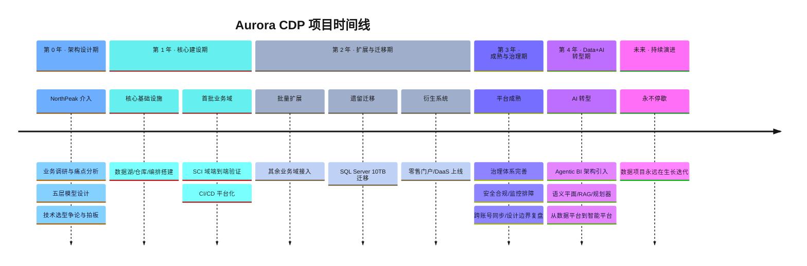
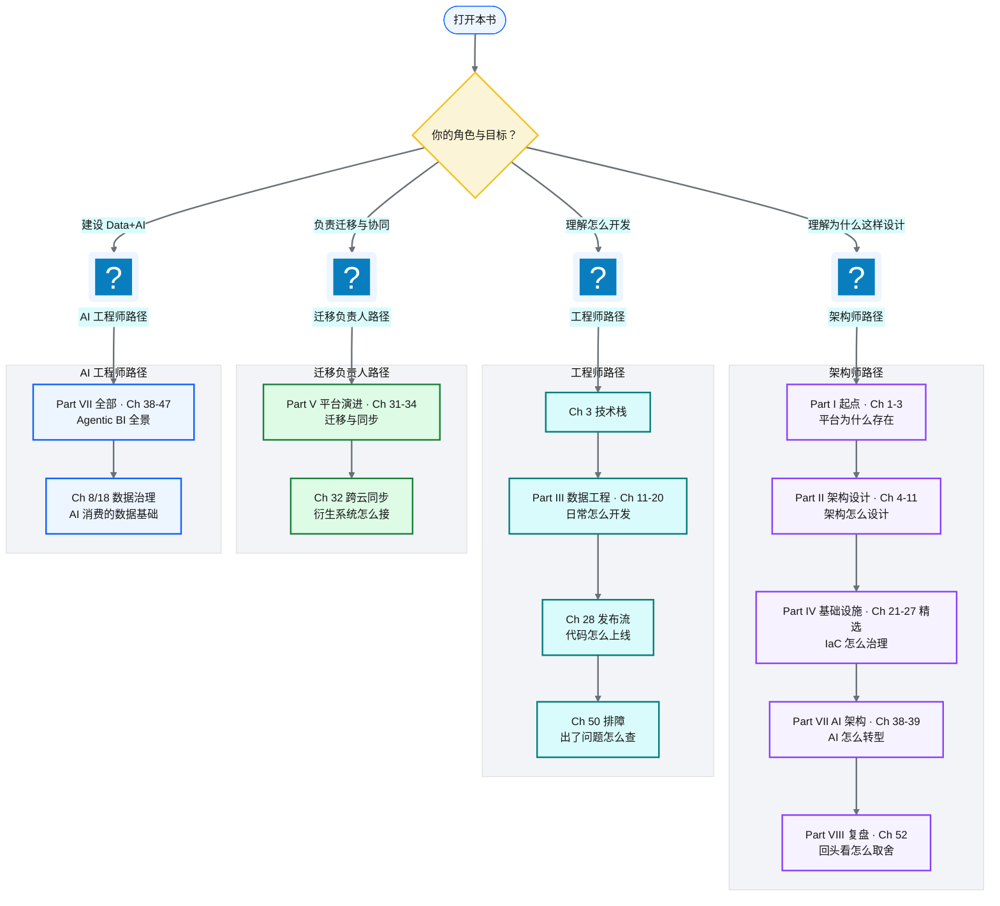

# 前言

!!! info "面包屑"
    [本书主页](./index.md) › 前言

---

## 虚构声明与叙事约定

!!! warning "重要声明"

本书是一部技术实践专著，为保护商业隐私并便于公开发布，书中所有公司、人员、系统标识均为**虚构**。具体如下：

| 虚构实体 | 在书中的角色 | 说明 |
|---|---|---|
| **Aurora Pharma（奥罗拉制药）** | 甲方 | 虚构的全球 top 医药外企巨头，中国区业务为平台建设主体 |
| **NorthPeak Consulting（北峰咨询）** | 乙方 | 虚构的 top 外企咨询公司，负责平台的设计与交付 |
| **「首席解决方案架构师」** | 作者 / 叙述者 | 即"我"，NorthPeak 驻场 Aurora 的首席架构师，全书第一人称叙事 |

**表 0-1** 虚构声明与叙事约定

书中涉及的药品品牌以治疗领域代号表示（如 `CardioBrand-A`、`OphthaBrand-C`），数据供应商以 `Vendor-A`、`Vendor-B` 表示，云资源标识均使用示例值。所有代码示例均为自包含的示意片段，旨在说明设计思想，**不是**任何真实系统的生产代码。书中的项目时间线、场景故事、决策争论均为基于真实工程经验的艺术加工，旨在增强可读性，不对应任何真实事件。

!!! tip "为什么虚构？"
    因为架构思想的价值不依附于特定的公司或品牌。把"某家真实药企怎么建数据平台"换成"Aurora 怎么建数据平台"，读者获得的工程经验是完全等价的——而后者可以自由传播。

> ⚠️ 在进入正文之前请先记住上述约定：本书所有公司、人员、系统、药品、供应商名称均为虚构，所有量化数据为基于行业合理推演的量级，代码示例为示意片段。理解这一点，能让你把注意力放在"为什么这么设计"而非"这是哪家公司"。

---

## 作者自述：一个数据开发八年数据工程路

我做数据这件事，到今天刚好八年。

这八年没换过赛道——从毕业第一天就在数据领域，从数据工程师一路做到首席解决方案架构师。行业倒是换了两次：先做了几年专利数据，然后是企业征信数据，现在在医药行业做企业级数据平台。三个行业看起来跨度挺大，但内核没变：处理的都是多源、异构、需要治理的数据，区别只在于形态、规模和业务诉求。

### 第一段：专利数据——文本处理与图关系建模的启蒙

我入行是在一家做知识产权大数据的互联网公司，那是我数据工程的启蒙。专利数据很特别——核心载体是专利全文（说明书、权利要求书、附图），动辄几十页，技术术语密集。但专利数据最有价值的不是单篇文本，而是专利之间的关系：一件专利引用了哪些在先专利、被哪些后续专利引用、同族专利在哪些国家申请、专利权人之间有没有许可或诉讼关系——这些构成一个庞大的引证网络图。

那几年我学会了三件事：

第一，结构化文本的批量处理。专利全文需要经过分词、实体识别（技术术语/化学结构/IPC 分类号）、语义抽取（权利要求分解），才能变成可检索的结构化数据。这让我真正体会了"非结构化数据变成结构化资产"的工程代价——不是教科书上写一写那么简单。

第二，图关系建模。专利引证网络天然是有向图——节点是专利，边是引用关系。计算一件专利的"影响力"需要沿图做多跳遍历（被引用次数、被引用的被引用次数……），在关系型数据库里用递归 SQL 跑很慢，但在图数据库里是原生操作。这段经历直接影响了后来 Agentic BI 的设计：在做 R/V/G/D 四引擎 RAG（Ch 41）时，我几乎是本能地想到用图引擎（Engine G）来做表间关系遍历——因为在专利数据里，我已经踩过"为什么关系数据库搞不定图查询"的坑。

第三，数据质量是底线。专利数据的用户是专利律师和企业 IP 部门，他们对数据准确性是"零容忍"——一条引用关系错了，可能导致侵权分析失误。这养成了我"数据质量必须工程化保障"的习惯，后来在医药 CDP 里做 PyDeequ 质量校验和行数对账（Ch 17），根子就在这儿。

### 第二段：企业征信数据——多源融合与实体解析的淬炼

第二段在一家做企业征信大数据的互联网公司。企业征信的数据源特别庞杂——工商注册信息、司法判决、行政处罚、经营异常、税务、社保、招投标、舆情……每个数据源格式不同、更新频率不同、可信度也不同。征信最核心的技术挑战是实体解析（Entity Resolution）：同一家企业在不同数据源里可能叫"奥罗拉制药有限公司""奥罗拉（中国）""Aurora Pharma China"，工商注册号、统一社会信用代码、法人姓名可能部分缺失或冲突——怎么把它们识别为同一个实体？

这段经历教会我几件事：

第一，多源数据融合的工程方法论。不同数据源的字段映射、口径对齐、冲突消解——这些后来在医药 CDP 里全用上了。Aurora 的数据孤岛（SFE、市场准入、零售、患者、主数据，见 Ch 1），本质和企业征信的多源融合是同一类问题，只是换了一个行业。

第二，实体解析的架构思维。企业征信的实体解析分两条路：确定性匹配（工商号/税号精确匹配）和概率性匹配（名称相似度+地址+法人组合判断）。后来在医药 CDP 做身份解析（患者 ID 跨系统关联、医生主数据统一），我把这套方法论照搬了过来——连阈值设置的思路都一样。

第三，风险传导的图思维。企业征信要算"风险传导"——A 公司担保 B 公司，B 公司涉诉，风险可能传导到 A。又是一个图遍历问题。两段经历让我对图数据有了本能的直觉——所以在 Agentic BI 架构里，用图引擎做 join 路径发现这个决策，几乎不用纠结。

### 第三段：医药 CDP——集大成与 Data+AI 转型

四年前，我以 NorthPeak Consulting 首席解决方案架构师的身份，驻场参与 Aurora Pharma 中国区的企业级数据平台建设。

这一次，前三段经历攒下的东西全涌到了一起：专利数据的文本处理和图建模，企业征信的多源融合和实体解析，加上这个项目特有的基础设施工程化（:simple-terraform: Terraform/CI-CD）和最终的 Data+AI 转型（Agentic BI）——凑成了一个完整的"从数据到智能"链路。

这四年里，平台经历了完整的生命周期：

**图 0-1** 第三段：医药 CDP——集大成与 Data+AI 转型

这个项目最大的特点不是"一次性建好"，而是一直在生长。第一年搭骨架，第二年长肌肉（迁移+衍生系统），第三年强神经（治理+排障），第四年长大脑（AI 转型）。而且生长不会停——本书最后一章（[Ch 52](./52-架构师的复盘-取舍遗憾与主流对比.md)）列出了"如果重来"的十个改进方向，它们就是下一轮生长的起点。

### 这本书想传递什么

做了八年，我最深的体会是：代码会过时，技术栈会更迭，但架构思想和决策方法论留得下来。

四年前启动这个平台时，:simple-snowflake: Snowflake 和 :simple-databricks: Databricks 还没入华商用，国内能选的云原生数仓方案不多。我们只能扎在 AWS China 的生态里，用 Terraform、Glue、Step Functions、Redshift 这些组件，拼出一座覆盖十几个业务域、上千张源表、TB 级数据量的企业级平台。过程里有漂亮的设计，也有糙活儿；有做对了的决策，也有事后想抽自己的妥协。

到了第四年，大模型（LLM）的浪潮冲了过来，"BI 自助化"和"Agentic BI"成了新的命题。纯数据平台不够用了——业务方要的不再是"给我一张报表"，而是"我用自然语言问，你给我答案，而且答案得可治理、可解释、可信任"。于是平台又开始新一轮生长：从数据供应走向 AI-ready 数据供应，从被动查询走向 Agent 编排。

这本书，就是这八年——尤其是后面四年这个项目的完整记录。

我写这本书，不是要教你某个工具怎么用——那些文档官网都有。我想传递的是：一个架构师在面对复杂业务约束和有限资源时怎么思考、怎么取舍、怎么在"够用"和"优雅"之间找到平衡。书里有很多"当时为什么这么做"的诚实复盘，也有很多"如果重来会怎样"的推演。因为在我看来，工程经验最值钱的部分，不是你做了什么，而是你为什么这么做，以及你意识到了哪些地方可以做得更好。

---

## 这本书写给谁、能带走什么

### 写给谁

| 读者画像 | 你能从书中获得什么 |
|---|---|
| **数据工程师（1-3 年）** | 理解企业级数据平台的全貌，跳出"写 ETL 脚本"的视角，看到配置驱动、连接器框架、分层架构等设计模式 |
| **平台架构师（3-8 年）** | 获得一整套从 0 到 1 的架构决策参考：五层模型、环境隔离、IaC 治理、CI/CD 设计，以及每个决策背后的 trade-off |
| **AI 应用工程师** | 理解如何把一个传统数据平台升级为 AI-ready 数据供应平台，掌握 Agentic BI 的架构设计与工程落地 |
| **技术管理者 / 项目负责人** | 看到大型数据平台建设的全周期：从需求到蓝图、从选型到交付、从迁移到演进，以及量化价值度量 |

**表 0-2** 写给谁

### 能带走什么

读完这本书，你应该能够：

1. **画出**一座企业级数据平台的完整架构图，并解释每个层次为什么存在；
2. **理解**配置驱动、事件驱动、分层 IaC、同构仓库等设计模式的核心思想与适用边界；
3. **掌握**数据迁移、跨账号同步、衍生系统集成等复杂工程场景的架构方法；
4. **建立**对 Data + AI 转型的认知：从语义治理、RAG 检索到 Agent 编排、SQL 护栏的完整 Agentic BI 架构；
5. **学会**架构师的思维方式——如何在约束下做 trade-off，如何诚实地面对设计缺陷，如何系统性对比主流方案。

---

## 如何阅读：四条阅读路径

本书共 8 部分 53 章，内容横跨数据工程、基础设施、AI 应用三大领域，按照一个真实数据平台的**生命周期演进**组织。你不必从头读到尾——根据你的角色和目标，选择最适合的路径：

**图 0-2** 如何阅读：四条阅读路径

四条路径的详细章节指引，请见[本书主页](./index.md)的"阅读路径"部分。

**如果你是通读型读者**，建议严格按 Part I → VIII 顺序阅读——这是项目生命周期的自然演进：从业务困局出发，经架构设计、工程实践、基础设施、平台演进、衍生系统，最终走向 AI 转型与治理复盘。你会看到一个数据平台如何在四年里从无到有、从数据到智能、从"够用"到"停不下来"。

---

## 体例说明

为了让本书既深入又易读，我采用了以下统一的体例：

### 图文并茂

全书大量使用 **Mermaid 图**——包括架构图、流程图、时序图、状态图和思维导图。几乎每个关键设计都配有图示。我信奉"一图胜千言"。

### 特殊标记框

全书使用 MkDocs Material 原生 **admonition（提示框）**承载各类延伸信息，并配以统一的矢量图标（跨平台像素一致，不依赖系统 emoji 渲染）：

| 标记框 | 图标 | 含义 | 示例 |
|---|---|---|---|
| !!! tip "引申" | :material-lightbulb: | 超出当前实践的延伸知识，供读者深入思考 | "如果采用 :material-database-sync: Iceberg 表格式，分区演进将自动管理……" |
| !!! warning "Trade-off" | :material-alert: | 当前设计在特定约束下的取舍，并给出主流方案对比 | "当时选 Step Functions 而非 Airflow，代价是……" |
| !!! info "面包屑" | :material-map-marker: | 章节在全书中的定位导航 | 本书主页 › Part I 起点 › Ch 1 |
| !!! info "项目时间线" | :material-clock-outline: | 本章内容发生在项目的哪个阶段 | 项目第 1 年 · 核心建设期 |
| !!! quote "下一章" | :material-book-open: | 演进承接——当前阶段成果如何催生下一阶段挑战 | Ch 1 数字化转型下的医药数据困局 |

**表 0-3** 特殊标记框

> 图标体系遵循 5 维分工：:material-…: 承担基调与框架（导航/提示/通用概念）；:simple-…: 标注技术栈与品牌（语言、框架、云厂商）；:octicons-…: 用于研发协作语义（Git :octicons-git-branch-16: 分支、 :octicons-git-pull-request-16: PR、Tag、终端）；:fontawesome-…: 填补文件类型与商业隐喻；Twemoji 仅在 changelog 等少量情感场景兜底。

### 时间线标注

每章开头（面包屑导航后）都有一行**项目时间线标注**，标明本章内容发生在项目的哪个阶段：

!!! abstract "项目第 1 年 · 核心建设期"

这帮助你在阅读时保持"项目演进"的时间感——知道某个设计是在什么阶段、什么约束下做出的。

### 章节结构

每一章遵循统一的结构：

1. **章首**：:material-school: 本章你将学到——3-5 个要点
2. **正文**：设计思想阐述，穿插 Mermaid 图、对比表、代码示例、叙事情节
3. **!!! tip 引申框**（如适用）
4. **!!! warning Trade-off 框**（如适用）
5. **本章小结**：核心要点回顾
6. **!!! quote 下一章导引**：演进承接——当前阶段的成果如何催生下一阶段的挑战
7. **参考文献**（如适用）

### 代码示例

书中的代码示例均为**自包含的示意片段**，用伪代码或简化后的 :simple-python: Python/HCL/Terraform 表达设计思想。它们**不是**生产代码，也不会引用任何真实仓库路径。

---

## 写作理念

最后，我想说明贯穿全书的四个写作信条：

**第一，讲设计，不讲实现。** 代码实现是会变的——今天用 Glue，明天可能换 Spark on K8s；今天用 Step Functions，明天可能换 Airflow。但配置驱动的思想、分层架构的原则、事件驱动的范式，这些不会因为换引擎就变。所以本书聚焦"为什么这么设计"，而非"代码怎么写"。

**第二，讲 trade-off，不讲银弹。** 软件工程里没有银弹。每一个设计决策都是在特定约束下的取舍——性能与成本、灵活性与简洁性、上市速度与技术债。书中会诚实地呈现这些取舍，包括那些事后被证明不够好的决策。因为真实的工程就是这样，而读者最需要学会的，恰恰是取舍的能力。

**第三，讲演进，不讲终点。** 这座平台从"纯数据"走向"Data + AI"的过程，本身就是最好的教材。好的架构不是一次性完美设计，而是能持续演进的有机体。数据项目永远在长，不会停。

**第四，讲叙事，不讲干货罗列。** 这不是一本工具手册，而是一本架构师的手记。每一章都有故事——某个业务诉求如何催生某个设计、某次事故如何暴露某个缺陷、某个选型如何在争论中拍板。因为这些"人"的决策过程，才是工程经验中最难传递、也最有价值的部分。

---

行了，让我们开始吧。

---

!!! quote "下一章"
    [Ch 1 数字化转型下的医药数据困局](./01-数字化转型下的医药数据困局.md) —— 我们先回到一切的起点：为什么 Aurora 需要一座数据平台？

