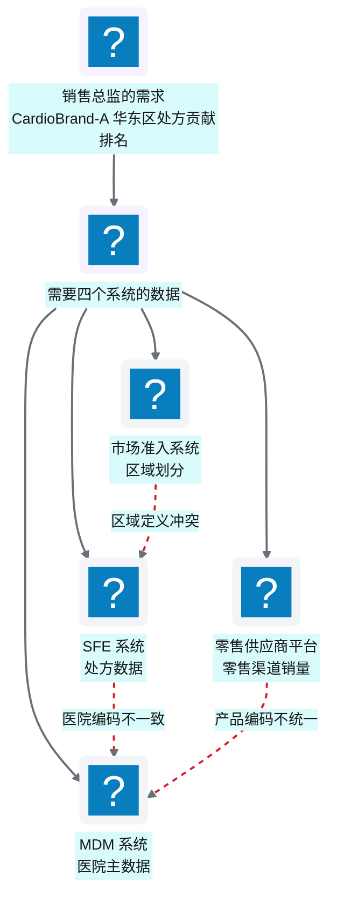
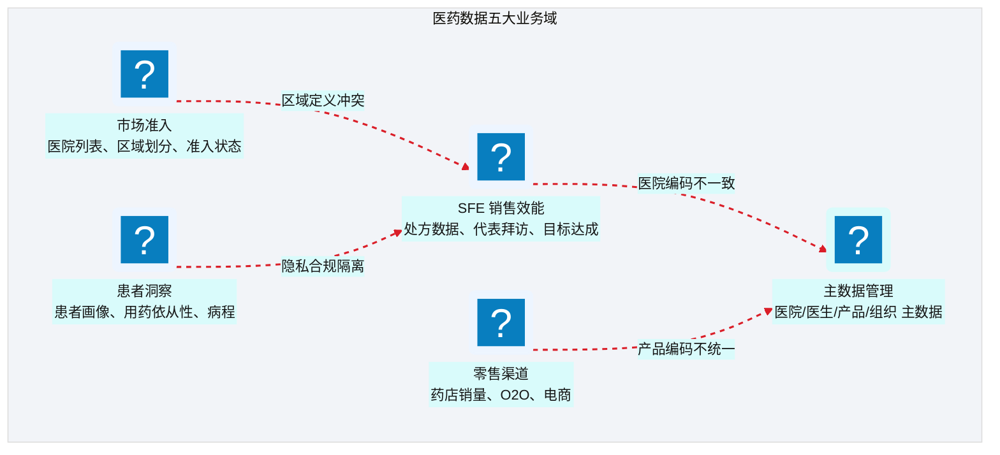
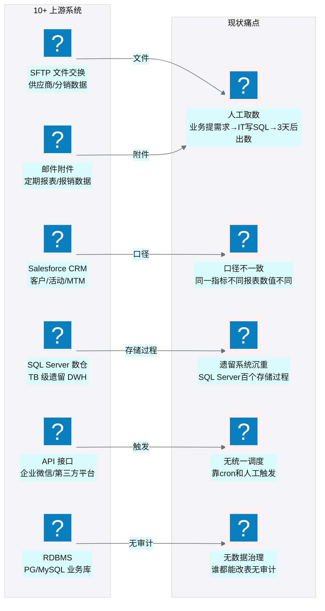
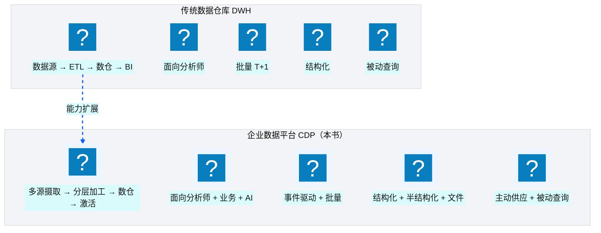
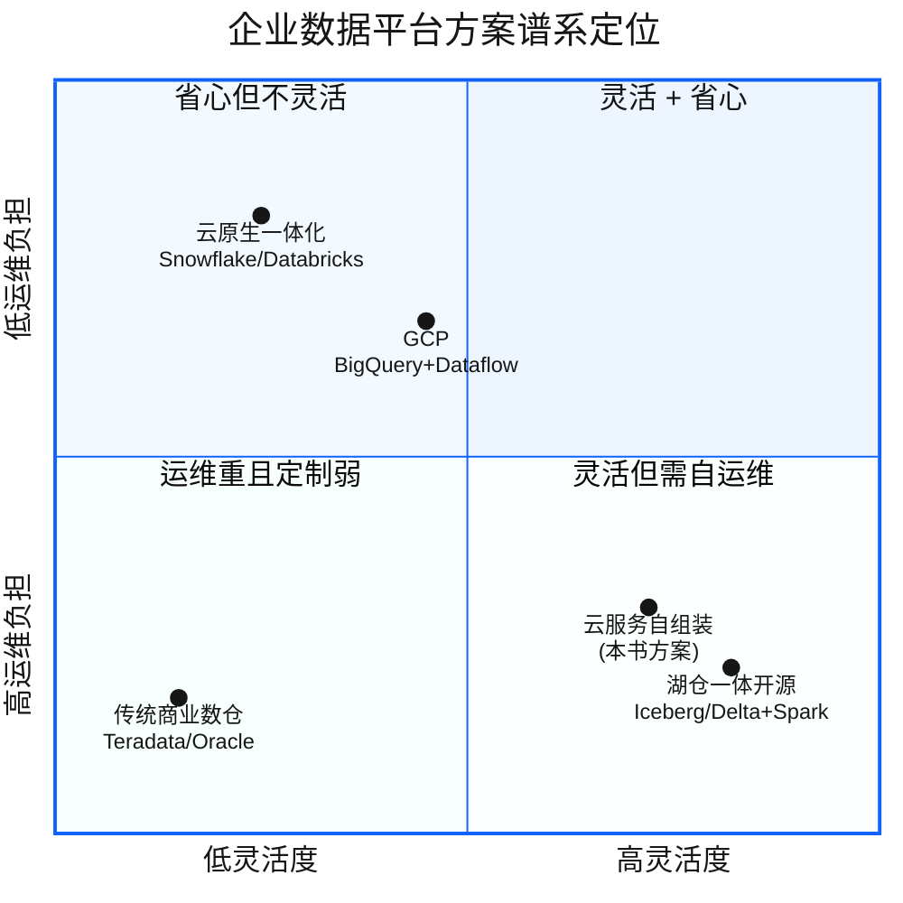

# Ch 1 数字化转型下的医药数据困局

!!! info "面包屑"
    [本书主页](./index.md) › [Part I 起点](./00-preface.md) › Ch 1

!!! abstract "项目第 0 年 · 架构设计期——一切的起点"

---

## :material-school: 本章你将学到
- 医药行业为什么是"数据密集型"行业，它的数据孤岛是怎样形成的
- Aurora 中国区在平台建设前面临的具体数据现状与痛点
- 为什么选择 CDP（客户数据平台）而非传统数仓来破局
- CDP 概念的两种流派之争：营销 CDP vs 企业数据平台

---

## 1.1 医药行业的"数据孤岛群岛"

四年前那个秋天的下午，我第一次走进 Aurora 中国区总部。

作为 NorthPeak Consulting 派出的首席解决方案架构师，我的任务是为 Aurora 评估"是否需要建一个企业级数据平台"。在那之前，我做过专利数据和企业征信数据，自以为对"数据孤岛"已经见怪不怪了——毕竟企业征信的工商/司法/税务/舆情数据也是出了名的分散。但 Aurora 的现状还是让我吃了一惊。

那天下午，销售总监给了我一个"简单"的需求："我想看上个月 CardioBrand-A 在华东区的处方贡献排名。"

听起来很简单，对吧？一个 GROUP BY 加一个 WHERE 的事。但数据团队的小李花了三天才给出一张表——因为这张表需要四个系统的数据：

**图 1-1** 医药行业的"数据孤岛群岛"

更要命的是，三天后销售总监拿到表，发现"华东区"的定义和上季度不一样——因为市场准入系统在季度间调过一次区域划分，但 SFE 系统的映射没同步更新。于是又改了两天。

这不是个例，而是 Aurora 数据现状的缩影。

### 医药数据的五大业务域

医药企业的数据天然分散在多个业务域中，每个域有自己的系统、自己的数据模型、自己的口径定义：

**图 1-2** 医药数据的五大业务域

这些业务域之间的虚线，代表的就是"数据孤岛"——数据物理分散、口径逻辑不一致、编码体系不统一、更新频率不同步。它们就像一片群岛：远远看去是一个整体，真要从一个岛到另一个岛，才发现没有桥。

### 孤岛是怎样形成的——以及为什么" :octicons-git-merge-16: 合并"比"新建"更难

数据孤岛不是某一个人的错，它是组织演进的必然副产品：

| 成因 | 说明 | 典型表现 |
|---|---|---|
| **系统分期建设** | 不同业务系统在不同时期、由不同供应商建设 | SFE 用了 5 年的 Oracle，零售是新上的 SaaS |
| **组织边界** | 不同部门各管一摊，数据所有权分散 | 销售管 SFE，准入管医院列表，互不开放 |
| **供应商锁定** | 每个系统有自己的数据模型和编码体系 | 同一家医院在三个系统里有三个不同编码 |
| **合规隔离** | 患者数据因隐私法规需要物理/逻辑隔离 | 患者数据不能直接和销售数据 join |
| **技术债** | 历史遗留系统无法改造，只能"打补丁" | 遗留 SQL Server 数仓跑了一堆存储过程，无人敢动 |

**表 1-1** 孤岛是怎样形成的——以及为什么" :octicons-git-merge-16: 合并"比"新建"更难

我在企业征信行业见过一模一样的问题——工商、司法、税务数据各自为政，同一家企业在不同源里名称不同、编码不同。当时的解决方案是建一个"实体解析引擎"做跨源实体对齐。Aurora 的问题本质相同，只是实体从"企业"变成了"医院/医生/患者"，数据域从"工商/司法/税务"变成了"SFE/准入/零售/患者/主数据"。

!!! tip "引申"
    数据孤岛的本质是"组织架构的镜像"。Conway 定律说"系统架构反映组织架构"——数据架构同样如此。要打破孤岛，光靠技术不够，还需要组织协同和治理机制。这也是为什么本书的 Part IV（基础设施与工程效能）和 Part VIII（治理与复盘）会花大量篇幅讲"治理"——技术只是工具，治理才是让孤岛不再重生的免疫系统。

### 医药行业合规约束速览

孤岛之外，医药行业还有另一条贯穿平台建设始终的约束线——**合规**。它不是事后补丁，而是从架构第一天就要嵌入的非功能需求。在深入 Aurora 的数据现状之前，先用一页速览医药行业的主要合规约束——它们会反复出现在后续章节（脱敏设计见 [Ch 18](./18-数据脱敏与隐私治理.md)，安全治理见 [Ch 48](./48-安全-合规与治理.md)）。

**GxP ALCOA+ 数据完整性原则**——医药行业 GxP（GMP/GCP/GLP）规范要求所有数据满足 ALCOA+ 九项原则，映射到平台机制如下：

| 原则 | 含义 | 平台机制映射 |
|---|---|---|
| **可归属 Attributable** | 数据可追溯到产生者 | 全链路审计日志、操作者标识（[Ch 49](./49-日志-监控-审计与告警.md)） |
| **可辨识 Legible** | 数据可读、可理解 | 元数据管理、数据目录与 schema 治理（[Ch 20](./20-元数据管理与数据血缘.md)） |
| **同步 Contemporaneous** | 数据实时记录，不事后补登 | 事件驱动摄取、加载时间戳记录 |
| **原始 Original** | 保留原始记录 | Landing 层不可变副本、版本三元组（[Ch 7](./07-数据湖分层设计.md)） |
| **准确 Accurate** | 数据正确、无差错 | PyDeequ 质量校验、行数对账（[Ch 17](./17-Landing到Raw到Enriched开发实战.md)） |
| **完整 Complete** | 无数据缺失 | 质量门禁、断点续传（[Ch 14](./14-数据库与JDBC连接器.md)、[Ch 31](./31-遗留系统迁移-SQLServer到Redshift.md)） |
| **一致 Consistent** | 跨系统口径一致 | 语义平面、术语治理（[Ch 40](./40-语义平面-三层治理与Git-YAML.md)） |
| **持久 Enduring** | 数据长期保存、不丢失 | S3 版本控制、生命周期策略 |
| **可得 Available** | 数据可被审查调阅 | 数据目录、权限可审计 |

**表 1-2** 医药行业合规约束速览

**中国数据合规法规**——Aurora 中国区业务还须满足以下法规，它们直接塑造了平台的技术选型：

| 法规 | 核心要求 | 对平台的影响 |
|---|---|---|
| **《个人信息保护法》PIPL** | 最小必要、目的限制、可审计、跨境传输限制 | 字段级脱敏策略选择、数据用途标签、全链路日志 |
| **《数据安全法》** | 数据分类分级、重要数据目录 | 敏感数据识别与标签、元数据管理 |
| **FDA 21 CFR Part 11**（涉美业务） | 电子签名、审计追踪、数据完整性 | 审计日志不可篡改、操作留痕 |

**表 1-3** 医药行业合规约束速览

!!! tip "引申：数据驻留"
    上述法规的共同要求是**数据驻留**——中国区业务数据必须留存在境内。这也是 Aurora 选择 AWS China（由光环新网/西云数据运营）而非 AWS Global 的根本原因：AWS China 的物理基础设施位于中国大陆，满足数据驻留要求，但服务子集、账号体系、网络连通性与 Global 存在差异（详见 [Ch 3](./03-技术栈全景与预备知识.md) 的对比）。数据驻留不是一条约束，而是架构的第一性原理。

---

## 1.2 Aurora 中国区的数据现状：10+ 上游系统、TB 级遗留库、人工取数

让我把镜头拉近到 Aurora 中国区的数据全景。在我介入之前，它大致是这样的：

### 上游系统全景

**图 1-3** 上游系统全景

### 量化痛点

| 痛点维度 | 现状 | 业务影响 |
|---|---|---|
| **取数时效** | 业务提需求 → IT 排期 → 平均 3 天交付 | 决策滞后，机会窗口错失 |
| **口径一致性** | 同一指标在 3 张报表中有 3 个数值 | 会议争论"谁的数据对"而非"怎么改善" |
| **遗留系统** | SQL Server DWH 约 10TB，百个存储过程 | 维护成本高，无人敢改，扩展性差 |
| **数据覆盖** | 10+ 上游系统，但 60% 数据未结构化入仓 | 分析师只能"看到"部分数据 |
| **数据治理** | 无统一权限、无审计日志、无血缘 | 合规风险高，排障靠"猜" |
| **自动化** | ETL 靠 cron + 人工触发，无编排引擎 | 故障无人知晓，靠用户投诉发现 |

**表 1-4** 量化痛点

### 最痛的那个场景

如果让我选一个"最痛"的场景，那就是**月底结账**。

每个月末，财务、销售、市场三个部门同时要数据。数据团队的三个人通宵跑存储过程、导 :fontawesome-solid-file-excel: Excel、发邮件。如果某个存储过程报错了——因为上游某张表多了一列——整个链条卡住，所有人等。而到了第二天，业务说"数据好像不对"，数据团队得从凌晨的日志里一行行找原因。

这个场景重复了不止一年。它不是某个工具能解决的问题，而是**整个数据架构需要重构**的信号。

我在企业征信公司见过类似的场景——月底出企业信用报告，数据团队通宵跑批。当时的解法是建了一个统一的数据处理平台，把原本散落在各个存储过程里的逻辑收拢到一个 ETL 框架里，配上调度引擎。Aurora 的问题需要类似的解法，但规模更大、合规要求更严。

!!! tip "引申"
    "月底结账通宵"是数据平台欠债的典型症状。它的根因不是"人不够"或"工具不好"，而是**架构缺乏自动化和可观测性**——没有统一调度（靠 cron）、没有状态追踪（靠人工记忆）、没有告警（靠用户投诉发现故障）。这些正是本书 Part II（架构设计）和 Part VIII（治理与监控）要系统化解决的。

---

## 1.3 为什么是 CDP 而非传统数仓：业务诉求与边界

面对上述困局，第一个问题是：建一个传统数据仓库（DWH）不就行了吗？为什么要搞 CDP？

答案是：Aurora 的诉求超出了传统 DWH 的能力边界。

### 传统 DWH vs CDP 的能力边界

**图 1-4** 传统 DWH vs CDP 的能力边界

| 维度 | 传统 DWH | 企业数据平台（本书的 CDP） |
|---|---|---|
| **数据范围** | 结构化业务数据为主 | 结构化 + 半结构化 + 文件 + API + 邮件 |
| **数据流向** | 单向：源 → 仓 → 报表 | 双向：摄取入仓 + 激活导出回业务系统 |
| **消费者** | 分析师（SQL/BI 工具） | 分析师 + 业务用户 + AI Agent |
| **时效** | T+1 批量为主 | 事件驱动 + 定时批量混合 |
| **治理** | 基本的权限控制 | 全链路审计、血缘、脱敏、合规 |
| **扩展性** | 加源 = 改 ETL | 加源 = 加配置（配置驱动） |

**表 1-5** 传统 DWH vs CDP 的能力边界

Aurora 需要的不只是"把数据存起来出报表"，而是：

1. **统一摄取**：把 10+ 上游系统的数据，用一套标准化的框架接入，而不是每个源写一套 ETL；
2. **分层加工**：原始数据、标准化数据、分析就绪数据分层管理，各取所需；
3. **双向流动**：不仅要入仓分析，还要把加工结果"激活"导回 :material-cloud-braces: Salesforce、SFTP、API 等下游系统；
4. **治理合规**：医药行业的 GxP 数据完整性要求、中国数据驻留法规、患者隐私保护，必须有体系化治理；
5. **AI 就绪**：为未来的 AI 消费做准备——数据要语义化、可治理、可追溯。

这五点诉求，传统 DWH 一条都满足不了。尤其是第 5 点——"AI 就绪"——在四年前还不是一个普遍认知，但我基于前两段经历（专利数据的语义建模、企业征信的实体解析）隐隐感到：数据平台迟早要为 AI 消费做准备。这个直觉后来在第四年得到了验证（见 [Part VII](./38-时代命题-AI-Ready数据供应.md)）。

!!! warning "Trade-off"
    CDP 的能力更强，但复杂度也更高。传统 DWH 一个团队三五个人就能搞定；而企业级 CDP 需要基础设施、数据工程、平台运维多个角色的协作。对于数据量小、源系统少、只需出报表的场景，传统 DWH 反而是更经济的选择。Aurora 之所以选择 CDP 路线，是因为它的业务复杂度和未来演进诉求已经超出了 DWH 的舒适区。

### 从报告到立项

那天通宵的月底结账之后，我花了两周做了一件事：把上述痛点量化成一份诊断报告，递到 Aurora 中国区 IT 负责人和业务 VP 的桌上。报告里没有堆砌技术名词，只有三组数字——取数时效、口径一致性、数据覆盖——以及一个结论："这不是换一个工具能解决的，需要一座企业级数据平台。"

接下来的事就顺理成章了：业务 VP 想要"问一句就出数"，IT 负责人想要"不再通宵"，CFO 想要"看清成本"——三方诉求在一个目标上汇合了。这份诊断报告，就是本书所记录的那座平台的起点。至于蓝图怎么画、选型怎么争、团队怎么搭——那是 [Ch 2](./02-从需求到蓝图：一个数据平台的诞生.md) 的故事。

---

## 1.3 平台规模速查表与平台经济学

在深入架构细节之前，先建立两个量级感：**这座平台长到多大**，以及**它值不值这个钱**。这两个问题的答案，决定了后续每一个设计决策的取舍空间——只有知道规模量级，才能判断"为什么 Redshift 要 24 节点""为什么不能靠手工运维"。

!!! note ""
    以下规模与成本数据为**基于行业合理推演的量级**，旨在让读者建立直觉，非 Aurora 公司真实数据。

### 平台规模速查表

先看这座平台四年间长到的规模——它从一个 10TB 的遗留数仓起步，四年后膨胀到 10 倍体量：

| 指标 | 迁移前（旧数仓） | 四年后（CDP） | 备注 |
|---|---|---|---|
| **存储规模** | ~10 TB | **100 TB+** | 含 Landing/Raw/Enriched/Curated 多副本 |
| **表数量** | 4000+ 张 | **20000+ 张** | 含外部 SaaS/API/邮件/文件来源 |
| **日均新增** | — | ~50-80 GB | 全量 + 增量混合摄入 |
| **数据源种类** | ~10 类 | **~25 类** | JDBC/SaaS API/FTP/邮件/HCP 主数据等 |
| **数仓规格** | SQL Server（物理机） | **9 节点 ra3.4xlarge**（或 Serverless 64-128 RPU） | 支撑日均 500-1000 条即席查询 |
| **用户规模** | 数字化部门 10 人，业务用户 50 人 | **300+ 注册用户，100+ 高频业务用户** | 代码/市场准入/商务分析为主 |

```mermaid
%%{init: {'theme':'base','themeVariables':{'primaryColor':'#edf5ff','primaryTextColor':'#161616','primaryBorderColor':'#0f62fe','lineColor':'#697077','secondaryColor':'#d9fbfb','tertiaryColor':'#f2f4f8','fontSize':'14px'}}}%%
flowchart LR
    subgraph Before["迁移前 · SQL Server"]
        direction TB
        B1@{ icon: "devicon:microsoftsqlserver", form: "rounded", label: "10 TB 存储", pos: "b", h: 44 }
        B2@{ icon: "codicon:database", form: "rounded", label: "4000+ 张表", pos: "b", h: 44 }
        B3@{ icon: "codicon:library", form: "rounded", label: "5 类数据源", pos: "b", h: 44 }
        B4@{ icon: "codicon:person", form: "rounded", label: "5-8 个用户", pos: "b", h: 44 }
    end

    subgraph After["四年后 · CDP"]
        direction TB
        A1@{ icon: "logos:aws-s3", form: "rounded", label: "100 TB+ 存储", pos: "b", h: 44 }
        A2@{ icon: "codicon:database", form: "rounded", label: "20000+ 张表", pos: "b", h: 44 }
        A3@{ icon: "codicon:library", form: "rounded", label: "25 类数据源", pos: "b", h: 44 }
        A4@{ icon: "codicon:person", form: "rounded", label: "100+ 用户", pos: "b", h: 44 }
        A5@{ icon: "logos:aws-redshift", form: "rounded", label: "9 节点 Redshift", pos: "b", h: 44 }
    end

    Before -->|"四年生长 10x"| After

    classDef bpExternal fill:#f2f4f8,stroke:#697077,stroke-width:2px,color:#161616
    classDef bpProcess  fill:#edf5ff,stroke:#0f62fe,stroke-width:2px,color:#161616

    class B1,B2,B3,B4 bpExternal
    class A1,A2,A3,A4,A5 bpProcess

    linkStyle 0 stroke:#0f62fe,stroke-width:2.5px
```

**表 1-6** 平台规模速查表

**图 1-5** 平台规模速查表

这个量级带来一个直接后果：**手工运维彻底失效**。20 张表可以靠人盯，20000 张表只能靠配置驱动 + 自动化治理——这正是本书反复强调"配置驱动""事件驱动""IaC 治理"的根因。

### 平台经济学：为什么自组装比买商业产品省钱

规模上去了，成本呢？以下是基于 AWS 公开定价对一座 100TB+ 医药数据平台的月度成本量级推估（AWS China 区域）：

| AWS 服务 | 月用量假设 | 月成本估算 | 备注 |
|---|---|---|---|
| **S3 存储** | 100TB（多副本+版本） | **¥15,000 / ~$2,100** | Landing→Raw→Enriched 三层 + 跨区域复制 |
| **Redshift Serverless** | 64 RPU 日间 + 16 RPU 夜间 | **¥25,000 / ~$3,500** | 高峰自动扩容至 128 RPU |
| **Glue ETL** | ~10 DPU × 200 job/天 | **¥24,000 / ~$3,400** | 全量+增量 pipeline + 开发端点 |
| **Lambda** | ~5 万次/天 × 1GB | **¥1,200 / ~$170** | 事件触发器、状态回写 |
| **Step Functions** | ~500 次/天 | **¥800 / ~$110** | 四种状态机 |
| **DynamoDB / Secrets / CloudWatch** | 配置表 + 密钥 + 日志 | **¥2,800 / ~$390** | 运行状态 + 凭证 + 可观测 |
| **网络/其他** | NAT/CF/跨 AZ/Route53 | **¥5,000 / ~$700** | — |
| **Bedrock/LLM API**（Agentic BI） | 日均 ~500 次查询 | **¥15,000 / ~$2,100** | NL2SQL + RAG + 护栏 + 可视化 |
| **合计** | — | **≈ ¥89,000 / ~$12,500 /月** | **年度 ≈ ¥107 万 / ~$15 万** |

**表 1-7** 平台经济学：为什么自组装比买商业产品省钱

对比传统数仓的拥有成本：

| 维度 | 传统数仓（SQL Server） | CDP 平台 |
|---|---|---|
| **许可 + 硬件 + DBA 人力** | ≈ ¥200-300 万/年 | — |
| **云资源 + 平台人力** | — | ≈ ¥107 万 + 工程团队 |
| **数据规模** | 10TB | 100TB+（10×） |
| **总拥有成本（含人力）** | 基线 | **降低约 50-60%** |

**表 1-8** 平台经济学：为什么自组装比买商业产品省钱

!!! warning "Trade-off"
    自组装的成本优势不是免费的——它的代价是**集成复杂度**：S3/Glue/Redshift/Step Functions/Lambda 要自己拼、自己排障、自己治理。本书 Part IV（基础设施即代码）和 Part VIII（治理与复盘）大半篇幅都在讲"如何驾驭这种复杂度"。如果团队没有足够的数据工程和 IaC 能力，云原生一体化方案（如 :simple-snowflake: Snowflake）省心但锁定深、单位成本更高——这是一道"能力 vs 成本"的经典权衡。

---

## 1.4 引申：CDP 概念辨析与主流方案地图

"CDP"这个词在行业里有两种截然不同的含义，容易混淆。有必要在此厘清——因为很多技术选型的误区，就源于概念混淆。

### 两种 CDP 流派

| 流派 | 全称 | 核心定位 | 典型产品 |
|---|---|---|---|
| **营销 CDP** | Customer Data Platform | 聚焦消费者画像、营销自动化、受众分群 | Segment, Tealium, mParticle |
| **企业数据平台 CDP** | Customer/Corporate Data Platform | 企业级数据基础设施，覆盖全业务域的数据摄取、加工、治理、激活 | 本书所述平台 |

**表 1-9** 两种 CDP 流派

本书讨论的是**后者**——企业数据平台。它不是营销工具，而是企业数据的基础设施层。之所以也叫"CDP"，是因为项目最初以"客户数据"为核心诉求启动，后来逐步扩展为覆盖全业务域的企业级平台。

!!! tip "引申"
    如果你在选型时听到"CDP"，一定要追问对方指的是哪种。营销 CDP 关注的是"把用户行为数据汇成 360° 画像并推给营销渠道"；企业数据平台关注的是"把企业所有数据统一接入、治理、加工、供应"。两者的技术栈、团队配置、治理要求完全不同。营销 CDP 的典型架构是"事件采集 → 用户画像 → 受众分群 → 营销渠道推送"，以实时流处理为主；企业数据平台是"多源摄取 → 分层加工 → 仓库服务 → 激活/供应"，以批量 ETL + 事件驱动为主。

### 主流企业数据平台方案地图

**图 1-6** 主流企业数据平台方案地图

这四类方案各有适用场景。本书的方案属于 **B 类——云服务自组装**。这在四年前（项目启动时）的中国市场是一个务实的选择（原因见 [Ch 2](./02-从需求到蓝图：一个数据平台的诞生.md) 的技术选型分析），但它不是唯一解，也不一定是今天的最佳解。

!!! tip "引申：数据平台方案的发展脉络"
    。理解这四类方案的演进，有助于你判断"今天应该选什么"：

    - **D 类（传统商业数仓）**是 2010 年代前的主流——Teradata/Oracle DWH，稳定但昂贵、扩展性差。
    - **B 类（云服务自组装）**是 2013-2018 年的主流——AWS S3+Redshift+Glue 的组合让企业能在云上自建数据平台，灵活但运维重。本书就是这个时代的产物。
    - **A 类（云原生一体化）**是 2018 年后崛起的——:simple-snowflake: Snowflake/:simple-databricks: Databricks 把"数据湖+数仓+ETL"打包成一体化平台，大幅降低运维负担。四年前它们还没入华，所以 Aurora 选不了。
    - **C 类（湖仓一体开源）**是 2020 年后成熟的方向——:material-database-sync: Iceberg/Delta Lake 让数据湖获得 ACID 事务能力，配合 Spark/Trino 引擎，实现"开放、无锁定"的湖仓一体。这是目前最前沿的方向。

    如果今天重新选型，A 类和 C 类是首选——A 类省心，C 类自由。但本书的价值不在于"选了哪个方案"，而在于"在任何方案上如何做架构决策"——五层模型、配置驱动、事件驱动、治理体系这些设计思想是方案无关的。

在 [Ch 52 架构师的复盘](./52-架构师的复盘-取舍遗憾与主流对比.md) 中，我会系统性地对比这四类方案，并给出"如果重来"的选型建议。

---

## :material-check-circle: 本章小结
- 医药行业天然存在"数据孤岛群岛"——SFE、市场准入、零售、患者、主数据五大域各自为政，根因是组织演进的自然副产品
- 医药行业合规约束（GxP ALCOA+ / PIPL / 数据安全法 / 数据驻留）从架构第一天就要嵌入，数据驻留决定了 AWS China 的选型
- Aurora 中国区面临 10+ 上游系统、TB 级遗留库、人工取数、口径不一致、月底通宵等系统性痛点——这不是工具能解决的，是架构需要重构
- 平台四年间从 10TB/4000+ 表长到 100TB+/20000+ 表，月成本量级约 ¥11.4 万——规模决定了"只能配置驱动 + 自动化治理"
- 传统 DWH 无法满足 Aurora 的五点诉求：统一摄取、分层加工、双向流动、治理合规、AI 就绪
- "CDP"一词有两种流派，本书讨论的是企业数据平台，不是营销 CDP
- 主流方案分四类（云原生一体化 / 云服务自组装 / 湖仓开源 / 传统商业数仓），本书方案属于第二类——方案会过时，但架构思想历久弥新

---

!!! quote "下一章"
    [Ch 2 从需求到蓝图：一个数据平台的诞生](./02-从需求到蓝图：一个数据平台的诞生.md) —— 了解了"为什么"，接下来看"怎么做"：NorthPeak 如何介入，技术选型如何在一轮轮争论中拍板，团队如何组建。这是项目第 0 年的核心叙事。

