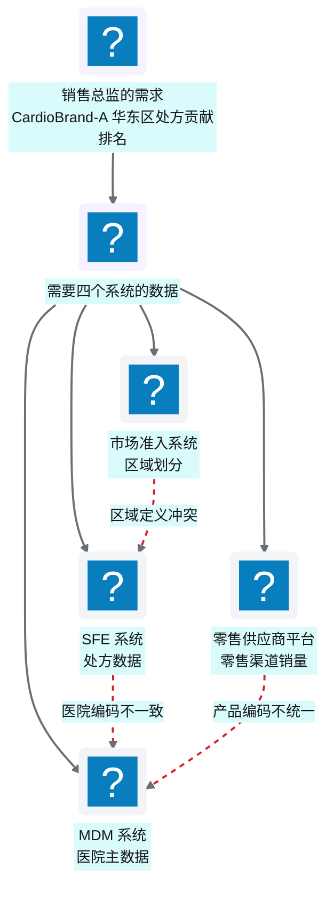
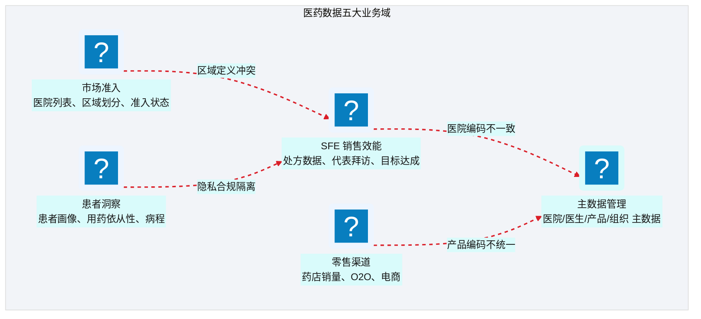
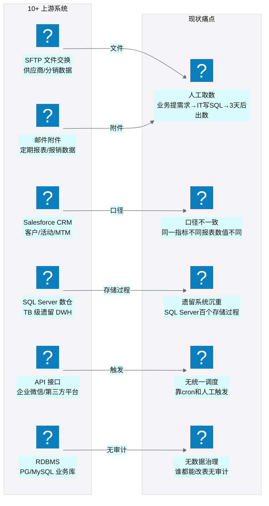
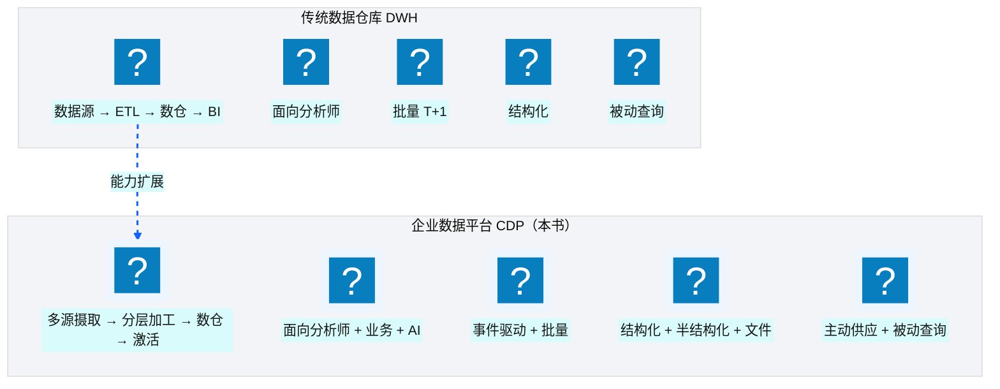
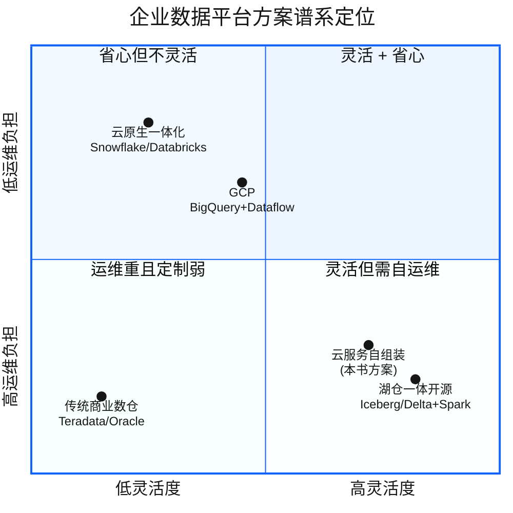

# Ch 1 数字化转型下的医药数据困局

!!! info "面包屑"
    [本书主页](./index.md) › [Part I 起点](./00-preface.md) › Ch 1

!!! abstract "项目第 0 年 · 架构设计期——一切的起点"

---

## :material-school: 本章你将学到
- 医药行业为什么是"数据密集型"行业，它的数据孤岛是怎样形成的
- Aurora 中国区在平台建设前面临的具体数据现状与痛点
- 为什么选择 CDP（客户数据平台）而非传统数仓来破局
- CDP 概念的两种流派之争：营销 CDP vs 企业数据平台

---

## 1.1 医药行业的"数据孤岛群岛"

四年前那个秋天的下午，我第一次走进 Aurora 中国区总部。

作为 NorthPeak Consulting 派出的首席解决方案架构师，我的任务是为 Aurora 评估"是否需要建一个企业级数据平台"。在那之前，我做过专利数据和企业征信数据，自以为对"数据孤岛"已经见怪不怪了——毕竟企业征信的工商/司法/税务/舆情数据也是出了名的分散。但 Aurora 的现状还是让我吃了一惊。

那天下午，销售总监给了我一个"简单"的需求："我想看上个月 CardioBrand-A 在华东区的处方贡献排名。"

听起来很简单，对吧？一个 GROUP BY 加一个 WHERE 的事。但数据团队的小李花了三天才给出一张表——因为这张表需要四个系统的数据：

**图 1-1** 医药行业的"数据孤岛群岛"

更要命的是，三天后销售总监拿到表，发现"华东区"的定义和上季度不一样——因为市场准入系统在季度间调过一次区域划分，但 SFE 系统的映射没同步更新。于是又改了两天。

这不是个例，而是 Aurora 数据现状的缩影。

### 医药数据的五大业务域

医药企业的数据天然分散在多个业务域中，每个域有自己的系统、自己的数据模型、自己的口径定义：

**图 1-2** 医药数据的五大业务域

这张图我画了不止一版。最初我把五个域画成平铺的并列方块——直到第一周访谈结束时，市场准入的同事问我："你这个图里 SFE 和我们准入用的'区域'是一回事吗？"我才意识到，五个域之间真正的问题不是"并列分散"，而是**两两之间存在口径冲突**，图上的四条红色虚线才是重点。

四条虚线，对应四类典型的跨域冲突。**医院编码不一致**：SFE 用自己的医院 ID，MDM 维护"权威"主数据，但两边编码体系从未真正对齐过——同一个三甲医院在 SFE 里是 `H001`，在 MDM 里是 `SH-PH-0001`。**区域定义冲突**：市场准入按招标行政区域划分，SFE 按销售大区划分，两套区域在华东的边界差了两个地级市——这正是销售总监那张表对不上的根因。**产品编码不统一**：零售渠道的 SKU 粒度（按包装规格）和主数据的产品粒度（按通用名）对不上，药店销量和处方数据无法直接 join。**隐私合规隔离**：患者域的数据因 PIPL 不能与其他域直接关联，物理上就必须隔离——这不是技术能"打通"的，而是合规划定的硬边界。

这四条虚线指向一个共同的解法方向：需要一个**横切五域的主数据与语义层**来做实体对齐和口径统一。我在企业征信行业见过一模一样的问题——工商、司法、税务数据各自为政，同一家企业在不同源里名称不同、编码不同。当时的解决方案是建一个"实体解析引擎"做跨源实体对齐。Aurora 的问题本质相同，只是实体从"企业"变成了"医院/医生/患者"，数据域从"工商/司法/税务"变成了"SFE/准入/零售/患者/主数据"。

也正因如此，图里我把 MDM 单独用青色（数据类）标出——它不是一个普通的业务域，而是其余四个域的**对齐基准**。没有 MDM 做锚点，其余四域的虚线冲突永远无解。这个判断后来直接催生了本书 [Ch 20 元数据管理与数据血缘](./20-元数据管理与数据血缘.md) 和 [Ch 40 语义平面](./40-语义平面-三层治理与Git-YAML.md) 的设计——把"对齐基准"从一次性脚本升级为平台级能力。

### 孤岛是怎样形成的——以及为什么" :octicons-git-merge-16: 合并"比"新建"更难

数据孤岛不是某一个人的错，它是组织演进的必然副产品：

| 成因 | 说明 | 典型表现 |
|---|---|---|
| **系统分期建设** | 不同业务系统在不同时期、由不同供应商建设 | SFE 用了 5 年的 Oracle，零售是新上的 SaaS |
| **组织边界** | 不同部门各管一摊，数据所有权分散 | 销售管 SFE，准入管医院列表，互不开放 |
| **供应商锁定** | 每个系统有自己的数据模型和编码体系 | 同一家医院在三个系统里有三个不同编码 |
| **合规隔离** | 患者数据因隐私法规需要物理/逻辑隔离 | 患者数据不能直接和销售数据 join |
| **技术债** | 历史遗留系统无法改造，只能"打补丁" | 遗留 SQL Server 数仓跑了一堆存储过程，无人敢动 |

**表 1-1** 孤岛是怎样形成的——以及为什么" :octicons-git-merge-16: 合并"比"新建"更难

!!! tip "引申"
    数据孤岛的本质是"组织架构的镜像"。Conway 定律说"系统架构反映组织架构"——数据架构同样如此。要打破孤岛，光靠技术不够，还需要组织协同和治理机制。这也是为什么本书的 Part IV（基础设施与工程效能）和 Part VIII（治理与复盘）会花大量篇幅讲"治理"——技术只是工具，治理才是让孤岛不再重生的免疫系统。

### 医药行业合规约束速览

孤岛之外，医药行业还有另一条贯穿平台建设始终的约束线——**合规**。它不是事后补丁，而是从架构第一天就要嵌入的非功能需求。在深入 Aurora 的数据现状之前，先用一页速览医药行业的主要合规约束——它们会反复出现在后续章节（脱敏设计见 [Ch 18](./18-数据脱敏与隐私治理.md)，安全治理见 [Ch 50](./50-安全-合规与治理.md)）。

坦白说，做专利数据那几年，"合规"对我而言约等于"数据要准确、别泄露"；做企业征信时，合规升级成"要留痕、能审计"。但到 Aurora 第一周，法务部门递给我一份 GxP 检查清单时，我才意识到医药行业的合规是另一个量级——它不只约束数据怎么用，还约束数据怎么**产生、记录、保存、调阅**。这张清单后来被我贴在工位上整整四年，几乎每个架构决策都要回头对照一遍。

**GxP ALCOA+ 数据完整性原则**——医药行业 GxP（GMP/GCP/GLP）规范要求所有数据满足 ALCOA+ 九项原则，映射到平台机制如下：

| 原则 | 含义 | 平台机制映射 |
|---|---|---|
| **可归属 Attributable** | 数据可追溯到产生者 | 全链路审计日志、操作者标识（[Ch 51](./51-日志-监控-审计与告警.md)） |
| **可辨识 Legible** | 数据可读、可理解 | 元数据管理、数据目录与 schema 治理（[Ch 20](./20-元数据管理与数据血缘.md)） |
| **同步 Contemporaneous** | 数据实时记录，不事后补登 | 事件驱动摄取、加载时间戳记录 |
| **原始 Original** | 保留原始记录 | Landing 层不可变副本、版本三元组（[Ch 7](./07-数据湖分层设计.md)） |
| **准确 Accurate** | 数据正确、无差错 | PyDeequ 质量校验、行数对账（[Ch 17](./17-Landing到Raw到Redshift开发实战.md)） |
| **完整 Complete** | 无数据缺失 | 质量门禁、断点续传（[Ch 14](./14-数据库与JDBC连接器.md)、[Ch 31](./31-遗留系统迁移-SQLServer到Redshift.md)） |
| **一致 Consistent** | 跨系统口径一致 | 语义平面、术语治理（[Ch 40](./40-语义平面-三层治理与Git-YAML.md)） |
| **持久 Enduring** | 数据长期保存、不丢失 | S3 版本控制、生命周期策略 |
| **可得 Available** | 数据可被审查调阅 | 数据目录、权限可审计 |

**表 1-2** 医药行业合规约束速览

这张表关键不在"九项原则"本身，是第三列——**每条原则对应一个具体的平台机制**。这不是巧合，是我刻意把 ALCOA+ 从"审计清单"转成了"架构选型输入"。比如"原始 Original"这一条，直接决定了数据湖必须有 Landing 层的不可变副本——任何清洗都只能在 Raw 标准化之后的仓内 ELT / `enriched_*` 进行，原始数据一旦落地就不许改（详见 [Ch 7](./07-数据湖分层设计.md)）。再比如"同步 Contemporaneous"，决定了我们必须用事件驱动摄取（[Ch 10](./10-编排与调度设计-StepFunctions与EventBridge.md)）而非 T+1 批量补登——因为"事后补登"在 GxP 审计里是严重缺陷。如果当时我按传统数仓思路先建仓再补审计，九项里至少四项会在架构层就无法满足，事后补救的成本是推翻重建。

**中国数据合规法规**——Aurora 中国区业务还须满足以下法规，它们直接塑造了平台的技术选型：

| 法规 | 核心要求 | 对平台的影响 |
|---|---|---|
| **《个人信息保护法》PIPL** | 最小必要、目的限制、可审计、跨境传输限制 | 字段级脱敏策略选择、数据用途标签、全链路日志 |
| **《数据安全法》** | 数据分类分级、重要数据目录 | 敏感数据识别与标签、元数据管理 |
| **FDA 21 CFR Part 11**（涉美业务） | 电子签名、审计追踪、数据完整性 | 审计日志不可篡改、操作留痕 |

**表 1-3** 医药行业合规约束速览

三套法规里，PIPL 对架构的塑造最深远。"最小必要"意味着平台不能"先把所有数据都收进来再说"——每个字段入仓都要标注用途、可被审计；"目的限制"意味着同一份患者数据，用于科研和用于营销的合规边界不同，必须有数据用途标签做行级权限控制。这两条直接催生了 [Ch 18 数据脱敏与隐私治理](./18-数据脱敏与隐私治理.md) 里"字段级脱敏 + 用途标签"的双层设计——是合规逼出来的复杂，不是我想要复杂。

!!! tip "引申：数据驻留"
    上述法规的共同要求是**数据驻留**——中国区业务数据必须留存在境内。这也是 Aurora 选择 AWS China（由光环新网/西云数据运营）而非 AWS Global 的根本原因：AWS China 的物理基础设施位于中国大陆，满足数据驻留要求，但服务子集、账号体系、网络连通性与 Global 存在差异（详见 [Ch 3](./03-技术栈全景与预备知识.md) 的对比）。数据驻留不是一条约束，而是架构的第一性原理——它决定了云区域、决定了可用服务清单、也决定了跨境团队的协作方式。

---

## 1.2 Aurora 中国区的数据现状：10+ 上游系统、TB 级遗留库、人工取数

让我把镜头拉近到 Aurora 中国区的数据全景。在我介入之前，它大致是这样的：

### 上游系统全景

**图 1-3** 上游系统全景

这张图费了一番功夫——不是因为系统多，而是因为**没有人能一次性说清"我们到底有哪些数据源"**。每访谈一个部门，就多冒出一两个我之前不知道的"影子系统"：某个业务团队自己用 :fontawesome-solid-file-excel: Excel 维护的医院名单、某个供应商每月发邮件附件过来的销量报表、某个已离职同事留下的 PG 库还在跑着无人维护的报表。图里画的是六类上游，实际盘点下来有 10+ 个，而"未结构化入仓"的比例高达 60%——意味着分析师能"看到"的数据，只是这座冰山的水面以上部分。

图右侧的五类痛点，本质是六类上游的**接入方式各异**导致的。SFTP 和邮件是文件交换，没有 schema 约束；SQL Server 数仓锁在百个存储过程里，逻辑不可见；Salesforce 是 SaaS，数据在云端拿不到本地；API 接口靠人工触发，没有调度；RDBMS 业务库谁都能改，无审计。**每多一种接入方式，就多一种故障模式和一种治理盲区**——这正是我后来坚持要做"配置驱动连接器框架"（[Ch 13](./13-连接器框架总览.md)）的根因：不能让每种数据源各自为政地写 ETL，必须用一套统一抽象把接入方式收敛成有限的几种模式。

这个判断也呼应了我做企业征信时的教训——当时也是十几个数据源各写各的 ETL，最后维护成一团乱麻。Aurora 的规模更大（10+ 源 vs 当时的 6 源），如果再走老路，半年后就会重蹈覆辙。规模决定了"只能标准化、不能定制化"——这条规律贯穿了全书。

### 量化痛点

把访谈结论量化后，Aurora 的现状痛点归为六个维度：

| 痛点维度 | 现状 | 业务影响 |
|---|---|---|
| **取数时效** | 业务提需求 → IT 排期 → 平均 3 天交付 | 决策滞后，机会窗口错失 |
| **口径一致性** | 同一指标在 3 张报表中有 3 个数值 | 会议争论"谁的数据对"而非"怎么改善" |
| **遗留系统** | SQL Server DWH 约 10TB，百个存储过程 | 维护成本高，无人敢改，扩展性差 |
| **数据覆盖** | 10+ 上游系统，但 60% 数据未结构化入仓 | 分析师只能"看到"部分数据 |
| **数据治理** | 无统一权限、无审计日志、无血缘 | 合规风险高，排障靠"猜" |
| **自动化** | ETL 靠 cron + 人工触发，无编排引擎 | 故障无人知晓，靠用户投诉发现 |

**表 1-4** 量化痛点

六条痛点看起来并列，但在我向 IT 负责人汇报时，我把它们分成了两层——**症状层**和**根因层**。取数时效、口径一致性、数据覆盖是症状：业务直接感受到的痛。遗留系统、无数据治理、无自动化是根因：它们是前三个症状反复发作的温床。这个区分很关键，因为它决定了改造的优先级——**如果只治症状（比如上个 BI 工具让取数快一点），根因还在，三个月后症状会换个面目卷土重来**。

这也是为什么我后来没有推荐"先买个 BI 工具快速见效"的过渡方案。当时业务 VP 确实倾向先上 BI 缓解取数痛点，但我用企业征信的教训说服了他：我曾见过一个客户先上了 Tableau，取数确实快了，但因为底层口径没统一，半年后报表数量翻倍、口径分歧也翻倍，最后还是得推倒重来建数仓。**症状可以临时缓解，但根因（遗留系统、治理缺失、无自动化）必须一次性解决**——否则就是在沙地上盖楼。这个判断最终让 Aurora 下决心做平台级重建，而不是打补丁。

### 最痛的那个场景

如果让我选一个"最痛"的场景，那就是**月底结账**。

每个月末，财务、销售、市场三个部门同时要数据。数据团队的三个人通宵跑存储过程、导 :fontawesome-solid-file-excel: Excel、发邮件。如果某个存储过程报错了——因为上游某张表多了一列——整个链条卡住，所有人等。而到了第二天，业务说"数据好像不对"，数据团队得从凌晨的日志里一行行找原因。

这个场景重复了不止一年。它不是某个工具能解决的问题，而是**整个数据架构需要重构**的信号。

我在企业征信公司见过类似的场景——月底出企业信用报告，数据团队通宵跑批。当时的解法是建了一个统一的数据处理平台，把原本散落在各个存储过程里的逻辑收拢到一个 ETL 框架里，配上调度引擎。Aurora 的问题需要类似的解法，但规模更大、合规要求更严。

!!! tip "引申"
    "月底结账通宵"是数据平台欠债的典型症状。它的根因不是"人不够"或"工具不好"，而是**架构缺乏自动化和可观测性**——没有统一调度（靠 cron）、没有状态追踪（靠人工记忆）、没有告警（靠用户投诉发现故障）。这些正是本书 Part II（架构设计）和 Part VIII（治理与监控）要系统化解决的。

---

## 1.3 为什么是 CDP 而非传统数仓：业务诉求与边界

面对上述困局，问题是：建一个传统数据仓库（DWH）不就行了吗？为什么要搞 CDP？

原因简单：Aurora 的诉求超出了传统 DWH 的能力边界。

### 传统 DWH vs CDP 的能力边界

**图 1-4** 传统 DWH vs CDP 的能力边界

| 维度 | 传统 DWH | 企业数据平台（本书的 CDP） |
|---|---|---|
| **数据范围** | 结构化业务数据为主 | 结构化 + 半结构化 + 文件 + API + 邮件 |
| **数据流向** | 单向：源 → 仓 → 报表 | 双向：摄取入仓 + 激活导出回业务系统 |
| **消费者** | 分析师（SQL/BI 工具） | 分析师 + 业务用户 + AI Agent |
| **时效** | T+1 批量为主 | 事件驱动 + 定时批量混合 |
| **治理** | 基本的权限控制 | 全链路审计、血缘、脱敏、合规 |
| **扩展性** | 加源 = 改 ETL | 加源 = 加配置（配置驱动） |

**表 1-5** 传统 DWH vs CDP 的能力边界

这张对比表我在选型评审会上逐行讲过。关键不是"CDP 每一项都更强"，而是要讲清楚**每行差距是否构成一票否决**。前两行（数据范围、数据流向）是能力增量——DWH 做不到的 CDP 能补上，但 DWH 能做的 CDP 也能做，不算否决项。真正让我排除 DWH 的是后四行：**消费者**、**时效**、**治理**、**扩展性**。

其中"扩展性"是决定性的。Aurora 有 10+ 上游系统且还会增长，走传统 DWH 路线，每加一个源就要写一套 ETL——人力成本随数据源数量**线性增长**。我在企业征信时见过这条曲线的尽头：6 个源还能维护，到 12 个源时脚本开始互相冲突、改一处崩三处。Aurora 的 10+ 源只是起点，四年后长到 25 类——按 DWH 的线性增长模型，ETL 工程师数量会失控。配置驱动架构（加源=加配置，零代码）是我当时唯一看到能把这条曲线压平的方法，也成了全书反复出现的核心母题（M1）。

Aurora 需要的不是"把数据存起来出报表"，是：

1. **统一摄取**：把 10+ 上游系统的数据，用一套标准化的框架接入，而不是每个源写一套 ETL；
2. **分层加工**：原始数据、标准化数据、分析就绪数据分层管理，各取所需；
3. **双向流动**：不仅要入仓分析，还要把加工结果"激活"导回 :material-cloud-braces: Salesforce、SFTP、API 等下游系统；
4. **治理合规**：医药行业的 GxP 数据完整性要求、中国数据驻留法规、患者隐私保护，必须有体系化治理；
5. **AI 就绪**：为未来的 AI 消费做准备——数据要语义化、可治理、可追溯。

这五点诉求，传统 DWH 一条都不沾边。"AI 就绪"这条我在四年前提出来的时候，很多人都觉得太超前了——但那两段经历（专利数据的语义建模、企业征信的实体解析）让我隐约觉得，数据平台迟早要面向 AI 消费者。这个直觉后来在第四年得到了验证（见 [Part VII](./38-时代命题-AI-Ready数据供应.md)）。

!!! warning "Trade-off"
    CDP 路线不是没有代价。传统 DWH 三五个人、一套 SQL 技能栈就能搞定；企业级 CDP 需要基础设施、数据工程、平台运维多个角色协作，技术栈从 SQL 扩展到 Python/Terraform/Step Functions/Lambda——学习曲线陡，初期交付反而比"直接在 SQL Server 上写存储过程"慢。如果数据量小（<1TB）、源系统少（<3 个）、只需出固定报表，传统 DWH 反而是更经济、更快见效的选择。Aurora 之所以选 CDP，是因为它的规模（10TB 起步）、源系统数量（10+ 且增长）、合规要求（GxP+PIPL）和演进诉求（AI 就绪）全部超出了 DWH 的舒适区——在这里选 DWH 才是更大的风险。

### 从报告到立项

那天通宵的月底结账之后，我花了两周把痛点量化成一份诊断报告，递到 Aurora 中国区 IT 负责人和业务 VP 的桌上。报告里没堆技术名词，只有三组数字——取数时效、口径一致性、数据覆盖——和一个结论："换工具没用，得建一座企业级数据平台。"

接下来的事就顺理成章了：业务 VP 想要"问一句就出数"，IT 负责人想要"不再通宵"，CFO 想要"看清成本"——三方诉求在一个目标上汇合了。这份报告，就是本书所记录的那座平台的起点。蓝图怎么画、选型怎么争、团队怎么搭——那是 [Ch 2](./02-从需求到蓝图：一个数据平台的诞生.md) 的事。

---

## 1.4 平台规模速查表与平台经济学

在深入架构细节之前，先建立两个量级感：**这座平台长到多大**，以及**它值不值这个钱**。这两个问题的答案，决定了后续每一个设计决策的取舍空间——只有知道规模量级，才能判断"为什么 Redshift 要 24 节点""为什么不能靠手工运维"。

!!! note ""
    以下规模与成本数据为**基于行业合理推演的量级**，旨在让读者建立直觉，非 Aurora 公司真实数据。

### 平台规模速查表

先看这座平台四年间长到的规模——它从一个 10TB 的遗留数仓起步，四年后膨胀到 10 倍体量：

| 指标 | 迁移前（旧数仓） | 四年后（CDP） | 备注 |
|---|---|---|---|
| **存储规模** | ~10 TB | **100 TB+** | 含 Landing/Raw 多副本 + 仓内 Gold |
| **表数量** | 4000+ 张 | **20000+ 张** | 含外部 SaaS/API/邮件/文件来源 |
| **日均新增** | — | ~50-80 GB | 全量 + 增量混合摄入 |
| **数据源种类** | ~10 类 | **~25 类** | JDBC/SaaS API/FTP/邮件/HCP 主数据等 |
| **数仓规格** | SQL Server（物理机） | **9 节点 ra3.4xlarge**（或 Serverless 64-128 RPU） | 支撑日均 500-1000 条即席查询 |
| **用户规模** | 数字化部门 10 人，业务用户 50 人 | **300+ 注册用户，100+ 高频业务用户** | 代码/市场准入/商务分析为主 |

```mermaid
%%{init: {'theme':'base','themeVariables':{'primaryColor':'#edf5ff','primaryTextColor':'#161616','primaryBorderColor':'#0f62fe','lineColor':'#697077','secondaryColor':'#d9fbfb','tertiaryColor':'#f2f4f8','fontSize':'14px'}}}%%
flowchart LR
    subgraph Before["迁移前 · SQL Server"]
        direction TB
        B1@{ icon: "devicon:microsoftsqlserver", form: "rounded", label: "10 TB 存储", pos: "b", h: 44 }
        B2@{ icon: "codicon:database", form: "rounded", label: "4000+ 张表", pos: "b", h: 44 }
        B3@{ icon: "codicon:library", form: "rounded", label: "5 类数据源", pos: "b", h: 44 }
        B4@{ icon: "codicon:person", form: "rounded", label: "5-8 个用户", pos: "b", h: 44 }
    end

    subgraph After["四年后 · CDP"]
        direction TB
        A1@{ icon: "logos:aws-s3", form: "rounded", label: "100 TB+ 存储", pos: "b", h: 44 }
        A2@{ icon: "codicon:database", form: "rounded", label: "20000+ 张表", pos: "b", h: 44 }
        A3@{ icon: "codicon:library", form: "rounded", label: "25 类数据源", pos: "b", h: 44 }
        A4@{ icon: "codicon:person", form: "rounded", label: "100+ 用户", pos: "b", h: 44 }
        A5@{ icon: "logos:aws-redshift", form: "rounded", label: "9 节点 Redshift", pos: "b", h: 44 }
    end

    Before -->|"四年生长 10x"| After

    classDef bpExternal fill:#f2f4f8,stroke:#697077,stroke-width:2px,color:#161616
    classDef bpProcess  fill:#edf5ff,stroke:#0f62fe,stroke-width:2px,color:#161616

    class B1,B2,B3,B4 bpExternal
    class A1,A2,A3,A4,A5 bpProcess

    linkStyle 0 stroke:#0f62fe,stroke-width:2.5px
```

**表 1-6** 平台规模速查表

**图 1-5** 平台规模速查表

这张规模表里，对我架构决策影响最大的是**表数量从 4000+ 涨到 20000+** 这一行——不是存储，不是用户数。存储扩容是"加钱"的事（加节点、加桶），用户增长是"加权限"的事，但**表数量增长是"加认知负担"的事**——20000 张表意味着没人能同时记住它们的 schema、血缘和口径。

我在第一年底平台长到 8000 张表时就感受到了这个拐点：排障靠"谁建过这张表就去问谁"，但建表的人已经离职了，或者那张表是自动生成的配置任务创建出来的——血缘断了，没人能说清"这张表的 200 个字段哪个是真的"。这事直接逼出了两样东西：一是 [Ch 20 元数据管理与数据血缘](./20-元数据管理与数据血缘.md) 的血缘自动采集机制，二是 [Ch 40 语义平面](./40-语义平面-三层治理与Git-YAML.md) 的语义治理层——把"表的口径是什么"从人脑记忆迁到 Git YAML 版本化。不建这两套机制，20000 张表会彻底失控。

这个量级有一个直接后果：**手工运维彻底失效**。20 张表可以靠人盯，20000 张表只能靠配置驱动 + 自动化治理——这就是全书反复强调"配置驱动""事件驱动""IaC 治理"的根因。规模决定架构（M11）不是什么口号，是冷冰冰的工程现实。

### 平台经济学：为什么自组装比买商业产品省钱

规模上去了，钱花到哪了？以下是基于 AWS 公开定价对一座 100TB+ 医药数据平台的月度成本量级推估（AWS China 区域）：

| AWS 服务 | 月用量假设 | 月成本估算 | 备注 |
|---|---|---|---|
| **S3 存储** | 100TB（多副本+版本） | **¥15,000 / ~$2,100** | Landing→Raw 两层 + 跨区域复制 |
| **Redshift Serverless** | 64 RPU 日间 + 16 RPU 夜间 | **¥90,000 / ~$12,500** | 按 RPU-小时计费；高峰可扩至 128 RPU |
| **Glue ETL** | ~10 DPU × 200 job/天 | **¥24,000 / ~$3,400** | 全量+增量 pipeline + 开发端点 |
| **Lambda** | ~5 万次/天 × 1GB | **¥1,200 / ~$170** | 事件触发器、状态回写 |
| **Step Functions** | ~500 次/天 × ~10 转换 | **¥40 / ~$6** | Standard 按状态转换计费；Express 更低 |
| **DynamoDB / Secrets / CloudWatch** | 配置表 + 密钥 + 日志 | **¥2,800 / ~$390** | 运行状态 + 凭证 + 可观测 |
| **网络/其他** | NAT/CF/跨 AZ/Route53 | **¥5,000 / ~$700** | — |
| **国产 LLM API（DeepSeek/Qwen 等）**（Agentic BI） | 日均 ~500 次查询 | **¥15,000 / ~$2,100** | AWS China 无 Bedrock，走国产 API |
| **合计** | — | **≈ ¥153,000 / ~$21,500 /月** | **年度 ≈ ¥184 万 / ~$26 万** |

**表 1-7** 平台经济学：为什么自组装比买商业产品省钱

!!! warning "Trade-off"
    表中为按 AWS 公开定价推估的量级，实际随用量与中国区溢价波动。Redshift Serverless 是大头：64 RPU 日间 + 16 RPU 夜间满载约 ¥80,000–100,000/月；早期粗估曾写成 ¥25,000，低估约 3–4 倍。Step Functions 则相反：Standard 约 $25/百万次状态转换，500 次/天 × 10 转换 ≈ 15 万转换/月，约 ¥40，早期粗估 ¥800 高估了 20 倍。LLM 行刻意写成国产 API 而非 Bedrock，因为 AWS China 截至 2026 年仍无 Bedrock。读者应以 Pricing Calculator 实测为准。

对比传统数仓的拥有成本：

| 维度 | 传统数仓（SQL Server） | CDP 平台 |
|---|---|---|
| **许可 + 硬件 + DBA 人力** | ≈ ¥200-300 万/年 | — |
| **云资源 + 平台人力** | — | ≈ ¥184 万 + 工程团队 |
| **数据规模** | 10TB | 100TB+（10×） |
| **总拥有成本（含人力）** | 基线 | **降低约 40-50%** |

**表 1-8** 平台经济学：为什么自组装比买商业产品省钱

这两张成本表是我向 CFO 汇报时的核心论据，但我得诚实说出表里**没写进去的东西**。表 1-7 的 ¥153,000/月只算了云资源，没算工程团队工资——一个 5-6 人的平台团队年人力成本远超云资源费用。表 1-8 的"降低 40-50%"是把人力算进去后的总拥有成本对比，前提是**这个团队同时服务多个业务域**——如果只有一个域在用，自组装的成本优势会被人力成本吃掉。

这就引出了我当时最纠结的取舍：**自组装 vs 买一体化产品（Snowflake/Databricks）**。四年前 Snowflake 还没正式入华，Databricks 在中国区的支持也有限——这是客观约束。但如果它们当时可用，我会怎么选？坦白讲，对于"只想快速出数、不想建平台能力"的客户，我会推荐 Snowflake——省心、省人、省排障。但 Aurora 的诉求不是"出数"，而是"建一座能持续演进四年的平台"——自组装换来的**架构掌控力和能力沉淀**（配置驱动框架、连接器抽象、IaC 治理体系）是买一体化产品拿不到的。这些能力后来在 Part VII 的 Agentic BI 转型中起了关键作用——如果全压在 Snowflake 上，第四年做 NL2SQL 和语义平面时，我们会受限于供应商的能力边界。

!!! warning "Trade-off"
    自组装的成本优势不是免费的——代价是**集成复杂度**。S3/Glue/Redshift/Step Functions/Lambda 要自己拼、自己排障、自己治理。本书 Part IV（基础设施即代码）和 Part VIII（治理与复盘）大半篇幅都在讲怎么驾驭这种复杂度。团队没有足够的数据工程和 IaC 能力，云原生一体化方案（比如 :simple-snowflake: Snowflake）省心但锁定深、单位成本更高——这是"能力 vs 成本"的经典权衡。**没有对错，只看你的团队能力和演进诉求匹配哪一个。**

---

## 1.5 引申：CDP 概念辨析与主流方案地图

"CDP"这个词在行业里有两种意思，容易搞混。得先分清楚——很多选型的坑，根子就在概念混淆。

### 两种 CDP 流派

| 流派 | 全称 | 核心定位 | 典型产品 |
|---|---|---|---|
| **营销 CDP** | Customer Data Platform | 聚焦消费者画像、营销自动化、受众分群 | Segment, Tealium, mParticle |
| **企业数据平台 CDP** | Customer/Corporate Data Platform | 企业级数据基础设施，覆盖全业务域的数据摄取、加工、治理、激活 | 本书所述平台 |

**表 1-9** 两种 CDP 流派

这两种流派的混淆，不是理论问题，是我亲手踩过的坑。项目立项第一周，Aurora 的市场部门兴冲冲地拿了一份 Segment 的宣传材料来问我："我们要建的 CDP 是不是就是这个？"——他们以为买个现成产品就全解决了。我花了一个下午解释：Segment 擅长事件采集和受众分群，解决的是"用户行为数据汇成 360° 画像推给营销渠道"；而 Aurora 要把 SFE、准入、零售、患者、主数据**五大业务域**统一接入治理——这是基础设施层的活，营销工具根本覆盖不了。当时没分清楚的话，买错产品，半年后就是"客户画像有了，月底结账还在通宵"。

本书讨论的是**后者**——企业数据平台，不是营销工具，是企业数据基础设施层。之所以叫"CDP"，是因为项目最初以"客户数据"为核心诉求启动，后来逐步扩展为覆盖全业务域的企业级平台。这个命名遗留是我的一点遗憾——如果重来，我会一开始就叫它"企业数据平台（EDP）"，能省掉无数概念澄清的成本（详见 [Ch 54 复盘](./54-架构师的复盘-取舍遗憾与主流对比.md)）。

!!! tip "引申"
    如果你在选型时听到"CDP"，一定要追问对方指的是哪种。营销 CDP 关注的是"把用户行为数据汇成 360° 画像并推给营销渠道"；企业数据平台关注的是"把企业所有数据统一接入、治理、加工、供应"。两者的技术栈、团队配置、治理要求完全不同。营销 CDP 的典型架构是"事件采集 → 用户画像 → 受众分群 → 营销渠道推送"，以实时流处理为主；企业数据平台是"多源摄取 → 分层加工 → 仓库服务 → 激活/供应"，以批量 ETL + 事件驱动为主。**一个简单的判别法**：如果对方的方案重点是"推给营销渠道"，那是营销 CDP；如果重点是"统一治理 + 分层加工 + 多消费者"，那是企业数据平台。

### 主流企业数据平台方案地图

**图 1-6** 主流企业数据平台方案地图

这四类方案各有适用场景。本书属于 **B 类——云服务自组装**。四年前（项目启动时）在中国市场，这是个务实的选择（原因见 [Ch 2](./02-从需求到蓝图：一个数据平台的诞生.md) 的技术选型分析），但它不是唯一解，也不一定是今天的最佳解。

我得坦白交代选 B 的逻辑。四年前（2022 年）的中国市场，A 类（Snowflake/Databricks）尚未正式入华，C 类（Iceberg/Delta 湖仓一体）在国内的生产案例极少、社区支持薄弱。留给我的实际选项只有两项：D 类（继续给 SQL Server 加硬件）或 B 类（云服务自组装）。D 类已被证实在 10TB→100TB 的增长曲线面前撑不住，所以 B 类不是"最优选"，是"约束下的唯一可行解"。

如果今天重新选，我会认真评估 A 类和 C 类。A 类（Snowflake）省去了 Part IV 大半的 IaC 治理负担——本书用 10 章讲的基础设施自动化，Snowflake 一个托管服务就覆盖了；C 类（Iceberg+Spark/Trino）则提供"开放、无锁定"的湖仓一体，而且 Apache Iceberg 的 ACID 事务、schema 演化、time travel 能力，正是 [Ch 7 数据湖分层](./07-数据湖分层设计.md) 里我们用 S3 版本控制苦哈哈实现的那部分——Iceberg 是原生支持的。但不管选 A 还是 C，本书讲的**五层模型、配置驱动、事件驱动、语义治理**这些设计思想都是方案无关的。方案会过时，架构思想历久弥新——这是我想传递的核心。

!!! tip "引申：数据平台方案的发展脉络"
    四类方案的演进脉络，帮你判断"今天该选什么"：

    - **D 类（传统商业数仓）**是 2010 年代前的主流——Teradata/Oracle DWH，稳定但昂贵、扩展性差。
    - **B 类（云服务自组装）**是 2013-2018 年的主流——AWS S3+Redshift+Glue 的组合让企业能在云上自建数据平台，灵活但运维重。本书就是这个时代的产物。
    - **A 类（云原生一体化）**是 2018 年后崛起的——:simple-snowflake: Snowflake/:simple-databricks: Databricks 把"数据湖+数仓+ETL"打包成一体化平台，大幅降低运维负担。四年前它们还没入华，所以 Aurora 选不了。
    - **C 类（湖仓一体开源）**是 2020 年后成熟的方向——:material-database-sync: Iceberg/Delta Lake 让数据湖获得 ACID 事务能力，配合 Spark/Trino 引擎，实现"开放、无锁定"的湖仓一体。这是目前最前沿的方向。

    如果今天重新选，A 类和 C 类是首选——A 类省心，C 类自由。不过本书的价值不在"选了哪个方案"，而在"在任何方案上怎么做架构决策"——五层模型、配置驱动、事件驱动、治理体系这些设计思想是方案无关的。

在 [Ch 54 架构师的复盘](./54-架构师的复盘-取舍遗憾与主流对比.md) 中，我会系统对比这四类方案，并给出"如果重来"的选型建议。

---

## :material-check-circle: 本章小结
- 医药行业天然存在"数据孤岛群岛"——SFE、市场准入、零售、患者、主数据五大域各自为政，根子在组织演进
- 合规约束（GxP ALCOA+ / PIPL / 数据安全法 / 数据驻留）从架构第一天就要嵌入，数据驻留决定了 AWS China 的选型
- Aurora 中国区面临 10+ 上游系统、TB 级遗留库、人工取数、口径不一致、月底通宵等系统性痛点——不是换工具能解决的，是架构需要重写
- 平台四年间从 10TB/4000+ 表长到 100TB+/20000+ 表，月成本约 ¥8.9 万——规模决定了"只能配置驱动 + 自动化治理"
- 传统 DWH 无法满足 Aurora 的五项诉求：统一摄取、分层加工、双向流动、治理合规、AI 就绪
- "CDP"一词有两种流派，本书讨论的是企业数据平台，不是营销 CDP
- 主流方案分四类（云原生一体化 / 云服务自组装 / 湖仓开源 / 传统商业数仓），本书方案属于第二类——方案会过时，架构思想历久弥新

---

!!! quote "下一章"
    [Ch 2 从需求到蓝图：一个数据平台的诞生](./02-从需求到蓝图：一个数据平台的诞生.md) —— 了解了"为什么"，接下来看"怎么做"：NorthPeak 如何介入，技术选型如何在一轮轮争论中拍板，团队如何组建。这是项目第 0 年的核心叙事。

