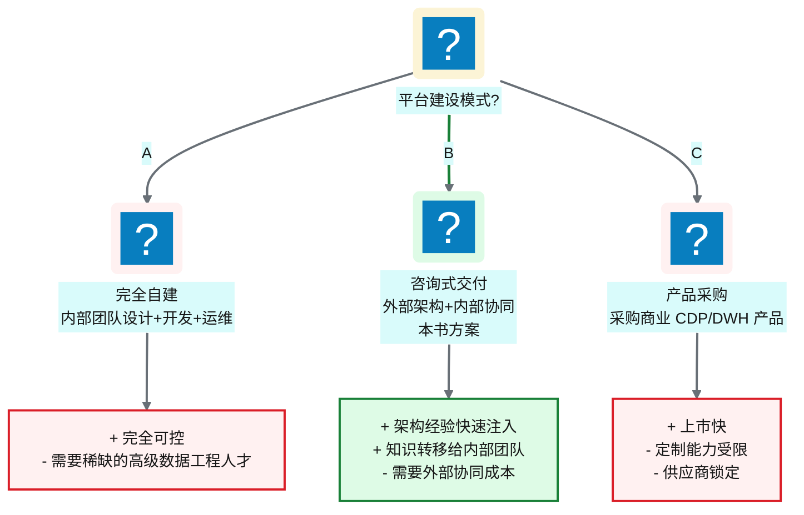
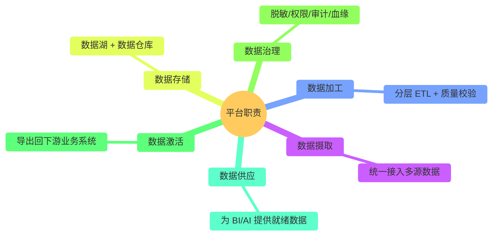
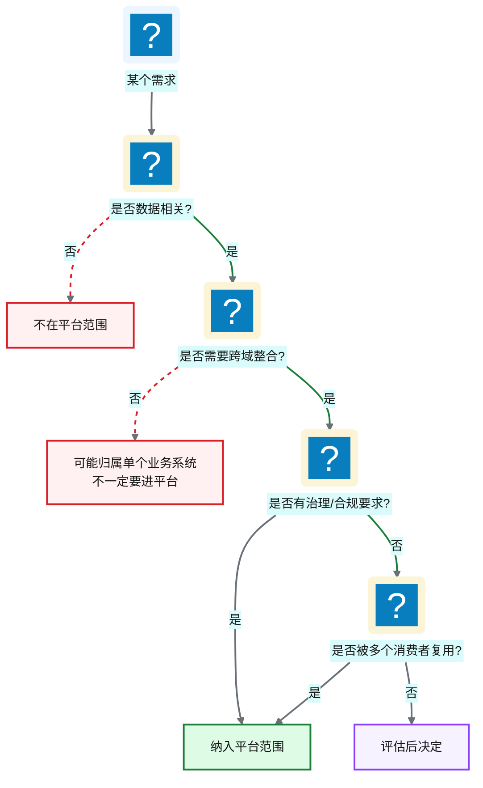
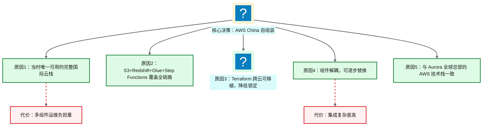
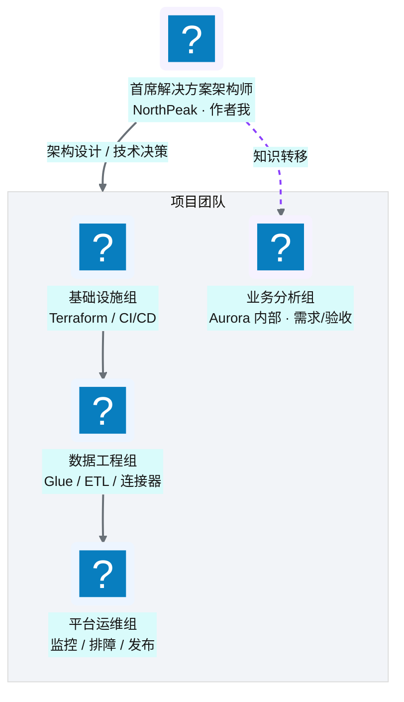

# Ch 2 从需求到蓝图：一个数据平台的诞生

!!! info "面包屑"
    [本书主页](./index.md) › [Part I 起点](./01-数字化转型下的医药数据困局.md) › Ch 2

!!! abstract "项目第 0 年 · 架构设计期——蓝图成型"

---

## :material-school: 本章你将学到
- NorthPeak 以何种方式介入 Aurora 的数据平台建设，咨询式交付与自建的差异
- 如何划定平台的范围与边界——做什么、不做什么同样重要
- 技术选型的核心 trade-off：为什么选 AWS China + :simple-terraform: Terraform + Glue/Step Functions，以及当时的历史约束和选型争论
- 大型数据平台项目的团队组建与交付节奏

---

## 2.1 项目背景与 NorthPeak 的介入：咨询式交付 vs 自建

[Ch 1](./01-数字化转型下的医药数据困局.md) 的调研结束后，我给 Aurora 管理层写了一份评估报告，结论很直接："修修补补没意义，得建一座新的企业级数据平台。"管理层同意了，但经典选择题摆了上来：自建还是外采？

### 三种交付模式对比

**图 2-1** 三种交付模式对比

| 维度 | 完全自建 | 咨询式交付（本书） | 产品采购 |
|---|---|---|---|
| **上市速度** | 慢（需先招人） | 中（架构师即到位） | 快（开箱即用） |
| **定制灵活性** | 最高 | 高 | 低 |
| **知识沉淀** | 内部自然积累 | 需刻意设计知识转移 | 依赖供应商文档 |
| **初始成本** | 中（人员逐步到位） | 高（咨询费） | 中（许可费） |
| **长期成本** | 低（自有团队） | 中（逐步移交） | 高（持续许可+升级） |
| **适用条件** | 已有成熟数据团队 | 团队建设中，需架构引导 | 需求标准化、无特殊定制 |

**表 2-1** 三种交付模式对比

Aurora 选的是**咨询式交付**：NorthPeak 派出我（首席解决方案架构师）和一支工程团队，与 Aurora 内部 IT 团队协同，完成平台从设计到交付的全过程，过程中把架构能力和工程实践转移给内部团队。

这个选择不是默认的。Aurora 管理层起初倾向"完全自建"——理由很正：平台是核心资产，不该依赖外部。我用一个反例说服了他们：我见过一个客户坚持自建，花了八个月招数据工程师，来的人要么能力不够、要么进来就离职——因为没有成熟架构师带，新人没法成长。八个月后连数据湖都没搭起来，业务方彻底没了耐心。自建的前提是"你已有成熟数据团队"，而 Aurora 当时的 IT 团队是 SQL Server DBA 背景，缺云原生和分布式数据工程经验——硬自建等于让没打过仗的队伍直接上战场。

产品采购（选项 C）也排除了。医药行业的合规要求（GxP ALCOA+、PIPL 数据驻留）加上 10+ 异构数据源的接入需求，现成商业 CDP 产品很难匹配——要么定制能力受限，要么数据驻留不达标。最终咨询式交付（选项 B）成了约束下的最优解：架构师即到位，不用等人；跨行业经验快速注入，少走弯路；通过知识转移让内部团队逐步接手。代价是外部协同成本和咨询费——但比起自建的"八个月空转"和产品采购的"定制受限"，这个代价划得来。

!!! tip "引申"
    咨询式交付的核心价值不是"外部人更厉害"，而是"外部人见过更多场景"。我在专利数据和企业征信两段经历里，见过两套完全不同的数据平台架构——专利数据偏"全文检索+图数据库"，企业征信偏"多源融合+实体解析"。这些跨行业经验让我在 Aurora 的架构设计时，能跳出"医药行业的惯性思维"，从更广的视角做决策。这也是为什么本书的很多设计模式（如图引擎做 join 发现、配置驱动框架）能跨行业复用——好的架构思想是行业无关的。但有一句实话得补上：咨询式交付有个隐性风险——**知识转移如果不到位，外部团队一撤，平台就成了没人能维护的黑箱**。这也是为什么我在交付节奏里刻意安排了知识转移环节（见 §2.4.2）。

---

## 2.2 范围与边界：平台做什么、不做什么

架构设计的第一步不是画图，而是**画边界**。我在企业征信项目里吃过亏——当时"什么都想管"，结果边界无限膨胀，最后变成了什么都做不好的大杂烩。到了 Aurora，我学乖了：先明确"不做什么"。

### 平台做什么

**图 2-2** 平台做什么

这六个职责不是一开始就定全的。画第一版蓝图时我只写了前三个（摄取/加工/存储），后来对比企业征信项目才补上后三个。企业征信那座平台最初也只管"摄取+加工+存储"，建到一半发现两个缺口：一是数据脱敏和权限没人管，合规审计时手忙脚乱；二是加工完的数据只存在仓库里"等人来查"，业务方还是觉得取数难。这两个缺口让我在 Aurora 的蓝图里把"治理"和"激活/供应"提成和前三个并列的一等职责——不是事后补丁，是第一天就该规划的事。

六个职责里，"数据激活"和"数据供应"最容易被忽视。很多团队建平台只想到"把数据收进来、存好、加工好"，忘了问"加工好的数据怎么送到消费者手里"。这正是传统 DWH 的盲区（见 [Ch 1 表 1-5](./01-数字化转型下的医药数据困局.md) 的"数据流向"行）——单向流入，没有主动供应。Aurora 的平台从第一天就把"激活导回下游系统"和"为 BI/AI 供应就绪数据"纳入职责，这个决策后来在 Part VI 衍生系统（[Ch 37 DaaS 激活层](./37-数据即服务-DaaS激活层设计.md)）和 Part VII Agentic BI（[Ch 38 AI-Ready 数据供应](./38-时代命题-AI-Ready数据供应.md)）里兑现了价值——平台不只是"数据仓库"，是"数据供应中枢"。

### 平台不做什么

| 不做的事 | 原因 | 谁来做 |
|---|---|---|
| **不做 BI 可视化** | 平台提供数据，不提供报表展现 | 下游 BI 工具（Tableau/Power BI） |
| **不做业务逻辑判断** | 平台是数据基础设施，不嵌入业务规则 | 业务系统自身 |
| **不做实时流处理** | 当时业务以 T+1 批量为主，实时需求不足 | 未来演进时再引入 |
| **不做数据科学建模** | 平台供应数据，不做模型训练 | 数据科学团队 |
| **不做应用开发** | 平台不是应用运行时 | 业务应用团队 |

**表 2-2** 平台不做什么

这张"不做清单"比"做清单"更难定，因为每一条都意味着对某个业务方说"不"。"不做 BI 可视化"吵得最久——市场部门一开始坚持"平台应该自带报表"，他们说数据进了平台还得再买 Tableau 才能看，多此一举。我的反驳是：BI 可视化是展现层，和数据平台是不同的关注点——把报表逻辑嵌进数据平台，会让平台变成什么都管的大杂烩，违反关注点分离原则（M2）。最后的妥协是：平台提供标准化语义层和数据供应接口，下游 BI 工具直接对接——平台做"数据供应"，BI 做"数据展现"，谁也别越界。

"不做实时流处理"这一条我当时最纠结。四年前实时需求确实不强（业务以 T+1 批量为主），但我知道这个边界早晚得破。我选择先划出去的原因是：实时流处理（Kinesis/Flink）会引入一套完全不同的运维模式——水位线、反压、exactly-once——把它和批量 ETL 混在一起会让平台复杂度翻倍。先把批量+事件驱动做扎实，等实时需求真来了再以旁路方案引入——这个决策在第四年的近实时场景里确实兑现了（详见 [Ch 33 自研 DAG 调度器](./33-自研DAG调度器与任务编排.md)）。**边界不是永久的，但阶段性划清能让平台在当前阶段保持聚焦**。

!!! warning "Trade-off"
    划定边界就意味着"有所不为"。比如我们早期决定"不做实时流处理"，这让平台架构简化了很多（纯批量 + 事件驱动），但也导致后期某些近实时场景需要额外的旁路方案。边界永远是 trade-off——划太窄，能力不足；划太宽，复杂度失控。原则是：**先把核心做扎实，边界外的东西留给未来演进**。这个原则在第四年得到了回报——当 AI 转型来临时，平台核心架构足够稳健，能在其上叠加 Agentic BI 层。

### 范围定义的决策框架

我用一个简单的框架来辅助范围决策——每次有人提"平台要不要管 XX"，走一遍这个流程：

**图 2-3** 范围定义的决策框架

这个框架不是理论模型，是被逼出来的。项目第二周，市场部门提了一个需求："平台要不要管代表拜访路线优化？"——听起来和数据相关（拜访数据在 SFE 里），但仔细想是业务逻辑，不是数据基础设施的职责。我和团队吵了一下午没结论，最后画了这个决策树，走一遍：数据相关？是。需要跨域整合？否（只在 SFE 域内）。有治理/合规要求？否。被多个消费者复用？否。→ 评估后决定：不纳入平台，留给 SFE 系统自己优化。一个下午的争论，这棵树五分钟就判完了。

这个框架后来救了好几次"边界膨胀"的险。最典型的是第三个月，有人提议"平台要不要接日志分析"——走决策树：数据相关？是。需要跨域整合？否（日志单独成域）。有治理要求？是（审计日志要留存）。被多消费者复用？是（运维+安全+合规都要看）。→ 纳入平台范围。这个判断后来催生了 [Ch 49 日志监控审计与告警](./49-日志-监控-审计与告警.md)——审计日志确实该进平台，因为它是多消费者、有合规要求的跨域数据。**框架的价值不在于"画得漂亮"，而在于让边界决策可复现、可复盘**——下次有人质疑"为什么这个没进平台"，走一遍树就能说清楚，而不是"当时拍脑袋定的"。

---

## 2.3 技术选型的 trade-off：为什么选 AWS China + Terraform + Glue/Step Functions

这是全书最关键的架构决策之一，也是项目第 0 年吵得最凶的议题。后续所有章节的技术细节都建立在这个选型之上，所以我把它放在这里详细拆开。

### 选型争论现场

技术选型评审会上，三方意见激烈交锋：

- **Aurora IT 团队**倾向"直接用阿里云全套"——他们有阿里云运维经验，觉得自建太累。
- **Aurora 全球总部**倾向"和全球保持一致，用 AWS"——Aurora 全球其他区域已经用 AWS。
- **我（NorthPeak）**倾向"AWS China 自组装 + Terraform"——理由后面详述。

争论的焦点不是"用哪个云"（AWS 已基本确定），而是"在 AWS 上怎么组装"：

- 选项一：AWS 全自组装（S3+Glue+Redshift+Step Functions+DynamoDB）——灵活但运维重
- 选项二：等 :simple-snowflake: Snowflake 入华——省心但当时不可用
- 选项三：用 AWS EMR + 自建 Airflow——更灵活但更重

### 时代背景：四年前的中国云市场

!!! warning "重要的历史约束"
    这个项目启动于**四年前**。当时（2021 年前后），中国的云原生数据平台市场与今天有很大不同：

    - **Snowflake 尚未入华**：Snowflake 在中国大陆没有商用服务节点，跨境访问的延迟和合规问题使其不可行
    - **:simple-databricks: Databricks 尚未提供大陆商用服务**：同样面临入华门槛
    - **AWS China（由光环新道/西云数据运营）**是当时少数能提供完整数据服务栈的国际云，且已有合规资质
    - **阿里云、腾讯云**虽有数据产品，但生态完整度和国际团队接受度不如 AWS

    因此，"在 AWS China 上自组装数据平台"在当时是一个**约束条件下的务实选择**，而非"最优选择"。

    下文的技术对比**按当前（2026 年）的能力正常描述**——因为读者需要理解的是方案的 trade-off 本身，而非四年前的市场快照。

### 选型决策矩阵

| 维度 | AWS China 自组装 （本书方案） | Snowflake-first | Databricks Lakehouse | Airflow + 开源自组装 |
|---|---|---|---|---|
| **数据仓库** | Redshift（托管，Ra3） | Snowflake（原生云数仓） | Databricks SQL（湖仓统一） | 自建 PG/Trino |
| **数据湖** | S3 + :simple-apacheparquet: Parquet | 内置（Snowflake 内部） | S3 + Delta/:material-database-sync: Iceberg | S3 + 开源格式 |
| **ETL 引擎** | Glue（托管 Spark） | Snowpipe/Task | Databricks Spark | 自建 Spark/Flink |
| **编排** | Step Functions + EventBridge | Snowflake Task/Airflow | Databricks Workflows | Airflow（主力） |
| **IaC** | Terraform | Terraform | Terraform | Terraform |
| **运维负担** | 中（多组件组装） | 低（高度托管） | 中低（Databricks 托管） | 高（全自建） |
| **锁定程度** | 中（AWS 服务） | 高（Snowflake 生态） | 中高（Databricks 生态） | 低（纯开源） |
| **中国可用性（4年前）** | ✅ | ❌ | ❌ | ✅（自部署） |
| **中国可用性（现在）** | ✅ | ✅（已入华） | ✅（已入华） | ✅ |

**表 2-3** 选型决策矩阵

这张矩阵在评审会上是我辩护的核心。关键不是"AWS 自组装每一行都赢"，而是要讲清**哪些行是硬约束——一票否决，哪些行是软偏好——可以妥协**。

"中国可用性（4年前）"是硬约束。Snowflake 和 Databricks 当时没进中国，直接出局，不管其他维度多优秀。这不是偏好问题，是合规和物理可达性的事。剩下的两个可选方案（AWS 自组装 vs Airflow+开源自组装）对比，"运维负担"和"锁定程度"是软偏好——AWS 自组装运维负担中等但锁定也中等，开源方案运维负担高但锁定低。我的判断是：**Aurora 的团队规模（5-6 人）扛不住"运维负担高"的开源方案**。自建 Spark/Flink/Trino 集群需要专职 infra 工程师，Aurora 当时没这个人。锁定程度虽然 AWS 自组装偏高，但 Terraform 的跨云可移植性给了一条"以后能迁"的退路，中和了锁定风险。

矩阵里还有一行容易被忽略但影响很深——"ETL 引擎"。Glue 是托管 Spark，我们不用自己维护集群；开源方案要自建 Spark，集群调优、版本升级、故障恢复全得自己来。这个差异第一年不明显，到第二年业务域从 3 个涨到 15 个时，Glue 的"零运维"价值就体现出来了——如果当时选自建 Spark，光维护集群就会吃掉团队一半精力。**选型的眼光要看到一年后，不能只看眼下**。

### 为什么最终选了 AWS China 自组装

**图 2-4** 为什么最终选了 AWS China 自组装

**核心选择逻辑**：

1. **云栈完整性**：S3（存储）+ Glue（ETL）+ Redshift（仓库）+ Step Functions（编排）+ DynamoDB（配置）+ Lambda（控制面），全部托管。这在四年前是国内能做到的最高程度的"托管化"——不用自己管服务器。
2. **IaC 可移植性**：选 Terraform 而非 CloudFormation，因为它云无关——以后要迁到其他云，IaC 层可以复用。这个决策后来被证明是对的——第四年评估 Snowflake 迁移时，IaC 层的可移植性大幅降低了评估门槛。
3. **组件可替换性**：每个组件都解耦。Redshift 不行了换 Snowflake，Glue 不行了换 EMR。这就是"自组装"相对于"一体化"的核心好处——不赌一家。
4. **全球一致性**：Aurora 全球总部已经用 AWS，中国区接着用，可以复用全球的 IaC 模块和运维经验。

!!! warning "Trade-off"
    自组装的代价是**集成复杂度和运维负担**。你得自己处理组件之间的认证、网络、错误传播、监控。一体化方案（如 Snowflake）把这些问题全封装好了，但代价是深度锁定。四年后的今天，如果 Snowflake 和 Databricks 都已入华，这个 trade-off 的天平可能会倒向一体化。但在当时，我们没这个选项。

### 为什么选 Terraform 而非 CloudFormation

| 维度 | Terraform | CloudFormation |
|---|---|---|
| **云支持** | 多云（AWS/Azure/GCP/...） | 仅 AWS |
| **学习曲线** | HCL 语法简洁 | :simple-yaml: YAML/:simple-json: JSON 较冗长 |
| **状态管理** | 外部 state（S3+DynamoDB） | 内置（CloudFormation 托管） |
| **模块生态** | 丰富（社区 Registry） | AWS 官方为主 |
| **可移植性** | 高（跨云复用） | 无（AWS 锁定） |

**表 2-4** 为什么选 Terraform 而非 CloudFormation

Terraform vs CloudFormation，我项目第一周就拍板了，但引发了一场意外的争论。Aurora 全球总部 infra 团队用的是 CloudFormation——理由很简单，"AWS 原生、无外部依赖"。我花了一整个下午说服他们接受 Terraform，核心就两条：可移植性和模块生态。

可移植性是面向未来的保险。我当时没法预知四年后会不会迁移，但架构师的工作就是留余地——万一要迁到其他云，或者 Snowflake 入华后要部分迁移，IaC 层不该成障碍。CloudFormation 是 AWS 专有的，迁云意味着 IaC 全重写；Terraform 云无关，至少模块结构可以复用。第四年评估 Snowflake 迁移时，这个决策兑现了——我们发现 IaC 层的可移植性大幅降低了迁移门槛。

模块生态是面向当下的效率。CloudFormation 以 AWS 官方模块为主，社区生态薄；Terraform 有丰富的社区 Registry，VPC、Redshift、Glue 这些常见资源的创建方式社区已有成熟模块可直接引用。这让 Part IV（[Ch 24 通用 Terraform 模块设计](./24-通用Terraform模块设计.md)）能站在社区模块的肩膀上，不用从零造轮子。**选一个生态成熟的工具，比选一个"官方但没人用的"工具，长期收益大多了**。

!!! tip "引申：IaC 的发展脉络"
    基础设施即代码（Infrastructure as Code）本身经历了几代演进：早期是 Shell 脚本 + CloudFormation（声明式但云锁定）→ Terraform（声明式+多云，成为事实标准）→ Pulumi（用真实编程语言写 IaC，更灵活但更重）→ CDK（云厂商提供的编程式 IaC，如 AWS CDK）。本书选 Terraform 是因为它在"成熟度、社区生态、跨云可移植性"三者间取得了最佳平衡。如果今天重新选，Terraform 仍然是首选——它的地位在 IaC 领域类似于 SQL 在查询领域的地位。

---

## 2.4 团队、节奏与交付模式

### 团队结构

**图 2-5** 团队结构

这个团队结构是我在项目第一周搭的，逻辑很简单——Aurora 缺什么，NorthPeak 补什么。Aurora 内部当时只有 SQL Server DBA 和业务分析师，缺云原生 infra 能力和分布式数据工程能力。所以 NorthPeak 这边补基础设施组和数据工程组，Aurora 那边出业务分析组负责需求和验收。平台运维组是混合编制：前期 NorthPeak 为主，后期逐步移交 Aurora 内部人员——这个"逐步移交"就是咨询式交付里知识转移的落地方式。

图里有一条容易被忽略的虚线——我（首席架构师）到业务分析组的"知识转移"。很多咨询项目只转移技术能力（教写代码），不转移架构能力（教做决策）。结果外部一撤，内部团队能维护代码但做不了架构演进。我刻意把"架构决策能力"列进了知识转移范围：每个关键决策——选型、边界划定、模块设计——都拉着 Aurora 的技术骨干一起讨论，讲清楚"为什么这么选"，而不只是"选了这个"。这比单纯交接代码慢，但两年后 Aurora 内部团队能独立做架构演进，证明这个投入值了。**知识转移的终极目标，是让自己变得不再被需要**——这是咨询式交付最诚实的信条。

### 交付节奏

| 阶段 | 周期 | 产出 |
|---|---|---|
| **架构设计** | 第 1-4 周 | 五层模型、技术选型、仓库规划 |
| **核心基础设施** | 第 5-12 周 | core-infra 仓库、数据湖桶、Redshift 基座 |
| **首批业务域** | 第 13-24 周 | SCI 域接入端到端流水线，验证架构 |
| **批量扩展** | 第 25-40 周 | 其余业务域接入，CI/CD 平台化 |
| **迁移与演进** | 第 41 周起 | 遗留系统迁移、衍生系统建设 |

**表 2-5** 交付节奏

交付模式采用**敏捷迭代**：每两周一个 sprint，每个 sprint 交付可验证的端到端切片（而非单点功能）。这比"先建三个月基础设施再建业务"的瀑布模式安全得多——架构设计需要真实数据的验证才能确认它是对的。

!!! tip "引申"
    大型数据平台项目最大的风险不是技术，而是"建了很久却没人用"。我在企业征信项目里见过这个坑——团队花了半年建基础设施，结果业务方等不及，自己用 :fontawesome-solid-file-excel: Excel 搞了一套。到平台上线时，业务方已经不感兴趣了。所以在 Aurora，我刻意让首批业务域（SCI）在第 13 周就跑通端到端流水线，让业务方尽早看到数据、给反馈。这比追求"完美架构"重要得多——因为**没有真实业务验证的架构，全是纸上谈兵**。

---

## :material-check-circle: 本章小结
- Aurora 选择咨询式交付：NorthPeak 注入跨行业架构经验（专利数据/企业征信/医药），与内部团队协同，过程中完成知识转移
- 平台范围明确："做什么"（摄取/加工/存储/治理/激活/供应）与"不做什么"（BI 可视化/业务逻辑/实时流/数据科学建模/应用开发）同等重要
- 技术选型经历了三方争论，最终选 AWS China 自组装 + Terraform——核心原因是：四年前 Snowflake/Databricks 未入华，AWS China 是唯一可用的完整国际云栈；Terraform 提供跨云可移植性
- 团队按基础设施/数据工程/运维/业务分析分组，采用敏捷迭代、每两周交付端到端切片的节奏——避免"建了很久没人用"的风险

---

!!! quote "下一章"
    [Ch 3 技术栈全景与预备知识](./03-技术栈全景与预备知识.md) —— 进入正文前的最后一站：一张全景图看懂平台的技术栈与仓库体系，以及你需要的前置知识。

