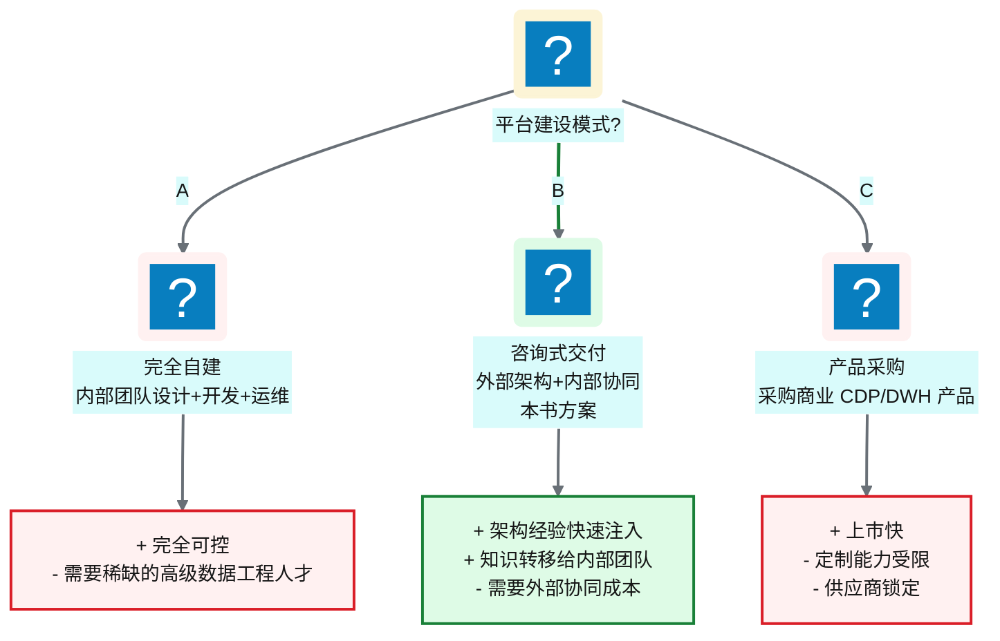
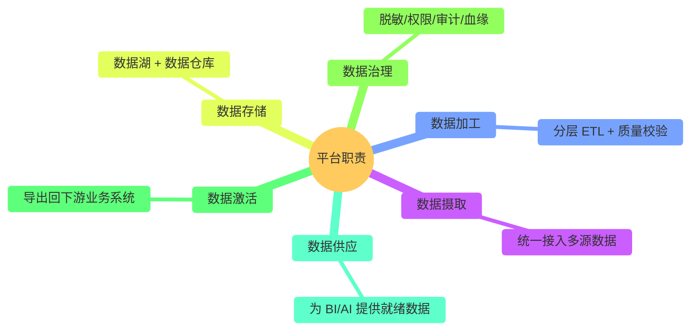
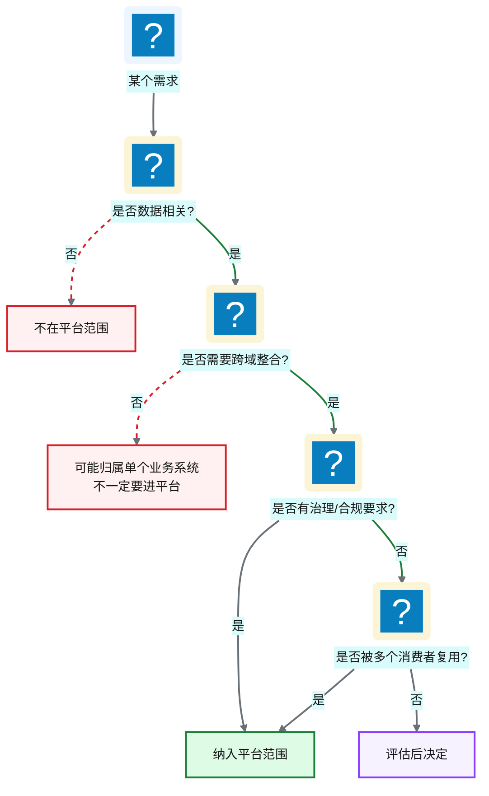
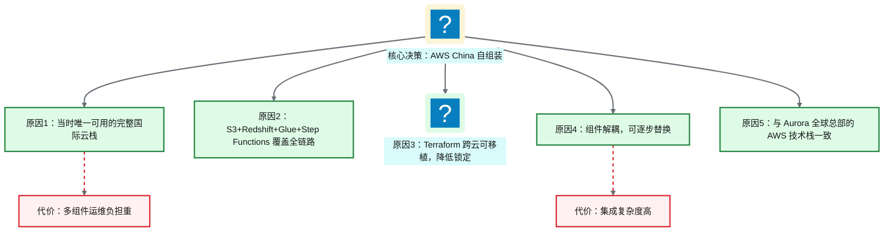
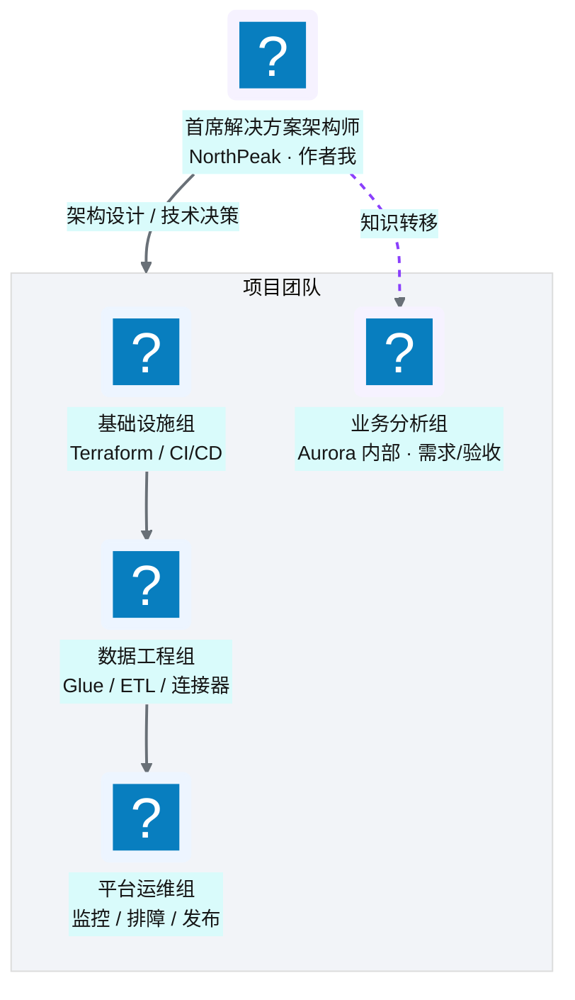

# Ch 2 从需求到蓝图：一个数据平台的诞生

!!! info "面包屑"
    [本书主页](./index.md) › [Part I 起点](./01-数字化转型下的医药数据困局.md) › Ch 2

!!! abstract "项目第 0 年 · 架构设计期——蓝图成型"

---

## :material-school: 本章你将学到
- NorthPeak 以何种方式介入 Aurora 的数据平台建设，咨询式交付与自建的差异
- 如何划定平台的范围与边界——做什么、不做什么同样重要
- 技术选型的核心 trade-off：为什么选 AWS China + :simple-terraform: Terraform + Glue/Step Functions，以及当时的历史约束和选型争论
- 大型数据平台项目的团队组建与交付节奏

---

## 2.1 项目背景与 NorthPeak 的介入：咨询式交付 vs 自建

[Ch 1](./01-数字化转型下的医药数据困局.md) 的调研结束后，我给 Aurora 管理层写了一份评估报告，结论很直接："修修补补没有意义，需要建一座全新的企业级数据平台。"管理层同意了，但摆在面前的是一个经典的选择题：**自建还是外采？**

### 三种交付模式对比

**图 2-1** 三种交付模式对比

| 维度 | 完全自建 | 咨询式交付（本书） | 产品采购 |
|---|---|---|---|
| **上市速度** | 慢（需先招人） | 中（架构师即到位） | 快（开箱即用） |
| **定制灵活性** | 最高 | 高 | 低 |
| **知识沉淀** | 内部自然积累 | 需刻意设计知识转移 | 依赖供应商文档 |
| **初始成本** | 中（人员逐步到位） | 高（咨询费） | 中（许可费） |
| **长期成本** | 低（自有团队） | 中（逐步移交） | 高（持续许可+升级） |
| **适用条件** | 已有成熟数据团队 | 团队建设中，需架构引导 | 需求标准化、无特殊定制 |

**表 2-1** 三种交付模式对比

Aurora 选择的是**咨询式交付**：NorthPeak 派出我（首席解决方案架构师）和一支工程团队，与 Aurora 内部的 IT 团队协同，完成平台从设计到交付的全过程，并在过程中将架构能力和工程实践转移给内部团队。

!!! tip "引申"
    咨询式交付的核心价值不是"外部人更厉害"，而是"外部人见过更多场景"。我在专利数据和企业征信两段经历里，见过两套完全不同的数据平台架构——专利数据偏"全文检索+图数据库"，企业征信偏"多源融合+实体解析"。这些跨行业经验让我在 Aurora 的架构设计时，能跳出"医药行业的惯性思维"，从更广的视角做决策。这也是为什么本书的很多设计模式（如图引擎做 join 发现、配置驱动框架）能跨行业复用——好的架构思想是行业无关的。

---

## 2.2 范围与边界：平台做什么、不做什么

架构设计的第一步不是画图，而是**画边界**。这个道理我在企业征信项目里吃过亏——当时"什么都想管"，结果平台边界无限膨胀，最终变成了一个什么都做不好的大杂烩。到了 Aurora，我学乖了：先明确"不做什么"。

### 平台做什么

**图 2-2** 平台做什么

### 平台不做什么

| 不做的事 | 原因 | 谁来做 |
|---|---|---|
| **不做 BI 可视化** | 平台提供数据，不提供报表展现 | 下游 BI 工具（Tableau/Power BI） |
| **不做业务逻辑判断** | 平台是数据基础设施，不嵌入业务规则 | 业务系统自身 |
| **不做实时流处理** | 当时业务以 T+1 批量为主，实时需求不足 | 未来演进时再引入 |
| **不做数据科学建模** | 平台供应数据，不做模型训练 | 数据科学团队 |
| **不做应用开发** | 平台不是应用运行时 | 业务应用团队 |

**表 2-2** 平台不做什么

!!! warning "Trade-off"
    划定边界意味着"有所不为"。比如我们早期决定"不做实时流处理"，这让平台架构简化了很多（纯批量 + 事件驱动），但也导致后期某些近实时场景需要额外的旁路方案。边界的划定永远是 trade-off——划太窄，平台能力不足；划太宽，复杂度失控。原则是：**先把核心做扎实，边界外的东西留给未来演进**。这个原则在第四年得到了回报——当 AI 转型来临时，平台的核心架构足够稳健，能支撑在其之上叠加 Agentic BI 层。

### 范围定义的决策框架

我用一个简单的框架来辅助范围决策——每次有人提"平台要不要管 XX"时，走一遍这个流程：

**图 2-3** 范围定义的决策框架

---

## 2.3 技术选型的 trade-off：为什么选 AWS China + Terraform + Glue/Step Functions

这是全书最关键的架构决策之一，也是项目第 0 年争论最激烈的议题。我把它放在这里详细讨论，因为后续所有章节的技术细节都建立在这个选型之上。

### 选型争论现场

技术选型评审会上，三方意见激烈交锋：

- **Aurora IT 团队**倾向"直接用阿里云全套"——他们有阿里云运维经验，觉得自建太累。
- **Aurora 全球总部**倾向"和全球保持一致，用 AWS"——Aurora 全球其他区域已经用 AWS。
- **我（NorthPeak）**倾向"AWS China 自组装 + Terraform"——理由后面详述。

争论的焦点不是"用哪个云"（AWS 已基本确定），而是"在 AWS 上怎么组装"：

- 选项一：AWS 全自组装（S3+Glue+Redshift+Step Functions+DynamoDB）——灵活但运维重
- 选项二：等 :simple-snowflake: Snowflake 入华——省心但当时不可用
- 选项三：用 AWS EMR + 自建 Airflow——更灵活但更重

### 时代背景：四年前的中国云市场

!!! warning "重要的历史约束"
    这个项目启动于**四年前**。当时（2021 年前后），中国的云原生数据平台市场与今天有很大不同：

    - **Snowflake 尚未入华**：Snowflake 在中国大陆没有商用服务节点，跨境访问的延迟和合规问题使其不可行
    - **:simple-databricks: Databricks 尚未提供大陆商用服务**：同样面临入华门槛
    - **AWS China（由光环新道/西云数据运营）**是当时少数能提供完整数据服务栈的国际云，且已有合规资质
    - **阿里云、腾讯云**虽有数据产品，但生态完整度和国际团队接受度不如 AWS

    因此，"在 AWS China 上自组装数据平台"在当时是一个**约束条件下的务实选择**，而非"最优选择"。

    下文的技术对比**按当前（2026 年）的能力正常描述**——因为读者需要理解的是方案的 trade-off 本身，而非四年前的市场快照。

### 选型决策矩阵

| 维度 | AWS China 自组装 （本书方案） | Snowflake-first | Databricks Lakehouse | Airflow + 开源自组装 |
|---|---|---|---|---|
| **数据仓库** | Redshift（托管，Ra3） | Snowflake（原生云数仓） | Databricks SQL（湖仓统一） | 自建 PG/Trino |
| **数据湖** | S3 + :simple-apacheparquet: Parquet | 内置（Snowflake 内部） | S3 + Delta/:material-database-sync: Iceberg | S3 + 开源格式 |
| **ETL 引擎** | Glue（托管 Spark） | Snowpipe/Task | Databricks Spark | 自建 Spark/Flink |
| **编排** | Step Functions + EventBridge | Snowflake Task/Airflow | Databricks Workflows | Airflow（主力） |
| **IaC** | Terraform | Terraform | Terraform | Terraform |
| **运维负担** | 中（多组件组装） | 低（高度托管） | 中低（Databricks 托管） | 高（全自建） |
| **锁定程度** | 中（AWS 服务） | 高（Snowflake 生态） | 中高（Databricks 生态） | 低（纯开源） |
| **中国可用性（4年前）** | ✅ | ❌ | ❌ | ✅（自部署） |
| **中国可用性（现在）** | ✅ | ✅（已入华） | ✅（已入华） | ✅ |

**表 2-3** 选型决策矩阵

### 为什么最终选了 AWS China 自组装

**图 2-4** 为什么最终选了 AWS China 自组装

**核心选择逻辑**：

1. **云栈完整性**：S3（存储）+ Glue（ETL）+ Redshift（仓库）+ Step Functions（编排）+ DynamoDB（配置）+ Lambda（控制面），这套组合覆盖了数据平台的完整链路，且全部托管。这在四年前是国内能做到的最高程度的"托管化"——不用自己管服务器。
2. **IaC 可移植性**：选 Terraform 而非 CloudFormation，因为 Terraform 是云无关的——如果未来要迁移到其他云，IaC 层可以复用。这个决策后来被证明是明智的——第四年评估 Snowflake 迁移时，IaC 层的可移植性降低了迁移评估的门槛。
3. **组件可替换性**：每个组件都是解耦的。Redshift 不行了可以换 Snowflake，Glue 不行了可以换 EMR。这是"自组装"相对于"一体化"的核心优势——不赌一家。
4. **全球一致性**：Aurora 全球总部已经在用 AWS，中国区用 AWS 可以复用全球的 IaC 模块和运维经验。

!!! warning "Trade-off"
    自组装的代价是**集成复杂度和运维负担**。你需要自己处理组件之间的认证、网络、错误传播、监控。一体化方案（如 Snowflake）把这些都封装好了，但代价是深度锁定。四年后的今天，如果 Snowflake 和 Databricks 都已入华，这个 trade-off 的天平可能会倾向一体化方案。但在当时，我们没有这个选项。

### 为什么选 Terraform 而非 CloudFormation

| 维度 | Terraform | CloudFormation |
|---|---|---|
| **云支持** | 多云（AWS/Azure/GCP/...） | 仅 AWS |
| **学习曲线** | HCL 语法简洁 | :simple-yaml: YAML/:simple-json: JSON 较冗长 |
| **状态管理** | 外部 state（S3+DynamoDB） | 内置（CloudFormation 托管） |
| **模块生态** | 丰富（社区 Registry） | AWS 官方为主 |
| **可移植性** | 高（跨云复用） | 无（AWS 锁定） |

**表 2-4** 为什么选 Terraform 而非 CloudFormation

选择 Terraform 的核心理由是**可移植性**和**模块生态**。即便我们当时只用 AWS，但架构师的责任是为未来留余地——万一要迁移，IaC 层不该成为障碍。Terraform 的社区模块生态也比 CloudFormation 丰富得多——很多常见 AWS 资源的标准化创建方式，社区已经有成熟模块可以直接引用。

!!! tip "引申：IaC 的发展脉络"
    。基础设施即代码（Infrastructure as Code）本身经历了几代演进：早期是 Shell 脚本 + CloudFormation（声明式但云锁定）→ Terraform（声明式+多云，成为事实标准）→ Pulumi（用真实编程语言写 IaC，更灵活但更重）→ CDK（云厂商提供的编程式 IaC，如 AWS CDK）。本书选 Terraform 是因为它在"成熟度、社区生态、跨云可移植性"三者间取得了最佳平衡。如果今天重新选，Terraform 仍然是首选——它的地位在 IaC 领域类似于 SQL 在查询领域的地位。

---

## 2.4 团队、节奏与交付模式

### 团队结构

**图 2-5** 团队结构

### 交付节奏

| 阶段 | 周期 | 产出 |
|---|---|---|
| **架构设计** | 第 1-4 周 | 五层模型、技术选型、仓库规划 |
| **核心基础设施** | 第 5-12 周 | core-infra 仓库、数据湖桶、Redshift 基座 |
| **首批业务域** | 第 13-24 周 | SCI 域接入端到端流水线，验证架构 |
| **批量扩展** | 第 25-40 周 | 其余业务域接入，CI/CD 平台化 |
| **迁移与演进** | 第 41 周起 | 遗留系统迁移、衍生系统建设 |

**表 2-5** 交付节奏

交付模式采用**敏捷迭代**：每两周一个 sprint，每个 sprint 交付可验证的端到端切片（而非单点功能）。这比"先建三个月基础设施再建业务"的瀑布模式更安全——因为架构设计需要真实数据的验证才能确认其有效性。

!!! tip "引申"
    大型数据平台项目最大的风险不是技术，而是"建了很久却没人用"。我在企业征信项目里见过这个坑——团队花了半年建基础设施，结果业务方等不及，自己用 :fontawesome-solid-file-excel: Excel 搞了一套。到平台上线时，业务方已经不感兴趣了。所以在 Aurora，我刻意让首批业务域（SCI）在第 13 周就跑通端到端流水线，让业务方尽早看到数据、给反馈。这比追求"完美架构"更重要——因为**没有真实业务验证的架构，都是纸上谈兵**。

---

## :material-check-circle: 本章小结
- Aurora 选择咨询式交付：NorthPeak 注入跨行业架构经验（专利数据/企业征信/医药），与内部团队协同，过程中完成知识转移
- 平台范围明确："做什么"（摄取/加工/存储/治理/激活/供应）与"不做什么"（BI 可视化/业务逻辑/实时流/数据科学建模/应用开发）同等重要
- 技术选型经历了三方争论，最终选 AWS China 自组装 + Terraform——核心原因是：四年前 Snowflake/Databricks 未入华，AWS China 是唯一可用的完整国际云栈；Terraform 提供跨云可移植性
- 团队按基础设施/数据工程/运维/业务分析分组，采用敏捷迭代、每两周交付端到端切片的节奏——避免"建了很久没人用"的风险

---

!!! quote "下一章"
    [Ch 3 技术栈全景与预备知识](./03-技术栈全景与预备知识.md) —— 进入正文前的最后一站：一张全景图看懂平台的技术栈与仓库体系，以及你需要的前置知识。

