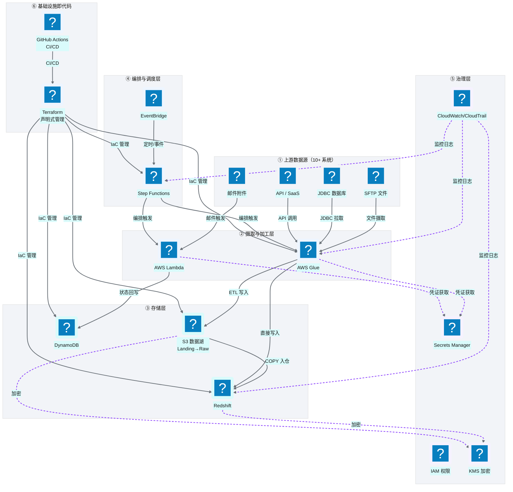
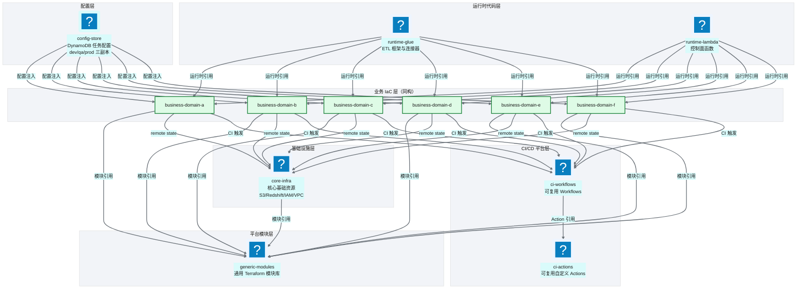
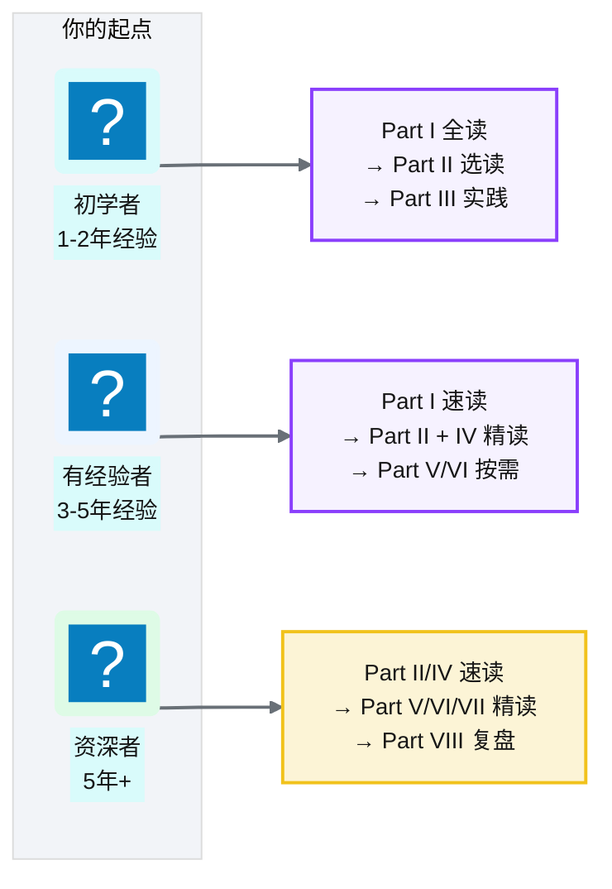

# Ch 3 技术栈全景与预备知识

!!! info "面包屑"
    [本书主页](./index.md) › [Part I 起点](./00-preface.md) › Ch 3

!!! abstract "项目第 0 年 · 架构设计期——技术栈定稿"

---

## :material-school: 本章你将学到
- 平台的"一句话定义"和完整技术栈主表（合并用途与定位，兼作后续章节导航）
- 核心组件的协作关系全景图，以及 AWS China 与 Global 的关键差异
- 平台仓库体系的分层设计与依赖关系（虚构最佳实践示意）
- 阅读后续章节需要的前置知识检查清单

---

技术选型定了（[Ch 2](./02-从需求到蓝图：一个数据平台的诞生.md)），接下来要把这些组件组装成平台。但在动手之前，我想先给读者一张"全景地图"——让你看到整体长什么样、每个组件扮演什么角色。

这一章是全书唯一"纯科普"性质的章节。如果你已经熟悉 AWS 数据服务栈和 :simple-terraform: Terraform，可以快速跳过。如果比较陌生，建议花点时间把这张地图印在脑子里——后续每一章都会在地图的某个区域深入展开。

---

## 3.1 平台一句话与技术栈全景表

**平台一句话**：

> Aurora CDP 是一个构建在 AWS China 上的企业级数据平台，通过 Terraform 管理基础设施、Glue + Lambda 处理数据、DynamoDB 存储任务配置、Step Functions + EventBridge 编排调度、:simple-githubactions: GitHub Actions 完成 CI/CD 发布。它从 SFTP、API、:material-cloud-braces: Salesforce、JDBC 数据库、邮件等上游系统摄取数据，经过 S3 分层数据湖（Landing → Raw → Enriched）和 Glue ETL 加工，最终落入 Redshift 供 BI 和 AI 消费，或导出回下游业务系统。

下面这张主表把技术栈与组件定位合并在一起——既告诉你"用什么技术、做什么用途"，也告诉你"在书中哪里详细讨论"，作为后续阅读的导航锚点：

| 层级 | 技术 | 用途 | 在书中详细讨论 |
|---|---|---|---|
| **基础设施即代码** | Terraform (HCL) | 用代码声明"要哪些 AWS 资源"，自动创建/修改/销毁 | Part IV Ch 21-25 |
| **计算 / ETL** | AWS Glue (:simple-apachespark: PySpark + :simple-python: Python Shell) | 托管的 Spark 运行时，负责数据搬运和转换（数据面） | Part II Ch 9, Part III Ch 13-17 |
| **控制面** | AWS Lambda (:simple-python: Python) | 无服务器函数，轻量控制逻辑：触发、参数处理、状态回写 | Part II Ch 9, Part III Ch 12 |
| **编排** | AWS Step Functions | 状态机编排引擎，把多个 Glue/Lambda 串成有状态流程 | Part II Ch 10, Part IV Ch 26 |
| **调度** | Amazon EventBridge | 事件总线 + 定时调度器，触发 Step Functions | Part II Ch 10 |
| **数据湖** | Amazon S3（Landing/Raw 分层；Gold 在 Redshift） | 对象存储，数据湖的物理载体，按分层管理 | Part II Ch 7 |
| **数据仓库** | Amazon Redshift | 列式数据仓库，分析查询的执行引擎 | Part II Ch 8 |
| **元数据** | AWS Glue Data Catalog + Crawler | Schema 发现与查询 | Part III Ch 20 |
| **交互查询** | Amazon Athena | S3 上的 Serverless SQL 查询引擎 | Part II Ch 7 |
| **任务配置** | Amazon DynamoDB | 键值数据库，存任务配置（运行时动态读取）和运行状态 | Part II Ch 11, Part III Ch 12 |
| **凭证管理** | AWS Secrets Manager | 托管密钥，存数据库密码、API token，支持自动轮转 | Part IV Ch 29 |
| **安全** | IAM Roles/Policies, KMS, OIDC | 权限、加密、身份联合 | Part VIII Ch 50 |
| **监控** | CloudWatch, CloudTrail | 日志、指标、审计、告警 | Part VIII Ch 51 |
| **API** | API Gateway + Lambda | 数据查询/写入 REST API（DaaS） | Part VI Ch 39 |
| **CI/CD** | :simple-githubactions: GitHub Actions（reusable workflows + custom actions） | 验证、计划、部署、发布 | Part IV Ch 27-28 |
| **代码语言** | Python（主）、HCL、:simple-yaml: YAML、:simple-json: JSON、TypeScript | — | 全书 |

**表 3-1** 平台一句话与技术栈全景表

这张表我项目第一周画在白板上，擦了改、改了擦，最后定格在这 16 行。只看技术名词，会觉得"这不就是一堆 AWS 服务堆一起吗"——但关键不在单个服务，在**为什么是这套组合、而不是别的**。

这套组合的内核是**控制面与数据面分离**（M6）：Lambda 做轻量控制（触发、参数处理、状态回写），Glue 做重数据搬运（ETL 转换），Step Functions 把两者串成有状态流程，DynamoDB 存配置和运行状态。这个分工不是我发明的，是 AWS 数据服务栈的天然分层——但选择"严守这个分层、不让 Glue 干控制的活、也不让 Lambda 干数据搬运的活"是刻意的架构纪律。我在企业征信项目里见过反例：有人为了省事在 Lambda 里跑重型数据处理，函数超时、内存爆掉、排障失败——控制面和数据面一混，故障隔离和弹性扩容都没法做。

表里还有一条暗线：**Terraform + GitHub Actions 覆盖了"声明"和"发布"两个维度**。Terraform 声明"要什么资源"，GitHub Actions 负责"怎么安全地把变更推上去"。这套 IaC + CI/CD 组合是 Part IV（Ch 21-30）的主角，它的价值第一年不明显——手动点几下也能部署——到第二年业务域从 3 个涨到 15 个时才体现出来：没有自动化 CI/CD，15 个仓库的手动部署会吃掉团队所有时间。**选型要有"看到第二年"的眼光**，这条在第 2 章的 Glue vs 自建 Spark 决策里已经验证过一次了。

!!! tip "引申"
    如果你对这些组件完全陌生，建议先花一个周末看 AWS 官方的 [Building a Data Lake](https://aws.amazon.com/big-data/datalakes-and-analytics/) 入门教程。本书不会重复官方文档的基础内容，而是聚焦"如何用这些组件组装出一座企业级平台"。

---

## 3.2 核心组件协作全景图

把上表的技术组件串成一张协作关系图，让你在进入后续章节前，先有一个"全景地图"：

**图 3-1** 核心组件协作全景图

这张图建议你先存进脑子——后续每一章都是在它的某个区域深入展开。比如 [Ch 7](./07-数据湖分层设计.md) 展开存储层的 S3 分层，[Ch 8](./08-数据仓库设计-Redshift.md) 展开数据仓库，[Ch 9](./09-计算与ETL设计-Glue与Lambda.md) 展开数据面与控制面的分工，[Ch 10](./10-编排与调度设计-StepFunctions与EventBridge.md) 展开编排调度层。

如果你问我哪条线最重要，我会指 **EventBridge → Step Functions → Glue/Lambda** 这条主链——它是整个平台的"神经系统"。EventBridge 是触发源（定时或事件），Step Functions 是编排大脑（状态机决定执行顺序和错误重试），Glue/Lambda 是执行手脚。这条链路本质是**事件驱动编排**（M3）：数据到达或时间到了就触发，不用轮询。我在企业征信项目里用过 cron + Shell 脚本的方案，最大的痛是"故障没人知道"——脚本挂了得等用户投诉。Step Functions 的状态机自带重试、超时、错误捕获，把"故障可观测"从架构层就解决了。这也是为什么本书反复说"事件驱动"——不光是效率的事，更是可观测性的事。

图里还有一组容易被忽略的虚线——治理层（IAM/Secrets/KMS/CloudWatch）连到所有组件的虚线。它意味着**治理不是独立模块，是横切所有层的非功能需求**。很多团队建平台先"跑通功能"，治理留到"以后补"——我在企业征信时也这么想过，结果"以后"永远是"没有以后"，上线半年后补审计日志，发现全链路无埋点，只能推倒重来。Aurora 的平台从第一天就把治理虚线画进图里，哪怕第一版只做基础权限和日志——**治理得从第一行代码就嵌入，不能事后补**（M10）。

### AWS China vs AWS Global：为什么有差异、差异在哪

上图里的所有 AWS 服务，在 Aurora 这个项目里都跑在 **AWS China**（由光环新网/西云数据运营）而非 AWS Global。这不是随意选择——如 [Ch 1](./01-数字化转型下的医药数据困局.md) 所述，医药行业的数据驻留要求决定了必须用 China 区域。但 China 区域与 Global 在多个维度存在差异，这些差异会影响后续章节的诸多设计决策，值得先交代清楚：

| 维度 | AWS Global | AWS China | 对平台设计的影响 |
|---|---|---|---|
| **运营主体** | Amazon 直营 | 光环新网（北京区）/ 西云数据（宁夏区） | 合同、账单、合规主体不同 |
| **服务子集** | 全部服务、最新特性 | 部分服务、特性滞后 6-18 个月；**无 Bedrock** | 选型前必须核对中国区服务目录，不能按 Global 假设 |
| **账号体系** | 全球统一账号 | 独立账号体系，不与 Global 互通 | 跨境协作需独立 IAM、无法直接用 Global 的 SSO |
| **网络连通** | 全球互联 | 与 Global 物理隔离，跨境链路需专线/合规通道 | 与境外系统对接（如全球总部）需特殊网络方案 |
| **区域** | 30+ 区域 | 仅 `cn-north-1`（北京）/ `cn-northwest-1`（宁夏） | 多 AZ 可用，但区域级容灾选择有限 |
| **合规** | 各国法规 | 满足中国数据驻留、CSL / DSL / PIPL（三法一架） | 数据驻留是选型第一性原理 |
| **定价** | 全球统一定价 | 略有溢价（部分服务高 5-15%） | 成本估算需按 China 价格（见 [Ch 1](./01-数字化转型下的医药数据困局.md) 平台经济学） |

**表 3-2** AWS China vs AWS Global：为什么有差异、差异在哪

!!! warning "Trade-off"
    选择 AWS China 满足了数据驻留，代价是**服务子集和特性滞后**。最典型的例子：项目启动时（约 2022）:simple-snowflake: Snowflake 和 :simple-databricks: Databricks 都还没在大陆提供可用节点，云原生数仓选项十分有限——这是 Aurora 走"自组装"路线的历史约束（详见 [Ch 2](./02-从需求到蓝图：一个数据平台的诞生.md)）。第四年做 Agentic BI 时约束更硬——**AWS China 截至 2026 年仍无 Bedrock**，LLM 只能走国产 API（DeepSeek / Qwen 等），见 [Ch 6](./06-环境与多账号隔离设计.md)。选 Region 等于选服务可用性子集。

---

## 3.3 平台仓库全景与依赖关系图

技术组件选好了，但"怎么组织代码"是另一个层面的决策——仓库体系。我在企业征信项目里见过反面教材：所有代码塞一个仓库，IaC、ETL 脚本、配置、CI 全混一起。初期确实快，但业务域到 5 个以后，这个仓库变成了谁都不敢动的黑洞——改一个 ETL 脚本可能触发全量 CI，:octicons-git-pull-request-16: PR review 要看几百个文件。

Aurora 的仓库体系吸取了这个教训，从一开始就按职责分层。下面是虚构的最佳实践仓库体系示意：

**图 3-2** 平台仓库全景与依赖关系图

### 仓库职责说明

| 仓库 | 职责 | 层级 |
|---|---|---|
| **core-infra** | 核心基础资源：数据湖 S3 桶、Redshift 集群、IAM 基座、Secrets、VPC | 基础设施层 |
| **generic-modules** | 通用 Terraform 模块库（S3/Glue/Lambda/Step Functions/DynamoDB 等），被所有业务仓复用 | 平台模块层 |
| **business-domain-{a..f}** | 各业务域的 IaC 仓库，结构同构，引用 generic-modules 组装资源 | 业务 IaC 层 |
| **runtime-glue** | Glue ETL 框架与连接器代码（Python/:simple-apachespark: PySpark），CI 打包后供业务仓引用 | 运行时代码层 |
| **runtime-lambda** | Lambda 控制面函数代码，CI 打包后供业务仓引用 | 运行时代码层 |
| **config-store** | DynamoDB 任务配置（:simple-json: JSON），dev/qa/prod 三环境各一份 | 配置层 |
| **ci-actions** | 可复用的自定义 GitHub Actions（变更检测、凭证获取、打包等） | CI/CD 平台层 |
| **ci-workflows** | 可复用的 GitHub Actions Workflows（Terraform CI、Glue CI、Lambda CI 等） | CI/CD 平台层 |

**表 3-3** 仓库职责说明

这张表里的 8 个仓库不是一开始就定全的。项目第一周我只规划了 4 个（core-infra / runtime-glue / runtime-lambda / business-domain），后来在实践中补出了 generic-modules、config-store、ci-actions、ci-workflows。其中 **generic-modules** 的拆出最关键——最初业务仓各自写 Terraform 模块，到第三个业务域时我发现三套模块代码 80% 重复、20% 各自魔改，维护成本开始失控。把通用部分抽成 generic-modules 后，业务仓只写"差异配置"，模块复用率从 20% 提到 80%——这就是同构仓库模式（M4）的起点，[Ch 23](./23-业务仓库设计与同构模式.md) 会详细展开。

**config-store** 单独成仓也是教训驱动的。最初任务配置散落在各业务仓的 tfvars 里，改一个任务参数要跑完整 Terraform plan/apply——太重了。把配置抽到 DynamoDB 独立管理后，改任务参数变成"改一条 JSON + Lambda 动态读取"，零 IaC 变更、秒级生效。这个"配置与执行分离"（M6）的设计后来成了全书反复出现的核心模式。

### 核心依赖关系

1. **配置仓**提供任务的声明式配置 → 被 Lambda 读取 → 注入 Step Functions → 驱动 Glue job
2. **运行时代码仓**的脚本被 Terraform 通过 S3 路径引用 → 部署为 Glue job / Lambda function
3. **业务 IaC 仓**通过 generic-modules 组装资源 → CI 调用 ci-workflows → 底层依赖 ci-actions
4. **core-infra** 提供共享 S3 桶、Redshift、IAM → 业务仓通过 remote state 引用

这四条依赖关系画出来像个倒着的树——core-infra 是根，generic-modules 和 ci 平台是干，业务仓是叶。第一年画这张依赖图时，我最担心的是**循环依赖**：业务仓依赖 core-infra 的 remote state，core-infra 又依赖 runtime-glue 的 S3 路径，runtime-glue 的 CI 又依赖 ci-workflows……如果哪条线画回去，整个链就断了。所以我定了一条铁律：**依赖只能从上往下（叶→干→根），绝不能从下往上**。这条纪律看似简单，但到第二年业务仓多了，总有人想"让 core-infra 直接引用业务仓的配置"图省事——每次我都会在 PR review 时拦下。**依赖方向一乱，技术债会指数级增长**。

!!! warning "Trade-off"
    多仓库（polyrepo）的好处是边界清晰、权限隔离、CI 独立；代价是跨仓库变更需要协调、依赖管理复杂。另一种选择是 monorepo——所有代码在一个仓库里，用目录划分。我们在 [Ch 23](./23-业务仓库设计与同构模式.md) 会详细对比这两种模式。这里选 polyrepo 的核心理由是：**IaC 与运行时代码的发布节奏不同**——Terraform 资源变更需要 plan/apply 审批，而 Glue 脚本只需 S3 上传。混在一个仓库会让 CI 流程极度复杂。

---

## 3.4 给读者的学习地图与前置知识检查清单

技术栈和仓库体系讲完了，最后给读者一张"怎么读这本书"的地图。这部分纯工具性——没有架构决策，只有导航建议。你是资深架构师，可以直接跳到 [Part II](./04-平台五层模型与设计哲学.md)；你是初学者，下面的清单能帮你判断哪里需要补课。

### 前置知识检查清单

在深入后续章节前，建议先自评以下知识点。不要求全部精通，但至少"听说过、知道是干嘛的"：

| 知识点 | 要求 | 如果不熟 |
|---|---|---|
| **SQL** | 能写 JOIN/子查询/聚合 | 这是底线，必须补 |
| **Python** | 能读懂函数/类/装饰器 | Part III/VI/VII 会大量涉及 |
| **AWS 基础** | 知道 S3/IAM/Lambda 是什么 | 看 AWS 官方入门 |
| **Terraform 基础** | 知道 HCL 语法和 resource 概念 | 看 HashiCorp 官方教程 |
| **数据仓库概念** | 知道维度建模/事实表/维度表 | 看《数据仓库工具箱》 |
| **ETL 概念** | 知道抽取-转换-加载的基本流程 | — |
| **Git/GitHub** | 会 clone/commit/PR/branch | — |
| **:simple-docker: Docker 基础**（Part VII） | 知道容器/镜像概念 | Ch 38–49 涉及 |
| **LLM 基础**（Part VII） | 知道 prompt/embedding/agent 概念 | Ch 38–49 涉及 |

**表 3-4** 前置知识检查清单

### 学习地图

**图 3-3** 学习地图

---

## :material-check-circle: 本章小结
- 平台技术栈以 AWS China 为基础：Terraform 管 IaC，Glue+Lambda 做计算，S3+Redshift 做存储，Step Functions+EventBridge 做编排，DynamoDB 做配置，GitHub Actions 做 CI/CD
- 核心组件分为：基础设施层 / 摄取加工层 / 存储层 / 编排调度层 / 治理层 / CI-CD 层，协作关系清晰
- 仓库体系采用 polyrepo：core-infra / generic-modules / business-domain-{a..f} / runtime-glue / runtime-lambda / config-store / ci-actions / ci-workflows，各司其职
- 后续章节的前置知识：SQL/Python/AWS 基础是底线，Terraform/数据仓库/ETL 概念建议提前了解

---

!!! quote "下一部分"
    [Part II 架构设计：从 0 到 1 构建平台骨架](./04-平台五层模型与设计哲学.md) —— 从 Ch 4 开始，我们进入架构设计的核心：平台五层模型、端到端数据流、数据湖与数据仓库设计、计算与编排。

