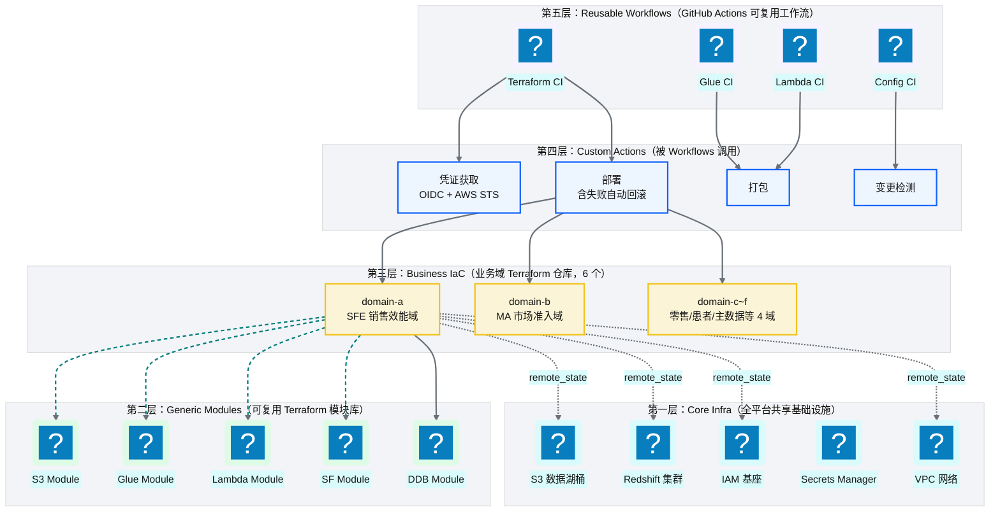
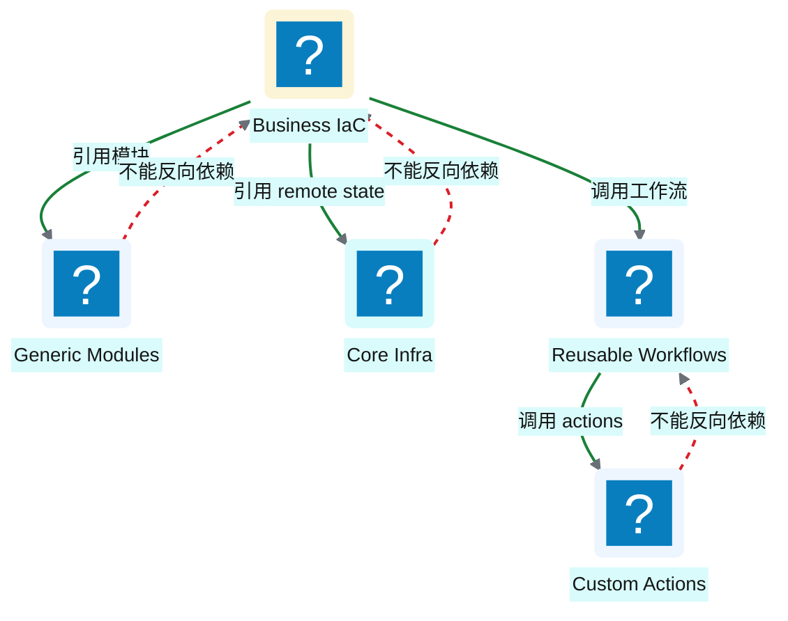
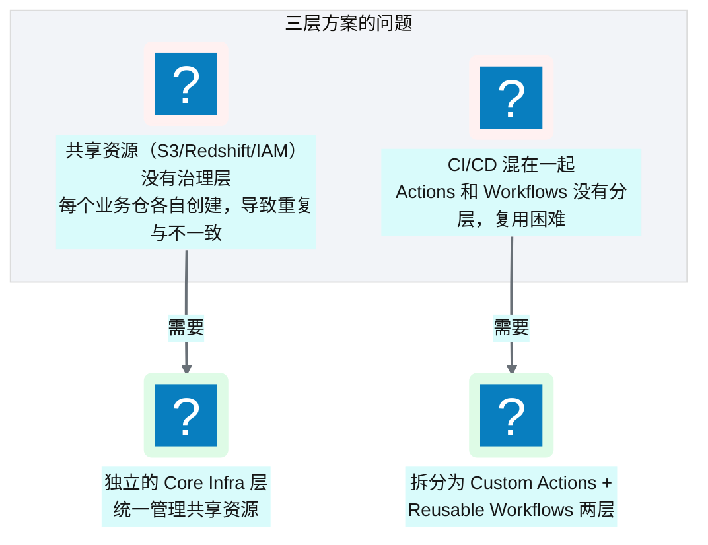
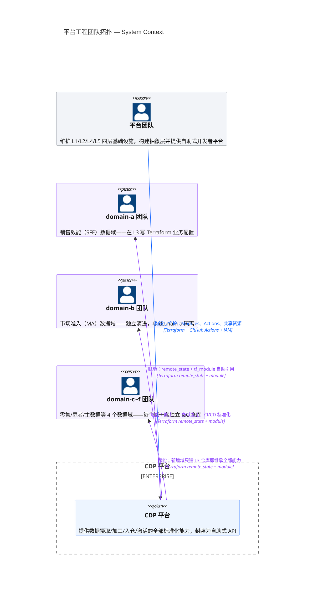

# Ch 4 平台五层模型与设计哲学

!!! info "面包屑"
    [本书主页](./index.md) › [Part II 架构设计](./03-技术栈全景与预备知识.md) › Ch 4

!!! abstract "项目第 0 年 · 架构设计期——五层模型诞生"

---

## :material-school: 本章你将学到
- 平台五层模型的完整定义与各层职责
- 为什么是五层而非三层——共享、模式、业务、CI 的治理分工
- 分层思维背后的"平台工程"理念与 Well-Architected 视角

---

如果说整个平台是一座建筑，那五层模型就是它的地基和承重墙。这个模型不是第一天画好的——它是在第 0 年反复推演和争论中慢慢长出来的。

一开始我画了个三层模型（Generic Modules → Business IaC → CI/CD），觉得够了。但 Aurora 平台架构组负责人提了一个尖锐的问题："共享资源谁管？S3 数据湖桶、Redshift 集群、IAM 基座——每个业务仓自己建的话，命名冲突怎么办？权限不一致怎么办？"这个问题让我意识到三层兜不住，于是拆出了 Core Infra 层。后来 CI/CD 设计阶段又发现 Actions 和 Workflows 混在一起复用不了，于是又拆出了 Custom Actions 层。最后就成了五层。

这个过程本身就说明了一件事：**好的分层不是一次设计出来的，是在"发现痛点→加一层抽象→验证"的循环里逼出来的。**

---

## 4.1 五层模型：Core Infra → Generic Modules → Business IaC → Custom Actions → Reusable Workflows

平台的基础设施不是一锅粥，而是**五层分层架构**。每层有明确的职责边界，上层依赖下层，下层不知道上层存在。

**图 4-1** 五层模型：Core Infra → Generic Modules...

### 各层职责

| 层 | 仓库 | 职责 | 谁来维护 |
|---|---|---|---|
| **Core Infra** | `core-infra` | 共享基础资源：数据湖 S3 桶、Redshift 集群、IAM 基座、Secrets、VPC | 平台架构组 |
| **Generic Modules** | `generic-modules` | 通用 :simple-terraform: Terraform 模块库，封装 AWS 资源的标准创建方式 | 平台架构组 |
| **Business IaC** | `business-domain-{a..f}` | 各业务域的 IaC，引用 generic modules 组装自己的资源 | 业务域团队 |
| **Custom Actions** | `ci-actions` | 可复用的 :simple-githubactions: GitHub Actions 组件（变更检测、凭证获取、打包） | 平台 CI/CD 组 |
| **Reusable Workflows** | `ci-workflows` | 可复用的 CI/CD 工作流（Terraform CI、Glue CI 等） | 平台 CI/CD 组 |

**表 4-1** 各层职责

这张表里"谁来维护"一栏是我和 Aurora 平台架构组吵得最久的部分。初版我写的是"平台团队维护所有层"，架构组负责人当场否决："那平台团队就成瓶颈了——每个业务域改个配置都得排队等我们。"这句话点醒了我：**分层不光是技术分层，更是组织分工的镜像**（Conway 定律）。于是我把 L3（Business IaC）的维护权交给了业务域团队——他们最懂自己的业务，该让它们自主演进；平台团队只管 L1/L2/L4/L5 这四层"公共底座"。这个分工后来被证明是对的：第二年业务域从 3 个涨到 6 个的时候，平台团队没被业务需求淹没，因为 L3 的变更不经过平台团队。

表里还有一个容易漏掉的设计——L1（Core Infra）和 L2（Generic Modules）虽然都是平台架构组维护，但职责边界很微妙。L1 管的是"具体的共享资源实例"——就这个 S3 桶、这个 Redshift 集群。L2 管的是"创建资源的标准方式"——创建任意的 S3 桶的通用模块。这个区分就是"实例与类型"的分离：L2 是类型（Class），L1 是全局唯一的实例（Instance）。混在一起的话，改 L2 模块直接冲击 L1 资源，风险失控。分开以后，L2 模块能独立迭代、独立测试，L1 只在版本升级时才引用新版——**类型稳了，实例才稳**。

### 层间依赖规则

**核心原则：依赖只能向下，不能向上。**

**图 4-2** 层间依赖规则

- 第三层（Business IaC）可以引用第二层（Generic Modules）和第一层（Core Infra 的 remote state）
- 第五层（Reusable Workflows）可以调用第四层（Custom Actions）
- **反过来不行**：Core Infra 不能依赖 Business IaC，Generic Modules 不能引用具体业务

这条规则保证：**底层变更影响面可控，上层变更不伤及底层**。

这条"依赖只能向下"的铁律，是我从企业征信项目的血泪教训里提炼出来的。当时没定这条规则，结果出现了"反向依赖"——核心基础设施仓库图省事，直接引用了某个业务仓的配置变量。短期确实方便了，后果是：改业务仓配置会触发核心基础设施重建，一次"改个参数"变成了"全平台 plan/apply"，风险和时间都失控。更糟的是半年后那个业务仓要下线，核心基础设施却"依赖"着它，根本删不掉——僵尸依赖。到 Aurora 我把这条铁律贴在架构评审室墙上，每次 PR review 第一件事就是查依赖方向——**宁可一开始麻烦，别后面还债**。

这条规则还有一个深层好处：**底层可以独立演进**。L2 的 Generic Modules 从 v1 升级到 v2，L3 的业务仓可以逐个迁移，不用"一升全升"——因为 L2 不知道 L3 存在，L2 的变更不会强制触发 L3。这种"底层向上兼容、上层按需迁移"的模式，让我们在四年里多次升级模块没引发全局故障。如果依赖是双向的，哪一层变了都是全链路变更，平台根本演进不了（M2 关注点分离的实践价值）。

---

## 4.2 为什么是五层而非三层：共享/模式/业务/CI 的治理分工

最简化的 IaC 架构是三层：`Generic Modules → Business IaC → CI/CD`。为什么我们要拆成五层？

### 三层方案的问题

**图 4-3** 三层方案的问题

如果只有三层：
- **共享资源谁管？** S3 数据湖桶、Redshift 集群、IAM 基座这些全局共享资源，放在每个业务仓里各自创建，会重复定义、命名冲突、权限不一致。需要一个独立的 **Core Infra 层**统一管理。
- **CI/CD 怎么复用？** GitHub Actions 的 custom actions 和 reusable workflows 是两个不同抽象层次。actions 是"原子操作"（获取 AWS 凭证），workflows 是"流程编排"（Terraform 验证→计划→部署）。混在一个仓库里职责模糊。需要拆成 **Custom Actions 层**和 **Reusable Workflows 层**。

这俩问题不是理论推演，是我在三层方案上真实摔过的跟头。第一个（共享资源混乱）出在项目第二个月：domain-a 和 domain-b 各自用 Terraform 建了 S3 数据湖桶，命名分别是 `aurora-datalake-a` 和 `aurora-datalake-b`——看起来没冲突，但 Redshift 的 COPY 权限要对两个桶分别授权，IAM role 要维护两套，跨域查询还得做跨桶授权。到第三个业务域接入时，权限矩阵已经一团乱。我不得不停下所有业务开发，花了一周把三个桶合并成 core-infra 统管的单桶——这周重构的痛让我把"共享资源必须独立成层"写进了架构铁律。

第二个（CI/CD 混层）出在第三个月：ci-workflows 仓库里既有 custom actions 又有 reusable workflows，新人根本分不清"该改哪个"。更糟的是，一个 action 被多个 workflow 引用，改 action 得同时验证所有引用它的 workflow——耦合太死。拆成 ci-actions（原子操作）和 ci-workflows（流程编排）两层后，action 独立版本化、独立测试，workflow 只在需要时引用新版本——**原子操作和流程编排是不同的变更节奏，不分层就耦合**。这个教训在 [Ch 27 CI/CD 可复用工作流平台](./27-CI-CD可复用工作流平台.md) 有详细展开。

### 五层的治理分工

| 治理诉求 | 由哪一层解决 | 举例 |
|---|---|---|
| **共享资源的统一管理** | Core Infra（L1） | 数据湖桶只有一个定义，所有业务仓通过 remote state 引用 |
| **资源创建方式的标准化** | Generic Modules（L2） | 创建 S3 桶的标准方式封装成模块，所有业务仓复用 |
| **业务域的独立演进** | Business IaC（L3） | domain-a 加新表不影响 domain-b |
| **CI 原子操作的复用** | Custom Actions（L4） | "获取 AWS 凭证"这个操作只写一次，所有 workflow 复用 |
| **CI 流程的标准化** | Reusable Workflows（L5） | "Terraform CI"流程只定义一次，所有业务仓调用 |

**表 4-2** 五层的治理分工

这张表里每条治理诉求都对应一个真实的"痛点→拆层"故事。"共享资源统一管理"那一行，痛点是第二个月的三桶权限混乱（上节说了）；"资源创建方式标准化"，痛点是第三个月三个业务仓各自写 S3 模块，80% 代码重复但 20% 各自魔改，一个 bug 要改三处——抽成 Generic Modules 后只改一处；"CI 原子操作复用"，痛点是"获取 AWS 凭证"这段逻辑在五个 workflow 里复制了五份，OIDC 升级时要改五处——抽成 Custom Actions 后只改一处。

我想强调的不是"五层合理"这个结论，而是它背后的原则：**架构分层的驱动力是实践中的痛点，不是理论上的整洁**。没痛点就分层是过度设计，有痛点不拆是欠设计。Aurora 这五层是在"痛点→拆层→验证→新痛点→再拆层"的循环里长出来的，这也是为什么我在引言里说"好的分层不是一次性设计出来的"。如果第一天就硬拆五层，反而会因为没痛过而拆错边界——有些该合的被强拆，有些该拆的被漏掉。

!!! warning "Trade-off"
    五层的代价是**认知复杂度**。新人得先搞清楚五层之间的关系才能上手——我第二年统计过，新人平均 2-3 周才能在 L3 独立写业务 IaC，三层方案可能一周就够了。但这是一次性学习成本——一旦理解，所有操作都有规律可循。相反，三层方案上手快，但随着业务域增多，重复和不一致会指数级增长，长期维护成本远超五层。**学习成本是线性的，维护成本是指数的**——规模上去以后一定选五层。

---

## 4.3 分层思维引申：Well-Architected 视角与"平台工程"理念

### AWS Well-Architected 视角

五层模型与 AWS Well-Architected Framework 的六大支柱有对应关系：

| Well-Architected 支柱 | 在五层模型中的体现 |
|---|---|
| **安全性** | L1 统一 IAM 基座、L2 模块内置安全最佳实践（加密/最小权限） |
| **可靠性** | L1 共享资源的高可用配置、L5 CI 流程的验证门禁 |
| **性能效率** | L2 模块封装性能优化（如 Redshift 分布键选择） |
| **成本优化** | L3 业务仓独立管理资源，可按域优化 |
| **卓越运营** | L4/L5 标准化 CI/CD，降低运维负担 |
| **可持续性** | L2 模块统一资源规格，避免过度配置 |

**表 4-3** AWS Well-Architected 视角

坦率说，这张映射表不是我在设计五层时主动对照 Well-Architected 画出来的——是平台上线一年后，Aurora 全球总部的架构审计要求提交 Well-Architected 自评报告，我才"事后"做对照。结果让我松了口气：五层模型六个支柱都覆盖了，没明显盲区。但诚实复盘的话，有一个支柱在设计时是被忽视的——**可持续性**。第一年我只盯"性能"和"成本"，资源规格按"够用就好"定，没想过过度配置的浪费。到第二年做 FinOps 成本治理才发现 L2 模块里好几个 S3 桶没配生命周期策略，冷数据一直占着标准存储的费用——事后才补上。

借这个对照我想说的是：**Well-Architected 不是设计时的检查清单，而是持续对照的标尺**。五层模型的设计驱动力是"解决实践痛点"，不是"对照 Well-Architected 打勾"——但事后对照能发现设计时的盲区（比如可持续性）。所以我的建议是：设计时别被框架绑架，上线后定期用框架"查漏补缺"。这比"一开始就照框架设计"务实——没痛过的设计容易拆错边界，而框架对照能帮你找到"哪里该痛但还没痛到"。

### "平台工程"理念

五层模型体现的是**平台工程（Platform Engineering）** 的核心思想：

> 平台工程是"为软件开发团队提供自助式内部开发者平台"的学科。平台团队构建抽象层，让业务团队专注于业务逻辑而非基础设施。

在本书的语境下：

**图 4-4** "平台工程"理念

平台团队维护四层基础设施（L1/L2/L4/L5），业务团队只需在 L3 写自己的业务配置。这就像 Kubernetes 提供了平台，应用团队只需要写 Deployment :simple-yaml: YAML——**好的平台让消费者感觉不到底层的复杂性**。

这个理念在 Aurora 落地的关键决策是：**L3 业务团队写 Terraform 时，不需要懂 Terraform 的全部**。我让平台团队在 L2 的 Generic Modules 里做了"意图级封装"——业务团队只需要声明"我要一个 S3 桶存 SFE 原始数据"，模块内部自动处理加密、生命周期、权限策略、命名规范。业务团队感知到的是"填几个参数"，而不是"写 200 行 HCL"。这就是平台工程的核心：**把复杂性沉到平台层，把简洁性浮给业务层**。

这个决策第一年有争议——有人说"封装太多会让业务团队失去灵活性"。我的反驳是：灵活性是给平台团队的，不是给业务团队的——业务团队要的是"快速建资源"，不是"灵活配置每个参数"。如果业务团队真需要某个模块没暴露的参数，走 PR 给 L2 模块加一个 variable——这比每个业务仓各自魔改安全得多。到第二年，6 个业务域团队都在 L3 独立交付，平均一个新业务域接入只需 1-2 周——这个速度在三层方案下是不可想象的（三层时要平台团队全程参与）。**平台工程的成功标准不是平台有多强，而是业务团队多快能自助交付**——这是我在 Aurora 最重要的架构成就之一（M7 平台工程）。

!!! tip "引申"
    如果你想深入理解平台工程，推荐阅读《Team Topologies》（Matthew Skelton）——书中提出了"Stream-Aligned Team"和"Platform Team"的团队拓扑模型，与本书的五层架构高度契合。平台团队是"赋能者"而非"控制者"，它的成功标准是业务团队的交付速度。我读这本书时有种"相见恨晚"的感觉——书里用理论完美解释了我用直觉做出的那些决策。如果项目第一天就读过，很多弯路能省掉。

---

## :material-check-circle: 本章小结
- 平台采用五层分层架构：Core Infra → Generic Modules → Business IaC → Custom Actions → Reusable Workflows
- 每层职责明确，依赖只能向下不能向上，保证变更影响面可控
- 五层而非三层的原因：共享资源需独立治理层（L1），CI/CD 需分原子操作与流程编排两层（L4/L5）
- 五层模型体现 AWS Well-Architected 六支柱与平台工程理念：平台团队构建抽象，业务团队专注业务

---

!!! quote "下一章"
    [Ch 5 端到端数据流全景](./05-端到端数据流全景.md) —— 理解了"分层怎么分"，接下来看"数据怎么流"：一条数据从上游到消费的完整旅程。
