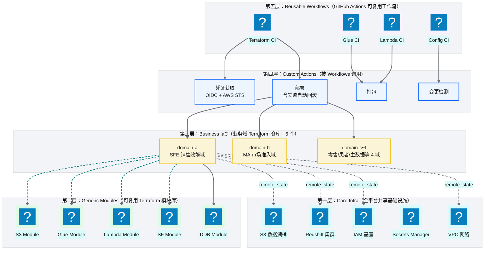
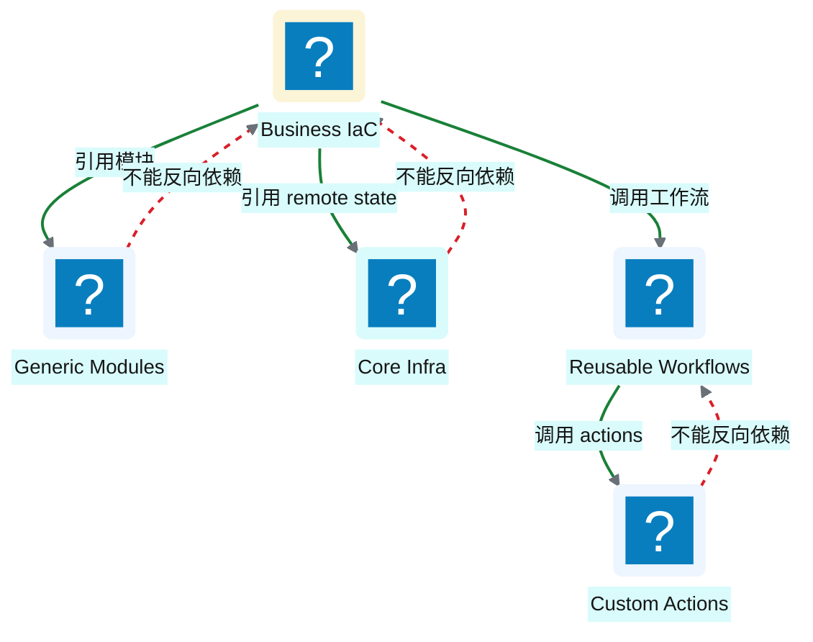
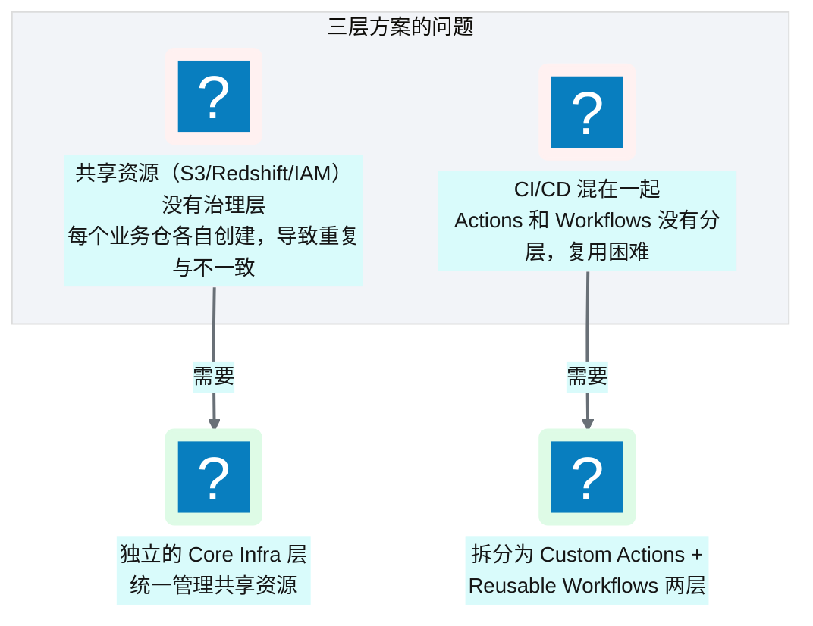
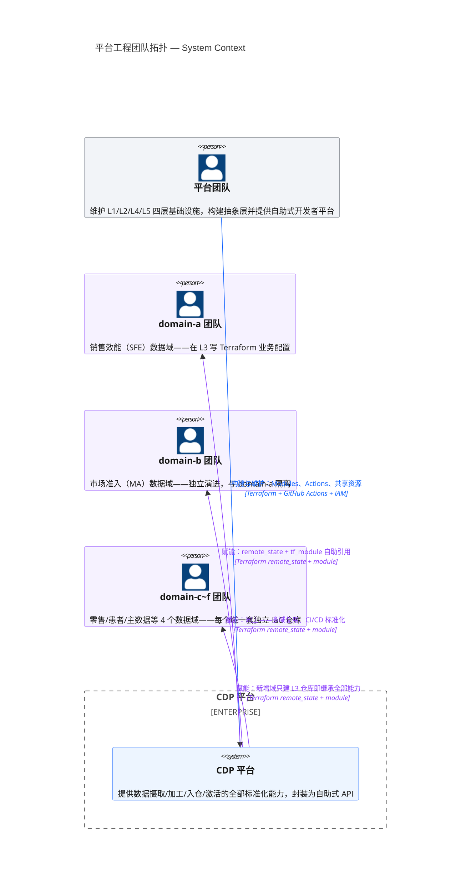

# Ch 4 平台五层模型与设计哲学

!!! info "面包屑"
    [本书主页](./index.md) › [Part II 架构设计](./03-技术栈全景与预备知识.md) › Ch 4

!!! abstract "项目第 0 年 · 架构设计期——五层模型诞生"

---

## :material-school: 本章你将学到
- 平台五层模型的完整定义与各层职责
- 为什么是五层而非三层——共享、模式、业务、CI 的治理分工
- 分层思维背后的"平台工程"理念与 Well-Architected 视角

---

如果说整个平台是一座建筑，那五层模型就是它的地基和承重结构。这个模型不是第一天就定型的——它是在第 0 年的架构设计阶段，经过反复推演和争论后逐步成型的。

最初我画了一个三层模型（Generic Modules → Business IaC → CI/CD），觉得"够用了"。但 Aurora 的平台架构组负责人提了一个尖锐的问题："共享资源谁管？S3 数据湖桶、Redshift 集群、IAM 基座——如果每个业务仓自己创建，命名冲突了怎么办？权限不一致了怎么办？"这个问题让我意识到三层不够，于是拆出了 Core Infra 层。后来在 CI/CD 设计阶段又发现"Actions 和 Workflows 混在一起"导致复用困难，于是又拆出了 Custom Actions 层。最终形成了五层。

这个过程本身就说明了架构设计的一个真理：**好的分层不是一次性设计出来的，而是在"发现问题→增加抽象→验证"的循环中逐步逼近的。**

---

## 4.1 五层模型：Core Infra → Generic Modules → Business IaC → Custom Actions → Reusable Workflows

平台的基础设施不是一锅粥，而是**五层分层架构**。每一层有明确的职责边界，上层依赖下层，下层不知道上层存在。

**图 4-1** 五层模型：Core Infra → Generic Modules...

### 各层职责

| 层 | 仓库 | 职责 | 谁来维护 |
|---|---|---|---|
| **Core Infra** | `core-infra` | 共享基础资源：数据湖 S3 桶、Redshift 集群、IAM 基座、Secrets、VPC | 平台架构组 |
| **Generic Modules** | `generic-modules` | 通用 :simple-terraform: Terraform 模块库，封装 AWS 资源的标准创建方式 | 平台架构组 |
| **Business IaC** | `business-domain-{a..f}` | 各业务域的 IaC，引用 generic modules 组装自己的资源 | 业务域团队 |
| **Custom Actions** | `ci-actions` | 可复用的 :simple-githubactions: GitHub Actions 组件（变更检测、凭证获取、打包） | 平台 CI/CD 组 |
| **Reusable Workflows** | `ci-workflows` | 可复用的 CI/CD 工作流（Terraform CI、Glue CI 等） | 平台 CI/CD 组 |

**表 4-1** 各层职责

### 层间依赖规则

**核心原则：依赖只能向下，不能向上。**

**图 4-2** 层间依赖规则

- 第三层（Business IaC）可以引用第二层（Generic Modules）和第一层（Core Infra 的 remote state）
- 第五层（Reusable Workflows）可以调用第四层（Custom Actions）
- **反过来不行**：Core Infra 不能依赖 Business IaC，Generic Modules 不能引用具体业务

这条规则保证了：**底层变更影响面可控，上层变更不影响底层**。

---

## 4.2 为什么是五层而非三层：共享/模式/业务/CI 的治理分工

最简化的 IaC 架构是三层：`Generic Modules → Business IaC → CI/CD`。那为什么我们要拆成五层？

### 三层方案的问题

**图 4-3** 三层方案的问题

如果只有三层：
- **共享资源谁管？** S3 数据湖桶、Redshift 集群、IAM 基座这些全局共享资源，如果放在每个业务仓里创建，会导致重复定义、命名冲突、权限不一致。需要一个独立的 **Core Infra 层** 来统一管理。
- **CI/CD 怎么复用？** GitHub Actions 的 custom actions 和 reusable workflows 是两个不同抽象层次。actions 是"原子操作"（如"获取 AWS 凭证"），workflows 是"流程编排"（如"Terraform 验证→计划→部署"）。混在一个仓库里会让职责模糊。需要拆成 **Custom Actions 层** 和 **Reusable Workflows 层**。

### 五层的治理分工

| 治理诉求 | 由哪一层解决 | 举例 |
|---|---|---|
| **共享资源的统一管理** | Core Infra（L1） | 数据湖桶只有一个定义，所有业务仓通过 remote state 引用 |
| **资源创建方式的标准化** | Generic Modules（L2） | 创建 S3 桶的标准方式封装成模块，所有业务仓复用 |
| **业务域的独立演进** | Business IaC（L3） | domain-a 加新表不影响 domain-b |
| **CI 原子操作的复用** | Custom Actions（L4） | "获取 AWS 凭证"这个操作只写一次，所有 workflow 复用 |
| **CI 流程的标准化** | Reusable Workflows（L5） | "Terraform CI"流程只定义一次，所有业务仓调用 |

**表 4-2** 五层的治理分工

!!! warning "Trade-off"
    五层的代价是**认知复杂度**。新人需要理解五层之间的关系才能上手。但这是一次性的学习成本——一旦理解，后续所有操作都有规律可循。相比之下，三层方案虽然上手快，但随着业务域增多，重复和不一致会指数级增长，长期维护成本远高于五层。

---

## 4.3 分层思维引申：Well-Architected 视角与"平台工程"理念

### AWS Well-Architected 视角

五层模型与 AWS Well-Architected Framework 的六大支柱有对应关系：

| Well-Architected 支柱 | 在五层模型中的体现 |
|---|---|
| **安全性** | L1 统一 IAM 基座、L2 模块内置安全最佳实践（加密/最小权限） |
| **可靠性** | L1 共享资源的高可用配置、L5 CI 流程的验证门禁 |
| **性能效率** | L2 模块封装性能优化（如 Redshift 分布键选择） |
| **成本优化** | L3 业务仓独立管理资源，可按域优化 |
| **卓越运营** | L4/L5 标准化 CI/CD，降低运维负担 |
| **可持续性** | L2 模块统一资源规格，避免过度配置 |

**表 4-3** AWS Well-Architected 视角

### "平台工程"理念

五层模型体现的是**平台工程（Platform Engineering）** 的核心思想：

> 平台工程是"为软件开发团队提供自助式内部开发者平台"的学科。平台团队构建抽象层，让业务团队专注于业务逻辑而非基础设施。

在本书的语境下：

**图 4-4** "平台工程"理念

平台团队维护四层基础设施（L1/L2/L4/L5），业务团队只需要在 L3 写自己的业务配置。这就像 Kubernetes 提供了平台，应用团队只需要写 Deployment :simple-yaml: YAML——**好的平台让消费者感知不到底层的复杂性**。

!!! tip "引申"
    如果你想深入理解平台工程，推荐阅读《Team Topologies》（Matthew Skelton）——书中提出了"Stream-Aligned Team"和"Platform Team"的团队拓扑模型，与本书的五层架构高度契合。平台团队是"赋能者"而非"控制者"，它的成功标准是业务团队的交付速度提升。

---

## :material-check-circle: 本章小结
- 平台采用五层分层架构：Core Infra → Generic Modules → Business IaC → Custom Actions → Reusable Workflows
- 每层职责明确，依赖只能向下不能向上，保证变更影响面可控
- 五层而非三层的原因：共享资源需独立治理层（L1），CI/CD 需分原子操作与流程编排两层（L4/L5）
- 五层模型体现 AWS Well-Architected 六支柱与平台工程理念：平台团队构建抽象，业务团队专注业务

---

!!! quote "下一章"
    [Ch 5 端到端数据流全景](./05-端到端数据流全景.md) —— 理解了"分层怎么分"，接下来看"数据怎么流"：一条数据从上游到消费的完整旅程。

