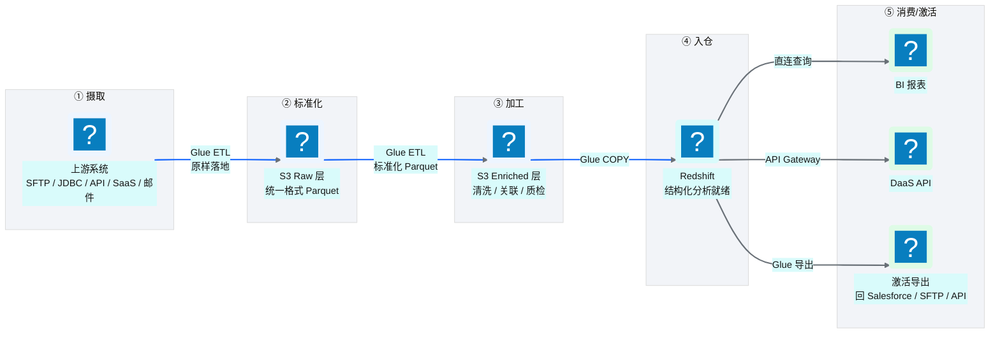
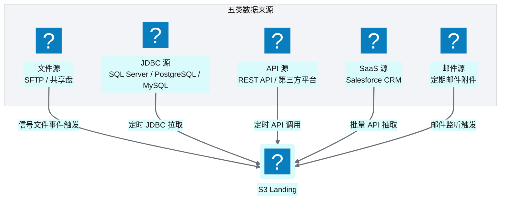
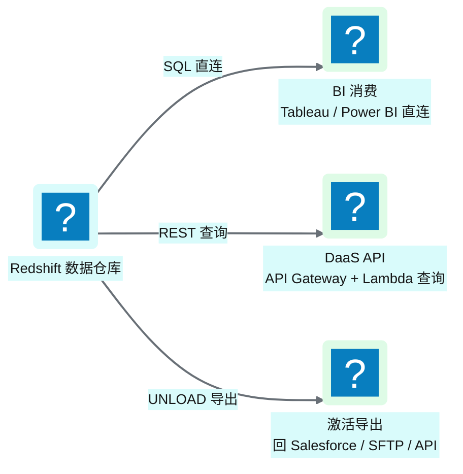
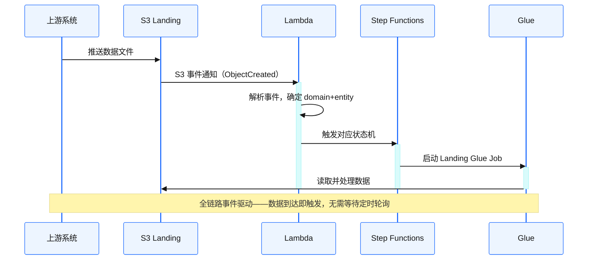
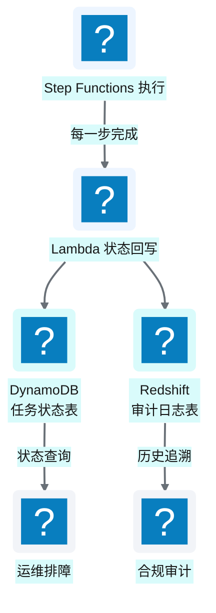

# Ch 5 端到端数据流全景

!!! info "面包屑"
    [本书主页](./index.md) › [Part II 架构设计](./04-平台五层模型与设计哲学.md) › Ch 5

!!! abstract "项目第 0 年 · 架构设计期——数据流蓝图"

---

## :material-school: 本章你将学到
- 一条数据从上游系统到最终消费的完整旅程
- 平台的五类数据来源与三类消费出口
- 三个关键设计模式：事件驱动触发、批次标识流转、状态回写

---

五层模型解决的是"基础设施怎么分层"的问题（[Ch 4](./04-平台五层模型与设计哲学.md)），但数据在层与层之间怎么流动，是另一个层面的问题。

我至今记得和 Aurora 业务团队第一次"走数据"的场景。我们在白板上画了一条线，从左到右标了五个阶段：摄取→标准化→加工→入仓→消费。然后我问了一个问题："一条处方数据，从 SFE 系统出发，到最后变成销售总监桌上的报表，中间要经过几跳？每跳谁负责？失败了怎么知道？"

没人能完整回答。因为在那之前，这条数据流的每一段都由不同的人用不同的工具处理——SFE 团队导出 :fontawesome-solid-file-csv: CSV，数据团队用 SQL Server 存储过程加工，BI 团队连 Redshift 出报表。中间没有统一的"流程编排"，也没有"状态追踪"——一段失败了，下游不知道，直到报表数字不对才发现。

这一章就是把白板上那条线变成一个完整的、可追溯的、自动化的数据流设计。

---

## 5.1 一条数据的旅程：上游 → S3 数据湖 → Glue ETL → Redshift → 激活/导出

**图 5-1** 一条数据的旅程：上游 → S3 数据湖 → Glue ETL → ...

### 五个阶段详解

| 阶段 | 位置 | 做什么 | 谁执行 |
|---|---|---|---|
| ① 摄取 | Landing 层 | 从上游系统拉取原始数据，原样落地 | Glue（ETL 引擎） |
| ② 标准化 | Raw 层 | 转为统一格式（:simple-apacheparquet: Parquet），标准化字段名/类型 | Glue |
| ③ 加工 | Enriched 层 | 清洗、关联、质量校验、脱敏、生成代理键 | Glue |
| ④ 入仓 | Redshift | 从 Enriched 层 COPY 到 Redshift 供查询 | Glue（COPY 命令） |
| ⑤ 消费/激活 | 下游 | BI 查询、DaaS API、导出回业务系统 | BI 工具 / Lambda / Glue |

**表 5-1** 五个阶段详解

这条流水线是**配置驱动**的——每个阶段的行为由 DynamoDB 中的任务配置决定，而非硬编码在脚本里。新增一个数据源，只需要加一条配置，不需要写新代码。

---

## 5.2 五类数据来源与三类消费出口

### 五类数据来源

**图 5-2** 五类数据来源

| 来源类型 | 触发方式 | 典型场景 |
|---|---|---|
| 文件源（SFTP） | 信号文件事件驱动 | 供应商定期推送数据文件 |
| JDBC 源 | 定时调度 | 从业务数据库增量拉取 |
| API 源 | 定时调度 | 调用第三方平台 REST API |
| SaaS 源 | 定时 + 事件混合 | :material-cloud-braces: Salesforce 批量抽取 + 双向任务监控 |
| 邮件源 | 邮件到达事件 | 定期邮件附件自动化摄取 |

**表 5-2** 五类数据来源

### 三类消费出口

**图 5-3** 三类消费出口

| 出口类型 | 方式 | 消费者 |
|---|---|---|
| BI 消费 | BI 工具直连 Redshift | 分析师、业务用户 |
| DaaS API | API Gateway + Lambda 查询 Redshift | 应用系统、外部消费者 |
| 激活导出 | Glue 将 Redshift 数据导出回下游系统 | Salesforce、SFTP、业务 API |

**表 5-3** 三类消费出口

!!! tip "引申"
    "激活导出"是 CDP 区别于传统 DWH 的重要特征。传统 DWH 是"数据黑洞"——数据只进不出；而 CDP 是"数据枢纽"——数据进来加工后，还要"激活"导回业务系统，形成闭环。比如分析出某个医生群体的处方倾向后，要把受众标签导回 Salesforce 供精准营销使用。

---

## 5.3 关键设计模式：事件驱动触发、批次标识流转、状态回写

### 模式一：事件驱动触发

平台不是靠"定时轮询"来发现新数据，而是靠**事件驱动**：

**图 5-4** 模式一：事件驱动触发

事件驱动的好处是**即时性**——数据到达即触发，无需等待下一个调度周期。但对于不支持事件通知的源（如 JDBC 数据库），退化为定时调度。

### 模式二：批次标识流转

每一次数据加载都有一个唯一的**批次标识**，贯穿整个流水线：

```mermaid
%%{init: {'theme':'base','themeVariables':{'primaryColor':'#edf5ff','primaryTextColor':'#161616','primaryBorderColor':'#0f62fe','lineColor':'#697077','secondaryColor':'#d9fbfb','tertiaryColor':'#f2f4f8','fontSize':'14px'}}}%%
flowchart LR
    T@{ icon: "codicon:clock", form: "rounded", label: "时间戳生成批次标识", pos: "b", h: 40 } -->|"写入路径"| L@{ icon: "logos:aws-s3", form: "rounded", label: "Landing 层<br/>路径含批次标识", pos: "b", h: 40 }
    L -->|"标准化"| R@{ icon: "logos:aws-s3", form: "rounded", label: "Raw 层<br/>分区含批次标识", pos: "b", h: 40 }
    R -->|"加工"| E@{ icon: "logos:aws-s3", form: "rounded", label: "Enriched 层<br/>分区含批次标识", pos: "b", h: 40 }
    E -->|"COPY 入仓"| RS@{ icon: "logos:aws-redshift", form: "rounded", label: "Redshift<br/>元数据表记录批次标识", pos: "b", h: 40 }
    RS -->|"记录审计"| AUDIT@{ icon: "codicon:history", form: "rounded", label: "审计日志<br/>关联批次标识", pos: "b", h: 40 }
classDef bpProcess  fill:#edf5ff,stroke:#0f62fe,stroke-width:2px,color:#161616
classDef bpData     fill:#d9fbfb,stroke:#007d79,stroke-width:2px,color:#161616
classDef bpInfo     fill:#f6f2ff,stroke:#8a3ffc,stroke-width:2px,color:#161616

class T bpProcess
class L,R,E,RS bpData
class AUDIT bpInfo
linkStyle default stroke:#697077,stroke-width:2px
```

**图 5-5** 模式二：批次标识流转

批次标识的价值是**可追溯性**：任何一行数据，都可以通过批次标识追溯到"它是什么时候、从哪个源、在哪次加载中进入平台的"。这是数据治理的基础。

!!! warning "Trade-off"
    批次标识贯穿全链路会增加 ETL 的复杂度——每一层都要传递和记录这个标识。但这是值得的，因为没有追溯能力的数据平台，在排障和合规审计时寸步难行。

### 模式三：状态回写

每个任务的执行状态会被**回写到 DynamoDB 和审计日志**，形成"可观测的执行轨迹"：

**图 5-6** 模式三：状态回写

状态回写让平台"可观测"——运维可以通过查询状态表知道"哪个任务在跑、哪个失败了、跑了多久"，而不需要去翻 CloudWatch 日志。

---

## :material-check-circle: 本章小结
- 一条数据的完整旅程：摄取（Landing）→ 标准化（Raw）→ 加工（Enriched）→ 入仓（Redshift）→ 消费/激活
- 五类数据来源：文件/JDBC/API/SaaS/邮件，各有触发方式；三类消费出口：BI/DaaS API/激活导出
- 三个关键设计模式：事件驱动触发（即时性）、批次标识流转（可追溯性）、状态回写（可观测性）

---

!!! quote "下一章"
    [Ch 6 环境与多账号隔离设计](./06-环境与多账号隔离设计.md) —— 数据流清楚了，接下来看平台如何在 dev/qa/prod 三环境间隔离，以及多账号的安全边界。

