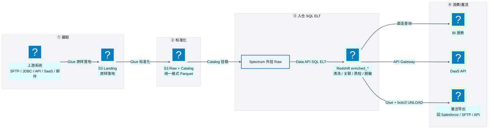
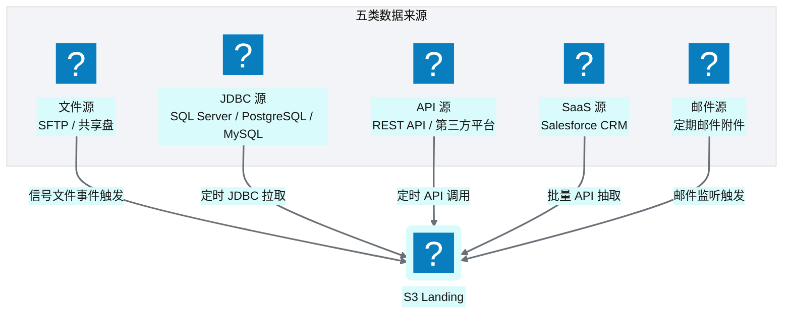
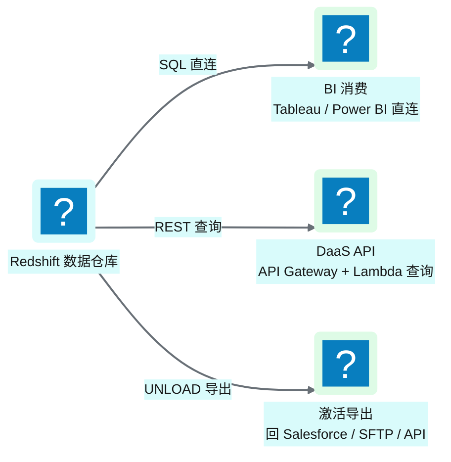
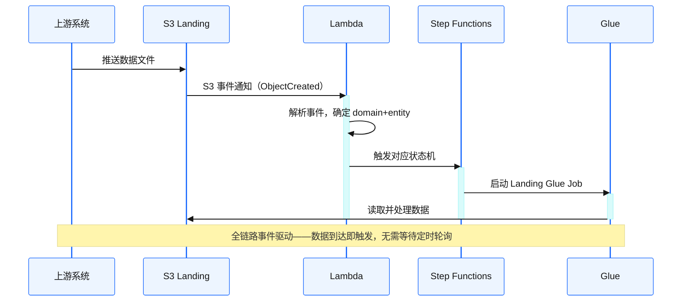
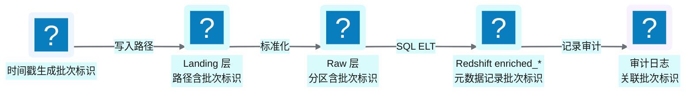
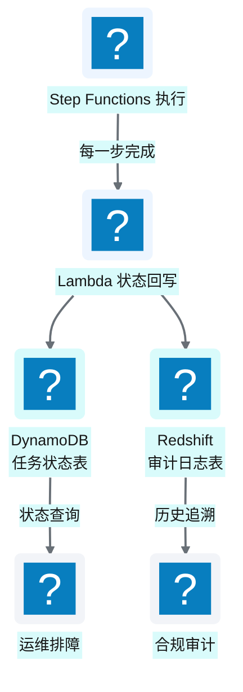

# Ch 5 端到端数据流全景

!!! info "面包屑"
    [本书主页](./index.md) › [Part II 架构设计](./04-平台五层模型与设计哲学.md) › Ch 5

!!! abstract "项目第 0 年 · 架构设计期——数据流蓝图"

---

## :material-school: 本章你将学到
- 一条数据从上游系统到最终消费的完整旅程
- 平台的五类数据来源与三类消费出口
- 三个关键设计模式：事件驱动触发、批次标识流转、状态回写

---

五层模型解决的是"基础设施怎么分层"（[Ch 4](./04-平台五层模型与设计哲学.md)），但数据在层与层之间怎么流动，是另一回事。

我至今记得第一次跟 Aurora 业务团队"走数据"的场景。我们在白板上画了一条线，从左到右标了五个阶段：摄取→标准化→加工→入仓→消费。然后我问了一个问题："一条处方数据，从 SFE 系统出发，到最后变成销售总监桌上的报表，中间要经过几跳？每跳谁负责？失败了怎么知道？"

没人能完整回答。因为在那之前，这条数据流的每一段都由不同的人用不同的工具处理——SFE 团队导出 :fontawesome-solid-file-csv: CSV，数据团队用 SQL Server 存储过程加工，BI 团队连 Redshift 出报表。中间没有统一的流程编排，也没有状态追踪——一段失败了，下游不知道，直到报表数字不对才发现。

这一章就是把白板上那条线变成一个完整的、可追溯的、自动化的数据流。

---

## 5.1 一条数据的旅程：上游 → S3 数据湖 → Glue ETL → Redshift → 激活/导出

**图 5-1** 一条数据的旅程：上游 → Landing/Raw → SQL ELT → 消费

### 五个阶段详解

现行旅程在叙事上仍可拆成五段能力（摄取、标准化、加工、入仓、消费），但**加工与入仓合并发生在 Redshift SQL ELT**，湖上不再物化 S3 Enriched。早期蓝图曾把③单独落在 Enriched 桶，演进原因见 [Ch 7](./07-数据湖分层设计.md)/[Ch 8](./08-数据仓库设计-Redshift.md)。

| 阶段 | 位置 | 做什么 | 谁执行 |
|---|---|---|---|
| ① 摄取 | Landing 层 | 从上游系统拉取原始数据，原样落地 | Glue |
| ② 标准化 | Raw 层 + Catalog | 转为 Parquet，标准化字段名/类型，注册 Catalog | Glue |
| ③④ 加工+入仓 | Spectrum → `enriched_*` | 清洗、关联、质检、脱敏、代理键，写入仓内 Gold | Glue/Python Shell + Redshift Data API（SQL ELT） |
| ⑤ 消费/激活 | 下游 | BI 查询、DaaS API、导出回业务系统 | BI 工具 / Lambda / Glue |

**表 5-1** 五个阶段详解（演进后）

这五个阶段不是我拍脑袋分的，是从企业征信项目的反面教训里提炼出来的。企业征信那座平台只有三个阶段：摄取→加工→入仓，没有"标准化"和"激活"。缺"标准化"的后果：原始数据直接进加工层，格式差异和业务逻辑缠在一起。缺"激活"的后果：数据进了仓库就死在那里。到 Aurora 我刻意保留标准化与激活：**标准化让加工只管业务逻辑不管格式差异，激活让数据形成闭环**。

后来我又做了一次演进：把"加工"从 S3 Enriched 挪进仓内 SQL。不可变性递减原则仍然成立。Landing 完全不可变，Raw 格式统一可重跑，仓内 `enriched_*` 可更新。排障时：仓内有问题退到 Raw 重跑 SQL ELT；Raw 有问题退到 Landing 重新摄取。**每一层都是下一层的"后悔药"**（呼应 [Ch 7](./07-数据湖分层设计.md)）。

这条流水线是**配置驱动**的——每个阶段的行为由 DynamoDB 中的任务配置决定，而非硬编码在脚本里。新增一个数据源，只需要加一条配置，不需要写新代码。

---

## 5.2 五类数据来源与三类消费出口

### 五类数据来源

**图 5-2** 五类数据来源

| 来源类型 | 触发方式 | 典型场景 |
|---|---|---|
| 文件源（SFTP） | 信号文件事件驱动 | 供应商定期推送数据文件 |
| JDBC 源 | 定时调度 | 从业务数据库增量拉取 |
| API 源 | 定时调度 | 调用第三方平台 REST API |
| SaaS 源 | 定时 + 事件混合 | :material-cloud-braces: Salesforce 批量抽取 + 双向任务监控 |
| 邮件源 | 邮件到达事件 | 定期邮件附件自动化摄取 |

**表 5-2** 五类数据来源

这五类来源不是按"系统名称"（SFE/CRM/零售）分的，是按**触发方式**——这是我在设计连接器框架时做的关键抽象。按系统名称分会有 10+ 类，连接器要写 10+ 套；按触发方式分只有五类，连接器只需写五套，每套覆盖多个同类系统。SFTP 和共享盘都是"文件源"，JDBC 无论是 SQL Server 还是 PostgreSQL 都是"定时拉取"——**抽象的粒度决定了复用的程度**（M1 配置驱动架构的根基）。

五类里最特殊的是"邮件源"——它听着土，但在医药行业很常见：某些供应商只肯用邮件发销量报表，不肯搭 SFTP 或 API。一开始我想拒绝（"邮件怎么能进数据平台"），但业务方说"这个供应商的数据很重要，你不接我们就还是手工处理"。于是设计了邮件监听触发：邮件到达→Lambda 解析附件→落地 Landing。这个"妥协"后来证明有价值——它让我意识到**数据平台的入口要迁就现实，不是让现实迁就平台**。如果坚持"只接 API/SFTP"，反而把一部分数据挡在平台外面，加剧数据孤岛。

### 三类消费出口

**图 5-3** 三类消费出口

| 出口类型 | 方式 | 消费者 |
|---|---|---|
| BI 消费 | BI 工具直连 Redshift | 分析师、业务用户 |
| DaaS API | API Gateway + Lambda 查询 Redshift | 应用系统、外部消费者 |
| 激活导出 | Glue 将 Redshift 数据导出回下游系统 | Salesforce、SFTP、业务 API |

**表 5-3** 三类消费出口

三类出口的设计驱动力是"消费者多样性"——不同消费者要不同的数据访问方式。BI 工具要 SQL 直连（低延迟、交互式），应用系统要 REST API（标准化、可编程），下游业务系统要批量导出（异步、大批量）。如果只给一种出口（比如只有 BI 直连），那应用系统和下游业务系统就得绕路——要么自己写脚本查 Redshift，要么导 CSV 手工导——这正是企业征信项目踩过的坑。我在 Aurora 从第一天就把三类出口都规划进蓝图，让每种消费者都有正道走，不用各自绕路造野路子。

三类里"激活导出"是工程量最大的，也是最容易被忽视的。BI 和 DaaS 是"被动等查询"，激活是"主动推送"——它需要一个完整的导出框架（Glue + boto3 提交 UNLOAD → 格式转换 → 推送到 Salesforce/SFTP/API）。我在第一年低估了它的复杂度，以为"导出就是导入的逆过程"，结果发现导出要处理目标系统的限流、幂等、回滚——这些在导入端不存在。到第二年激活导出需求爆发时，我不得不重构了整个导出框架（详见 [Ch 37 DaaS 激活层](./37-数据即服务-DaaS激活层设计.md)）。**导入和导出看着对称，其实是完全不同的工程问题**——这是我在数据流设计上交的学费。

!!! tip "引申"
    "激活导出"是 CDP 区别于传统 DWH 的重要特征。传统 DWH 是"数据黑洞"——数据只进不出；而 CDP 是"数据枢纽"——数据进来加工后，还要"激活"导回业务系统，形成闭环。比如分析出某个医生群体的处方倾向后，要把受众标签导回 Salesforce 供精准营销使用。**判断一个平台是 DWH 还是 CDP，看它的数据流是单向还是双向**——单向是 DWH，双向是 CDP。

---

## 5.3 关键设计模式：事件驱动触发、批次标识流转、状态回写

### 模式一：事件驱动触发

平台不是靠"定时轮询"来发现新数据，而是靠**事件驱动**：

**图 5-4** 模式一：事件驱动触发

事件驱动的好处是**即时性**——数据到达即触发，不用等下一个调度周期。但对于不支持事件通知的源（如 JDBC 数据库），退化为定时调度。

选事件驱动而非全定时轮询，我项目第一周就拍板了，驱动力是企业征信的教训。企业征信那座平台全靠 cron 定时轮询：每 15 分钟扫一次 SFTP 看有没有新文件。三个问题：一是延迟——数据到了最多等 15 分钟；二是浪费——没数据也空跑，白耗资源；三是故障不可见——cron 脚本挂了没人知道，等用户投诉。到 Aurora 我发誓不用 cron 做数据触发，改用 S3 事件通知 + EventBridge——数据落地瞬间触发 Lambda，零延迟、零空跑、故障由 Step Functions 状态机捕获。这三个问题的解决不是"锦上添花"，是"雪中送炭"——企业征信的痛让我对 cron 产生了一种近乎生理性的厌恶。

不过我得诚实说：事件驱动不是银弹。它要求源系统支持事件通知——S3 文件落地没问题，但 JDBC 数据库的"新数据到达"没原生事件。对 JDBC 源，我退化为定时调度（EventBridge 定时触发 Step Functions）。这个退化是务实的妥协——强行给 JDBC 加事件通知（比如 CDC 流）在当时规模下是过度设计。**架构师的工作是判断"哪里该事件驱动、哪里该定时"，不是教条地全盘事件驱动**（M3 事件驱动编排的实践边界）。

### 模式二：批次标识流转

每一次数据加载都有一个唯一的**批次标识**，贯穿整个流水线：

**图 5-5** 模式二：批次标识流转

批次标识的价值是**可追溯性**：任何一行数据，都可以通过批次标识追溯到"什么时候、从哪个源、在哪次加载中进的平台"。这是数据治理的基础。

!!! warning "Trade-off"
    批次标识贯穿全链路会增加 ETL 的复杂度——每一层都要传递和记录这个标识。但值得，因为没有追溯能力的数据平台，在排障和合规审计时寸步难行。

### 模式三：状态回写

每个任务的执行状态会被**回写到 DynamoDB 和审计日志**，形成"可观测的执行轨迹"：

**图 5-6** 模式三：状态回写

状态回写让平台变得"可观测"——运维查状态表就知道哪个任务在跑、哪个失败、跑了多久，不用去 CloudWatch 翻日志。

状态回写这个模式，是我在企业征信项目里最痛的教训逼出来的。当时所有任务靠 cron 跑，状态全靠人记——谁跑了什么、成功没有、跑到哪步，全在操作者脑袋里。最荒唐的一次：一个 ETL 任务连续失败了三天没人知道，直到业务方说"这周报表数字怎么没变"——我们才去翻日志，发现上游改了字段名，脚本一直在报错。这件事让我想明白了一件事：**没有状态回写的平台，就是"故障靠用户投诉发现"的黑箱**。到 Aurora 我把"每个任务每一步都回写状态"列为铁律——Step Functions 每完成一步，Lambda 立刻把状态写到 DynamoDB 和 Redshift 审计表。运维查状态直接查表，不用翻日志。

状态回写还有一层我在设计时没预料到的价值——它后来成了合规审计的基石。GxP ALCOA+ 要求"数据可追溯到产生者"（见 [Ch 1 表 1-2](./01-数字化转型下的医药数据困局.md)），状态回写表记录着"谁在什么时候触发了什么任务、处理了多少行数据、成功还是失败"——这恰恰是审计员要看的。如果当时只把状态回写当"运维工具"而没设计成"审计可查"的格式，第四年 GxP 审计会焦头烂额。**好的架构设计经常是"无心插柳"——为运维做的事，后来成了合规的底座**（M10 合规从第一天嵌入的意外收获）。

---

## :material-check-circle: 本章小结
- 一条数据的完整旅程：摄取（Landing）→ 标准化（Raw + Catalog）→ SQL ELT 入仓（`enriched_*`）→ 消费/激活；湖上不再物化 Enriched
- 五类数据来源：文件/JDBC/API/SaaS/邮件；三类消费出口：BI/DaaS API/激活导出
- 三个关键设计模式：事件驱动触发、批次标识流转、状态回写

---

!!! quote "下一章"
    [Ch 6 环境与多账号隔离设计](./06-环境与多账号隔离设计.md) —— 数据流清楚了，接下来看平台如何在 dev/qa/prod 三环境间隔离，以及多账号的安全边界。
