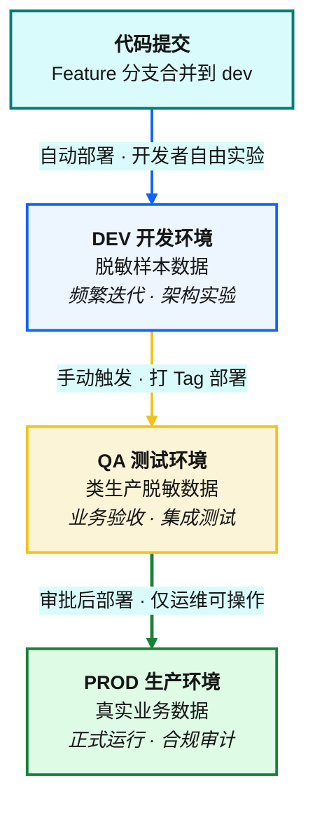
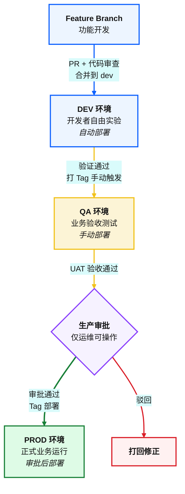
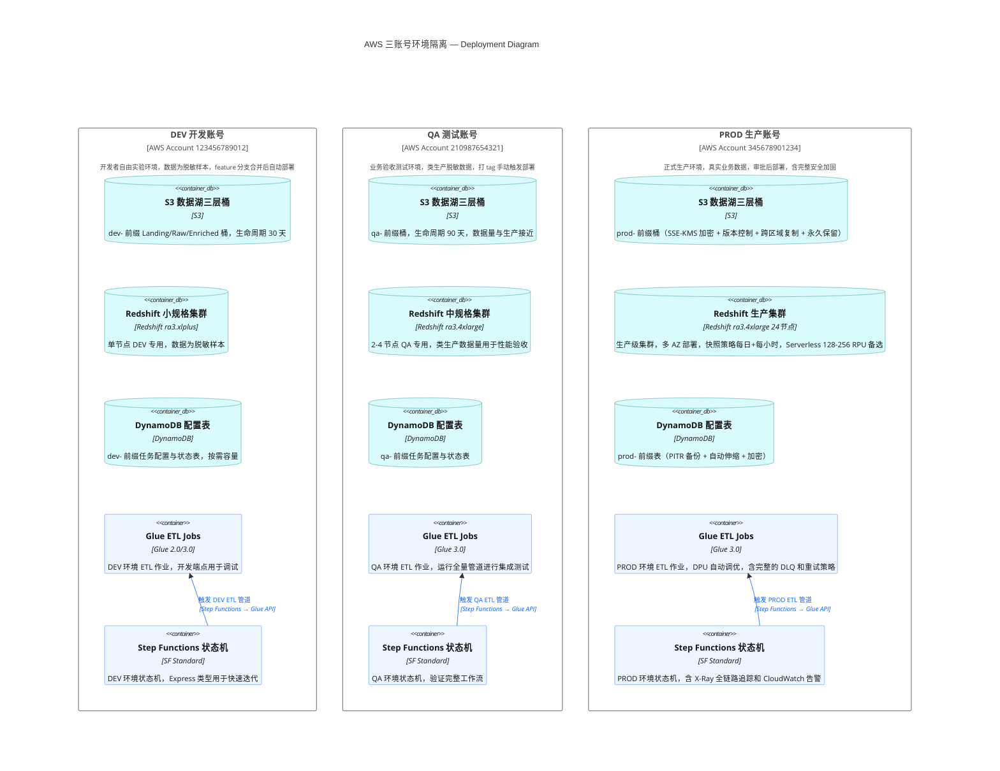
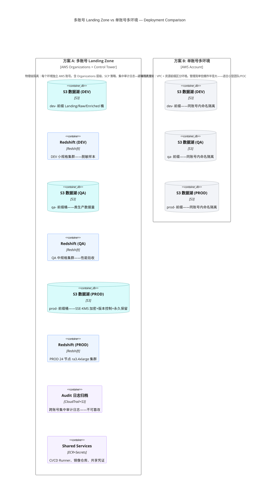
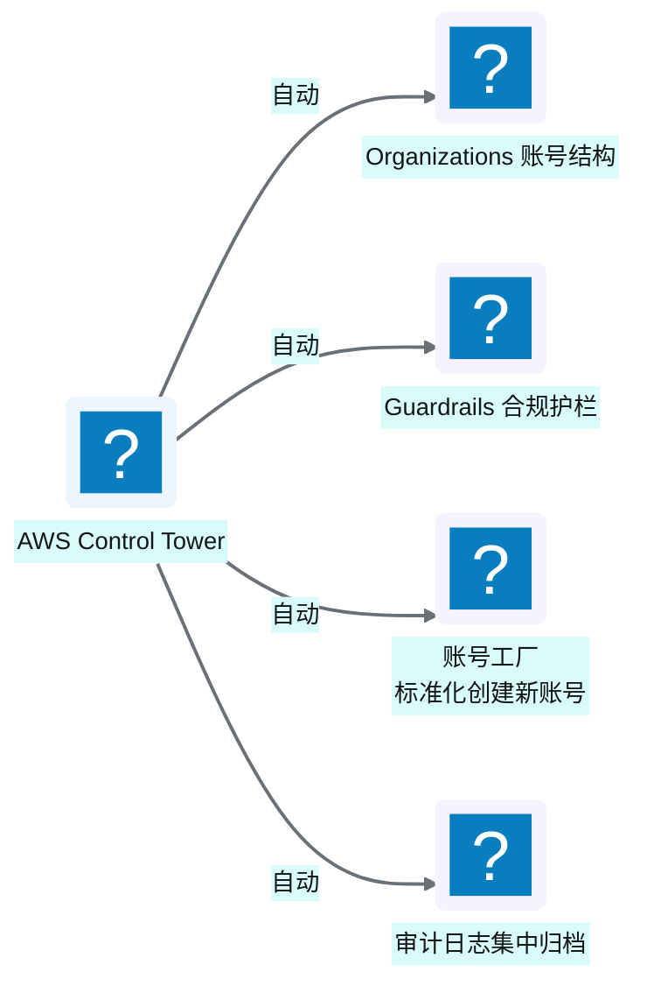

# Ch 6 环境与多账号隔离设计

!!! info "面包屑"
    [本书主页](./index.md) › [Part II 架构设计](./05-端到端数据流全景.md) › Ch 6

!!! abstract "项目第 0 年 · 架构设计期——环境隔离设计"

---

## :material-school: 本章你将学到
- dev/qa/prod 三环境模型的设计与发布路径
- 账号级隔离与 region 隔离的策略
- Landing Zone 模式 vs 单账号多环境的架构对比

---

## 6.1 dev/qa/prod 三环境模型与发布路径

### 三环境模型

代码从开发到生产，经过三个独立环境，每个环境的部署方式和数据策略各有不同：

**图 6-1** 三环境模型

| 环境 | 用途 | 数据 | 谁能操作 | 部署方式 |
|---|---|---|---|---|
| **DEV** | 开发调试、架构实验 | 脱敏样本数据 | 开发者 | :octicons-git-branch-16: feature 分支合并后自动部署 |
| **QA** | 业务验收、集成测试 | 类生产数据（脱敏） | QA + 开发 | :octicons-tag-16: 打 tag 手动触发 |
| **PROD** | 正式业务运行 | 真实生产数据 | 仅运维（审批） | tag + 审批后部署 |

**表 6-1** 三环境模型

### 发布路径

**图 6-2** 发布路径

这条发布路径适用于所有四类发布物：:simple-terraform: Terraform 资源、Glue 脚本、Lambda 代码、DynamoDB 配置（详见 [Ch 28](./28-四类发布流.md)）。

!!! warning "Trade-off"
    三环境是数据平台的"标配"，但环境的维护成本不低——每多一个环境，就多一份基础设施、多一份数据同步、多一份配置管理。有些团队用"两环境（dev+prod）"来降低成本，代价是测试覆盖不足，生产事故风险升高。对于医药这种强合规行业，三环境是底线。

---

## 6.2 账号级隔离与 region 隔离（AWS China）

### 账号级隔离

每个环境使用**独立的 AWS 账号**，实现物理级隔离：

**图 6-3** 账号级隔离

账号级隔离的好处：

| 好处 | 说明 |
|---|---|
| **爆炸半径控制** | DEV 里的误操作不会影响 PROD |
| **权限天然隔离** | 开发者只有 DEV 账号权限，无法触碰 PROD |
| **计费独立** | 各环境成本可独立核算 |
| **合规审计** | PROD 账号的 CloudTrail 独立审计 |

**表 6-2** 账号级隔离

### Region 隔离

平台部署在 **AWS China（cn-north-1）**，这是由光环新道/西云数据运营的独立区域，与全球 AWS 物理隔离，满足中国数据驻留要求。

!!! tip "引申"
    AWS China 不是 AWS Global 的"镜像"，而是一个**独立的云**——服务子集更小、账号体系独立、需要中国 ICP 备案。选择 AWS China 意味着某些全球区有的服务（如某些 AI 服务）可能不可用，需要在架构设计时提前确认服务可用性。

---

## 6.3 引申：Landing Zone 模式 vs 单账号多环境

### 两种多环境架构对比

**图 6-4** 两种多环境架构对比

| 维度 | 多账号 Landing Zone（方案 A） | 单账号多环境（方案 B） |
|---|---|---|
| **隔离强度** | 物理级（账号隔离） | 逻辑级（VPC/命名前缀） |
| **爆炸半径** | 最小 | 较大（一个 IAM 误配可能影响多环境） |
| **运维复杂度** | 高（多账号管理） | 低（一个账号管所有） |
| **成本** | 略高（每账号有基线开销） | 低 |
| **合规** | 强（审计独立） | 弱 |
| **适合规模** | 中大型企业 | 小型团队/POC |

**表 6-3** 两种多环境架构对比

### AWS Control Tower

如果使用 AWS 的 **Control Tower**，可以自动化创建和管理 Landing Zone：

**图 6-5** AWS Control Tower

!!! warning "Trade-off"
    本书方案（多账号 Landing Zone）在隔离和合规上更优，但运维复杂度也更高。如果团队规模小、合规要求不极端，单账号多环境 + 严格的 IAM 策略也能工作。关键是要**有意识地选择**，而不是稀里糊涂地混在一起。

---

## :material-check-circle: 本章小结
- 三环境模型（dev/qa/prod）是数据平台标配：DEV 自动部署、QA 手动触发、PROD 审批后部署
- 账号级隔离实现物理级安全：每个环境独立 AWS 账号，爆炸半径可控
- Region 选择 AWS China（cn-north-1）满足中国数据驻留合规要求
- 多账号 Landing Zone vs 单账号多环境：前者隔离强但运维重，后者简单但风险高——按规模和合规要求选择

---

!!! quote "下一章"
    [Ch 7 数据湖分层设计](./07-数据湖分层设计.md) —— 环境搭好了，接下来看数据湖的 Landing/Raw/Enriched 三层如何设计。

