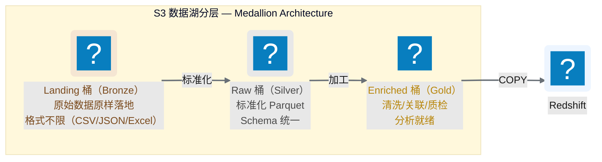
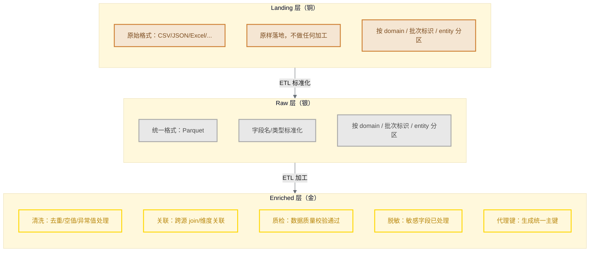
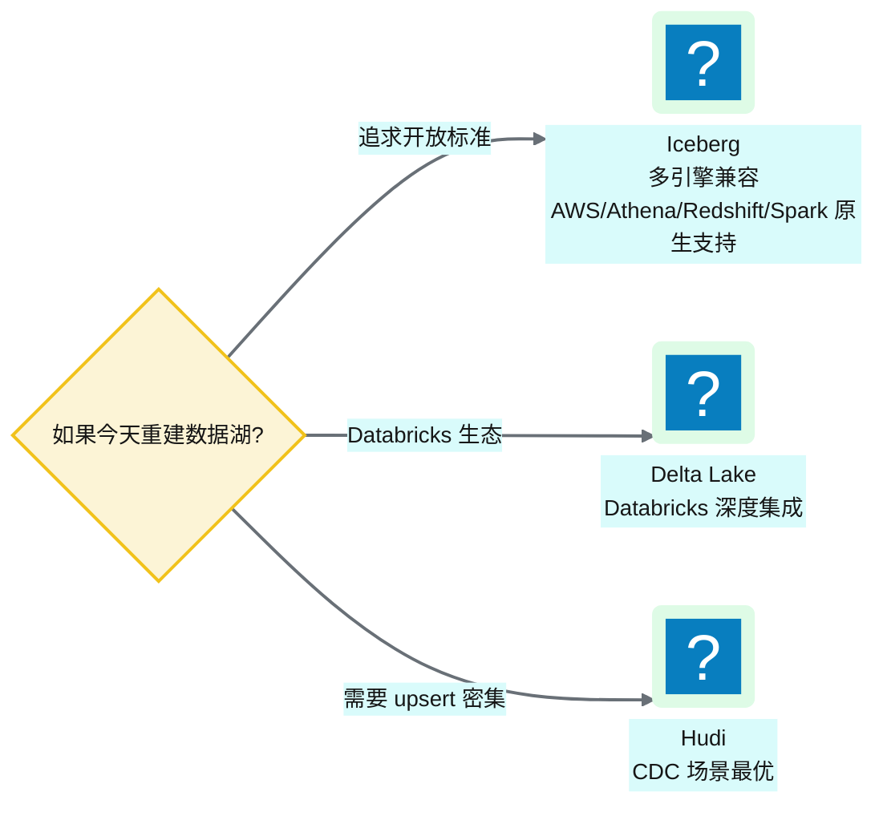

# Ch 7 数据湖分层设计（Landing/Raw/Enriched）

!!! info "面包屑"
    [本书主页](./index.md) › [Part II 架构设计](./06-环境与多账号隔离设计.md) › Ch 7

!!! abstract "项目第 0-1 年 · 架构设计期→核心建设期——数据湖奠基"

---

## :material-school: 本章你将学到
- S3 数据湖的三层分桶设计与命名约定
- Medallion 架构的核心理念与分区策略
- 数据湖格式选型的 trade-off：:simple-apacheparquet: Parquet vs :material-database-sync: Iceberg/Delta/Hudi

---

数据湖是整个平台的"地基"——所有数据先落地到 S3，再分层加工。这个设计看似简单（不就是建几个 S3 桶吗？），但深究下去有一堆工程决策：分几个桶？怎么命名？用什么文件格式？怎么做分区？历史版本要不要保留？

我在企业征信项目里见过一个"反面教材"：当时图省事，所有数据丢进一个 S3 桶的前缀里，不分区、不分层、:simple-apacheparquet: Parquet 和 :fontawesome-solid-file-csv: CSV 混着存。结果三个月后，查询性能急剧下降（Athena 扫描全量数据）、成本飙升（没有分区过滤）、排障困难（不知道某个文件是哪个批次产生的）。这个教训让我在 Aurora 的数据湖设计上格外谨慎——分层、命名、分区、格式，每一个决策都要想清楚。

---

## 7.1 S3 分层桶设计与命名约定

数据湖采用经典的 **Medallion 架构**（铜/银/金），在 S3 上体现为三个独立桶：


<p class="caption" markdown="span">**图 7-1** S3 分层桶设计与命名约定</p>

### 桶命名约定

| 层 | 命名模式 | 举例 |
|---|---|---|
| Landing | `aurora-cdp-landing-{env}-{region}` | `aurora-cdp-landing-dev-cn-north-1` |
| Raw | `aurora-cdp-raw-{env}-{region}` | `aurora-cdp-raw-dev-cn-north-1` |
| Enriched | `aurora-cdp-enriched-{env}-{region}` | `aurora-cdp-enriched-dev-cn-north-1` |
<p class="caption" markdown="span">**表 7-1** 桶命名约定</p>


这个命名不是我拍脑袋定的，是踩过"命名混乱"的坑后提炼的。企业征信项目时，数据湖桶叫 `data-lake`——简单，但三个月后来了第二个项目也要用数据湖，桶名直接冲突了；后来做环境隔离，`data-lake-dev`/`data-lake-prod` 混在一个账号里，计费标签分不清。到 Aurora 我定了一条铁律：**桶名必须自描述——看名字就知道是哪个项目、哪个层、哪个环境、哪个 Region**。`aurora-cdp-landing-dev-cn-north-1` 这个名字是长，但它编码了全部上下文——运维扫一眼就知道这个桶属于谁、能干什么、在哪儿。命名的冗长是一次性认知成本，命名的模糊是长期排障成本。

命名里还有一个容易看漏的设计——`{env}` 在 `{region}` 前面。这个顺序是我刻意定的：环境比 Region 更重要（dev 的桶哪怕跨 Region 也是 dev），排序反映了"变更频率从高到低"——环境会随部署变，Region 基本不动。这样按环境过滤（如 `aws s3 ls | grep landing-dev`）也更顺手。

### 为什么分三个桶而不是一个桶三个前缀

| 维度 | 三桶方案（本书） | 一桶多前缀 |
|---|---|---|
| **权限隔离** | 可按桶授予不同 IAM 策略 | 只能按前缀，粒度粗 |
| **生命周期** | 各桶独立配置 S3 Lifecycle | 一个桶一套规则 |
| **成本归集** | 桶级计费标签清晰 | 需要按前缀拆分 |
| **爆炸半径** | 一桶误删不影响其他 | 全在一起 |
<p class="caption" markdown="span">**表 7-2** 为什么分三个桶而不是一个桶三个前缀</p>

表里"爆炸半径"这一行是我在企业征信真实栽过的跟头。当时用一桶多前缀，某个 ETL 脚本的 S3 路径写错了——本该写 `s3://data-lake/raw/sci/` 误写成 `s3://data-lake/landing/sci/`——Raw 层的加工脚本读到了 Landing 层的原始数据（未标准化），产出的 Enriched 数据全错了，而且因为在一个桶里，没有"权限拒绝"这个保护——脚本有桶权限就能读写任何前缀。那次事故排查了两天才发现是路径写错。到 Aurora 我坚持三桶——**桶是权限的物理边界**，Raw 层的 Glue job 没有 Landing 桶的写权限，路径写错了会直接权限拒绝，而不是"静默写错地方"。这个设计让"路径错误"从"静默数据污染"变成了"显式权限报错"——故障可发现，而不是潜伏。

"生命周期"这一行也有实战价值。Landing 层是原始数据，30 天后可以删（已经转成 Raw）；Enriched 层是加工结果，要长期保留；Raw 层在中间。三桶方案让每层独立配 S3 Lifecycle——Landing 自动 30 天转 Glacier 再删除，Enriched 永久保留。如果一桶多前缀，一个 Lifecycle 规则要覆盖所有前缀，要么"一刀切"（不该删的也删了），要么写一堆复杂规则（维护痛苦）。**独立桶=独立生命周期=独立成本优化**，这是三桶方案的隐性收益。

---

## 7.2 Medallion 架构与分区策略

### Medallion 架构的层间契约


<p class="caption" markdown="span">**图 7-2** Medallion 架构的层间契约</p>

这张图里的"层间契约"是我在设计时反复强调的概念——**每一层对上一层的承诺是固定的，不能随便打破**。Landing 对 Raw 的承诺是"原始数据原样落地，格式不限"；Raw 对 Enriched 的承诺是"Parquet 格式、字段名/类型已标准化"；Enriched 对 Redshift 的承诺是"已清洗、已关联、已质检、已脱敏"。这些契约看起来是"约定"，但它们是整个流水线可靠性的基石——如果 Raw 层偶尔混进未标准化的数据，Enriched 的加工脚本就会崩。

我在企业征信项目里见过契约被打破的后果。当时没有明确的层间契约——加工脚本直接读 Landing 层的原始数据，"顺手"做标准化。短期看省了一层（Raw 层），长期看是灾难：每个加工脚本都要自己处理格式差异，逻辑重复又不一致；更糟的是，Landing 层的格式一旦变了（上游改了 CSV 列顺序），所有加工脚本同时崩。到 Aurora 我把"层间契约不可跨越"定为铁律——Enriched 只能读 Raw，Raw 只能读 Landing，绝不跳层。哪怕"跳层省一次 ETL"看起来诱人，也不行——**省一次 ETL 的代价是契约松散后的全链路脆弱**（M2 关注点分离的实践）。

### 分区策略

每一层都按 **`domain / 批次标识 / entity`** 三级分区：

```
s3://aurora-cdp-raw-dev-cn-north-1/
  └── sci/                          ← domain（业务域）
      └── 20260618-001500/          ← 批次标识（日期+时间）
          ├── hospital_master/      ← entity（数据实体）
          │   └── part-00001.parquet
          └── prescription_fact/
              └── part-00001.parquet
```

| 分区层级 | 含义 | 作用 |
|---|---|---|
| `domain` | 业务域（sci/retail/ma/...） | 按业务域隔离数据 |
| 批次标识 | 时间戳 | 版本管理 + 可追溯 |
| `entity` | 数据实体（表/对象） | 按实体组织文件 |
<p class="caption" markdown="span">**表 7-3** 分区策略</p>

这个三级分区（`domain / 批次标识 / entity`）是我在企业征信的教训基础上设计的。企业征信时用两级分区（`source / date`），看起来够用，但排障时发现一个问题："我想看某次加载的所有数据"——但 `date` 粒度太粗（一天可能有多次加载），"某次加载"没法精确定位。到 Aurora 我把 `date` 升级为"批次标识"（时间戳精确到分钟），每次加载一个独立目录——排障时只要知道"哪次加载出了问题"，直接定位到那个目录，不用在海量文件里翻。

分区设计里还有一个我纠结过的决策：**批次标识 vs 覆盖写**。批次标识是"每次加载新建目录"，覆盖写是"每次加载覆盖同一目录"。覆盖写省空间（只保留最新），批次标识省心（历史可回溯）。我最终选批次标识，核心驱动力是医药合规——GxP ALCOA+ 要求"原始数据可追溯"（见 [Ch 1 表 1-2](./01-数字化转型下的医药数据困局.md)），如果覆盖写，"上个月的原始数据是什么"就无法回答。批次标识让每一次加载都是"一个不可变的版本"——这个设计后来在审计时被审计员表扬"数据可追溯性做得好"。**合规要求倒逼了分区设计**——这是医药行业做数据平台独有的约束驱动。

!!! warning "Trade-off"
    按批次标识分区的好处是"每次加载都是一个独立版本"，可以按时间回溯。代价是同一 entity 会有多个版本的文件，需要下游（Raw→Enriched）做合并。另一种方案是"只保留最新版本"（覆盖写），代价是丢失历史。我们选择保留版本，因为医药数据合规要求"可追溯"。

    这个代价在第二年表数量增长到上千张后变得显著——Enriched 层合并逻辑越来越复杂，每次加工要扫多个批次目录。如果当时用了 Iceberg（见下节），这个"合并"问题会被原生 time travel 解决——这也是我后来反思"止步 Parquet"的遗憾之一。

---

## 7.3 引申：数据湖格式选型——Parquet vs Iceberg/Delta/Hudi

### 当时的选择：纯 Parquet

平台数据湖使用纯 **Parquet** 文件——没有使用任何"表格式"（Table Format）。

这个选择在今天看来是"遗憾"（见 §7.3.4 如果重来），但在四年前是务实的。当时我在 Parquet 和 Iceberg 之间犹豫了两周——Iceberg 能解决 ACID、time travel、schema 演进，看起来更"先进"。但最终选 Parquet 的决定性因素是**风险可控**：Parquet 是 AWS China 最早支持、最稳定的格式，Athena/Redshift/Glue 都原生兼容，团队也有经验；而 Iceberg 在 AWS China 的集成当时还很不成熟，生产案例极少。对一个医药合规项目，"选不成熟技术"的风险远大于"少几个能力"的代价。**架构选型不是选"最先进"，而是选"约束下最稳"**——这是我在四年前做的判断，也是四年后反思的起点。

### 什么是表格式

表格式（如 Iceberg/Delta Lake/Hudi）在 Parquet 文件之上增加了一层"元数据抽象"，让数据湖获得类似数据库的能力：

| 能力 | 纯 Parquet | Iceberg/Delta/Hudi |
|---|---|---|
| **ACID 事务** | ❌ | ✅ |
| **Time Travel** | ❌（需手动保留版本） | ✅（原生支持） |
| **Schema 演进** | 困难（需重写文件） | ✅（自动管理） |
| **分区演进** | 困难 | ✅（隐藏分区） |
| **Upsert/Delete** | ❌（需全量重写） | ✅ |
| **并发写入** | 危险（可能冲突） | ✅（事务隔离） |
<p class="caption" markdown="span">**表 7-4** 什么是表格式</p>

这张表里每一行"❌"都是我在 Aurora 用 Parquet 时真实痛过的。最痛的是"Schema 演进"——第二年初，SFE 系统的处方表加了一个字段，按 Parquet 方案要重写所有历史文件（因为旧文件没有新列），几千个文件重跑了整整一天。如果用 Iceberg，加列是元数据操作，秒级完成，不用重写数据。另一个痛是"并发写入"——两个 ETL 同时写同一张表时，Parquet 没有锁，可能产生冲突文件；我不得不在应用层用 DynamoDB 加分布式锁，复杂且脆弱。Iceberg 的事务隔离原生解决这个问题。**表格式不是"锦上添花"，而是"补 Parquet 的结构性缺陷"**——这些缺陷在数据量小时能忍，规模大了就成了瓶颈。


### 为什么当时选纯 Parquet

!!! tip "引申：表格式三巨头的区别"
    Iceberg（Netflix 开源，现属 Apache）、Delta Lake（:simple-databricks: Databricks 开源）、Hudi（Uber 开源，现属 Apache）是三大表格式，核心能力类似但各有侧重：

    - **Iceberg** 最"中立"——不绑定任何计算引擎，AWS/Athena/Redshift/Spark/Trino 都原生支持。如果追求"开放标准、无锁定"，Iceberg 是首选。AWS 已经把 Iceberg 作为 S3 Tables 的默认格式。
    - **Delta Lake** 与 Databricks 深度绑定——在 Databricks 上体验最好，但脱离 Databricks 生态后功能受限。如果你的平台以 Databricks 为核心，Delta 是自然选择。
    - **Hudi** 最擅长 CDC（变更数据捕获）场景——支持 Upsert/Delete 的高效写入，适合"频繁更新"的数据。如果你的数据以流式 Upsert 为主，Hudi 更合适。

    这三者的竞争是当前数据领域最热门的"标准之战"之一。对于新项目，Iceberg 是最安全的押注——因为它的"中立性"让它在多云、多引擎环境下不会被困住。

!!! warning "Trade-off"
    四年前启动项目时，Iceberg/Delta/Hudi 尚处于早期阶段，在 AWS China 的集成支持有限，团队也缺乏生产经验。纯 Parquet 虽然能力弱，但**稳定、简单、无依赖**。

    代价是：每次 schema 变更需要重写历史文件、不支持 upsert（只能全量覆盖）、并发写入需要应用层加锁。这些代价在平台初期数据量小时不明显，但随着业务域扩展到十几个、表扩展到上千张，Schema 变更和并发写入的痛苦越来越显著——这也是 [Ch 34](./34-设计边界与已知取舍的诚实复盘.md) 中"已知设计边界"的根源之一。

### 如果重来


<p class="caption" markdown="span">**图 7-3** 如果重来</p>

!!! tip "引申"
    表格式是数据湖领域的"第二代革命"。如果你今天在建数据湖，强烈建议直接采用 Iceberg 或 Delta Lake——它们让数据湖获得"湖仓一体"（Lakehouse）能力，模糊了数据湖和数据仓库的边界。纯 Parquet 方案在新项目中已经不推荐。我们在 [Ch 52](./52-架构师的复盘-取舍遗憾与主流对比.md) 会把"止步 Parquet"列为当时的遗憾之一。

---

## :material-check-circle: 本章小结
- 数据湖采用 Medallion 架构：Landing（铜/原样）→ Raw（银/标准化）→ Enriched（金/分析就绪），三个独立 S3 桶
- 分区策略按 `domain / 批次标识 / entity` 三级，实现业务域隔离、版本管理、可追溯
- 当时选纯 Parquet 是稳定性与简单性的 trade-off；如果重来会选 Iceberg/Delta 获得表格式能力
- 表格式（Iceberg/Delta/Hudi）让数据湖获得 ACID/Time Travel/Schema 演进/Upsert 能力，是新项目推荐选择

---

!!! quote "下一章"
    [Ch 8 数据仓库设计（Redshift）](./08-数据仓库设计-Redshift.md) —— 数据湖之上是数据仓库。接下来看 Redshift 的集群架构、schema 分层、以及 RLS/CLS 安全策略。

