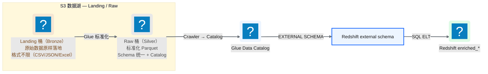
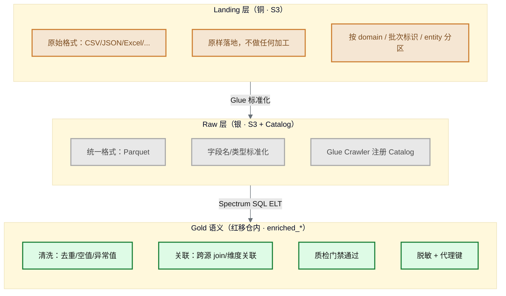
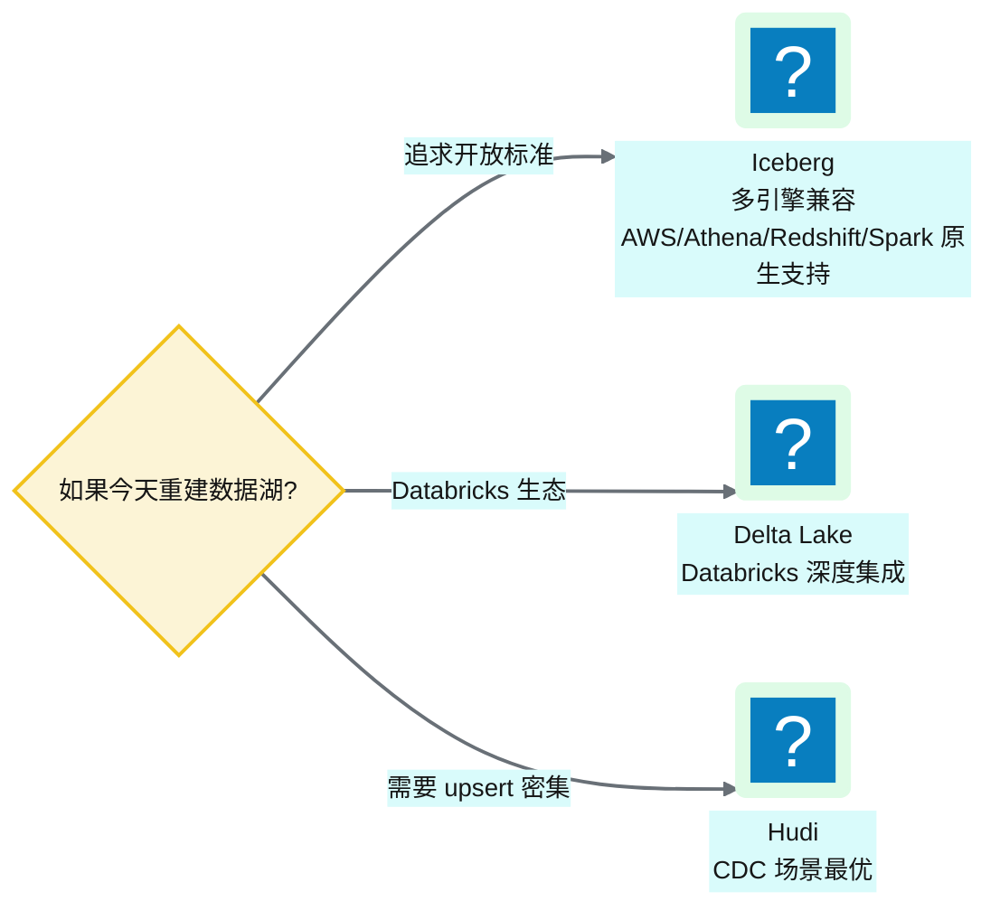

# Ch 7 数据湖分层设计（Landing/Raw）

!!! info "面包屑"
    [本书主页](./index.md) › [Part II 架构设计](./06-环境与多账号隔离设计.md) › Ch 7

!!! abstract "项目第 0-2 年 · 架构设计期→核心建设期——数据湖奠基与分层演进"

---

## :material-school: 本章你将学到
- S3 数据湖从「Landing/Raw/Enriched 三桶」演进到「Landing/Raw 两桶」的原因与代价
- Medallion 层间契约如何调整：Gold 语义上移到 Redshift，湖上只保留铜/银
- 数据湖格式选型的 trade-off：:simple-apacheparquet: Parquet vs :material-database-sync: Iceberg/Delta/Hudi

---

数据湖是整个平台的"地基"——所有数据先落地到 S3，再分层加工。这个设计看似简单（不就是建几个 S3 桶吗？），但深究下去有一堆工程决策：分几个桶？怎么命名？用什么文件格式？怎么做分区？历史版本要不要保留？

我在企业征信项目里见过一个"反面教材"：当时图省事，所有数据丢进一个 S3 桶的前缀里，不分区、不分层、:simple-apacheparquet: Parquet 和 :fontawesome-solid-file-csv: CSV 混着存。结果三个月后，查询性能急剧下降（Athena 扫描全量数据）、成本飙升（没有分区过滤）、排障困难（不知道某个文件是哪个批次产生的）。这个教训让我在 Aurora 的数据湖设计上格外谨慎——分层、命名、分区、格式，每一个决策都要想清楚。

分层本身也会演进。第 0–1 年我们按教科书上了 Landing→Raw→Enriched 三层；第 1–2 年表量上千、存储账单翻倍之后，我把 S3 上的 Enriched（金层）砍掉，Gold 语义迁入 Redshift，湖上只留 Landing→Raw。这一章先讲清现行两层设计，再回头交代三层为什么曾合理、后来哪里痛。

---

## 7.1 S3 分层桶设计与命名约定

现行数据湖在 S3 上只保留两层独立桶：**Landing（铜）**与 **Raw（银）**。分析就绪的 Gold 不再物化到第三个 S3 桶，而是由 Redshift 通过 Spectrum 外挂 Raw（Glue Data Catalog），用 SQL ELT 写入仓内 `enriched_*` schema。详见 [Ch 8](./08-数据仓库设计-Redshift.md)。


<p class="caption" markdown="span">**图 7-1** S3 分层桶设计与命名约定（演进后）</p>

湖上只有两次物化（Landing、Raw），第三次"金层"发生在仓内。**Medallion 的铜/银/金不必全部落在 S3**：当 Gold 只服务数仓消费时，在湖上再写一份 Enriched Parquet 就是重复存储。Landing/Raw 仍用独立桶做权限与生命周期边界，Gold 用 Redshift 内部表承载。

### 桶命名约定

| 层 | 命名模式 | 举例 |
|---|---|---|
| Landing | `aurora-cdp-landing-{env}-{region}` | `aurora-cdp-landing-dev-cn-north-1` |
| Raw | `aurora-cdp-raw-{env}-{region}` | `aurora-cdp-raw-dev-cn-north-1` |
<p class="caption" markdown="span">**表 7-1** 桶命名约定（现行两桶）</p>

这个命名不是我拍脑袋定的，是踩过"命名混乱"的坑后提炼的。企业征信项目时，数据湖桶叫 `data-lake`——简单，但三个月后来了第二个项目也要用数据湖，桶名直接冲突了；后来做环境隔离，`data-lake-dev`/`data-lake-prod` 混在一个账号里，计费标签分不清。到 Aurora 我定了一条铁律：**桶名必须自描述——看名字就知道是哪个项目、哪个层、哪个环境、哪个 Region**。`aurora-cdp-landing-dev-cn-north-1` 这个名字是长，但它编码了全部上下文——运维扫一眼就知道这个桶属于谁、能干什么、在哪儿。命名的冗长是一次性认知成本，命名的模糊是长期排障成本。

早期还有第三行 `aurora-cdp-enriched-{env}-{region}`。砍掉 Enriched 桶之后，命名规则本身没变，只是少了一类桶；Terraform 与 Lifecycle 规则随之删掉，账单里那一块"可重建却永久保留"的存储跟着消失。

命名里还有一个容易看漏的设计——`{env}` 在 `{region}` 前面。这个顺序是我刻意定的：环境比 Region 更重要（dev 的桶哪怕跨 Region 也是 dev），排序反映了"变更频率从高到低"——环境会随部署变，Region 基本不动。这样按环境过滤（如 `aws s3 ls | grep landing-dev`）也更顺手。

### 为什么分独立桶，以及为什么不再要第三个 Enriched 桶

| 维度 | 两桶（现行） | 三桶（第 0–1 年） | 一桶多前缀 |
|---|---|---|---|
| **权限隔离** | Landing/Raw 按桶 IAM | 多一桶 Enriched 写权限 | 只能按前缀，粒度粗 |
| **生命周期** | Landing/Raw 独立 Lifecycle | Enriched 曾"永久保留" | 一个桶一套规则 |
| **存储成本** | 湖上写两次 | 湖上写三次（Enriched 与仓内 Gold 重复） | 表面省桶，实际难归集 |
| **爆炸半径** | 一桶误删不影响另一桶 | 同左，但多一个可删错的金层桶 | 全在一起 |
<p class="caption" markdown="span">**表 7-2** 两桶 vs 三桶 vs 一桶多前缀</p>

表里"爆炸半径"这一行是我在企业征信真实栽过的跟头。当时用一桶多前缀，某个 ETL 脚本的 S3 路径写错了：本该写 `s3://data-lake/raw/sci/`，误写成 `s3://data-lake/landing/sci/`。Raw 层的加工脚本读到了 Landing 层的原始数据（未标准化），产出全错了；因为在一个桶里，也没有"权限拒绝"这个保护。那次事故排查了两天才发现是路径写错。到 Aurora 我坚持**独立桶是权限的物理边界**：Raw 层的 Glue job 没有 Landing 桶的写权限，路径写错了会直接权限拒绝。砍掉 Enriched 之后这个原则仍成立，只是边界从三道变成两道。

"生命周期"这一行也有实战价值。Landing 层是原始数据，30 天后转 Glacier 冷存储以降本，但**删除策略按数据类别分层执行**：营销/销售数据 1 年、GMP 批次记录 5 年、临床试验数据 25 年，满足 GxP 分级留存要求；Raw 层保留标准化副本供重跑与 Spectrum 扫描。如果一桶多前缀，一个 Lifecycle 规则要覆盖所有前缀，要么"一刀切"，要么写一堆复杂规则。独立桶才能各自配生命周期、各自算成本。

我早期差点踩过一个坑："原始数据 30 天后删除"在互联网很常见，**在医药行业是合规事故**。GxP 要求原始数据长期可追溯，临床试验数据按 ICH-GCP 保留 25 年，GMP 批次记录至少 5 年。我最初照搬互联网经验写 Lifecycle，差点把 Landing 层 30 天后直接 Delete，幸好评审时被合规同事拦下。后来改成"30 天转 Glacier 降本 + 按类别分层留存"。S3 Lifecycle 在这里同时管成本和合规（M10）。

!!! warning "Trade-off：当初为什么上三桶，后来为什么砍 Enriched"
    第 0 年我选三桶，理由很扎实：层间契约清晰、Enriched 可独立重跑、COPY 入仓路径简单、和 Databricks Medallion 教科书对齐。医药合规场景下，"多写一次可重建层"看起来值得。

    第 1–2 年痛点露出来了。Enriched 与 Redshift `enriched_*` 内容高度重叠，却要为"快查/可重跑"付双倍对象存储。Raw→Enriched 的 Spark 作业吃满算力与编排槽位，开发还要维护第三套配置。我们也没吃透 Redshift 的湖仓能力：Spectrum 可以把 Glue Catalog 里的 Raw database 挂成 external schema，一条 SQL 就能从湖读到仓写，不必先在 S3 再物化一份金层。

    砍掉 Enriched 的代价是：湖上不再有一份"分析就绪 Parquet"给 Athena 或其他引擎直接读；若将来有强湖侧消费，要么从 Raw 现算，要么重新引入物化。我们判断 Aurora 的主消费面在 Redshift/BI/DaaS，这个代价可接受。口语里有人叫这"少做一跳零 ETL"，指的是**去掉湖上第三跳与重复物化**，不是 AWS Aurora→Redshift 那个 Zero-ETL 产品。

---

## 7.2 Medallion 架构与分区策略

### Medallion 架构的层间契约

Medallion 的思想没丢，**物化位置变了**：铜/银仍在 S3；金在 Redshift。


<p class="caption" markdown="span">**图 7-2** Medallion 层间契约（Gold 上移到 Redshift）</p>

这张图里的"层间契约"仍是我反复强调的概念：**每一层对上一层的承诺固定，不能随便打破**。Landing 对 Raw 的承诺是"原始数据原样落地，格式不限"；Raw 对仓内 Gold 的承诺是"Parquet、字段名/类型已标准化，且已在 Glue Catalog 可发现"；`enriched_*` 对 BI/DaaS 的承诺是"已清洗、已关联、已质检、已脱敏"。契约没变，只是中间那一跳从"Glue 写 S3 Enriched"换成了"Redshift 读 external Raw 再 SQL 写入内部表"。

我在企业征信项目里见过契约被打破的后果。当时没有明确的层间契约，加工脚本直接读 Landing 层的原始数据，"顺手"做标准化。短期看省了一层，长期看是灾难：每个加工脚本都要自己处理格式差异；Landing 格式一变，所有脚本同时崩。到 Aurora 我把"层间契约不可跨越"定为铁律：**仓内 ELT 只读 Raw（经 Spectrum），Raw 只读 Landing，绝不跳层直接啃 Landing 的 CSV**。跳层省一次标准化看起来诱人，但契约一松，全链路都会脆（M2 关注点分离）。

Glue Crawler + Data Catalog 在这里不是附属品。Raw 写入后由 Crawler（或作业内 `enableUpdateCatalog`）维护表与分区元数据；Redshift 侧 `CREATE EXTERNAL SCHEMA ... FROM DATA CATALOG` 挂上同一 database，就能像查本地表一样 `SELECT` Raw（只读）。砍掉 Enriched 之后，湖仓仍能"一条 SQL 入仓"，靠的就是这层元数据。

### 分区策略

Landing 与 Raw 都按 **`domain / 批次标识 / entity`** 三级分区：

```
s3://aurora-cdp-raw-dev-cn-north-1/
  └── sci/                          ← domain（业务域）
      └── 20260618-001500/          ← 批次标识（日期+时间）
          ├── hospital_master/      ← entity（数据实体）
          │   └── part-00001.parquet
          └── prescription_fact/
              └── part-00001.parquet
```

| 分区层级 | 含义 | 作用 |
|---|---|---|
| `domain` | 业务域（sci/retail/ma/...） | 按业务域隔离数据 |
| 批次标识 | 时间戳 | 版本管理 + 可追溯 |
| `entity` | 数据实体（表/对象） | 按实体组织文件 |
<p class="caption" markdown="span">**表 7-3** 分区策略</p>

这个三级分区是我在企业征信的教训基础上设计的。企业征信时用两级分区（`source / date`），排障时"某次加载"没法精确定位。到 Aurora 我把 `date` 升级为"批次标识"（精确到分钟），每次加载一个独立目录。

分区设计里还有一个我纠结过的决策：**批次标识 vs 覆盖写**。我最终选批次标识，主要因为医药合规——GxP ALCOA+ 要求"原始数据可追溯"（见 [Ch 1 表 1-2](./01-数字化转型下的医药数据困局.md)）。批次标识让每一次加载都是"一个不可变的版本"。

!!! warning "Trade-off"
    按批次标识分区的好处是"每次加载都是一个独立版本"，可以按时间回溯。代价是同一 entity 会有多个版本的文件，下游 SQL ELT 需要按批次或合并策略取数。另一种方案是"只保留最新版本"（覆盖写），代价是丢失历史。我们选择保留版本，因为医药数据合规要求"可追溯"。

    这个代价在第二年表数量增长到上千张后变得显著，合并逻辑越来越复杂。砍掉 S3 Enriched 之后，合并压力从"Glue 写金层"转移到"Redshift SQL / staging 策略"；如果当时用了 Iceberg（见下节），time travel 会原生缓解批次合并。这也是我后来反思"止步 Parquet"的遗憾之一。对 Spectrum 而言，分区过滤更要紧：无分区的全表扫描会按扫描量计费，分区设计直接变成 FinOps 护栏（呼应 [Ch 8](./08-数据仓库设计-Redshift.md) 与 [附录 G](./appendix-G-FinOps成本治理.md)）。

---

## 7.3 引申：数据湖格式选型——Parquet vs Iceberg/Delta/Hudi

### 当时的选择：纯 Parquet

平台数据湖使用纯 **Parquet** 文件——没有使用任何"表格式"（Table Format）。

这个选择在今天看来是"遗憾"（见 §7.3.4 如果重来），但在四年前是务实的。当时我在 Parquet 和 Iceberg 之间犹豫了两周。Iceberg 能解决 ACID、time travel、schema 演进，看起来更"先进"。但最终选 Parquet，是因为**风险可控**：Parquet 是 AWS China 最早支持、最稳定的格式，Athena/Redshift Spectrum/Glue 都原生兼容；Iceberg 在 AWS China 的集成当时还很不成熟。对一个医药合规项目，"选不成熟技术"的风险远大于"少几个能力"的代价。架构选型不是选"最先进"，而是选"约束下最稳"。

现行两层湖 + Spectrum 路径下，Parquet 的分区与列裁剪直接决定 Spectrum 扫描成本。格式选型与分层演进是绑在一起的。

### 什么是表格式

表格式（如 Iceberg/Delta Lake/Hudi）在 Parquet 文件之上增加了一层"元数据抽象"，让数据湖获得类似数据库的能力：

| 能力 | 纯 Parquet | Iceberg/Delta/Hudi |
|---|---|---|
| **ACID 事务** | ❌ | ✅ |
| **Time Travel** | ❌（需手动保留版本） | ✅（原生支持） |
| **Schema 演进** | 加列容易、改列类型/删列困难（需重写文件） | ✅（自动管理） |
| **分区演进** | 困难 | ✅（隐藏分区） |
| **Upsert/Delete** | ❌（需全量重写） | ✅ |
| **并发写入** | 危险（可能冲突） | ✅（事务隔离） |
<p class="caption" markdown="span">**表 7-4** 什么是表格式</p>

常见误解要先掰开：**Parquet 加列不需要重写历史文件**，旧文件缺新列时查询返回 null。真正痛的是**改列类型 / 删列**，这两类操作才需要重写历史文件。第二年初我们真踩过这个坑：SFE 系统的处方表把 `quantity` 从 `int` 改成 `decimal`，按 Parquet 方案只能把几千个历史文件全部重写，整整跑了一天。另一个痛是并发写入：两个 ETL 同时写同一张表时，Parquet 没有锁，我不得不在应用层用 DynamoDB 加分布式锁。Iceberg 的事务隔离原生解决这个问题。

从湖仓一体视角看，Iceberg 还让"银/金不必全部物化成目录副本"更自然，快照与视图可以表达不同加工态。我们当时没有这条路，只能用"多写一个 Enriched 桶"换契约清晰；后来用 Spectrum SQL ELT 砍掉 Enriched，是在纯 Parquet 约束下能走的务实捷径，并不是表格式的完整替代。

### 为什么当时选纯 Parquet

!!! tip "引申：表格式三巨头的区别"
    Iceberg（Netflix 开源，现属 Apache）、Delta Lake（:simple-databricks: Databricks 开源）、Hudi（Uber 开源，现属 Apache）是三大表格式，核心能力类似但各有侧重：

    - **Iceberg** 最"中立"——不绑定任何计算引擎，AWS/Athena/Redshift/Spark/Trino 都原生支持。如果追求"开放标准、无锁定"，Iceberg 是首选。AWS 已经把 Iceberg 作为 S3 Tables 的默认格式。
    - **Delta Lake** 与 Databricks 深度绑定——在 Databricks 上体验最好，但脱离 Databricks 生态后功能受限。
    - **Hudi** 最擅长 CDC（变更数据捕获）场景——支持 Upsert/Delete 的高效写入，适合"频繁更新"的数据。

    这三者的竞争是当前数据领域最热门的"标准之战"之一。对于新项目，Iceberg 是最安全的押注——因为它的"中立性"让它在多云、多引擎环境下不会被困住。

!!! warning "Trade-off"
    四年前启动项目时，Iceberg/Delta/Hudi 尚处于早期阶段，在 AWS China 的集成支持有限，团队也缺乏生产经验。纯 Parquet 虽然能力弱，但**稳定、简单、无依赖**。

    代价要分清：加列不必重写历史文件；真正痛的是改列类型 / 删列才需要重写、不支持 upsert、并发写入需要应用层加锁。这些代价在平台初期数据量小时不明显，但随着业务域扩展到十几个、表扩展到上千张，痛苦越来越显著——这也是 [Ch 34](./34-设计边界与已知取舍的诚实复盘.md) 中"已知设计边界"的根源之一。

### 如果重来


<p class="caption" markdown="span">**图 7-3** 如果重来</p>

!!! tip "引申"
    表格式是数据湖领域的"第二代革命"。如果你今天在建数据湖，强烈建议直接采用 Iceberg 或 Delta Lake，它们让数据湖获得"湖仓一体"（Lakehouse）能力。纯 Parquet 方案在新项目中已经不推荐。我们在 [Ch 54](./54-架构师的复盘-取舍遗憾与主流对比.md) 会把"止步 Parquet"列为当时的遗憾之一；而"砍掉 S3 Enriched、Gold 入仓"则是我认为做对了的演进：在没有 Iceberg 的年代，用 Spectrum 外挂 + SQL ELT 避免了湖上金层的重复物化。

---

## :material-check-circle: 本章小结
- 现行数据湖为两层：Landing（铜/原样）→ Raw（银/标准化 Parquet + Catalog）；Gold 在 Redshift `enriched_*`，经 Spectrum SQL ELT 写入
- 第 0–1 年曾用三桶含 Enriched→COPY；因 S3 重复存储、Glue 多跳、未吃透外挂能力而演进为两层湖
- 分区策略仍按 `domain / 批次标识 / entity` 三级，服务可追溯与 Spectrum 分区过滤
- 当时选纯 Parquet 是稳定性与简单性的 trade-off；如果重来会选 Iceberg/Delta 获得表格式能力

---

!!! quote "下一章"
    [Ch 8 数据仓库设计（Redshift）](./08-数据仓库设计-Redshift.md) —— 数据湖之上是数据仓库。接下来看 Redshift 如何用 external schema 挂载 Raw Catalog，以及 schema 分层与 RLS/CLS 安全策略。
