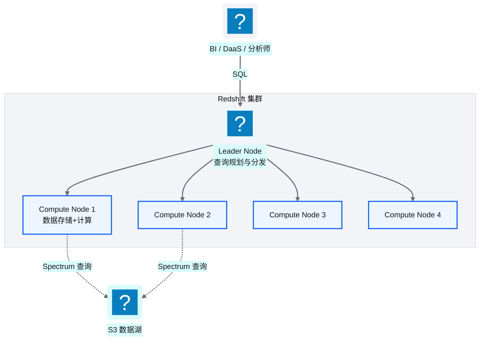
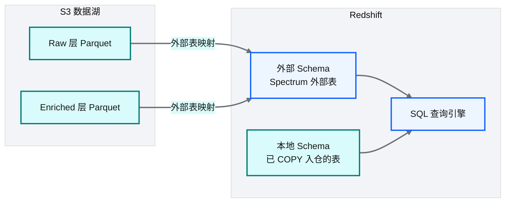
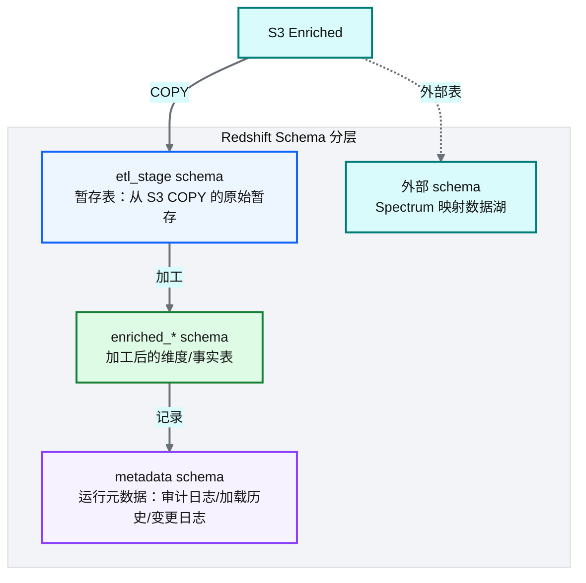
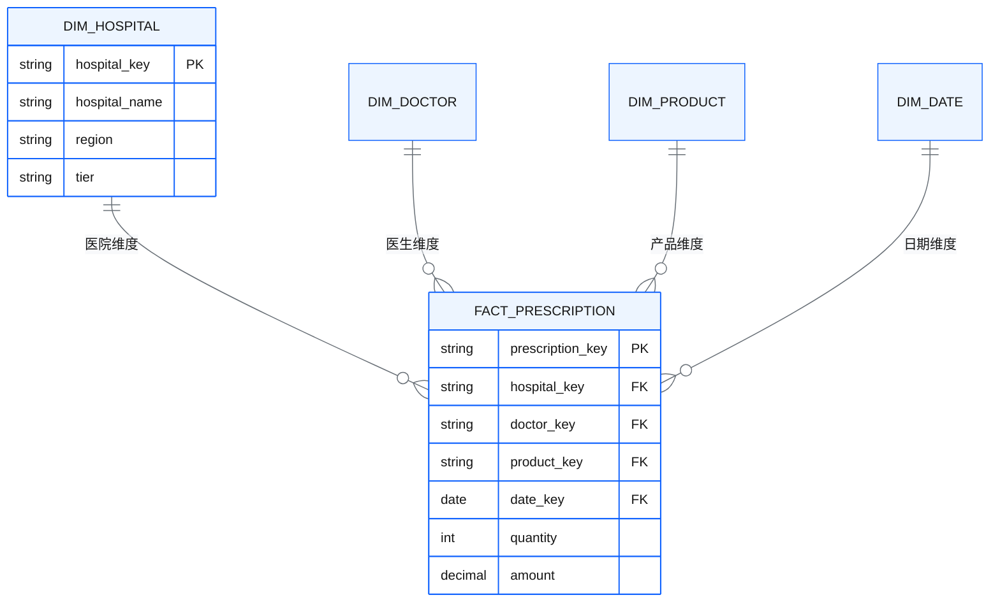
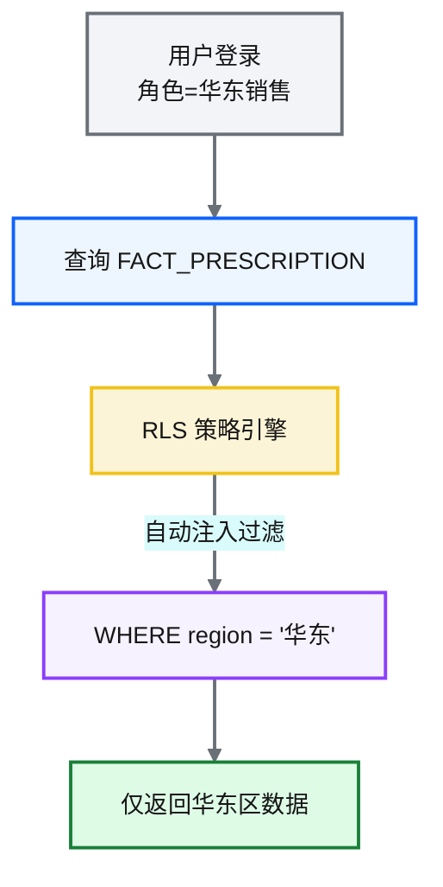
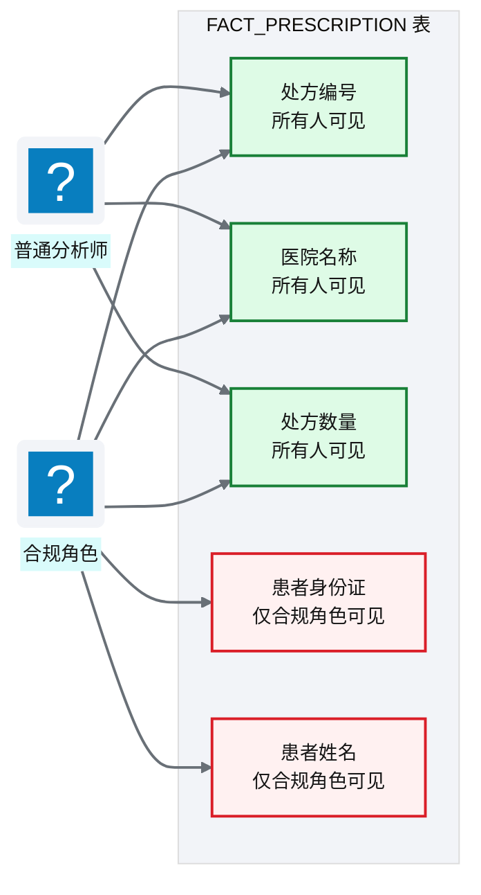
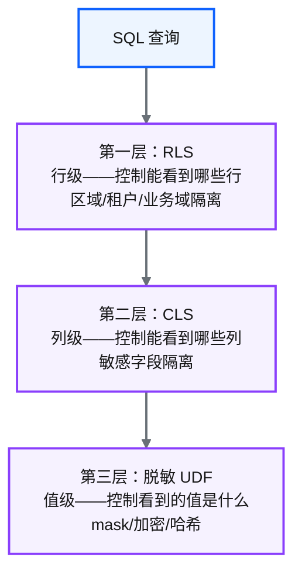

# Ch 8 数据仓库设计（Redshift）

!!! info "面包屑"
    [本书主页](./index.md) › [Part II 架构设计](./07-数据湖分层设计.md) › Ch 8

!!! abstract "项目第 0-1 年 · 架构设计期→核心建设期——数仓奠基"

---

## :material-school: 本章你将学到
- Redshift 集群架构与 Spectrum 外部表的设计
- 分层 schema 设计与 Kimball 维度建模在平台中的应用
- Redshift 行级安全（RLS）与列级安全（CLS）策略——数据仓库的安全基石
- Redshift vs :simple-snowflake: Snowflake vs BigQuery 的工程取舍

---

数据湖解决了"存储"问题（[Ch 7](./07-数据湖分层设计.md)），但"分析查询"需要数据仓库。在数据湖上用 Athena 做 ad-hoc 查询可以，但要支撑 BI 报表的高频复杂查询、多表 join 和聚合计算，还是需要一个真正的列式 MPP 数据仓库。

选 Redshift 的过程在 [Ch 2](./02-从需求到蓝图：一个数据平台的诞生.md) 已经讲过——四年前 Snowflake 未入华，Redshift 是 AWS China 上唯一靠谱的云数仓选项。但"选了 Redshift"只是开始，怎么用好它才是真正的工程挑战。

我在企业征信项目里用过 :simple-postgresql: PostgreSQL 做数仓——它能跑，但数据量到 TB 级后查询就慢得不可接受。PostgreSQL 是行式 OLTP 数据库，不适合大规模分析查询；Redshift 是列式 MPP（大规模并行处理）数据库，天然为分析场景设计。这个"行式 vs 列式"、"单机 vs MPP"的差别，是数仓设计的底层认知。

---

## 8.1 Redshift 集群架构与 Spectrum 外部表

### 集群架构

**图 8-1** 集群架构

Redshift 采用 **MPP（大规模并行处理）架构**：Leader Node 负责接收 SQL、生成执行计划并分发到 Compute Nodes；Compute Nodes 各自存储部分数据并并行执行。平台使用 RA3 节点类型——计算与存储分离架构，数据可缓存在本地 SSD，大量数据留在 S3。

### Spectrum：数据湖的"外部表"

Redshift Spectrum 让 Redshift 可以**直接查询 S3 数据湖中的数据**，无需先 COPY 入仓：

**图 8-2** Spectrum：数据湖的"外部表"

| 查询方式 | 数据位置 | 适合场景 |
|---|---|---|
| **本地表** | Redshift 内部存储 | 高频查询、复杂 join、性能敏感 |
| **Spectrum 外部表** | S3 数据湖 | 低频查询、探索性分析、避免重复存储 |

**表 8-1** Spectrum：数据湖的"外部表"

!!! tip "引申"
    Spectrum 的价值是"按需查询数据湖而不必全量入仓"。比如某个历史归档表很大但很少查，放本地浪费存储，放 S3 用 Spectrum 按需查更经济。这是"湖仓一体"的雏形——数据湖和数据仓库通过外部表打通。

---

## 8.2 模式设计：分层 schema 与 Kimball 维度建模

### Schema 分层

**图 8-3** Schema 分层

| Schema | 职责 | 谁写入 | 谁读取 |
|---|---|---|---|
| `metadata` | 运行元数据（审计/加载历史/DDL 变更） | ETL 框架自动 | 运维/排障/合规 |
| `etl_stage` | 暂存表（从 S3 COPY 的中间态） | ETL 框架 | 下游加工步骤 |
| 外部 schema | Spectrum 映射 S3 数据湖 | 数据目录 | 探索性查询 |
| `enriched_*` | 各业务域的维度/事实表 | ETL 框架 | BI/DaaS/AI |

**表 8-2** Schema 分层

### Kimball 维度建模

`enriched_*` schema 内部采用 **Kimball 维度建模**：

**图 8-4** Kimball 维度建模

| 表类型 | 作用 | 特征 |
|---|---|---|
| **维度表（Dimension）** | 描述业务实体 | 宽表、变化慢、用于过滤和分组 |
| **事实表（Fact）** | 记录业务事件 | 窄表、增长快、包含度量值和外键 |

**表 8-3** Kimball 维度建模

!!! warning "Trade-off"
    Kimball 维度建模是数据仓库的经典方法论，优势是查询性能好、业务理解直观。代价是维度变更管理复杂（SCD 类型 1/2/3 的选择）和建模成本高。另一种选择是 Data Vault——更适合大规模集成但查询性能差，需要再建一层星型模型供查询。对于以分析查询为主的场景，Kimball 仍是务实选择。

---

## 8.3 Redshift 行级安全（RLS）与列级安全（CLS）策略

这是数据仓库安全设计的核心。Redshift 提供两种细粒度安全策略，平台将其作为数据治理的基石。

!!! tip "引申：数据库安全的发展脉络"
    。数据库安全经历了从粗到细的演进：最早只有"库级权限"（能/不能访问这个库）→ "表级权限"（能/不能访问这张表）→ "行级安全 RLS"（能访问表，但只看到特定行）→ "列级安全 CLS"（能访问行，但特定列不可见）→ "单元格级安全"（行×列交叉控制）。每一代都在前一代基础上增加粒度。Redshift 同时支持 RLS 和 CLS，这让平台能在不改变查询 SQL 的前提下实现细粒度数据隔离——用户写 `SELECT * FROM fact_prescription`，RLS 自动加 `WHERE region='华东'`，CLS 自动隐藏 `patient_id_card` 列。用户无感，但数据安全了。这种"声明式安全"是现代数仓区别于传统数仓的重要能力。

### RLS（Row-Level Security）：行级安全

RLS 控制**谁能看到哪些行**。例如：华东区销售只能看到华东区的处方数据。

**图 8-5** RLS（Row-Level Security）：行级安全

RLS 策略绑定到角色（Role），查询时**自动注入行级过滤条件**，用户无需（也无法）手动绕过。

**典型应用**：

| 场景 | RLS 策略 |
|---|---|
| 区域隔离 | 华东销售只能看华东数据 |
| 业务域隔离 | SCI 团队只能看 SCI 域数据 |
| 租户隔离（AI 场景） | 不同租户的 Agent 只能查自己租户的数据 |

**表 8-4** RLS（Row-Level Security）：行级安全

### CLS（Column-Level Security）：列级安全

CLS 控制**谁能看到哪些列**。例如：普通分析师能看到处方数量但不能看到患者身份证号。

**图 8-6** CLS（Column-Level Security）：列级安全

CLS 通过列级 GRANT 实现：对敏感列只授予特定角色，其他角色查询时会报权限错误（或看不到该列）。

### RLS + CLS + 脱敏的协同分层

平台构建了**三层纵深防御**：

**图 8-7** RLS + CLS + 脱敏的协同分层

| 层 | 粒度 | 防护对象 | 详见 |
|---|---|---|---|
| RLS | 行 | 防止跨区域/租户数据泄露 | 本章 |
| CLS | 列 | 防止敏感字段被未授权访问 | 本章 |
| 脱敏 UDF | 值 | 即使看到字段，值也是脱敏后的 | [Ch 18](./18-数据脱敏与隐私治理.md) |

**表 8-5** RLS + CLS + 脱敏的协同分层

!!! tip "引申"
    三层防护的关系是"纵深防御"（Defense in Depth）——即使某一层被绕过，其他层仍能兜底。比如 RLS 配置错了导致跨区域可见，CLS 仍能阻止敏感列被访问；CLS 漏配了某列，脱敏 UDF 仍能让值不可读。这是安全架构的核心原则：**不依赖单一防线**。

---

## 8.4 引申：Redshift vs Snowflake vs BigQuery 的工程取舍

| 维度 | Redshift | Snowflake | BigQuery |
|---|---|---|---|
| **架构** | MPP（计算存储分离 RA3） | 原生云数仓（多集群共享存储） | Serverless（无集群概念） |
| **计费** | 按节点小时 | 按仓库大小+使用时长 | 按查询扫描量 |
| **扩展** | 弹性集群（增减节点） | 多虚拟仓库独立扩展 | 自动弹性 |
| **数据湖集成** | Spectrum（外部表） | 外部表 + 原生 :material-database-sync: Iceberg | 外部表 + BigLake |
| **半结构化** | SUPER 类型 | VARIANT 类型（原生） | STRUCT/ARRAY（原生） |
| **RLS/CLS** | ✅ 原生支持 | ✅ 原生支持 | ✅ 原生支持 |
| **中国可用性** | ✅（AWS China） | ✅（已入华） | ❌（GCP China 有限） |
| **运维负担** | 中（需管集群） | 低（高度托管） | 最低（Serverless） |

**表 8-6** 引申：Redshift vs Snowflake vs BigQuery 的工程取舍

!!! warning "Trade-off"
    四年前选 Redshift 的核心原因是"AWS China 可用 + 与 S3/Glue 生态集成"。如果今天选，Snowflake 在托管体验和半结构化数据处理上更优，且已入华。但 Redshift 的优势是与 AWS 生态深度集成（Spectrum/IAM/Glue 原生协作）+ 成本可控（按节点而非按查询）。两者都是合理选择，取决于团队偏好和生态锁定容忍度。

---

## :material-check-circle: 本章小结
- Redshift 采用 MPP 架构，RA3 节点实现计算存储分离；Spectrum 外部表打通数据湖与数据仓库
- Schema 分四层：metadata（元数据）/ etl_stage（暂存）/ 外部 schema（Spectrum）/ enriched_*（维度建模）
- `enriched_*` 采用 Kimball 维度建模：维度表 + 事实表，查询性能好、业务直观
- 安全基石：RLS（行级）+ CLS（列级）+ 脱敏 UDF（值级）三层纵深防御
- Redshift vs Snowflake vs BigQuery：各有优劣，四年前选 Redshift 是 AWS China 生态约束下的务实选择

---

!!! quote "下一章"
    [Ch 9 计算与 ETL 设计（Glue + Lambda）](./09-计算与ETL设计-Glue与Lambda.md) —— 仓库设计好了，数据怎么加工？接下来看计算层的选型与控制面/数据面分离。

