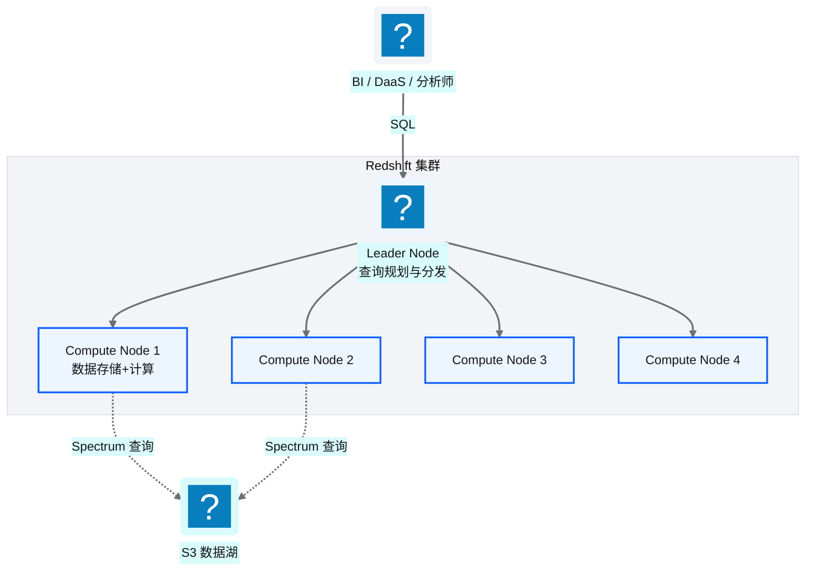
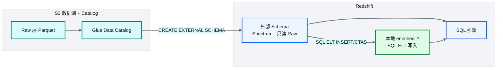
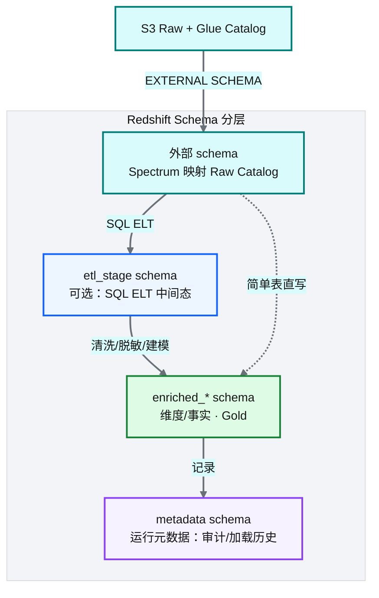
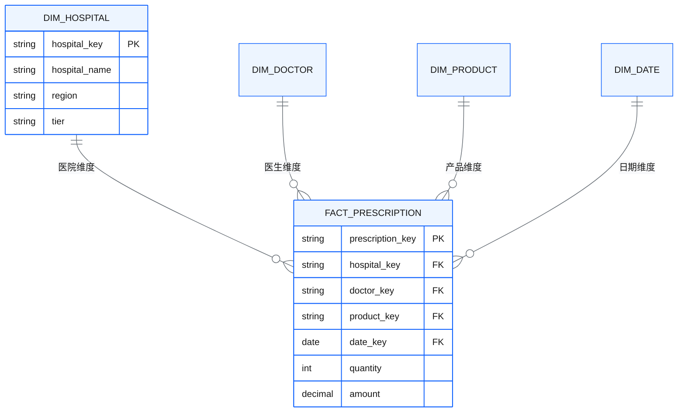
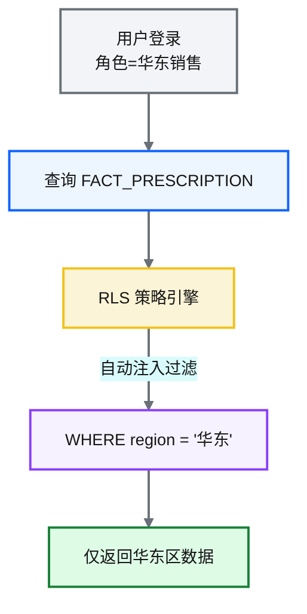
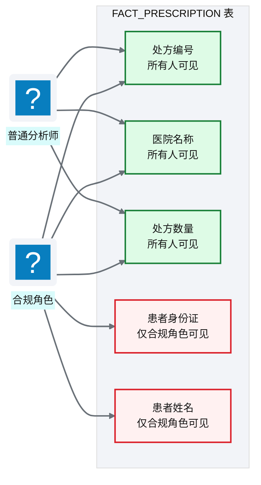
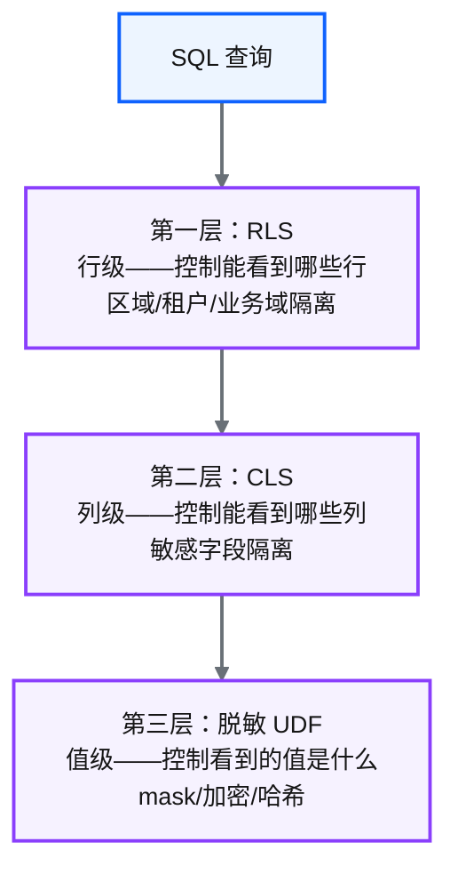

# Ch 8 数据仓库设计（Redshift）

!!! info "面包屑"
    [本书主页](./index.md) › [Part II 架构设计](./07-数据湖分层设计.md) › Ch 8

!!! abstract "项目第 0-2 年 · 架构设计期→核心建设期——数仓奠基与湖仓 ELT 演进"

---

## :material-school: 本章你将学到
- Redshift 集群架构，以及 Spectrum 外挂 Raw（Glue Catalog）作为主入仓读面
- 分层 schema：external → SQL ELT → `enriched_*`，COPY 降为特例
- Redshift 行级安全（RLS）与列级安全（CLS）策略——数据仓库的安全基石
- Redshift vs :simple-snowflake: Snowflake vs BigQuery 的工程取舍

---

数据湖解决了"存储"问题（[Ch 7](./07-数据湖分层设计.md)），但"分析查询"需要数据仓库。在数据湖上用 Athena 做 ad-hoc 查询可以，但 BI 报表的高频复杂查询、多表 join 和聚合计算，还是需要一个真正的列式 MPP 数据仓库。

选 Redshift 的过程在 [Ch 2](./02-从需求到蓝图：一个数据平台的诞生.md) 已经讲过：四年前 Snowflake 未入华，Redshift 是 AWS China 上唯一靠谱的云数仓选项。但"选了 Redshift"只是开始，怎么用好它才是真正的工程挑战，尤其是**如何把 Raw 数据湖接进仓内，而不在 S3 再物化一份 Enriched**。

我在企业征信项目里用过 :simple-postgresql: PostgreSQL 做数仓——能跑，但数据量到 TB 级后查询就慢得不可接受。PostgreSQL 是行式 OLTP 数据库，不适合大规模分析查询；Redshift 是列式 MPP（大规模并行处理）数据库，天然为分析场景设计。这个"行式 vs 列式"、"单机 vs MPP"的差别，是数仓设计的底层认知。

---

## 8.1 Redshift 集群架构与 Spectrum 外部表

### 集群架构

**图 8-1** 集群架构

Redshift 采用 **MPP（大规模并行处理）架构**：Leader Node 负责接收 SQL、生成执行计划并分发到 Compute Nodes；Compute Nodes 各自存储部分数据并并行执行。平台使用 RA3 节点类型——计算与存储分离架构，数据可缓存在本地 SSD，大量数据留在 S3。

选 RA3 而非 DC2，是我和企业征信教训对比后做的决策。企业征信时用 DC2（计算存储耦合）节点：数据全在本地 SSD，查询快，但扩容时要"加节点+重新分配数据"，停机维护半天。到 Aurora 我选 RA3（计算存储分离），数据主要在 S3，本地 SSD 只做缓存。**RA3 加节点时数据仍需重新分布到新的 slice 数量**（这点要诚实说，不是"零重分配"），但因 managed storage 架构（本地 SSD 缓存 + S3 持久层），重分布过程更透明：热数据保留在本地 SSD，冷数据按需从 S3 拉取，扩容可在分钟级完成且对查询影响较小。第二年业务域从 3 个涨到 6 个时，这点兑现了：有次 BI 查询高峰导致集群负载告警，我加了 2 个 RA3 节点，5 分钟生效，全程无停机；如果用 DC2，同样的扩容要停机半天重分配数据。计算存储分离换来的，是重分布更透明、扩容更平滑。

我早期写文档时也犯过一个概念错误：以为"RA3 与 Spectrum 天然配合、DC2 查 Spectrum 要跨存储层"。其实不准确。Spectrum 通过独立的 Spectrum 计算层（按工作组分配的 compute pool）扫描 S3，扫描结果回流到 Redshift 集群与本地表 join。这个扫描过程**与本地表存储层无关**。DC2 和 RA3 查 Spectrum 的路径一样，都是"独立计算层扫 S3 → 回流本地"。RA3 的真正优势是"本地表数据也在 S3 持久层"，这让**本地表扩容/恢复**更轻量，而不是"查 Spectrum 更快"。节点选型影响本地表的存储与扩容；Spectrum 路径对所有节点类型是一致的。

### Spectrum：从"冷数据旁路"到"主入仓读面"

Redshift Spectrum 让 Redshift 可以**直接查询 S3 数据湖中的数据**。第 0–1 年我只把它当"冷数据旁路"：高频表 COPY 入仓，低频表 Spectrum 探索。第 1–2 年砍掉 S3 Enriched 之后，Spectrum 升格为**主入仓路径的读面**：Glue Catalog 里的 Raw database 挂成 external schema，SQL ELT 从外挂表读、写入本地 `enriched_*`。

技术上就是官方那条路径：`CREATE EXTERNAL SCHEMA ... FROM DATA CATALOG`，把 Glue database 映射进来，集群与 S3 同 Region，IAM Role 授权扫桶。挂上之后，`SELECT` Raw 像查本地表一样，只是只读、按扫描计费。

**图 8-2** Spectrum：Raw Catalog 外挂与 SQL ELT 入仓

| 路径 | 数据位置 | 现行角色 |
|---|---|---|
| **Spectrum → SQL ELT → 本地表** | 读 S3 Raw，写 Redshift 内部 | **主入仓路径**（替代原 Enriched→COPY） |
| **本地表直查** | Redshift 内部存储 | BI/DaaS 高频查询、复杂 join |
| **Spectrum 只读探索** | S3 Raw（不入仓） | 低频归档、临时探查 |
| **COPY 入仓** | S3 → 本地表 | **特例**：跨账号桥接大文件等（见 [Ch 32](./32-跨账号批量同步-双桶桥接架构.md)） |

**表 8-1** Spectrum / SQL ELT / COPY 的现行分工

我当时意识到：如果 Gold 本来就要进 Redshift，再在 S3 写一份 Enriched Parquet 只为 COPY，等于用 Glue 和对象存储买了一层"中间真相"，而 Spectrum 已经能直接读 Raw。演进后的规则变成：**需要分析就绪的表，用 SQL 从 `ext_raw` 拉进 `enriched_*`；不必入仓的冷表，继续 Spectrum 按需查。** 二八定律还在，只是"入仓"从 COPY 换成了 SQL ELT。

但 Spectrum 有一个我在初期低估的坑：**它按扫描量计费**（约 $5/TB；按当时汇率，500GB ≈ $2.5 ≈ ¥18 量级）。有一次分析师写了个 `SELECT *` 查了张 500GB 的外部表，单次费用只有十几块。真正该警惕的是**无分区过滤的重复全表扫描**。主入仓路径也走 Spectrum 之后，这条护栏更硬：ELT SQL 必须带批次/分区谓词，BI 侧拦截全表扫描。Spectrum 按需查询很灵活，也很容易把账单打穿，必须有成本护栏（呼应 [附录 G FinOps](./appendix-G-FinOps成本治理.md)）。

!!! tip "引申"
    口语里有人把"去掉湖上第三跳"叫成"零 ETL"。本书说的是**湖仓一体 ELT / Spectrum 外挂**：少做一跳物化，不是 AWS Aurora MySQL→Redshift 那个 Zero-ETL 产品。前者是我们自己的架构演进；后者是托管复制管道，问题域不同。

!!! warning "Trade-off"
    SQL ELT 省掉了 S3 Enriched 与 Raw→Enriched 的 Glue 作业，编排和存储都更轻。代价是：复杂 join/重 UDF 会吃 Redshift 算力；Spectrum 扫描费用要盯紧；湖侧其他引擎不再有一份现成 Gold Parquet。若某域变换极重或要多引擎共享金层，仍可能局部回到 Glue 物化。我们把那当成例外，而不是默认。

---

## 8.2 模式设计：分层 schema 与 Kimball 维度建模

### Schema 分层

**图 8-3** Schema 分层（SQL ELT 主路径）

| Schema | 职责 | 谁写入 | 谁读取 |
|---|---|---|---|
| `metadata` | 运行元数据（审计/加载历史/DDL 变更） | ETL 框架自动 | 运维/排障/合规 |
| `etl_stage` | SQL ELT 可选暂存（复杂变换、原子切换） | ELT SQL | 下游加工步骤 |
| 外部 schema | Spectrum 映射 Raw（Glue Catalog） | Catalog（只读） | ELT / 探索查询 |
| `enriched_*` | 各业务域维度/事实（Gold） | ELT SQL | BI/DaaS/AI |

**表 8-2** Schema 分层

这四层 schema 的划分，是我在企业征信"单 schema 大杂烩"教训基础上设计的。企业征信时所有表都在一个 `public` schema 里：ETL 暂存表、维度事实表、审计日志表全混在一起。后果是 BI 工具连上来看到几百张表，分不清哪些是"分析就绪"哪些是"中间垃圾"。到 Aurora 我把 schema 分成四层，就是为了**让"表的状态"一目了然**：外部 schema 是"湖上 Raw，只读"，`etl_stage` 是"加工中，别碰"，`enriched_*` 是"加工完，可用"，`metadata` 是"元数据，运维用"。BI 工具只授权访问 `enriched_*`，从权限层杜绝了"误查暂存表或外挂明文"。

演进前后最大的变化：早期 `etl_stage` 吃的是 **S3 Enriched 的 COPY**；现行 `etl_stage`（可省略）吃的是 **external Raw 的 SQL 结果**。简单实体可以 `INSERT INTO enriched_sci.dim_hospital SELECT ... FROM ext_raw.hospital_master WHERE batch_id = ...` 直写；需要 staging + RENAME 原子切换的大表，才进 `etl_stage`（呼应 [Ch 34](./34-设计边界与已知取舍的诚实复盘.md) 的加载原子性讨论）。

`metadata` schema 单独列出是我特别想强调的设计。很多团队的数仓没有独立的元数据 schema，审计日志、加载历史、DDL 变更散落各处。到 Aurora 我把 `metadata` 作为一等 schema，ETL 框架自动记录每次加载的批次、行数、耗时、状态；后来在 GxP 审计时被评为"数据完整性可追溯性优秀"。元数据不是事后补的日志，是数仓的一等公民（M10）。

### Kimball 维度建模

`enriched_*` schema 内部采用 **Kimball 维度建模**：

**图 8-4** Kimball 维度建模

| 表类型 | 作用 | 特征 |
|---|---|---|
| **维度表（Dimension）** | 描述业务实体 | 宽表、变化慢、用于过滤和分组 |
| **事实表（Fact）** | 记录业务事件 | 窄表、增长快、包含度量值和外键 |

**表 8-3** Kimball 维度建模

选 Kimball 而非 Data Vault 或 Inmon，是我在项目第一周和团队争论后拍板的。Data Vault 的拥护者认为它"更适合大规模集成、变更管理好"——这理论上成立，但有个代价：Data Vault 的查询性能差，需要在上面再建一层星型模型供 BI 查询——等于建了两层模型（Vault + Mart），工作量翻倍。对于 Aurora 这个规模（20000+ 表但分析查询为主），Kimball 的"一层星型模型直接服务 BI"更务实——建模成本是 Data Vault 的一半，查询性能更好。

但我要诚实地说 Kimball 的痛点——**SCD（缓慢变化维）管理**。医院的级别从"三甲"变成"三甲+专科"时，是覆盖旧值（SCD1）还是保留历史（SCD2）？SCD2 要加 `effective_from/effective_to` 字段，维度表行数膨胀，BI 查询要带时间条件——复杂度不低。我在第一年低估了这个复杂度，导致第二年初医院维度改了三次级别，SCD2 逻辑写错了，报表"历史某时间点的医院级别"全错。花了三天修。**Kimball 的代价不在"建模型"，而在"管变化"**——如果数据域维度变化频繁，SCD 管理成本会吃掉 Kimball 的性能优势。这是选型时要权衡的。

!!! warning "Trade-off"
    Kimball 维度建模是数据仓库的经典方法论，优势是查询性能好、业务理解直观。代价是维度变更管理复杂（SCD 类型 1/2/3 的选择）和建模成本高。另一种选择是 Data Vault——更适合大规模集成但查询性能差，需要再建一层星型模型供查询。对于以分析查询为主的场景，Kimball 仍是务实选择——但要做好 SCD 管理的心理准备。

---

## 8.3 Redshift 行级安全（RLS）与列级安全（CLS）策略

这是数据仓库安全设计的核心。Redshift 提供两种细粒度安全策略，平台将其作为数据治理的基石。

!!! tip "引申：数据库安全的发展脉络"
    数据库安全经历了从粗到细的演进：最早只有"库级权限"（能/不能访问这个库）→ "表级权限"（能/不能访问这张表）→ "行级安全 RLS"（能访问表，但只看到特定行）→ "列级安全 CLS"（能访问行，但特定列不可见）→ "单元格级安全"（行×列交叉控制）。每一代都在前一代基础上增加粒度。Redshift 同时支持 RLS 和 CLS，这让平台能在不改变查询 SQL 的前提下实现细粒度数据隔离——用户写 `SELECT * FROM fact_prescription`，RLS 自动加 `WHERE region='华东'`，CLS 自动隐藏 `patient_id_card` 列。用户无感，但数据安全了。这种"声明式安全"是现代数仓区别于传统数仓的重要能力。

### RLS（Row-Level Security）：行级安全

RLS 控制**谁能看到哪些行**。例如：华东区销售只能看到华东区的处方数据。

**图 8-5** RLS（Row-Level Security）：行级安全

RLS 策略绑定到角色（Role），查询时**自动注入行级过滤条件**，用户无需（也无法）手动绕过。

选 RLS 而非"应用层过滤"，是我在企业征信教训基础上做的决策。企业征信时数据隔离靠应用层——BI 工具查询时拼接 `WHERE region=?`，参数由应用传入。问题有三个：一是**不可靠**——开发者忘了拼 WHERE，或拼错了，数据就泄露了；二是**难审计**——安全审计员要检查"每个查询是否正确过滤"，但过滤逻辑散落在各应用里，没法统一审计；三是**重复**——每个应用都要实现一遍过滤逻辑，维护成本高。到 Aurora 我选 RLS——过滤逻辑绑定在数据库层，应用层只管发 `SELECT *`，数据库自动注入过滤。**安全责任从"每个应用开发者"收敛到"数据库管理员"**——一处配置，全局生效，可审计。

RLS 还有一个我在第四年才意识到的战略价值——**它是 Agentic BI 的安全基石**。当 AI Agent 代用户查询数仓时（见 [Ch 46 数据平面与 CDP 整合](./46-数据平面与CDP整合.md)），Agent 用的数据库角色继承用户的 RLS 策略——华东用户的 Agent 只能查华东数据，即使 Agent 的 SQL 没带区域过滤，RLS 也会兜底。如果当时选了应用层过滤，Agent 时代就要重新给每条 SQL 拼过滤——而 RLS 让"安全策略"与"查询方式"解耦，AI 来了也不用改。**好的安全设计是面向未来的——它不预测未来用什么查询，但保证任何查询都安全**（M10 合规嵌入的长期回报）。

**典型应用**：

| 场景 | RLS 策略 |
|---|---|
| 区域隔离 | 华东销售只能看华东数据 |
| 业务域隔离 | SCI 团队只能看 SCI 域数据 |
| 租户隔离（AI 场景） | 不同租户的 Agent 只能查自己租户的数据 |

**表 8-4** RLS（Row-Level Security）：行级安全

### CLS（Column-Level Security）：列级安全

CLS 控制**谁能看到哪些列**。例如：普通分析师能看到处方数量但不能看到患者身份证号。

**图 8-6** CLS（Column-Level Security）：列级安全

CLS 通过列级 GRANT 实现：对敏感列只授予特定角色，其他角色查询时会报权限错误（或看不到该列）。

CLS 的设计驱动力是 PIPL 的"最小必要"原则——分析师查处方数据时，需要看"处方数量、医院、产品"来做销售分析，但**不需要**看"患者身份证、患者姓名"。如果用视图（View）实现，要为每个角色建一个视图，视图数量爆炸（N 个表 × M 个角色 = N×M 个视图）。CLS 让我直接在表上做列级 GRANT——一个角色一个 GRANT 语句，不用建视图。**CLS 是"声明式"的，视图是"命令式"的**——声明式更简洁、更不容易出错。

我在第一年用 CLS 时踩过一个坑——**`SELECT *` 的行为**。普通分析师跑 `SELECT * FROM fact_prescription` 时，因为 `patient_id_card` 列没授权，Redshift 会报权限错误而不是"自动跳过该列"。这导致 BI 工具的 `SELECT *` 查询全挂。解决方案是改 BI 工具的查询为显式列名（`SELECT prescription_id, hospital_name, quantity FROM ...`），只查授权的列。这个调整花了一周——但长期收益是 BI 查询更规范了，不再有 `SELECT *` 的坏习惯。**CLS 倒逼了查询规范化**——这是个意外但正向的副作用。

我自己早期写文档时也把两件事搅在一起了：**列级 GRANT 报权限错误**，和真正的 **CLS（Dynamic Data Masking，2023 年 GA）**。前面讲的"无权限列查询报错"其实是列级 GRANT：解析阶段发现用户对某列没权限，直接拒绝整个查询。非黑即白，要么看到完整列，要么查询失败。Dynamic Data Masking 则是另一回事：用户可以"看到"该列，但返回的是 mask 后的值，比如合规角色看到完整身份证号、分析师看到 `330***********1234`、其他角色看到 `******`。差别在于查询是否成功返回：GRANT 是"无权限则报错"，Masking 是"返回脱敏值"。Aurora 两套并用：极敏感列（患者身份证号原值）用列级 GRANT 严格拒绝（只有合规角色），需要"分级可见但脱敏"的列（医生姓名对外展示）用 Dynamic Data Masking。别把"列级 GRANT 报错"等同于 CLS；前者是权限，后者是脱敏。

### RLS + CLS + 脱敏的协同分层

平台构建了**三层纵深防御**：

**图 8-7** RLS + CLS + 脱敏的协同分层

| 层 | 粒度 | 防护对象 | 详见 |
|---|---|---|---|
| RLS | 行 | 防止跨区域/租户数据泄露 | 本章 |
| CLS | 列 | 防止敏感字段被未授权访问 | 本章 |
| 脱敏 UDF | 值 | 即使看到字段，值也是脱敏后的 | [Ch 18](./18-数据脱敏与隐私治理.md) |

**表 8-5** RLS + CLS + 脱敏的协同分层

!!! tip "引申"
    三层防护的关系是"纵深防御"（Defense in Depth）——即使某一层被绕过，其他层仍能兜底。比如 RLS 配置错了导致跨区域可见，CLS 仍能阻止敏感列被访问；CLS 漏配了某列，脱敏 UDF 仍能让值不可读。这是安全架构的核心原则：**不依赖单一防线**。

---

## 8.4 引申：Redshift vs Snowflake vs BigQuery 的工程取舍

| 维度 | Redshift | Snowflake | BigQuery |
|---|---|---|---|
| **架构** | MPP（计算存储分离 RA3） | 原生云数仓（多集群共享存储） | Serverless（无集群概念） |
| **计费** | 按节点小时 | 按仓库大小+使用时长 | 按查询扫描量 |
| **扩展** | 弹性集群（增减节点） | 多虚拟仓库独立扩展 | 自动弹性 |
| **数据湖集成** | Spectrum（外部表） | 外部表 + 原生 :material-database-sync: Iceberg | 外部表 + BigLake |
| **半结构化** | SUPER 类型 | VARIANT 类型（原生） | STRUCT/ARRAY（原生） |
| **RLS/CLS** | ✅ 原生支持 | ✅ 原生支持 | ✅ 原生支持 |
| **中国可用性** | ✅（AWS China） | ✅（2024-09 宁夏区 GA¹） | ❌（GCP China 有限） |
| **运维负担** | 中（需管集群） | 低（高度托管） | 最低（Serverless） |

**表 8-6** 引申：Redshift vs Snowflake vs BigQuery 的工程取舍

!!! note "Snowflake 入华说明"
    ¹ Snowflake 于 2024-09-01 在 AWS 宁夏区（cn-northwest-1）GA，由神州数码 DCC 运营，独立域名 `snowflakecomputing.cn`，需经 DCC 开户（非自助）、部分功能受限、与全球区账户不互通。它**不是** AWS China（北京/宁夏由西云/宁夏西云运营）上的原生服务。Databricks 截至 2026 年仍无 AWS China 商用 region（仅阿里云有 Databricks）。口径与 [Ch 2](./02-从需求到蓝图：一个数据平台的诞生.md) 表 2-3 一致。

!!! warning "Trade-off"
    四年前选 Redshift 的核心原因是"AWS China 可用 + 与 S3/Glue 生态集成"。如果今天选，Snowflake 在托管体验和半结构化数据处理上更优，且已在宁夏区商用——但入华路径是 DCC 独立运营，不是"同一套 AWS China 账单里勾选 Snowflake"。Redshift 的优势仍是与 AWS 生态深度集成（Spectrum/IAM/Glue 原生协作）+ 成本可控（按节点而非按查询）。两者都是合理选择，取决于团队偏好和生态锁定容忍度。

---

## :material-check-circle: 本章小结
- Redshift 采用 MPP 架构，RA3 节点实现计算存储分离；Spectrum 外挂 Raw Catalog 是主入仓读面
- 主路径：external schema → SQL ELT → `enriched_*`；COPY 降为跨账号等特例
- Schema 分四层：metadata / etl_stage（可选）/ 外部 schema（Raw）/ enriched_*（Gold）
- `enriched_*` 采用 Kimball 维度建模；安全基石：RLS + CLS + 脱敏 UDF 三层纵深防御
- Redshift vs Snowflake vs BigQuery：四年前选 Redshift 是 AWS China 生态约束下的务实选择

---

!!! quote "下一章"
    [Ch 9 计算与 ETL 设计（Glue + Lambda）](./09-计算与ETL设计-Glue与Lambda.md) —— 仓库设计好了，数据怎么加工？接下来看 Glue 如何收缩为 Landing→Raw，以及入仓如何交给 Redshift Data API 跑 SQL ELT。

