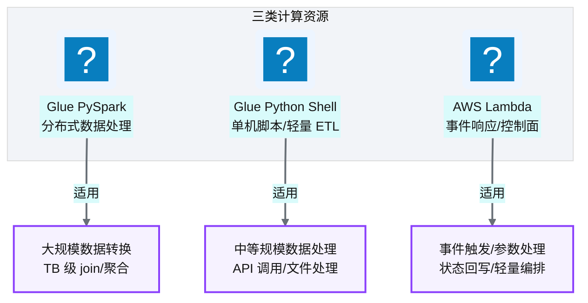
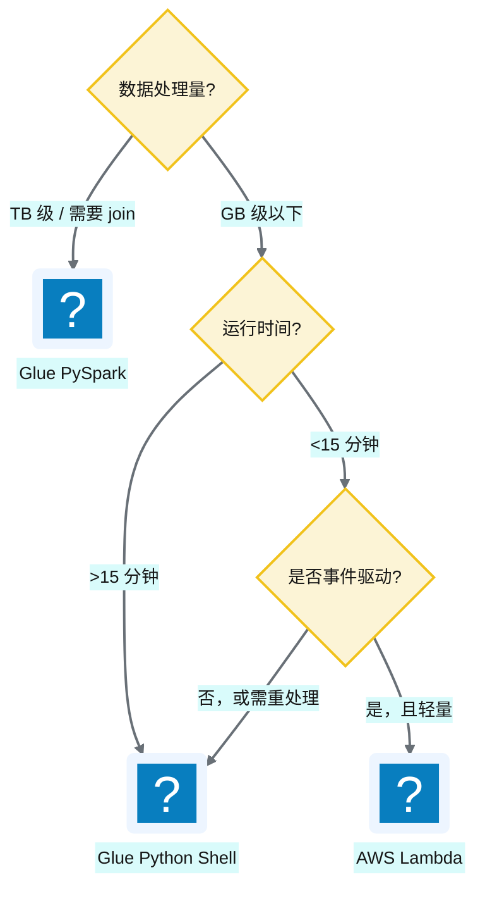
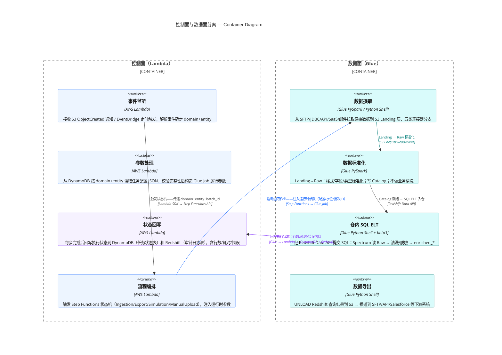
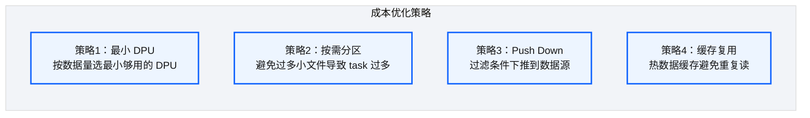

# Ch 9 计算与 ETL 设计（Glue + Lambda）

!!! info "面包屑"
    [本书主页](./index.md) › [Part II 架构设计](./08-数据仓库设计-Redshift.md) › Ch 9

!!! abstract "项目第 0-1 年 · 架构设计期→核心建设期——计算层选型"

---

## :material-school: 本章你将学到
- 计算层选型：Glue :simple-apachespark: PySpark vs :simple-python: Python Shell vs Lambda 的适用边界
- 控制面（Lambda）与数据面（Glue）的职责切分原则
- Spark on Glue 的成本与性能权衡

---

## 9.1 计算选型：Glue PySpark vs Python Shell vs Lambda

数据湖（[Ch 7](./07-数据湖分层设计.md)）和数仓（[Ch 8](./08-数据仓库设计-Redshift.md)）解决了"数据存哪"的问题，但"数据怎么加工"需要计算资源。AWS 提供了好几种计算选项——Glue PySpark、Glue Python Shell、Lambda、EMR——选哪个、怎么组合，是这一章的核心问题。

我在企业征信项目里踩过计算选型的坑：当时所有 ETL 都跑在自建 Spark 集群上，无论任务大小都启动一个 Spark Application。小任务（几百行数据）的启动开销（30-60 秒分配资源+初始化）比实际处理时间还长，资源浪费严重。到了 Aurora，我吸取教训：**不是所有数据处理都需要 Spark——按数据量和任务复杂度选最小够用的计算资源。** 这就是"控制面（Lambda）与数据面（Glue）分离"设计的起点。

平台有三类计算资源，各司其职：

**图 9-1** 计算选型：Glue PySpark vs Python Shell...

| 计算资源 | 运行模式 | 适合场景 | 不适合场景 |
|---|---|---|---|
| **Glue PySpark** | 分布式 Spark | 大规模数据转换、跨源 join、聚合 | 轻量任务（启动开销大） |
| **Glue Python Shell** | 单机 Python | 中等数据量（<GB 级）、API 调用、文件处理 | 大规模分布式处理 |
| **AWS Lambda** | 无服务器函数 | 事件响应（<15 分钟）、参数处理、状态回写 | 长时间运行、超大内存（上限 10GB） |

**表 9-1** 计算选型：Glue PySpark vs Python Shell vs Lambda

!!! note "Glue 版本口径"
    Glue 2.0 已于 2024-01-31 结束支持，并将于 2026-04-01 EOL。本书计算层统一按 **Glue 4.0+**（Spark 3.3 / Python 3.10，原生 Iceberg）叙述；新作业应直接用 4.0 或 5.0，不要再开 2.0 作业。Lambda 内存上限自 2020 年底起为 **10GB**（早期文档常写 3GB，已过时）。

### 选型决策树

**图 9-2** 选型决策树

!!! warning "Trade-off"
    Glue PySpark 的启动开销约 30-60 秒（分配资源+初始化 Spark），对于小任务这是显著浪费。但它的分布式能力在大数据量下不可替代。我们的原则是：**能用 Python Shell 解决的不用 PySpark，能用 Lambda 解决的不用 Python Shell**——选最小够用的计算资源。

这个决策树不是理论模型，是我在项目第一月被一个"杀鸡用牛刀"的案例逼出来的。当时有个 ETL 任务是从 API 拉几百行配置数据写入 DynamoDB——数据量 KB 级，处理时间不到 1 秒。但开发者习惯性地用 Glue PySpark 跑——结果 Spark 启动花了 40 秒，实际处理 1 秒，总耗时 41 秒，其中 97% 是启动开销。更荒唐的是这个任务每小时跑一次，一天浪费 24 × 40 秒 = 16 分钟的 DPU 计费。我把它改成 Lambda 后，总耗时降到 2 秒（含冷启动），成本降了 95%。这个案例让我定了一条铁律：**选计算资源的第一标准不是"能不能跑"，而是"启动开销占比是否合理"**——如果启动开销超过实际处理时间的 50%，说明选错了资源。

决策树里还有一个我在第二年才补的分支——"否，或需重处理 → Python Shell"。这个分支处理的是"定时批量任务"（非事件驱动，但需重跑）。最初我把这类任务也放 Lambda，结果遇到"重跑三天前数据"时 Lambda 的 15 分钟超时成了瓶颈。改用 Python Shell 后，重跑不受超时限制，还能复用 Glue 的开发端点调试。**选型时要考虑"正常跑"和"重处理"两种场景**——正常跑用最轻量资源，重处理要有足够弹性。

---

## 9.2 控制面（Lambda）与数据面（Glue）的职责切分

平台计算架构里，我把"控制逻辑"和"数据处理"拆到不同的计算资源。与 [Ch 7](./07-数据湖分层设计.md)/[Ch 8](./08-数据仓库设计-Redshift.md) 的分层演进同步，数据面也收缩了：Glue 不再跑 Raw→Enriched 的 Spark 金层，业务变换下推到 Redshift SQL ELT。

**图 9-3** 控制面（Lambda）与数据面（Glue）的职责切分

| 维度 | 控制面（Lambda） | 数据面（Glue） |
|---|---|---|
| **职责** | 触发、参数、状态、编排 | 数据搬运和转换 |
| **运行时间** | 秒级到分钟级 | 分钟级到小时级 |
| **资源** | 小（128MB-10GB，2023 年起 Lambda 内存上限提升至 10GB） | 大（可分配数十 DPU） |
| **触发方式** | 事件驱动（S3/EventBridge） | 被 Step Functions 调用 |
| **计费** | 按请求次数+时长 | 按 DPU 秒 |

**表 9-2** 控制面（Lambda）与数据面（Glue）的职责切分

### 为什么要分离

控制面与数据面分离的决策，不是我从理论上推导的，而是企业征信项目的反面教训逼出来的。企业征信时，控制逻辑（触发、参数、状态）和数据处理（ETL）全混在 Spark Application 里：一个 ETL 脚本既做数据转换，又做状态回写，还做错误重试。后果很具体。数据处理 OOM 时，整个 Application 崩了，控制逻辑也跟着崩。控制要高频低耗，数据要低频高耗，混在一起没法分别扩展。安全边界也糊了，只能给"全权限"。到 Aurora 我把两者彻底分离：Lambda 只管控制（不碰数据），Glue 只管数据（不做编排）。

分层演进后又加了一条：**业务清洗/脱敏/代理键尽量不在 Glue Spark 里做第二遍物化**。第 0–1 年数据面是 Landing→Raw→Enriched→COPY；现行是 Landing→Raw（Glue）+ SQL ELT 入仓（Data API）。我当时算过一笔账：上千张表的 Raw→Enriched 作业队列经常堵，DPU 账单里有一大块是"把马上要 COPY 进仓的数据再写一遍 S3"。把变换下推到 Redshift 之后，Glue 槽位和 S3 写入都瘦了一圈。代价是复杂跨源 join 可能更吃集群；那时仍可开特例 Glue PySpark，但默认路径是 SQL。

第四年才真正体会到这套分离的好处：它成了 Agentic BI 的安全边界。当 AI Agent 代用户操作数据平台时（见 [Ch 42 Agent 编排](./42-Agent编排-LangGraph与状态机.md)），Agent 调用的是控制面 Lambda（触发任务、查状态），而不是直接调数据面 Glue。Lambda 层可以做"Agent 权限校验+操作审计"，Glue/ELT 层只接受合法触发。**Agent 永远不直接碰数据**（M6 治理与执行分离）。

!!! tip "引申"
    控制面与数据面分离是分布式系统的经典原则（类似 Kubernetes 的控制平面与数据平面）。好处是：
    1. **故障隔离**：数据面 Glue 挂了不影响控制面 Lambda 继续监听事件
    2. **独立扩展**：控制面高频低耗，数据面低频高耗，扩展策略不同
    3. **成本优化**：Lambda 按请求计费（空闲免费），Glue 按运行时长计费；SQL ELT 进一步减少不必要的 DPU
    4. **职责清晰**：Lambda 不碰数据，Glue 不做编排；仓内变换用 SQL，湖上只做标准化

!!! warning "Trade-off"
    业务变换下推 Redshift 后，Glue 更轻，但 Redshift 成了变换瓶颈点。若某域日增 TB 级且 join 极重，把变换塞进仓内可能拖垮 BI 查询窗口。那时应把该域的重变换留在 Glue（甚至局部物化），而不是教条地"一切 SQL"。规模决定架构（M11）：默认 SQL ELT，例外按指标开闸。
---

## 9.3 引申：Spark on Glue 的成本与性能权衡

### 成本模型

Glue 按 **DPU（Data Processing Unit）· 秒** 计费。一个 ETL 作业的成本 = `DPU 数量 × 运行时长 × 单价`。

**图 9-4** 成本模型

图里的四个策略不是理论推演，是我在第一年做 FinOps 时逐个验证的。最有效的是策略 1（最小 DPU）——最初所有 Glue job 默认配 10 DPU "以防万一"，我跑了一个月的 CloudWatch 指标分析，发现 80% 的 job executor 内存利用率从没超过 30%——明显过度配置。我把这些 job 降到 2-5 DPU，月成本降了约 40%，性能基本没受影响（因为它们本来就没用满并行度）。**"以防万一"是成本优化的最大敌人**——应该从最小配置开始，靠指标往上加，而不是从大配置开始"以防万一"。

策略 2（按需分区）和策略 4（缓存复用）是我在第二个月调优时发现的"隐藏杀手"。有个 ETL job 处理一个分区表，但开发者在 `spark.read.parquet(path)` 时没传分区过滤——Spark 扫了全量 500GB 数据，而实际只需要当天的 5GB。加上 `.option("basePath", ...)` 做分区下推后，扫描量降了 99%，运行时间从 20 分钟降到 2 分钟。**分区不过滤等于没分区**——这是 Spark on S3 最常见的性能陷阱。

### 性能权衡

| 策略 | 成本影响 | 性能影响 |
|---|---|---|
| 增加 DPU | 💰 成本上升 | ⚡ 更快（更多并行度） |
| 减少 DPU | 💰 成本下降 | 🐢 更慢（并行度不足） |
| 用 Python Shell 替代 PySpark | 💰 成本下降（无 Spark 开销） | ⚡ 小数据更快（无启动开销） |
| 数据分区合理 | 💰 成本下降（只扫必要分区） | ⚡ 更快（减少扫描量） |

**表 9-3** 性能权衡

这张表里的每一行权衡，我都用真实案例验证过。最典型的是"DPU 增减"——有个跨源 join 的 ETL 最初配 5 DPU，跑了 45 分钟。我以为加 DPU 能加速，加到 10 DPU——结果只快了 5 分钟（40 分钟）。原因是这个 job 的瓶颈不是并行度，而是"Redshift COPY 的网络 IO"——加 DPU 解决不了网络瓶颈。这个案例让我学到：**调优前先找瓶颈**——CPU 瓶颈加 DPU 有用，IO 瓶颈加 DPU 无用。后来我定了一个调优流程：先看 CloudWatch 的 `executor.cpuUtilization` 和 `shuffle.readBytes`——CPU 高加 DPU，shuffle 大优化 join 策略，IO 高换存储层。

"用 Python Shell 替代 PySpark"这一行是我在第一年省得最多的优化。有个 ETL 任务从 SFTP 拉一个 200MB 的 CSV，做简单字段映射后写 Redshift——用 PySpark 跑 8 分钟（含 40 秒启动），改用 Python Shell + pandas 后跑 90 秒（无启动开销）。对 GB 级以下的数据，Python Shell 几乎总是比 PySpark 快——因为 Spark 的分布式协调开销在小数据量下是纯负担。**Spark 的价值在"大"，小数据用它是负担**——这条规律我在企业征信时就懂了，到 Aurora 把它变成了选型铁律。

!!! warning "Trade-off"
    Spark on Glue 最大的成本陷阱是"过度配置 DPU"——很多团队习惯性地分配 10+ DPU"以防万一"，但大部分 ETL 任务用 2-5 DPU 就够了。建议从最小配置开始，基于 CloudWatch 指标（executor 内存利用率、task 耗时）逐步调优。另一个陷阱是"小文件问题"——S3 上大量小文件会导致 Spark 产生海量 task，极度浪费。需要在写入时做文件合并。我在第一年踩过这个小文件坑——有个 job 写了 12000 个 1KB 的小文件，Spark 读了它产生了 12000 个 task，光 task 调度就花了 10 分钟。加了 `coalesce(1)` 合并后降到 1 个文件，读取 30 秒。**小文件是 Spark 的天敌，写入时必须合并**。

---

## :material-check-circle: 本章小结
- 三类计算资源：Glue PySpark / Python Shell / Lambda——选最小够用的
- 控制面（Lambda）与数据面（Glue）分离；数据面现行主路径为 Landing→Raw + Data API SQL ELT（不再默认 Raw→Enriched→COPY）
- Glue 成本 = DPU × 时长；业务变换下推 Redshift 可进一步省 DPU，但要注意仓内算力瓶颈
- 最常见的成本陷阱：过度配置 DPU 和小文件问题

---

!!! quote "下一章"
    [Ch 10 编排与调度设计（Step Functions + EventBridge）](./10-编排与调度设计-StepFunctions与EventBridge.md) —— 计算资源选好了，怎么把它们串成有状态的流程？接下来看编排层如何从四步金层演进为三步 SQL ELT。

