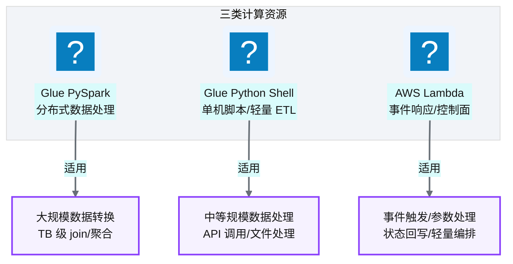
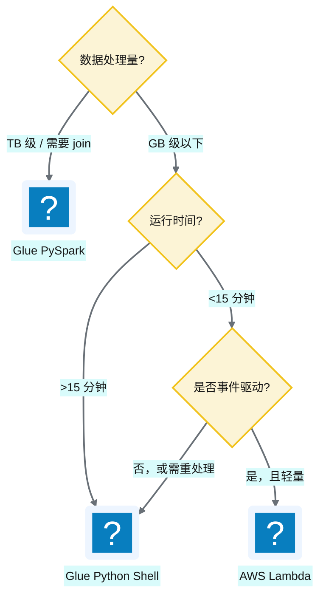
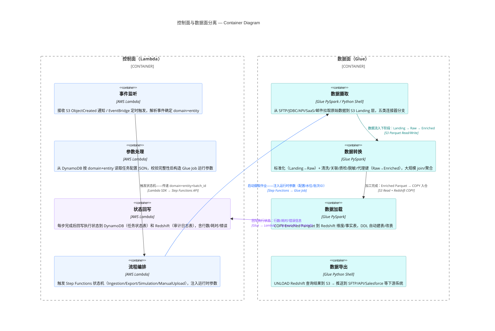
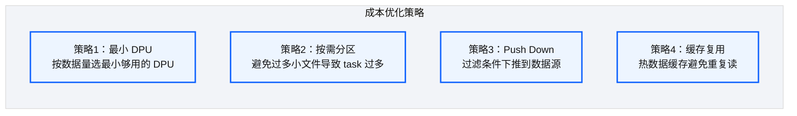

# Ch 9 计算与 ETL 设计（Glue + Lambda）

!!! info "面包屑"
    [本书主页](./index.md) › [Part II 架构设计](./08-数据仓库设计-Redshift.md) › Ch 9

!!! abstract "项目第 0-1 年 · 架构设计期→核心建设期——计算层选型"

---

## :material-school: 本章你将学到
- 计算层选型：Glue :simple-apachespark: PySpark vs :simple-python: Python Shell vs Lambda 的适用边界
- 控制面（Lambda）与数据面（Glue）的职责切分原则
- Spark on Glue 的成本与性能权衡

---

## 9.1 计算选型：Glue PySpark vs Python Shell vs Lambda

数据湖（[Ch 7](./07-数据湖分层设计.md)）和数仓（[Ch 8](./08-数据仓库设计-Redshift.md)）解决了"数据存哪"的问题，但"数据怎么加工"需要计算资源。AWS 提供了好几种计算选项——Glue PySpark、Glue Python Shell、Lambda、EMR——选哪个、怎么组合，是这一章的核心问题。

我在企业征信项目里踩过计算选型的坑：当时所有 ETL 都跑在自建 Spark 集群上，无论任务大小都启动一个 Spark Application。小任务（几百行数据）的启动开销（30-60 秒分配资源+初始化）比实际处理时间还长，资源浪费严重。到了 Aurora，我吸取教训：**不是所有数据处理都需要 Spark——按数据量和任务复杂度选最小够用的计算资源。** 这就是"控制面（Lambda）与数据面（Glue）分离"设计的起点。

平台有三类计算资源，各司其职：

**图 9-1** 计算选型：Glue PySpark vs Python Shell...

| 计算资源 | 运行模式 | 适合场景 | 不适合场景 |
|---|---|---|---|
| **Glue PySpark** | 分布式 Spark | 大规模数据转换、跨源 join、聚合 | 轻量任务（启动开销大） |
| **Glue Python Shell** | 单机 Python | 中等数据量（<GB 级）、API 调用、文件处理 | 大规模分布式处理 |
| **AWS Lambda** | 无服务器函数 | 事件响应（<15 分钟）、参数处理、状态回写 | 长时间运行、大内存 |

**表 9-1** 计算选型：Glue PySpark vs Python Shell vs Lambda

### 选型决策树

**图 9-2** 选型决策树

!!! warning "Trade-off"
    Glue PySpark 的启动开销约 30-60 秒（分配资源+初始化 Spark），对于小任务这是显著浪费。但它的分布式能力在大数据量下不可替代。我们的原则是：**能用 Python Shell 解决的不用 PySpark，能用 Lambda 解决的不用 Python Shell**——选最小够用的计算资源。

---

## 9.2 控制面（Lambda）与数据面（Glue）的职责切分

这是平台计算架构的**核心设计决策**：把"控制逻辑"和"数据处理"分离到不同的计算资源。

**图 9-3** 控制面（Lambda）与数据面（Glue）的职责切分

| 维度 | 控制面（Lambda） | 数据面（Glue） |
|---|---|---|
| **职责** | 触发、参数、状态、编排 | 数据搬运和转换 |
| **运行时间** | 秒级到分钟级 | 分钟级到小时级 |
| **资源** | 小（128MB-3GB） | 大（可分配数十 DPU） |
| **触发方式** | 事件驱动（S3/EventBridge） | 被 Step Functions 调用 |
| **计费** | 按请求次数+时长 | 按 DPU 秒 |

**表 9-2** 控制面（Lambda）与数据面（Glue）的职责切分

### 为什么要分离

!!! tip "引申"
    控制面与数据面分离是分布式系统的经典原则（类似 Kubernetes 的控制平面与数据平面）。好处是：
    1. **故障隔离**：数据面 Glue 挂了不影响控制面 Lambda 继续监听事件
    2. **独立扩展**：控制面高频低耗，数据面低频高耗，扩展策略不同
    3. **成本优化**：Lambda 按请求计费（空闲免费），Glue 按运行时长计费（空闲不跑就不花钱）
    4. **职责清晰**：Lambda 不碰数据（安全边界明确），Glue 不做编排（单一职责）

---

## 9.3 引申：Spark on Glue 的成本与性能权衡

### 成本模型

Glue 按 **DPU（Data Processing Unit）· 秒** 计费。一个 ETL 作业的成本 = `DPU 数量 × 运行时长 × 单价`。

**图 9-4** 成本模型

### 性能权衡

| 策略 | 成本影响 | 性能影响 |
|---|---|---|
| 增加 DPU | 💰 成本上升 | ⚡ 更快（更多并行度） |
| 减少 DPU | 💰 成本下降 | 🐢 更慢（并行度不足） |
| 用 Python Shell 替代 PySpark | 💰 成本下降（无 Spark 开销） | ⚡ 小数据更快（无启动开销） |
| 数据分区合理 | 💰 成本下降（只扫必要分区） | ⚡ 更快（减少扫描量） |

**表 9-3** 性能权衡

!!! warning "Trade-off"
    Spark on Glue 最大的成本陷阱是"过度配置 DPU"——很多团队习惯性地分配 10+ DPU"以防万一"，但大部分 ETL 任务用 2-5 DPU 就够了。建议从最小配置开始，基于 CloudWatch 指标（executor 内存利用率、task 耗时）逐步调优。另一个陷阱是"小文件问题"——S3 上大量小文件会导致 Spark 产生海量 task，极度浪费。需要在写入时做文件合并。

---

## :material-check-circle: 本章小结
- 三类计算资源：Glue PySpark（大规模分布式）/ Python Shell（中等单机）/ Lambda（事件驱动轻量）——选最小够用的
- 核心设计决策：控制面（Lambda）与数据面（Glue）分离——故障隔离、独立扩展、成本优化、职责清晰
- Glue 成本 = DPU × 时长，优化策略：最小 DPU、合理分区、Push Down、避免小文件
- 最常见的成本陷阱：过度配置 DPU 和小文件问题

---

!!! quote "下一章"
    [Ch 10 编排与调度设计（Step Functions + EventBridge）](./10-编排与调度设计-StepFunctions与EventBridge.md) —— 计算资源选好了，怎么把它们串成有状态的流程？接下来看编排层。

