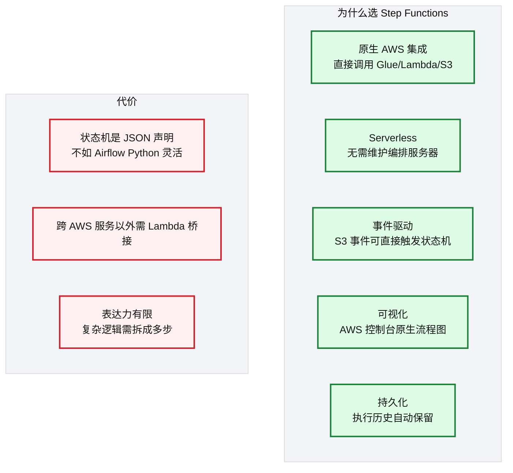
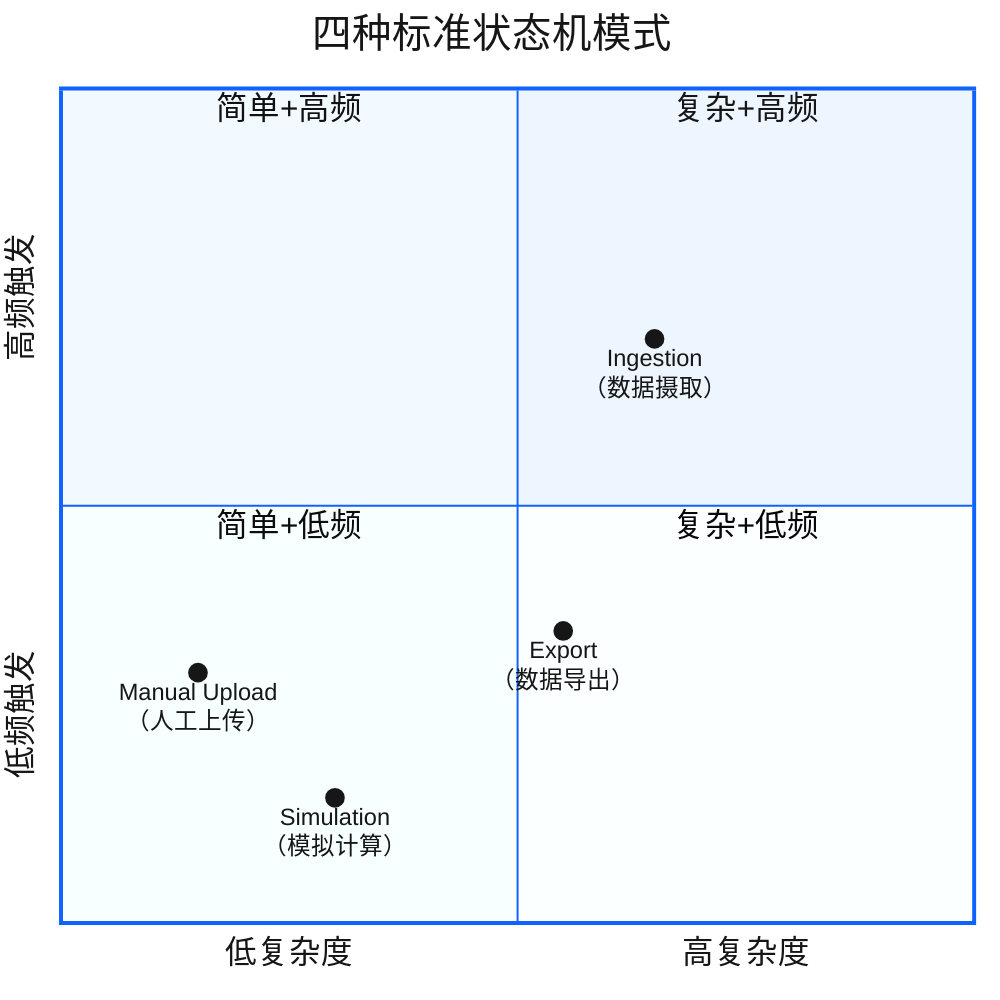
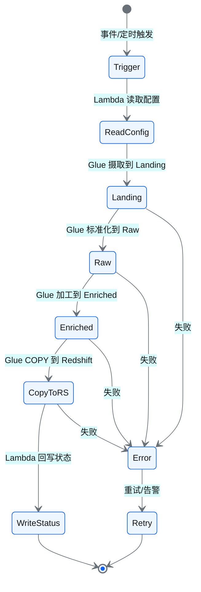
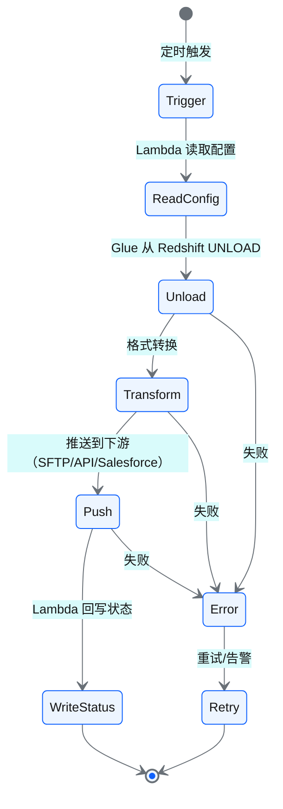
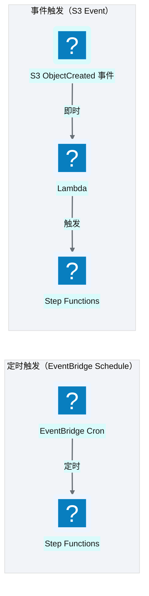
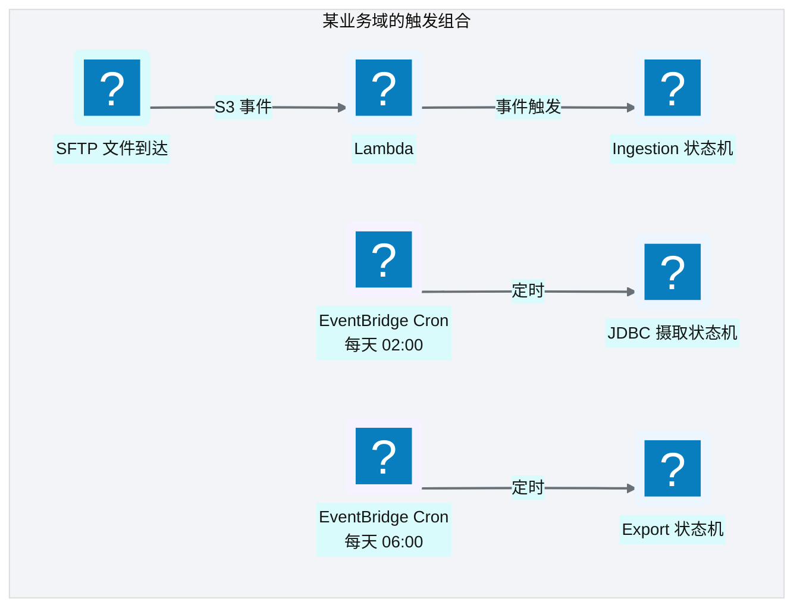

# Ch 10 编排与调度设计（Step Functions + EventBridge）

!!! info "面包屑"
    [本书主页](./index.md) › [Part II 架构设计](./09-计算与ETL设计-Glue与Lambda.md) › Ch 10

!!! abstract "项目第 0-1 年 · 架构设计期→核心建设期——编排引擎选型"

---

## :material-school: 本章你将学到

- 为什么选 Step Functions 而非 Airflow 作为编排引擎
- 四种状态机模式：ingestion / export / simulation / manual-upload
- EventBridge 定时调度与 S3 事件触发的组合策略
- Step Functions vs Airflow vs Dagster 的编排哲学对比

---

编排引擎是数据平台的"神经系统"——它决定"哪个任务先跑、哪个后跑、失败了怎么办"。这个决策在项目第 0 年引发了最激烈的争论。

Aurora 的数据工程团队里有几个人之前用过 Airflow，强烈建议"用 Airflow，社区成熟、:simple-python: Python 灵活、DAG 好写"。我理解他们的偏好——Airflow 确实是当时数据工程领域的事实标准。但我的顾虑是：Airflow 需要自己维护一个服务器集群（Worker/Scheduler/WebServer），而我们的平台设计理念是"尽量 Serverless、零运维"。另外，Aurora 的数据流以"事件驱动"为主（文件到达即处理），而 Airflow 的核心是"定时调度"，事件驱动需要额外插件。

最终我们选择了 Step Functions。不是因为 Step Functions 比 Airflow"更好"——它们各有优劣——而是因为它更匹配平台的"Serverless + 事件驱动 + AWS 原生"设计哲学。这个决策的 trade-off 后面详细展开。

---

## 10.1 为什么是 Step Functions 而非 Airflow：事件驱动 + Serverless 的取舍

**图 10-1** 为什么是 Step Functions 而非 Airflow：事...

| 维度 | Step Functions | Airflow |
| --- | --- | --- |
| **部署模式** | Serverless（AWS 托管） | 需自建/托管服务器 |
| **触发方式** | 事件驱动（S3/EventBridge/API） | 定时为主（事件触发需插件） |
| **定义方式** | :simple-json: JSON/CDK 声明式 | Python 代码（DAG） |
| **灵活性** | 中（声明式约束） | 高（Python 任意逻辑） |
| **AWS 集成** | 原生深度集成 | 需 Operator 适配 |
| **运维负担** | 零（Serverless） | 中（需维护 Airflow 实例） |
| **计费** | 按状态转换次数 | 按服务器运行时长 |

**表 10-1** 为什么是 Step Functions 而非 Airflow：事件驱动 + Serverless 的取舍

!!! warning "Trade-off"
    Step Functions 的核心优势是 Serverless + 原生 AWS 集成——零运维、事件驱动、与 Glue/Lambda/S3 无缝衔接。代价是表达力不如 Airflow 的 Python DAG 灵活。对于"以 AWS 为基础、事件驱动为主"的平台，Step Functions 是更自然的选择。如果团队已有 Airflow 经验且需要复杂编排逻辑，Airflow 也是合理选择。

---

## 10.2 状态机模式：ingestion / export / simulation / manual-upload

平台抽象出四种标准状态机模式，覆盖所有业务场景：

**图 10-2** 状态机模式：ingestion / export / simul...

### Ingestion 模式（最核心）

**图 10-3** Ingestion 模式（最核心）

### Export 模式

**图 10-4** Export 模式

### 模式抽象的价值

| 模式 | 覆盖场景 | 状态机数量 |
| --- | --- | --- |
| Ingestion | 所有数据源摄取 | 每个业务域 1 个标准模板 |
| Export | 所有激活导出 | 每个业务域 1 个标准模板 |
| Simulation | 模拟计算（如销量预测） | 按需 |
| Manual Upload | 人工上传文件触发处理 | 按需 |

**表 10-2** 模式抽象的价值

!!! tip "引申"
    模式抽象的核心价值是**复用**。不要给每个数据源建一个独立状态机——那样会有几十个几乎相同的状态机，维护噩梦。正确做法是建一套标准模板，通过配置参数差异化。这就是"配置驱动"在编排层的体现。

---

## 10.3 EventBridge 定时调度与 S3 事件触发的组合

### 两种触发方式

**图 10-5** 两种触发方式

| 触发方式 | 机制 | 适合场景 | 时效性 |
| --- | --- | --- | --- |
| **定时调度** | EventBridge Cron 规则 | JDBC 源定时拉取、定期导出 | T+N（按 cron 周期） |
| **事件触发** | S3 事件 → Lambda → SF | 文件到达即处理 | 近实时（秒级） |

**表 10-3** 两种触发方式

### 组合策略

大多数业务域**同时使用两种触发方式**：

- 文件源（SFTP）→ 事件触发（文件到达即处理）
- JDBC/API 源 → 定时调度（按业务周期拉取）
- 导出任务 → 定时调度（T+1 批量导出）

**图 10-6** 组合策略

---

## 10.4 引申：Step Functions vs Airflow vs Dagster 的编排哲学

| 维度 | Step Functions | Airflow | Dagster |
| --- | --- | --- | --- |
| **核心抽象** | 状态机（State Machine） | DAG（有向无环图） | Asset（数据资产） |
| **定义方式** | JSON/CDK 声明 | Python 代码 | Python 代码 |
| **触发** | 事件 + 定时 | 定时为主 | 事件 + 定时 |
| **数据血缘** | 无原生 | 无原生 | ✅ 原生（Asset 级） |
| **运维** | Serverless（零运维） | 需维护实例 | 需维护实例 |
| **AWS 集成** | 原生 | 需 Operator | 需集成 |
| **社区生态** | AWS 生态 | 最丰富 | 增长快 |

**表 10-4** 引申：Step Functions vs Airflow vs Dagster 的编排哲学

!!! tip "引申"
    Dagster 的"资产驱动"理念值得关注。传统编排（Airflow/Step Functions）以"任务"为中心——"执行这个任务"；Dagster 以"数据资产"为中心——"产出这个数据集"。后者的好处是血缘天然可见：你能看到某个表被哪些任务产出、又被哪些任务消费。这与数据平台的"可观测性"诉求高度契合。如果今天重建编排层，Dagster 值得认真评估。

---

## :material-check-circle: 本章小结

- 选 Step Functions 而非 Airflow：Serverless 零运维 + 原生 AWS 集成 + 事件驱动；代价是表达力不如 Python DAG
- 四种标准状态机模式：Ingestion（摄取）/ Export（导出）/ Simulation（模拟）/ Manual Upload（人工上传）——通过配置差异化，不要每个源建独立状态机
- 两种触发方式组合：定时调度（EventBridge Cron）用于 JDBC/API 源，事件触发（S3 事件→Lambda→SF）用于文件源
- 编排哲学对比：Step Functions（状态机）/ Airflow（DAG）/ Dagster（Asset）——Dagster 的资产驱动理念值得关注

---

!!! quote "下一章"
    [Ch 11 配置与状态管理](./11-配置与状态管理.md) —— 编排搭好了，任务怎么配置？接下来看配置驱动架构和状态管理的核心设计。

