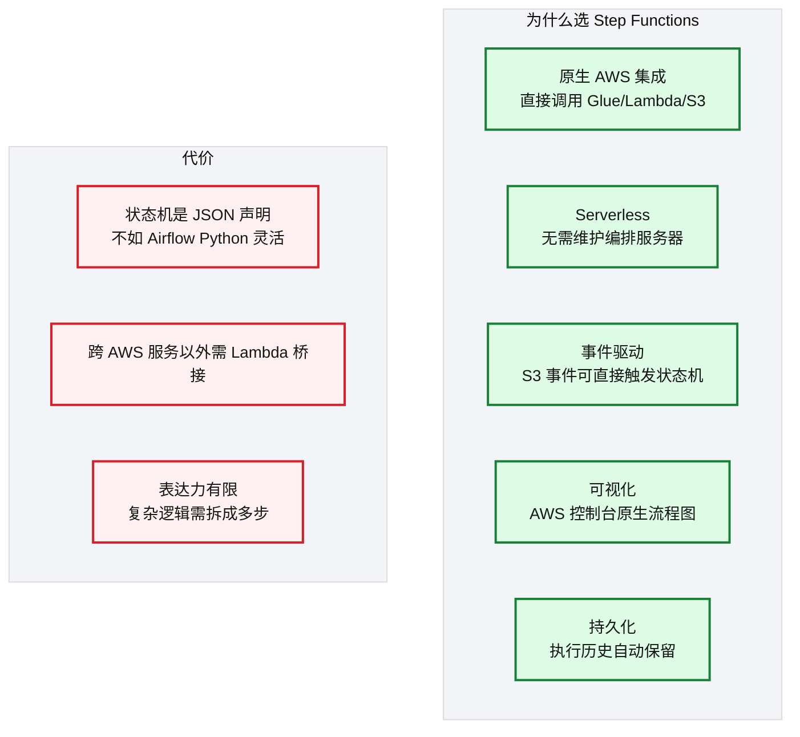
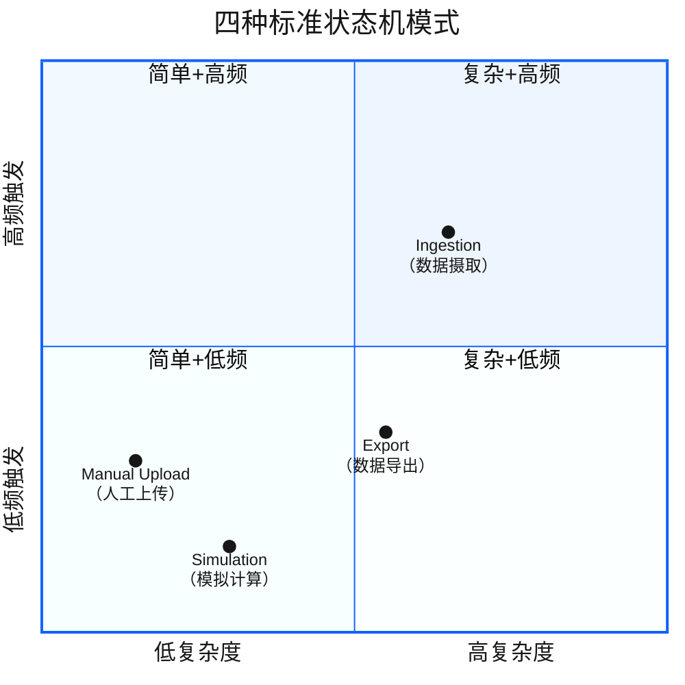
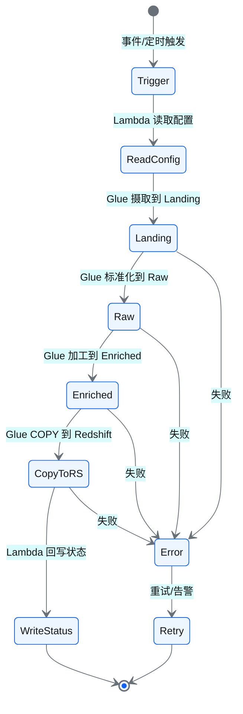
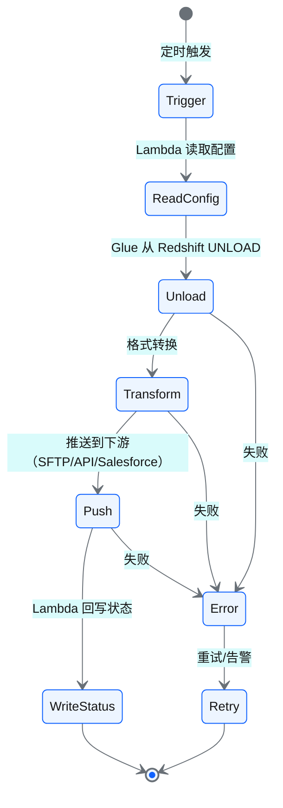
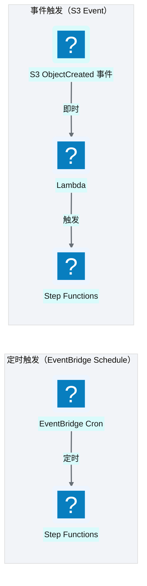
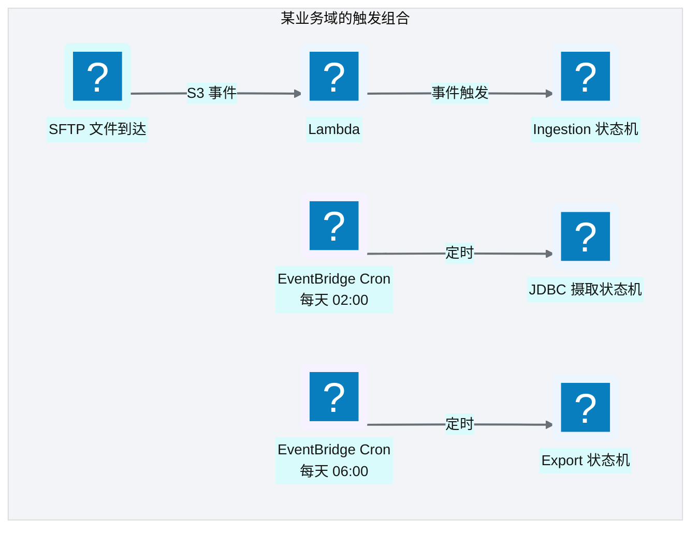

# Ch 10 编排与调度设计（Step Functions + EventBridge）

!!! info "面包屑"
    [本书主页](./index.md) › [Part II 架构设计](./09-计算与ETL设计-Glue与Lambda.md) › Ch 10

!!! abstract "项目第 0-1 年 · 架构设计期→核心建设期——编排引擎选型"

---

## :material-school: 本章你将学到

- 为什么选 Step Functions 而非 Airflow 作为编排引擎
- 四种状态机模式：ingestion / export / simulation / manual-upload
- EventBridge 定时调度与 S3 事件触发的组合策略
- Step Functions vs Airflow vs Dagster 的编排哲学对比

---

编排引擎是数据平台的"神经系统"——它决定"哪个任务先跑、哪个后跑、失败了怎么办"。这个决策在项目第 0 年引发了最激烈的争论。

Aurora 的数据工程团队里有几个人之前用过 Airflow，强烈建议"用 Airflow，社区成熟、:simple-python: Python 灵活、DAG 好写"。我理解他们的偏好——Airflow 确实是当时数据工程领域的事实标准。但我的顾虑是：Airflow 需要自己维护一个服务器集群（Worker/Scheduler/WebServer），而我们的平台设计理念是"尽量 Serverless、零运维"。另外，Aurora 的数据流以"事件驱动"为主（文件到达即处理），而 Airflow 的核心是"定时调度"，事件驱动需要额外插件。

最终我们选了 Step Functions。不是因为 Step Functions 比 Airflow"更好"——它们各有优劣——而是因为它更匹配平台的"Serverless + 事件驱动 + AWS 原生"设计哲学。这个决策的 trade-off 后面展开。

---

## 10.1 为什么是 Step Functions 而非 Airflow：事件驱动 + Serverless 的取舍

**图 10-1** 为什么是 Step Functions 而非 Airflow：事...

| 维度 | Step Functions | Airflow |
| --- | --- | --- |
| **部署模式** | Serverless（AWS 托管） | 需自建/托管服务器 |
| **触发方式** | 事件驱动（S3/EventBridge/API） | 定时为主（事件触发需插件） |
| **定义方式** | :simple-json: JSON/CDK 声明式 | Python 代码（DAG） |
| **灵活性** | 中（声明式约束） | 高（Python 任意逻辑） |
| **AWS 集成** | 原生深度集成 | 需 Operator 适配 |
| **运维负担** | 零（Serverless） | 中（需维护 Airflow 实例） |
| **计费** | 按状态转换次数 | 按服务器运行时长 |

**表 10-1** 为什么是 Step Functions 而非 Airflow：事件驱动 + Serverless 的取舍

!!! warning "Trade-off"
    Step Functions 的核心优势是 Serverless + 原生 AWS 集成——零运维、事件驱动、与 Glue/Lambda/S3 无缝衔接。代价是表达力不如 Airflow 的 Python DAG 灵活。对于"以 AWS 为基础、事件驱动为主"的平台，Step Functions 是更自然的选择。如果团队已有 Airflow 经验且需要复杂编排逻辑，Airflow 也是合理选择。

---

## 10.2 状态机模式：ingestion / export / simulation / manual-upload

平台抽象出四种标准状态机模式，覆盖所有业务场景：

**图 10-2** 状态机模式：ingestion / export / simul...

### Ingestion 模式（最核心）

**图 10-3** Ingestion 模式（最核心）

这个状态机的流程不是一次定型的——它经历了三个版本的演进。第一版只有"Landing → Raw → Enriched → CopyToRS"四步，没有"ReadConfig"和"WriteStatus"。第一版跑了两周就暴露了问题：每个 Glue job 的参数（源路径、目标路径、字段映射）硬编码在状态机 JSON 里，改一个参数要改 JSON 重新部署状态机——太重了。第二版我加了"ReadConfig"步——Lambda 从 DynamoDB 读配置，注入给 Glue job——这样改参数只需改 DynamoDB，状态机不用动（M1 配置驱动在编排层的落地）。第三版加的是"WriteStatus"——最初状态机的执行状态只存在 Step Functions 的执行历史里，排障要翻 SF 控制台，不直观；加了 WriteStatus 后状态回写到 DynamoDB，运维查一个表就能看全平台所有任务的状态（呼应 [Ch 5 状态回写](./05-端到端数据流全景.md)）。

流程里还有一条容易被忽略的线——每个 Glue 步骤都通向"Error → Retry"。这个错误处理不是事后补的，是第一天就设计的。我在企业征信时见过"ETL 失败无人知晓"的痛（见 [Ch 5 §5.3.3](./05-端到端数据流全景.md)），所以 Ingestion 状态机从第一版就有 Retry——默认重试 3 次，间隔指数退避，3 次都失败转 DLQ（死信队列）+ 告警。**编排引擎的价值不只是"串流程"，更是"管故障"**——没有错误处理的编排还不如 cron。

### Export 模式

**图 10-4** Export 模式

Export 模式看起来就是 Ingestion 的"逆过程"——一个数据进来，一个数据出去。但实际工程中它们的复杂度不对称：Export 比 Ingestion 难。原因在"Push"这一步——推送到下游系统（SFTP/API/Salesforce）要处理目标系统的限流、幂等、回滚，这些在 Ingestion 端不存在。我在第一年低估了这个差异，以为"导出就是导入的逆过程"，结果到第二年激活导出需求爆发时，Push 步骤的各种故障（Salesforce 限流、API 超时、SFTP 连接断）吃掉了团队大量排障时间。后来不得不重构了整个导出框架（详见 [Ch 37 DaaS 激活层](./37-数据即服务-DaaS激活层设计.md)）。**导入和导出看似对称，实则是完全不同的工程问题**——这是我在编排设计上交的学费。

Export 模式还有一个与 Ingestion 不同的设计点——触发方式。Ingestion 以事件触发为主（文件到达即处理），Export 几乎全是定时触发（T+1 批量导出）。原因是导出依赖"上游数据已加工完毕"——如果事件触发，可能 Enriched 还没算完就触发导出，导出的是半成品。定时触发（如每天 06:00）隐含了一个假设："06:00 之前所有 Ingestion 都跑完了"——这个假设需要监控保障，我们在 [Ch 49 日志监控审计与告警](./49-日志-监控-审计与告警.md) 里设计了"依赖完成检查"机制来兜底。

### 模式抽象的价值

| 模式 | 覆盖场景 | 状态机数量 |
| --- | --- | --- |
| Ingestion | 所有数据源摄取 | 每个业务域 1 个标准模板 |
| Export | 所有激活导出 | 每个业务域 1 个标准模板 |
| Simulation | 模拟计算（如销量预测） | 按需 |
| Manual Upload | 人工上传文件触发处理 | 按需 |

**表 10-2** 模式抽象的价值

"四种模式覆盖所有场景"这个抽象，是我从企业征信的反面教训里提炼的。企业征信时没有模式抽象——每个数据源建一个独立 DAG，最初 3 个源还好，到第 8 个源时已经有 8 个几乎相同的 DAG，改一个流程（比如加个质量校验步骤）要改 8 处。更糟的是，8 个 DAG 有 8 种"写法"——每个开发者风格不同，有的把状态回写放在最后，有的放在每步后——排障时要先搞懂"这个 DAG 是哪种风格"。到 Aurora 我发誓不再重复——四种标准模式，每个业务域用配置参数差异化，状态机的 JSON 模板只有 4 份。加质量校验步骤？改 1 份模板，所有业务域同时受益。**模式的本质是用"一份模板"换"N 份副本"的复用**——这是配置驱动（M1）在编排层的最高体现。

模式抽象还有一个隐性价值——**它让"新增业务域"变成可预估的工作**。企业征信时新增一个源要"写一个新 DAG"，工作量不可预估（取决于源的复杂度和开发者的熟练度）。Aurora 新增一个源只需"填一份配置 JSON"，工作量稳定在 1-2 天。这个可预估性让业务方对"多久能接入新源"有了明确预期，不再是无尽的"排期等待"。**好的抽象不只是技术复用，更是交付承诺的基础**——这是我在企业征信和 Aurora 两段经历对比后最深的体会。

!!! tip "引申"
    模式抽象的核心价值是**复用**。不要给每个数据源建一个独立状态机——那样会有几十个几乎相同的状态机，维护噩梦。正确做法是建一套标准模板，通过配置参数差异化。这就是"配置驱动"在编排层的体现。

---

## 10.3 EventBridge 定时调度与 S3 事件触发的组合

### 两种触发方式

**图 10-5** 两种触发方式

| 触发方式 | 机制 | 适合场景 | 时效性 |
| --- | --- | --- | --- |
| **定时调度** | EventBridge Cron 规则 | JDBC 源定时拉取、定期导出 | T+N（按 cron 周期） |
| **事件触发** | S3 事件 → Lambda → SF | 文件到达即处理 | 近实时（秒级） |

**表 10-3** 两种触发方式

"文件用事件触发、JDBC 用定时调度"这个分工，不是理论推演，而是数据源特性决定的。文件源（SFTP）的数据到达是"不可预测的"——供应商可能上午 10 点推，也可能下午 3 点推——如果用定时调度（如每 15 分钟扫一次），要么延迟（等下一个周期），要么浪费（没数据也空跑）。事件触发（S3 ObjectCreated 通知）解决了这两个问题——数据到达瞬间触发，零延迟零空跑。JDBC 源则相反——数据库里的数据是"持续变化"的，没有"到达"这个事件，只能定时拉取（CDC 除外，但当时 JDBC CDC 在 AWS China 支持有限）。**触发方式要匹配数据源的特性，而不是一刀切**——这是事件驱动编排（M3）的实践边界。

我在第一年踩过一个"触发方式选错"的坑。有个 SaaS API 源，我最初用事件触发（webhook 回调）——结果 SaaS 厂商的 webhook 不稳定，经常漏发，导致数据摄取缺失。后来我退化为定时调度（每 30 分钟主动拉一次）——虽然延迟增加了，但可靠性大幅提升。**事件驱动不是银弹——当源系统的事件通知不可靠时，定时轮询反而更稳**。架构师的责任是判断"源系统的事件能不能信"，而不是教条地全盘事件驱动。

### 组合策略

大多数业务域**同时使用两种触发方式**：

- 文件源（SFTP）→ 事件触发（文件到达即处理）
- JDBC/API 源 → 定时调度（按业务周期拉取）
- 导出任务 → 定时调度（T+1 批量导出）

**图 10-6** 组合策略

这张图展示的是一个业务域"同时用两种触发方式"的真实组合。图里有三个触发点：SFTP 文件到达走事件触发（Ingestion），JDBC 源走每天 02:00 定时（JDBC 摄取），导出走每天 06:00 定时（Export）。这三个时间点不是随便定的——02:00 是为了"在业务方上班前把 JDBC 数据拉完"，06:00 是为了"在 02:00 的 JDBC 摄取和加工都跑完后才导出"。**定时的时间点要形成依赖链**——06:00 的导出依赖 02:00 的摄取，如果 02:00 没跑完，06:00 导出的就是旧数据。

这个"时间点依赖链"在第一年靠"人工估算 + 留足余量"运作——02:00 摄取通常 1 小时跑完，06:00 导出留了 3 小时余量，足够。但到第二年数据量增长后，有次 JDBC 摄取跑了 4 小时（数据量翻倍），到 06:00 还没跑完，导出触发时拿到的是半成品——报表数字错了半天才发现。这次事故让我意识到"靠时间余量做依赖"是脆弱的——正确做法应该是"依赖完成检查"：导出状态机启动前先查 JDBC 摄取的状态，没完成就等待或告警。这个机制后来在 [Ch 49 日志监控审计与告警](./49-日志-监控-审计与告警.md) 里实现了。**定时调度的依赖链不能靠"时间余量"，要靠"状态检查"**——这是事件驱动编排（M3）与定时调度混合使用时的关键设计。

---

## 10.4 引申：Step Functions vs Airflow vs Dagster 的编排哲学

| 维度 | Step Functions | Airflow | Dagster |
| --- | --- | --- | --- |
| **核心抽象** | 状态机（State Machine） | DAG（有向无环图） | Asset（数据资产） |
| **定义方式** | JSON/CDK 声明 | Python 代码 | Python 代码 |
| **触发** | 事件 + 定时 | 定时为主 | 事件 + 定时 |
| **数据血缘** | 无原生 | 无原生 | ✅ 原生（Asset 级） |
| **运维** | Serverless（零运维） | 需维护实例 | 需维护实例 |
| **AWS 集成** | 原生 | 需 Operator | 需集成 |
| **社区生态** | AWS 生态 | 最丰富 | 增长快 |

**表 10-4** 引申：Step Functions vs Airflow vs Dagster 的编排哲学

!!! tip "引申"
    Dagster 的"资产驱动"理念值得关注。传统编排（Airflow/Step Functions）以"任务"为中心——"执行这个任务"；Dagster 以"数据资产"为中心——"产出这个数据集"。后者的好处是血缘天然可见：你能看到某个表被哪些任务产出、又被哪些任务消费。这与数据平台的"可观测性"诉求高度契合。如果今天重建编排层，Dagster 值得认真评估。

---

## :material-check-circle: 本章小结

- 选 Step Functions 而非 Airflow：Serverless 零运维 + 原生 AWS 集成 + 事件驱动；代价是表达力不如 Python DAG
- 四种标准状态机模式：Ingestion（摄取）/ Export（导出）/ Simulation（模拟）/ Manual Upload（人工上传）——通过配置差异化，不要每个源建独立状态机
- 两种触发方式组合：定时调度（EventBridge Cron）用于 JDBC/API 源，事件触发（S3 事件→Lambda→SF）用于文件源
- 编排哲学对比：Step Functions（状态机）/ Airflow（DAG）/ Dagster（Asset）——Dagster 的资产驱动理念值得关注

---

!!! quote "下一章"
    [Ch 11 配置与状态管理](./11-配置与状态管理.md) —— 编排搭好了，任务怎么配置？接下来看配置驱动架构和状态管理的核心设计。

