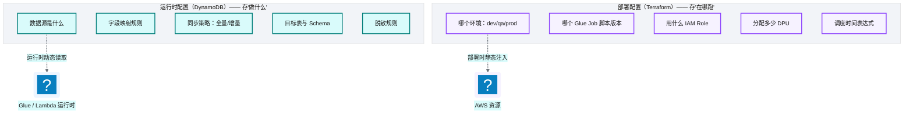
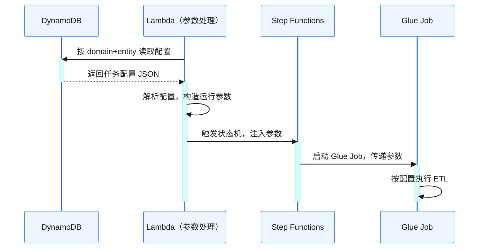
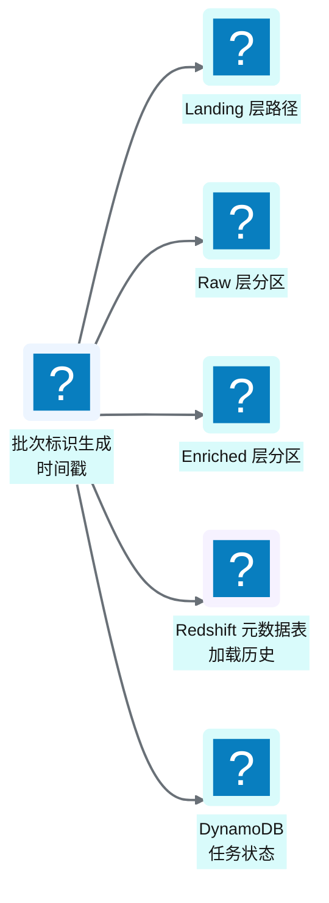
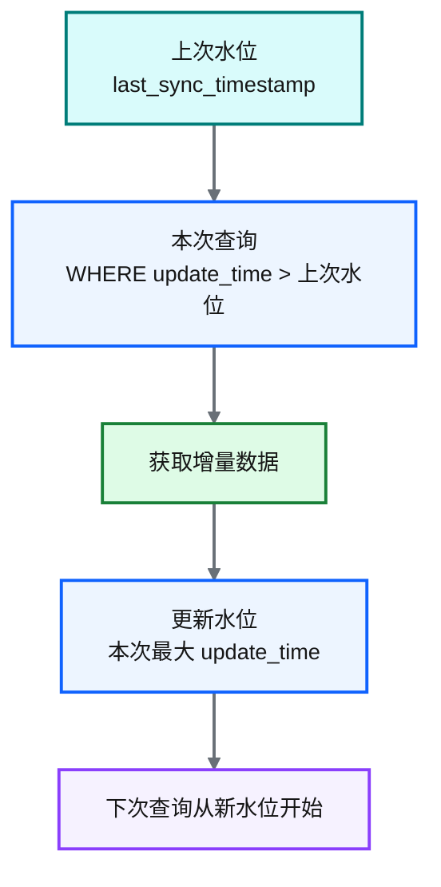
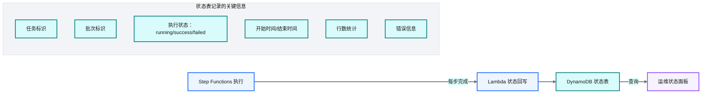
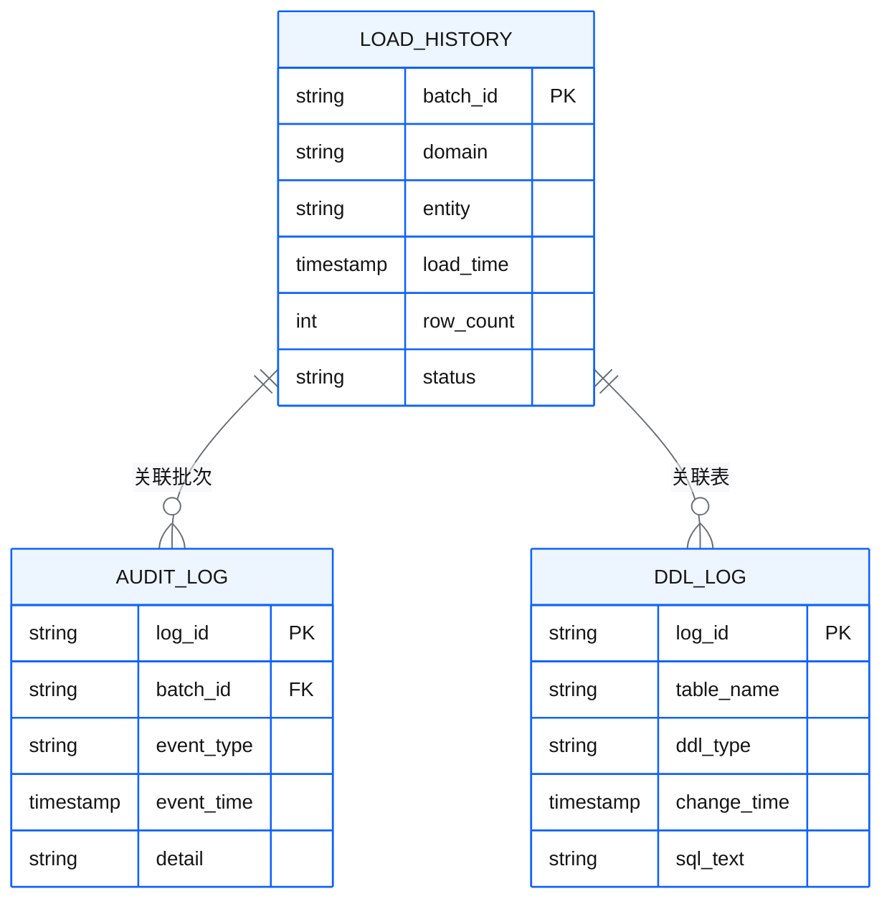

# Ch 11 配置与状态管理

!!! info "面包屑"
    [本书主页](./index.md) › [Part II 架构设计](./10-编排与调度设计-StepFunctions与EventBridge.md) › Ch 11

!!! abstract "项目第 0-1 年 · 架构设计期→核心建设期——配置驱动奠基"

---

## :material-school: 本章你将学到
- 配置驱动架构的核心理念：运行时配置存"做什么"，部署配置存"在哪跑"
- 批次标识与增量水位管理——数据可追溯性的基石
- 运行状态追踪与审计日志体系的设计

---

## 11.1 配置驱动架构：运行时配置存"做什么"，部署配置存"在哪跑"

这是平台最重要的设计决策之一——如果全书只能保留一个设计思想，我会选这一个。

这个思想的萌芽来自企业征信项目。当时每接一个新数据源（工商/司法/税务），数据团队就要写一套新的 ETL 脚本——读源、清洗、转换、写目标。十个数据源就是十套脚本，虽然逻辑大同小异，但因为硬编码了表名、字段映射和连接信息，每套都得单独维护。数据源增加到二十个时，维护成本已经失控。

到了 Aurora，我发誓不再走老路。核心思路是：**把"做什么"（业务逻辑：字段映射、加载模式、脱敏规则）从代码中提取出来，变成数据（配置）；代码变成"通用引擎"，按配置执行。** 这样加新数据源不需要改代码，只需要加配置。但配置怎么管？放 :simple-terraform: Terraform 里？那每次加数据源都要走 plan/apply——太重了。最终方案是"双配置体系"：运行时配置存 DynamoDB（热更新），部署配置存 Terraform（静态注入）。

这是平台最重要的设计决策之一：**把"做什么任务"和"在哪跑任务"分成两个配置体系**。

**图 11-1** 配置驱动架构：运行时配置存"做什么"，部署配置存"在哪跑"

| 维度 | 运行时配置（DynamoDB） | 部署配置（Terraform） |
|---|---|---|
| **回答的问题** | "做什么任务、什么映射、什么策略" | "在哪个环境、跑哪个脚本版本、用什么资源" |
| **读取时机** | 运行时动态读取（每次执行） | 部署时静态注入（Terraform apply） |
| **变更方式** | 配置发布流（热更新，无需重建资源） | Terraform 发布流（需 plan/apply） |
| **存储形式** | DynamoDB :simple-json: JSON 文档 | Terraform tfvars |

**表 11-1** 配置驱动架构：运行时配置存"做什么"，部署配置存"在哪跑"

### 为什么要分两套

!!! warning "Trade-off"
    如果只用 Terraform 管所有配置，那么"加一个数据源"就需要走 Terraform plan/apply 流程——审批、变更基础设施、等待部署。这太重了。把"做什么"放进 DynamoDB 后，加数据源只需要加一条 JSON 配置并发布——热更新、秒级生效、不碰基础设施。

### 配置注入链路

**图 11-2** 配置注入链路

!!! tip "引申"
    配置驱动架构的本质是"数据化"——把原本硬编码在脚本里的业务逻辑（字段映射、同步策略、脱敏规则）提取为数据（JSON 配置），让代码变成"通用引擎"，配置变成"业务声明"。这样加新数据源不需要改代码，只需要加配置。这是"开闭原则"（对扩展开放、对修改关闭）在数据工程中的体现。

---

## 11.2 批次标识与增量水位管理：数据可追溯性的基石

### 批次标识

每次数据加载生成一个唯一**批次标识**（时间戳），贯穿全链路：

**图 11-3** 批次标识

批次标识解决两个问题：
1. **版本管理**：同一张表每次加载是独立版本，可按时间回溯
2. **故障恢复**：失败后可以从指定批次重跑

### 增量水位管理

对于增量加载的数据源，平台维护一个**水位表**，记录"上次加载到哪里"：

**图 11-4** 增量水位管理

| 加载模式 | 水位管理 | 适合场景 |
|---|---|---|
| **全量加载** | 不需要水位 | 数据量小、或源表每次全量覆盖 |
| **增量加载** | 按时间戳/自增 ID 追踪水位 | 数据量大、有可靠变更标识 |
| **自定义加载** | 按业务逻辑定义 | 特殊场景（如按状态变更） |

**表 11-2** 增量水位管理

!!! warning "Trade-off"
    增量加载性能好但正确性依赖"可靠的水位标识"。如果源表的 update_time 不可靠（比如批量更新时时间戳相同），可能导致数据遗漏。全量加载简单可靠但性能差。对于关键业务数据，建议"增量加载为主 + 定期全量校准"的双保险策略。

---

## 11.3 运行状态追踪与审计日志体系

### 状态追踪

每个任务的执行状态实时回写到 DynamoDB，形成"可观测的执行面板"：

**图 11-5** 状态追踪

### 审计日志体系

Redshift 中维护一套元数据表，记录全链路审计信息：

**图 11-6** 审计日志体系

| 元数据表 | 记录内容 | 用途 |
|---|---|---|
| **加载历史** | 每次数据加载的批次、域、实体、行数、状态 | 追溯数据来源 |
| **审计日志** | 全链路事件（开始/完成/失败/告警） | 排障与合规 |
| **DDL 变更日志** | Schema 变更记录（建表/改列/删表） | Schema 演进追溯 |

**表 11-3** 审计日志体系

!!! tip "引申"
    审计日志是"被动血缘"——它记录"发生了什么"，但不记录"数据的流向关系"。主动血缘（如 OpenLineage/DataHub）会在任务执行时主动收集"输入表→输出表"的映射。我们在 [Ch 20](./20-元数据管理与数据血缘.md) 会详细对比这两种方案。

---

## :material-check-circle: 本章小结
- 配置驱动架构：运行时配置（DynamoDB）存"做什么"，部署配置（Terraform）存"在哪跑"——加数据源只需加配置，无需改代码或重建基础设施
- 批次标识贯穿全链路，实现版本管理与故障恢复；增量水位管理实现高效增量加载
- 运行状态实时回写 DynamoDB 实现可观测；Redshift 元数据表（加载历史/审计日志/DDL 变更）实现合规追溯
- 审计日志是"被动血缘"，与主动血缘（OpenLineage/DataHub）各有优劣

---

!!! quote "下一部分"
    [Part III 数据工程实践：连接器与流水线](./12-配置驱动的任务模型.md) —— 架构骨架搭完了，接下来进入"怎么开发"：从配置驱动的任务模型，到五类连接器，到三层 ETL 开发实战。

