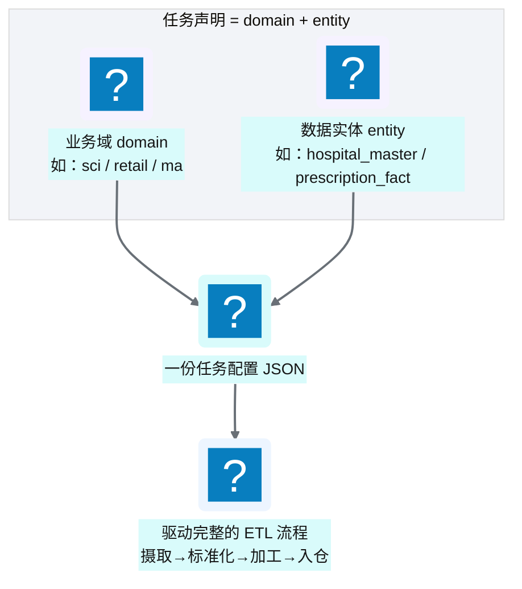
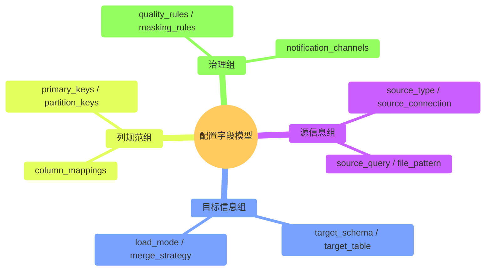
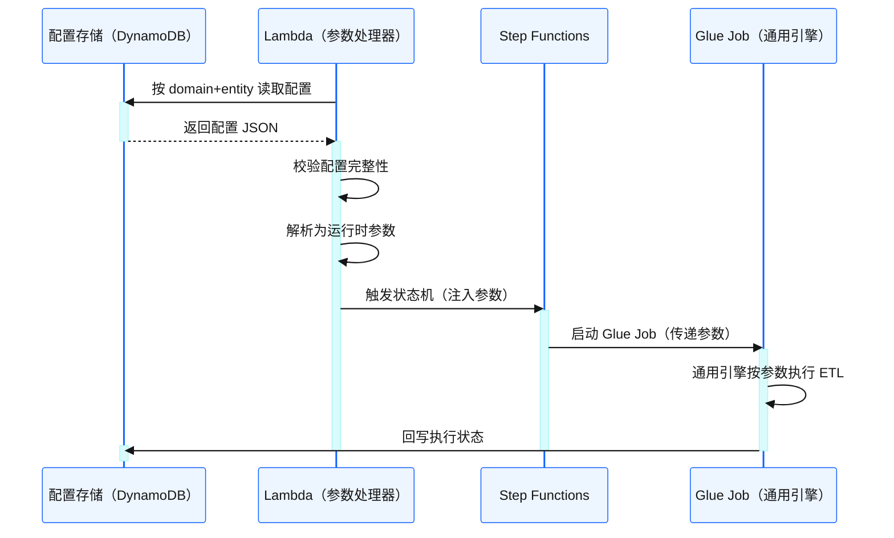

# Ch 12 配置驱动的任务模型

!!! info "面包屑"
    [本书主页](./index.md) › [Part III 数据工程实践](./11-配置与状态管理.md) › Ch 12

!!! abstract "项目第 1 年 · 核心建设期——任务模型设计"

---

## :material-school: 本章你将学到
- 任务声明模型：以业务域与数据实体为粒度的声明式任务定义
- 配置字段模型设计：列规范、主键、同步策略的声明式表达
- 配置注入机制：从声明式配置到运行时参数的完整链路

---

## 12.1 任务声明模型：业务域与数据实体粒度

[Ch 11](./11-配置与状态管理.md) 讲了配置驱动的理念——"运行时配置存做什么，部署配置存在哪跑"。这一章把"运行时配置"拆开来看：任务怎么声明、配置字段怎么组织、配置怎么注入到运行时。

核心理念是"声明式"——配置描述"要什么结果"（我要从 :simple-postgresql: PostgreSQL 拉取处方数据、增量同步、写到 enriched_sci schema），而非"怎么做步骤"（先连接数据库、再执行 SELECT、再转换格式、再写入 S3）。声明式配置把"加数据源"变成"加一条配置"，不是"写一套代码"。

平台的每一个数据任务，都以 **"业务域（domain）+ 数据实体（entity）"** 为粒度声明。这是配置驱动架构的核心单元。


<p class="caption" markdown="span">**图 12-1** 任务声明模型：业务域与数据实体粒度</p>

### 为什么选 domain + entity 粒度

| 粒度选项 | 优势 | 劣势 | 是否采用 |
|---|---|---|---|
| 按数据源 | 与源系统对应清晰 | 一个源含多个实体，粒度太粗 | ❌ |
| 按表 | 细粒度控制 | 缺少业务域归属，难治理 | ❌ |
| **domain + entity** | **业务域隔离 + 实体级控制** | 需要前期定义好域与实体 | ✅ |
| 按项目 | 与项目管理一致 | 技术视角错位 | ❌ |
<p class="caption" markdown="span">**表 12-1** 为什么选 domain + entity 粒度</p>


domain + entity 粒度的好处是：**业务域提供治理边界（权限/命名/调度隔离），数据实体提供操作单元（每个实体一条配置、一个独立流程）**。

这个粒度选择不是我一开始就想清楚的，而是试错过来的。最初我按"数据源"粒度建任务——一个 SFTP 源一个任务配置。但很快发现问题：一个 SFTP 源里可能有多个文件（医院主数据、处方数据、销量数据），它们的目标表、加载策略、脱敏规则都不同——按源粒度没法差异化。我又试了"按表"粒度——每张表一个配置，结果配置数量爆炸（20000+ 张表 = 20000+ 份配置），且没有"业务域归属"——权限按表授予太细，没法按域批量管理。最后我发现"domain + entity"是甜点——domain 做治理边界（按域授权、按域命名、按域调度隔离），entity 做操作单元（每个实体独立配置和流程）。粒度选择本质是"治理"和"操作"的平衡——太粗没法差异化，太细没法治理。

!!! tip "引申"
    domain + entity 的粒度选择，本质是在"治理粒度"和"操作粒度"之间找平衡。太粗（按数据源）控制不了细节；太细（按字段）配置会爆炸。domain 管"边界"，entity 管"操作"，这是实践中验证过的甜点。

---

## 12.2 配置字段模型设计：列规范、主键、同步策略的声明式表达

每份任务配置是一个 :simple-json: JSON 文档，声明"这个 entity 怎么摄取、怎么加工、怎么入仓"。以下是配置字段模型的核心设计（示意结构，非真实参数名）：


<p class="caption" markdown="span">**图 12-2** 配置字段模型设计：列规范、主键、同步策略的声明式表达</p>

| 字段组 | 核心字段 | 作用 |
|---|---|---|
| **源信息组** | 源类型、源连接信息、查询语句/文件模式 | 告诉引擎"数据从哪来、怎么取" |
| **目标信息组** | 目标 schema/table、加载模式、 :octicons-git-merge-16: 合并策略 | 告诉引擎"数据到哪去、怎么写" |
| **列规范组** | 列映射、主键、分区键 | 告诉引擎"字段怎么映射、怎么去重" |
| **治理组** | 质量规则、脱敏规则、通知渠道 | 告诉引擎"怎么校验、怎么脱敏、出问题通知谁" |
<p class="caption" markdown="span">**表 12-2** 配置字段模型设计：列规范、主键、同步策略的声明式表达</p>


### 声明式表达的价值

配置是**声明式**的——它描述"要什么结果"，而非"怎么做步骤"：

```
# 声明式配置示意（简化）
{
  "domain": "sci",
  "entity": "prescription_fact",
  "source": {
    "type": "jdbc",
    "connection": "auroracdp/mssql/source-db",
    "load_mode": "incremental",
    "watermark_column": "updated_at"
  },
  "target": {
    "schema": "enriched_sci",
    "table": "prescription_fact",
    "merge_strategy": "upsert_by_key"
  },
  "columns": {
    "primary_keys": ["prescription_id"],
    "mappings": [...]
  },
  "governance": {
    "quality_rules": [...],
    "masking_rules": [...]
  }
}
```

!!! warning "Trade-off"
    声明式配置的好处是"加数据源 = 加配置"，零代码。代价是配置字段模型的设计需要前期投入——字段太少不够用，太多则复杂度失控。我们的经验是：从最小可用集开始，按实际需求迭代扩展，而不是一开始就设计"完美"的字段集。

我从命令式到声明式的转变，是被企业征信的维护成本逼出来的。企业征信时每个 ETL 是命令式脚本——`connect(db) → execute(sql) → transform(df) → write(target)`，逻辑写死在代码里。最初很灵活（想怎么写怎么写），但到第十个数据源时，十个脚本有十种写法，改一个通用逻辑（比如加质量校验）要改十处。到 Aurora 我把所有 ETL 逻辑抽象成"通用引擎"，配置只声明"要什么"（源/目标/映射/策略），引擎按配置执行。这个转变的转折点是第三个月——有个新数据源接入，开发者只写了一条配置 JSON，没写一行代码，ETL 就跑通了。那一刻我才真正感受到声明式的分量：加数据源从"写代码"变成了"填表"。当然，代价是前期设计通用引擎投入了两个月——但这两个月换来了后续两年加几十个数据源零代码的效率，投入产出比极高。

---

## 12.3 配置注入机制：从声明到运行时参数


<p class="caption" markdown="span">**图 12-3** 配置注入机制：从声明到运行时参数</p>

### 通用引擎的设计原则

Glue Job 是一个**通用引擎**——它不包含任何特定数据源的业务逻辑，所有行为由注入的配置参数决定：

| 设计原则 | 说明 |
|---|---|
| **配置即行为** | 引擎读什么源、怎么转换、写到哪，全由配置决定 |
| **零硬编码** | 不在代码中写死任何表名、字段名、连接串 |
| ** :octicons-git-branch-16: 分支路由** | 引擎根据配置中的源类型，路由到对应的连接器分支 |
| **统一回写** | 无论哪个分支，执行状态都回写到统一的元数据表 |
<p class="caption" markdown="span">**表 12-3** 通用引擎的设计原则</p>

这四条原则里，"零硬编码"是最难做到的。我在第一版引擎里就没做到——虽然大部分逻辑是配置驱动的，但有些"特殊情况"被我硬编码了（比如某个数据源的字段名要做特殊转换）。结果半年后那个数据源下线了，硬编码逻辑成了"死代码"，新开发者看不懂"为什么要特殊处理这个源"——技术债。第二版我严格清理了所有硬编码，特殊逻辑全部提取为配置项（如 `column_transformations` 字段）。零硬编码不是"尽量做到"，而是"一条都不许有"——有一条例外，就会有两条、三条，最后引擎退化回"配置+硬编码"的混合体。

"分支路由"这条原则是连接器框架（[Ch 13](./13-连接器框架总览.md)）的核心——引擎根据配置中的 `source_type`（jdbc/sftp/api/saas/mail）路由到对应的连接器分支。每个分支只处理"该类源的特有逻辑"（如 JDBC 分支处理连接池、SFTP 分支处理文件下载），公共逻辑（如写 S3、回写状态）在引擎主干。这个"主干+分支"的结构让加新连接器类型时只需加一个分支，不用动主干——扩展点收敛在分支，稳定性收敛在主干。

!!! tip "引申"
    通用引擎 + 声明式配置 = 数据工程的"编译器"模式。配置是"源代码"（声明意图），引擎是"编译器"（执行意图）。这种分离让引擎可以独立优化和升级，而不影响业务配置。这也是为什么我们能从框架 v1 平滑演进——引擎换了，配置不用动。

---

## :material-check-circle: 本章小结
- 任务以 domain + entity 粒度声明：domain 提供治理边界，entity 提供操作单元
- 配置字段模型分四组：源信息 / 目标信息 / 列规范 / 治理——声明式表达"要什么结果"
- 配置注入链路：DynamoDB → Lambda 参数处理 → Step Functions → Glue 通用引擎
- 通用引擎遵循"配置即行为、零硬编码、分支路由、统一回写"原则——这是配置驱动架构可持续演进的根基

---

!!! quote "下一章"
    [Ch 13 连接器框架总览](./13-连接器框架总览.md) —— 任务模型清楚了，接下来看连接器框架如何用"统一入口 + 源系统路由"设计实现五类连接器。

