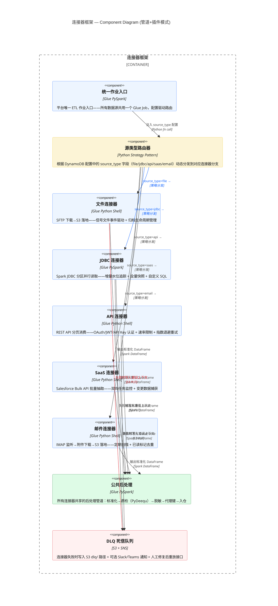
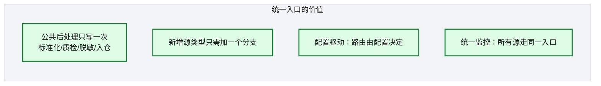
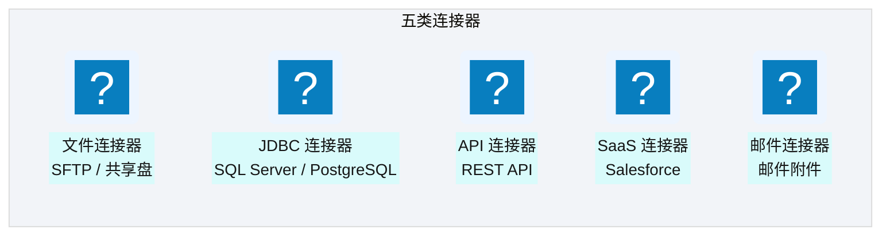
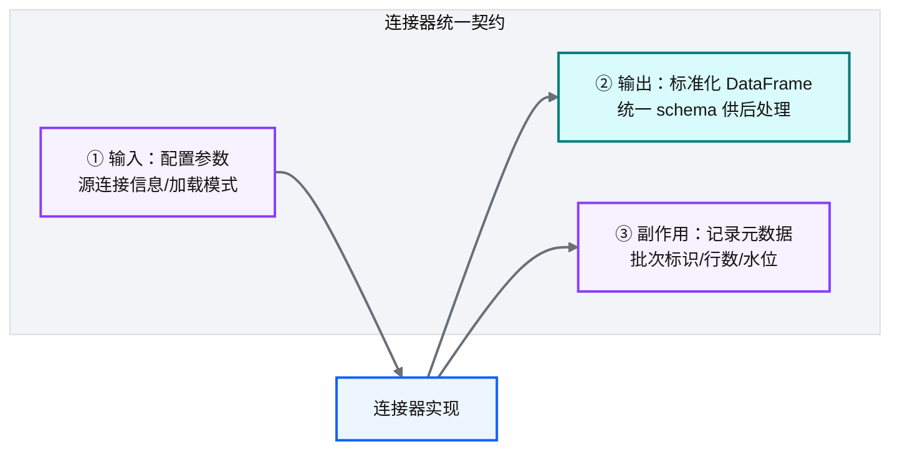
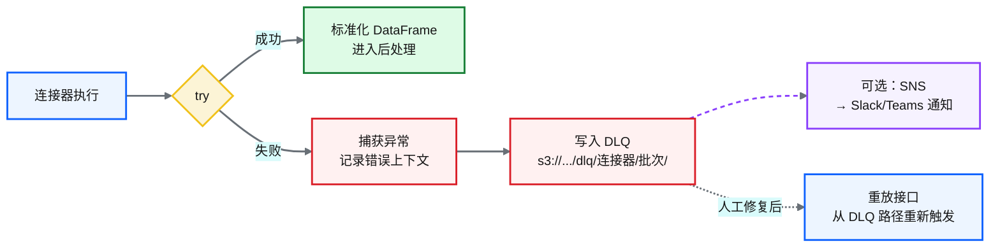

# Ch 13 连接器框架总览

!!! info "面包屑"
    [本书主页](./index.md) › [Part III 数据工程实践](./12-配置驱动的任务模型.md) › Ch 13

!!! abstract "项目第 1 年 · 核心建设期——连接器框架"

---

## :material-school: 本章你将学到
- 统一作业入口与源系统路由的设计思想
- 五类连接器（文件/JDBC/API/SaaS/邮件）的定位与协作
- 连接器框架的可扩展性设计

---

## 13.1 统一作业入口与源系统路由设计

平台有五类数据源，但**不是一个源写一个 Glue Job**——而是用一个**统一作业入口**，内部按源类型路由到不同的连接器分支。


<p class="caption" markdown="span">**图 13-1** 统一作业入口与源系统路由设计</p>

### 为什么用统一入口而非每源一个 Job

| 方案 | 优势 | 劣势 |
|---|---|---|
| **每源一个 Job** | 隔离性好 | 代码重复严重，维护 N 份几乎相同的后处理逻辑 |
| **统一入口 + 路由**（本书） | 公共逻辑只写一次，新增源类型只加分支 | 单个 Job 复杂度高 |
<p class="caption" markdown="span">**表 13-1** 为什么用统一入口而非每源一个 Job</p>



<p class="caption" markdown="span">**图 13-2** 为什么用统一入口而非每源一个 Job</p>

!!! warning "Trade-off"
    统一入口的代价是"单 Job 复杂度高"——随着源类型增多，入口代码会变大。应对策略是把每个连接器分支抽成独立模块（单一职责），入口只做路由和公共逻辑编排。这是"管道+插件"模式：入口是管道，连接器是插件。

---

## 13.2 五类连接器：文件/JDBC/API/SaaS/邮件


<p class="caption" markdown="span">**图 13-3** 五类连接器：文件/JDBC/API/SaaS/邮件</p>

| 连接器 | 摄取方式 | 触发方式 | 详细章节 |
|---|---|---|---|
| **文件连接器** | SFTP 下载 → S3 落地 | 信号文件事件驱动 | [Ch 15](./15-文件与S3连接器.md) |
| **JDBC 连接器** | Spark JDBC 拉取 | 定时调度 | [Ch 14](./14-数据库与JDBC连接器.md) |
| **API 连接器** | HTTP 请求 + 分页 | 定时调度 | [Ch 16](./16-API-SaaS与邮件连接器.md) |
| **SaaS 连接器** | SaaS 平台 API 批量抽取 | 定时 + 事件混合 | [Ch 16](./16-API-SaaS与邮件连接器.md) |
| **邮件连接器** | 邮件监听 → 附件下载 | 邮件到达事件 | [Ch 16](./16-API-SaaS与邮件连接器.md) |
<p class="caption" markdown="span">**表 13-2** 五类连接器：文件/JDBC/API/SaaS/邮件</p>


### 连接器的统一契约

每类连接器虽然摄取方式不同，但都遵循**统一契约**：


<p class="caption" markdown="span">**图 13-4** 连接器的统一契约</p>

无论哪个连接器，输出都是标准化的 DataFrame，交给公共后处理模块。这就是"统一入口"能工作的基础——**连接器只管"取数据"，后处理只管"加工数据"，两者通过统一契约解耦**。

把这个契约落到代码层面，就是一个抽象基类定义"输入配置 → 输出 DataFrame + 元数据"的统一接口，五类连接器各自实现：

```python
# 示意：连接器统一契约的抽象基类（策略模式）
from abc import ABC, abstractmethod
from pyspark.sql import DataFrame

class Connector(ABC):
    """所有连接器遵循同一契约：输入配置，输出标准化 DataFrame + 元数据。"""

    @abstractmethod
    def invoke(self, config: dict) -> tuple[DataFrame, dict]:
        # 核心意图：连接器只管"取数据"，后处理只管"加工数据"，二者解耦
        # config 由 DynamoDB 任务配置注入（见 Ch 12），含源连接信息/加载模式/水位
        ...

class JdbcConnector(Connector):
    def invoke(self, config: dict) -> tuple[DataFrame, dict]:
        df = self._read_partitioned(config)          # 见 Ch 14：分区读取 + 水位
        meta = {"batch_id": config["batch_id"],
                "row_count": df.count(),
                "watermark": self._next_watermark()}  # 副作用：记录元数据
        return df, meta                               # 输出标准化 schema 供后处理

# 新增一类源（如未来加 Kafka 流式源），只需实现 invoke 契约，无需改后处理
```

!!! tip "引申"
    统一契约的设计灵感来自"策略模式"（Strategy Pattern）。连接器是可替换的策略，公共后处理是不变的上下文。新增一种数据源类型（比如未来加 :simple-apachekafka: Kafka 流式源），只需要实现统一契约的新策略，无需改动后处理逻辑。

### 连接器容错设计：DLQ 死信队列模式

上游数据源千差万别，连接器失败是常态而非例外——JDBC 连接超时、API 返回 5xx、SFTP 文件被占用、邮件附件格式异常。如果失败后直接抛错中断整个批次，会导致一个连接器的偶发故障阻塞其他正常连接器。因此连接器框架需要一套**统一的容错契约**，核心是死信队列（Dead Letter Queue, DLQ）模式：


<p class="caption" markdown="span">**图 13-5** 连接器容错设计：DLQ 死信队列模式</p>

容错契约的四要素：

| 要素 | 做法 | 目的 |
|---|---|---|
| **① 入口捕获** | 连接器入口 `try/except` 包裹，捕获所有异常 | 单连接器失败不影响同批次其他连接器 |
| **② 错误持久化** | 失败记录 + 错误上下文（stack trace、配置快照、源标识）写入 S3 `dlq/{connector_name}/{batch_id}/` | 失败可追溯、可重放 |
| **③ 通知可选** | 通过 SNS → Slack/Teams 推送告警 | 关键失败即时感知，非关键失败仅落 DLQ |
| **④ 重放接口** | 人工修复根因后，从 DLQ 路径重新触发同一批次 | 失败不丢数据，修复后可补跑 |
<p class="caption" markdown="span">**表 13-3** 连接器容错设计：DLQ 死信队列模式</p>


```python
# 示意：连接器容错契约（DLQ 死信队列模式）
def safe_invoke(connector: Connector, config: dict, ctx) -> tuple[DataFrame, dict] | None:
    batch_id = config["batch_id"]
    try:
        return connector.invoke(config)                  # 核心意图：失败不中断批次
    except Exception as e:
        ctx.s3.put_object(
            Bucket=ctx.dlq_bucket,
            Key=f"dlq/{config['source_type']}/{batch_id}/error.json",
            Body=json.dumps({"error": str(e), "stack": traceback.format_exc(),
                             "config_snapshot": config, "ts": now()}))
        ctx.sns.notify(f"连接器 {config['source_type']} 批次 {batch_id} 失败：{e}")
        return None                                      # 返回 None，调度器继续下一个连接器
```

!!! warning "Trade-off"
    DLQ 模式提升了容错性，代价是**失败变得"安静"**——如果不配套告警和 DLQ 积压监控，失败会悄悄堆积成数据缺口。因此 DLQ 必须配合可观测性：DLQ 路径下的对象数量要纳入监控，超过阈值告警（详见 [Ch 49](./49-日志-监控-审计与告警.md)）。这是"容错"与"可观测"不可分割的典型例证。

---

## :material-check-circle: 本章小结
- 连接器框架采用"统一作业入口 + 源系统路由"设计：公共后处理只写一次，新增源类型只加分支
- 五类连接器：文件 / JDBC / API / SaaS / 邮件，各有摄取方式和触发方式
- 所有连接器遵循统一契约：输入配置参数 → 输出标准化 DataFrame → 记录元数据（策略模式实现）
- 连接器容错采用 DLQ 死信队列模式：入口捕获 → 错误持久化 → 可选通知 → 重放接口，配合可观测性监控 DLQ 积压
- 框架本质是"管道+插件"模式：入口是管道，连接器是可替换的策略插件

---

!!! quote "下一章"
    [Ch 14 数据库与 JDBC 连接器](./14-数据库与JDBC连接器.md) —— 接下来深入第一类连接器：关系型数据库的加载模式与增量水位追踪。

