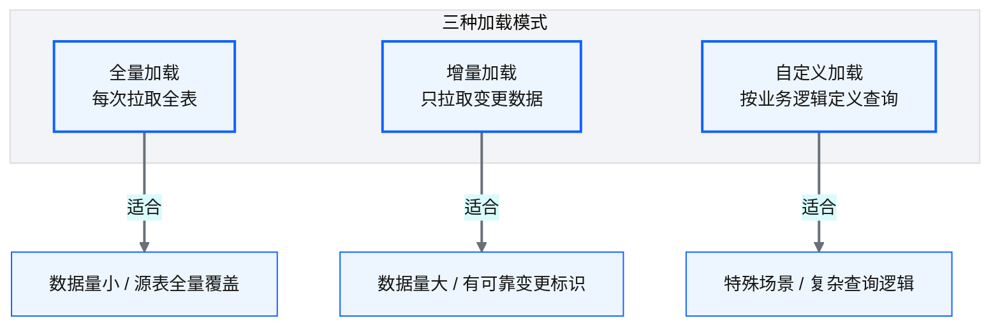
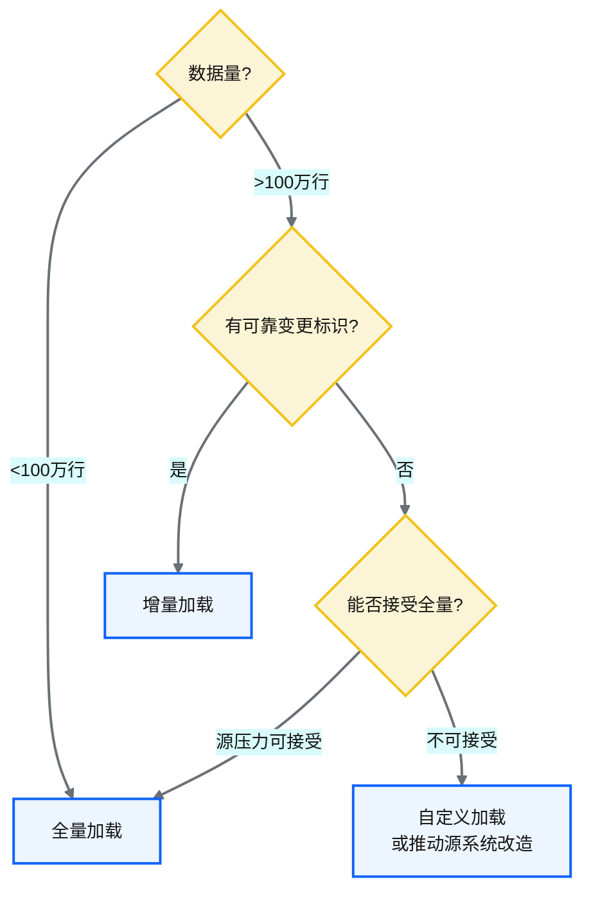
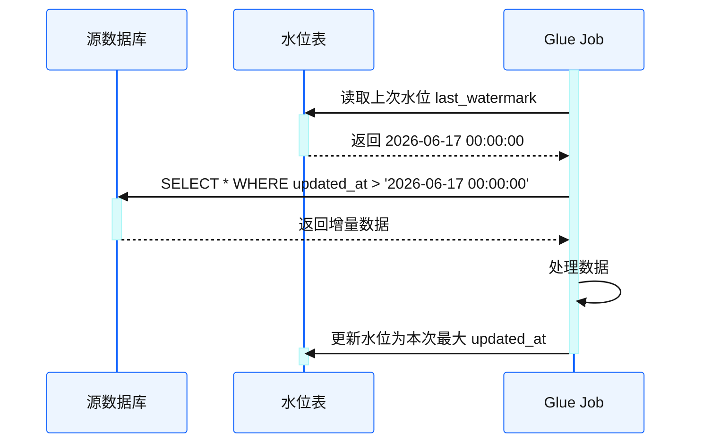
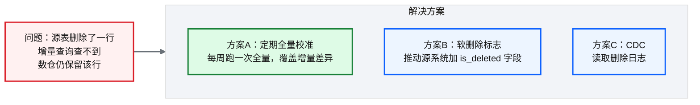
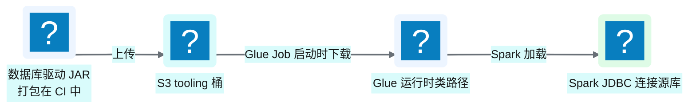

# Ch 14 数据库与 JDBC 连接器

!!! info "面包屑"
    [本书主页](./index.md) › [Part III 数据工程实践](./13-连接器框架总览.md) › Ch 14

!!! abstract "项目第 1 年 · 核心建设期——JDBC连接器"

---

## :material-school: 本章你将学到
- 关系型数据库的三种加载模式设计：全量/增量/自定义
- 增量水位追踪与变更捕获策略，以及 PySpark JDBC 分区读取与水位管理的伪代码
- JDBC 性能调优（numPartitions/fetchSize/谓词下推）与迟到数据处理（回溯窗口 + 幂等覆盖）
- 驱动依赖治理与运行时类加载的设计

---

## 14.1 关系型数据库的加载模式设计：全量/增量/自定义

!!! note "边界：JDBC 只管源库，不管 Redshift"
    本章 JDBC / ODBC 只用于从 **MySQL、SQL Server、PostgreSQL** 等关系型源库经 Glue Spark Job 拉数入湖。平台对 **Redshift** 的 COPY / UNLOAD / DDL 一律走 Glue + boto3（Redshift Data API），见 [Ch 5](./05-端到端数据流全景.md)、[Ch 32](./32-跨账号批量同步-双桶桥接架构.md)——两条路径不要混为一谈。


<p class="caption" markdown="span">**图 14-1** 关系型数据库的加载模式设计：全量/增量/自定义</p>

| 模式 | 机制 | 优势 | 劣势 |
|---|---|---|---|
| **全量** | `SELECT * FROM table` | 简单可靠、无需水位 | 大表性能差、源压力大 |
| **增量** | `WHERE update_time > 上次水位` | 性能好、源压力小 | 依赖可靠水位、需处理删除 |
| **自定义** | 业务定义 SQL 查询 | 灵活、可复杂逻辑 | 维护成本高、难标准化 |
<p class="caption" markdown="span">**表 14-1** 关系型数据库的加载模式设计：全量/增量/自定义</p>


### 加载模式的选择决策


<p class="caption" markdown="span">**图 14-2** 加载模式的选择决策</p>

!!! warning "Trade-off"
    增量加载看似总是更优，但它引入了"水位管理"的复杂性——需要处理水位回退、源表删除、时间戳冲突等边界情况。对于小表（<100 万行），全量加载的简单性远胜于增量加载的性能优势。原则是：**不要过早优化——当全量加载的运行时间可接受时，优先选全量**。

这个"不要过早优化"原则是我从企业征信的过度优化教训里学的。企业征信时我给所有表都上了增量加载——包括一张只有 500 行的配置表。结果配置表的增量逻辑（水位读取、查询拼接、水位更新）比全量拉取本身还复杂，有次水位更新失败导致配置表增量漏数据，排障花了半天——而全量拉取 500 行只需 2 秒。到 Aurora 我定了一个简单规则：100 万行以下的表默认全量，超过才考虑增量。这个规则让 60% 的小表走全量（简单可靠），40% 的大表走增量（性能优先）——维护成本大幅下降，而性能损失可忽略（小表全量也很快）。优化的标准不是"能不能更快"，而是"复杂度是否值得"。

---

## 14.2 增量水位追踪与变更捕获策略

### 水位追踪机制


<p class="caption" markdown="span">**图 14-3** 水位追踪机制</p>

上面的时序图描述了水位机制的数据流，落到 :simple-apachespark: PySpark 代码层面，关键是两点：**分区并行读取**（大表不能单连接拉）和**水位的读写要持久化**（放 DynamoDB 而非内存）：

```python
# 示意：PySpark JDBC 分区读取 + 水位管理（增量加载）
import boto3, datetime
ddb = boto3.resource("dynamodb").Table("aurora_cdp_watermark")

def load_incremental(spark, config):
    # 核心意图①：水位持久化在 DynamoDB，跨批次复用
    last_wm = ddb.get_item(Key={"table_name": config["table"]}).get("Item", {}).get("watermark")
    lower = last_wm or datetime.datetime(2000, 1, 1)         # 首次全量

    # 核心意图②：分区并行读取大表，避免单连接瓶颈
    df = (spark.read.format("jdbc")
          .option("url", config["jdbc_url"])
          .option("dbtable", f"(SELECT * FROM {config['table']} WHERE updated_at > '{lower}') t")
          .option("partitionColumn", "id")                    # 均匀分布的数值主键
          .option("lowerBound", config["id_min"])
          .option("upperBound", config["id_max"])
          .option("numPartitions", 32)                        # 并发连接数
          .option("fetchsize", 10000)                         # 每批拉取行数
          .load())

    # 核心意图③：读完后用本次最大 updated_at 更新水位（仅当本次有数据）
    new_wm = df.agg({"updated_at": "max"}).collect()[0][0]
    if new_wm:
        ddb.put_item(Item={"table_name": config["table"], "watermark": str(new_wm)})
    return df
```

### JDBC 性能调优

上面这段伪代码里藏着几个对大表性能至关重要的参数，调优不当会让"10TB 全量迁移"从 24 小时拖成一周。下面是关键参数与调优建议：

| 参数 | 作用 | 调优建议 |
|---|---|---|
| **`numPartitions`** | JDBC 并发连接数 | 大表 16-32，小表 4-8；受源库 `max_connections` 限制，过高会打挂源库 |
| **`partitionColumn`** | 分区列 | 选**均匀分布**的数值列（主键最佳），避免数据倾斜导致部分分区空转 |
| **`lowerBound`/`upperBound`** | 分区区间 | 用 `SELECT MIN(id), MAX(id)` 预估，区间过窄导致分区不均 |
| **`fetchsize`** | 每次网络往返拉取行数 | 大表设 10000-50000，减少 round-trip；过高则 Glue 端内存吃紧 |
| **谓词下推** | 把过滤推到源库执行 | 用 `dbtable` 包子查询（如上面伪代码），让 `WHERE` 在源库执行 |
<p class="caption" markdown="span">**表 14-2** JDBC 性能调优</p>


!!! warning "Trade-off"
    `numPartitions` 调高能加速读取，但每个分区会占用源库一个连接——32 个分区 = 32 个并发查询打在源库上。对生产库（尤其医药企业的 SFE/CRM 这种业务在用库），必须与 DBA 协商可接受的并发窗口，常在业务低峰期（凌晨）跑大表全量。这是"读取速度"与"源库稳定"的经典权衡。

### 迟到数据处理

水位机制有一个隐含假设：**数据的 `updated_at` 就是它真正发生变更的时间**。但现实中存在迟到数据——源系统的批处理延迟、跨时区时钟漂移、事务提交晚于业务时间，都会导致一条本属于"上一个水位窗口"的数据，在本次才出现 `updated_at`。如果严格按 `updated_at > last_watermark` 过滤，这条数据会被永久漏掉。

应对策略是**水位回溯窗口**——查询时把水位往前推一个安全余量，配合 S3 分区的幂等覆盖：

```python
# 示意：迟到数据处理——回溯窗口 + 分区幂等覆盖
def load_with_lookback(spark, config, lookback_days=3):
    last_wm = ddb.get_item(Key={"table_name": config["table"]})["Item"]["watermark"]
    # 核心意图：水位向前回溯 N 天，把迟到数据重新纳入
    safe_lower = last_wm - datetime.timedelta(days=lookback_days)
    df = read_jdbc(spark, config, where=f"updated_at > '{safe_lower}'")

    # 核心意图：按业务日期分区幂等覆盖，迟到数据重跑对应分区即覆盖旧值
    (df.write.mode("overwrite")
        .partitionBy("biz_date")                # 按业务日期分区
        .parquet(f"s3://ap-aurora-cdp-enriched/{config['domain']}/{config['table']}/"))
    return df
```


<p class="caption" markdown="span">**图 14-4** 示意：迟到数据处理——回溯窗口 + 分区幂等覆盖</p>

!!! tip "引申"
    回溯窗口的大小是一个权衡——太小会漏迟到数据，太大会让每次增量都重拉大量已处理数据，浪费算力。3 天是医药行业批处理场景的常见经验值（多数 SFE/CRM 的批处理延迟在 1-2 天内）。回溯窗口必须配合**幂等写入**（按分区 `overwrite`）才能工作——否则重拉的数据会和旧数据重复。幂等性是增量加载的基石，详见 [Ch 17](./17-Landing到Raw到Redshift开发实战.md) 的代理键与对账设计。

### 变更捕获策略对比

| 策略 | 机制 | 优势 | 劣势 |
|---|---|---|---|
| **时间戳水位** | `WHERE updated_at > last` | 简单通用 | 无法捕获硬删除 |
| **CDC（变更数据捕获）** | 读事务日志（MySQL: binlog；SQL Server: MS-CDC / transaction log） | 能捕获 INSERT/UPDATE/DELETE | 需要源系统支持+权限 |
| **触发器+标志表** | 源表加触发器记录变更 | 不依赖日志 | 侵入源系统 |
| **全量比对** | 全量拉取后与上次比对 | 无需源改造 | 性能差 |
<p class="caption" markdown="span">**表 14-3** 变更捕获策略对比</p>


!!! tip "引申"
    理想的增量捕获是 CDC（Change Data Capture）——通过读取数据库事务日志，精确捕获每条 INSERT/UPDATE/DELETE。AWS DMS 的 CDC 模式、Debezium、Flink CDC 都是这一思路。但 CDC 需要源系统开放日志权限且配置复杂，在医药企业的遗留系统上往往不可行。因此平台以时间戳水位为主、定期全量校准为辅——这是务实选择。

    我在项目第一月认真评估过 CDC——它确实能解决"硬删除捕获"这个时间戳水位的死穴（见 §14.2.5）。但评估后发现两个阻断性问题：一是 Aurora 的核心源系统 SQL Server 是遗留版本，transaction log（MS-CDC）读取需要 DBA 开权限且影响性能，DBA 明确拒绝；二是 Salesforce SaaS 源根本没有"数据库日志"这个概念，CDC 无从谈起。需要说明的是，SQL Server 的事务日志通过 MS-CDC（`sys.sp_cdc_enable_table`）或 Always On 可用性组 + DMS 捕获变更，与 MySQL 的 binlog 机制不同——binlog 是 MySQL 概念，SQL Server 没有 binlog。所以 CDC 对 Aurora 不可行不是"我不想用"，而是"源系统不支持"。退而求其次选时间戳水位+定期全量校准——虽然不如 CDC 精确，但在遗留系统约束下是唯一可行方案。架构选型不能只看"哪个更先进"，要看"源系统允许什么"——这是数据工程务实主义的体现。

### 处理删除的难题

增量加载最大的痛点是**硬删除**——数据被物理删除后，增量查询查不到它，但数仓里还留着。


<p class="caption" markdown="span">**图 14-5** 处理删除的难题</p>

平台采用**方案 A（定期全量校准）**作为兜底——简单、无侵入、可靠。

---

## 14.3 驱动依赖治理与运行时类加载

### 问题

JDBC 连接器需要数据库驱动（如 SQL Server 的 mssql-jdbc、:simple-postgresql: PostgreSQL 的 pgjdbc）。Glue 是托管环境，不能随意安装系统级依赖。

这个问题我在项目第一周就踩了——JDBC 连接器代码写好了，本地测试通过，部署到 Glue 后报 `ClassNotFoundException: com.microsoft.sqlserver.jdbc.SQLServerDriver`。原因很简单：Glue 的运行时环境只预装了少量常见库，SQL Server 驱动不在其中。最初我尝试把驱动打进 Python wheel 包——但 Glue PySpark 的类加载机制和普通 Python 不同，wheel 里的 JAR 不会被 Spark 的 JVM 类加载器发现。折腾了两天后我才找到正确方案：JAR 注入——把驱动 JAR 放 S3，Glue Job 启动时通过 `--extra-jars` 参数加载到 Spark 类路径。Glue 的托管性是双刃剑——省了运维但限制了依赖管理自由度，JAR 注入是绕过这个限制的标准做法。

### 解决方案： :fontawesome-solid-file-code: JAR 注入


<p class="caption" markdown="span">**图 14-6** 解决方案： :fontawesome-solid-file-code: J...</p>

| 设计要点 | 说明 |
|---|---|
| **JAR 版本化** | 每个驱动有版本号，CI 打包时记录 |
| **运行时注入** | Glue Job 启动时从 S3 下载所需 JAR 到类路径 |
| **依赖隔离** | 不同源可能需要不同版本驱动，通过配置指定 |
| **安全审计** | JAR 来源可控（非随意从公网下载） |
<p class="caption" markdown="span">**表 14-4** 解决方案： :fontawesome-solid-file-code: JAR 注入</p>

表里"依赖隔离"这一行是我踩过坑才加的。项目第二年接了一个 PostgreSQL 新源——开发者直接把 pgjdbc 的最新版 JAR 传上去了，结果和另一个旧版 PG 源的驱动冲突（两个版本的驱动类名相同但行为不同），导致旧源的连接器报诡异的 SSL 错误。排查了一天才发现是版本冲突。修复方案是给每个 JAR 加版本号后缀（`mssql-jdbc-8.4.1.jar`/`mssql-jdbc-12.2.0.jar`），配置里指定用哪个版本——不同源可以引用不同版本，互不冲突。依赖管理最怕"全局唯一版本"假设——现实是不同源需要不同版本，必须隔离。

!!! warning "Trade-off"
    JAR 注入比"把驱动打进 Glue :simple-python: Python 包"更灵活——可以按需加载不同版本驱动，不需要重新打包整个框架。代价是增加了运行时依赖管理的复杂度（需确保 S3 上的 JAR 可用）。我在第一年还踩过一个坑——S3 上的 JAR 被误删（生命周期策略配错），所有 JDBC 连接器同时挂。从那以后我把 JAR 路径加了"防删除"标记（S3 Object Lock），并纳入备份。运行时依赖的可用性也是 SLA 的一部分——JAR 丢了，连接器就停了，和数据库挂了一样严重。

---

## :material-check-circle: 本章小结
- 三种加载模式：全量（简单可靠）/ 增量（性能好但需水位）/ 自定义（灵活但难标准化）——小表优先全量
- 增量水位追踪以时间戳水位为主，水位持久化在 DynamoDB；PySpark 通过 `numPartitions`/`partitionColumn` 分区并行读取大表
- JDBC 性能调优核心是 `numPartitions`/`fetchsize`/谓词下推，但需与源库 DBA 协商并发窗口避免打挂源库
- 迟到数据用回溯窗口 + 分区幂等覆盖处理，幂等性是增量加载的基石
- 定期全量校准兜底删除问题；CDC 是理想方案但遗留系统常不可行
- 驱动依赖通过 :fontawesome-solid-file-code: JAR 注入解决：JAR 版本化存 S3，Glue 启动时加载到类路径，实现按需加载和依赖隔离

---

!!! quote "下一章"
    [Ch 15 文件与 S3 连接器](./15-文件与S3连接器.md) —— 接下来看第二类连接器：文件源的事件驱动摄取与 S3 归档策略。

