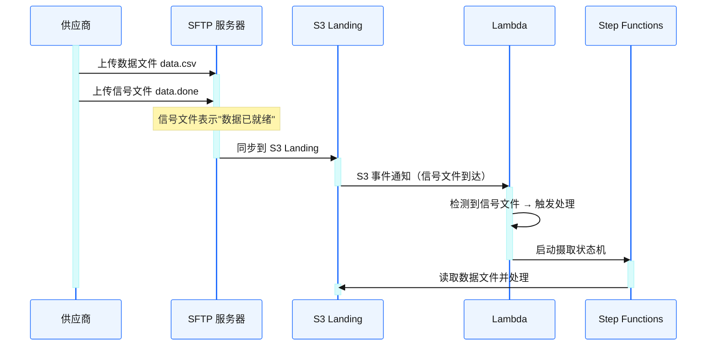
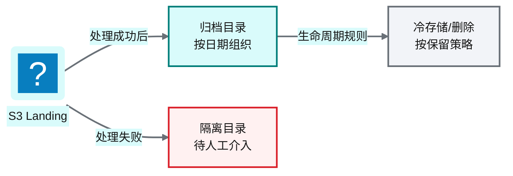
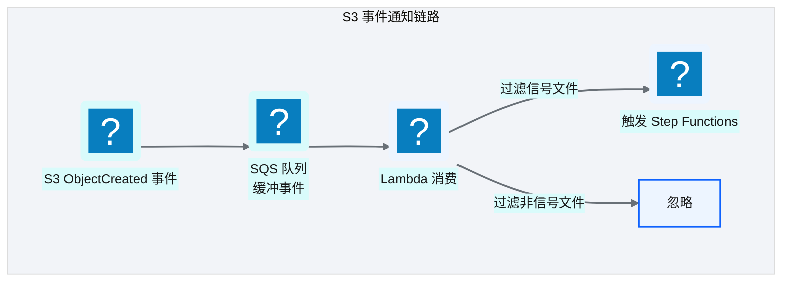
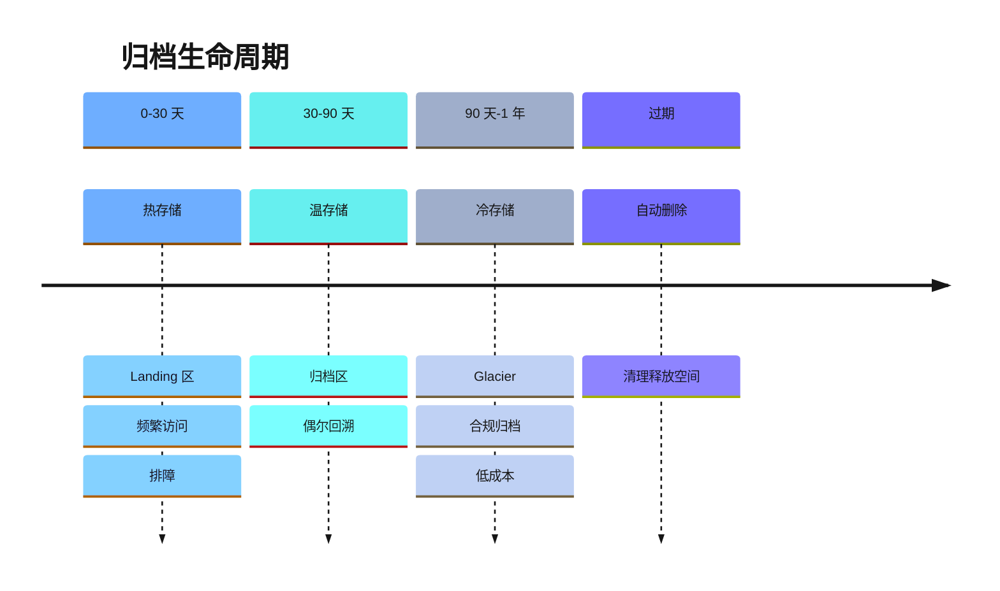
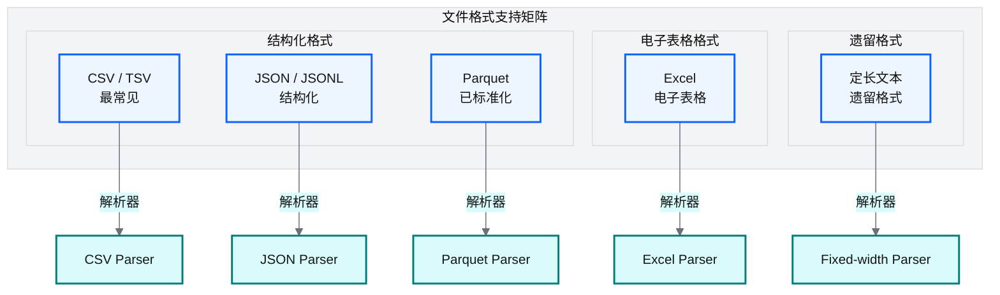
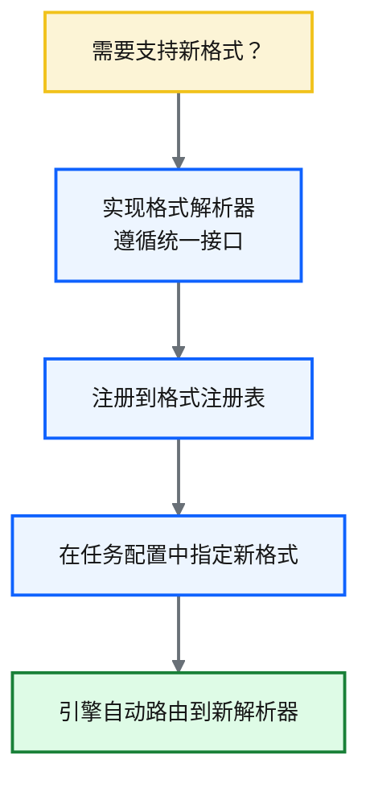

# Ch 15 文件与 S3 连接器

!!! info "面包屑"
    [本书主页](./index.md) › [Part III 数据工程实践](./14-数据库与JDBC连接器.md) › Ch 15

!!! abstract "项目第 1 年 · 核心建设期——文件连接器"

---

## :material-school: 本章你将学到
- 文件源摄取与信号文件事件驱动触发机制
- S3 事件触发与归档生命周期策略
- 文件格式支持与扩展点设计（含 FormatParser 抽象基类 + 格式注册表伪代码）
- 编码检测与处理（UTF-8 vs GBK 中文数据痛点）
- 文件大小限制与多文件数据集处理

---

## 15.1 文件源摄取与信号文件事件驱动触发

### 信号文件协议

文件源（如 SFTP）的数据到达是异步的——供应商可能在任意时间推送文件。平台通过**信号文件**机制实现事件驱动触发：


<p class="caption" markdown="span">**图 15-1** 信号文件协议</p>

### 为什么用信号文件而非直接检测数据文件

| 方案 | 问题 |
|---|---|
| **直接检测数据文件到达** | 大文件上传中途会触发事件 → 处理不完整文件 → 失败 |
| **信号文件协议** | 数据文件先传完，再传一个小的信号文件 → 信号文件到达 = 数据完整就绪 |
<p class="caption" markdown="span">**表 15-1** 为什么用信号文件而非直接检测数据文件</p>


!!! tip "引申"
    信号文件是分布式系统中"两阶段提交"的轻量版——先用大文件传数据，再用小文件传"就绪信号"。这避免了"处理到一半的文件"问题。这种模式在 EDI（电子数据交换）和银行业数据交换中非常常见。

### 归档与清理


<p class="caption" markdown="span">**图 15-2** 归档与清理</p>

---

## 15.2 S3 事件触发与归档策略

### S3 事件通知机制


<p class="caption" markdown="span">**图 15-3** S3 事件通知机制</p>

| 设计要点 | 说明 |
|---|---|
| **事件过滤** | Lambda 只对信号文件事件触发处理，忽略数据文件事件 |
| **SQS 缓冲** | 用 SQS 缓冲 S3 事件，避免大量并发文件到达时 Lambda 被打爆 |
| **幂等处理** | 同一文件可能触发多次事件，处理逻辑需幂等 |
| **归档分离** | 处理完后移至归档目录，Landing 区只保留待处理文件 |
<p class="caption" markdown="span">**表 15-2** S3 事件通知机制</p>


### 归档生命周期


<p class="caption" markdown="span">**图 15-4** 归档生命周期</p>

!!! warning "Trade-off"
    归档保留期是成本与合规的 trade-off。医药行业 GxP 要求"数据可追溯"，但"可追溯"不等于"永久热存储"。我们的策略是：热 30 天（排障用）→ 温 90 天（回溯用）→ 冷 1 年（合规用）→ 删除。这比"全量永久热存"节省 80%+ 存储成本。

---

## 15.3 文件格式支持与扩展点设计

### 支持的文件格式


<p class="caption" markdown="span">**图 15-5** 支持的文件格式</p>

| 格式 | 扩展名 | 特点 | 适用场景 | 解析器 |
|------|--------|------|----------|--------|
| **CSV / TSV** | `.csv`, `.tsv` | 文本、通用、人类可读 | 数据交换、日志导出 | `CsvParser` |
| **JSON / JSONL** | `.json`, `.jsonl` | 结构化、嵌套支持 | API 响应、事件流 | `JsonParser` |
| **Excel** | `.xlsx`, `.xls` | 电子表格、多 Sheet | 业务报表、手动数据 | `ExcelParser` |
| **Parquet** | `.parquet` | 列式存储、压缩高效 | 大数据处理、数据湖 | `ParquetParser` |
| **定长文本** | `.txt`, `.dat` | 固定宽度列、遗留格式 | 遗留系统导出 | `FixedWidthParser` |
<p class="caption" markdown="span">**表 15-3** 文件格式支持矩阵</p>

### 扩展点设计

新增文件格式的扩展遵循**开闭原则**：


<p class="caption" markdown="span">**图 15-6** 扩展点设计</p>

| 扩展步骤 | 说明 |
|---|---|
| ① 实现解析器 | 遵循统一接口：输入文件路径 → 输出标准化 DataFrame |
| ② 注册 | 在格式注册表中注册新格式标识 |
| ③ 配置 | 任务配置中指定新格式标识 |
| ④ 运行 | 引擎自动路由——无需改动公共后处理逻辑 |
<p class="caption" markdown="span">**表 15-4** 扩展点设计</p>


!!! tip "引申"
    扩展点设计的关键是"统一接口"。所有格式解析器实现同一个接口（输入文件→输出 DataFrame），引擎只依赖接口而非具体实现。这是"依赖倒置原则"的体现——高层模块（引擎）不依赖低层模块（具体格式解析器），两者都依赖抽象（统一接口）。

把这个统一接口落到代码，就是 `FormatParser` 抽象基类 + 各格式实现 + 格式注册表——引擎通过注册表按扩展名查找解析器，新增格式只需注册新实现：

```python
# 示意：FormatParser 抽象基类 + 格式注册表
from abc import ABC, abstractmethod
from pyspark.sql import DataFrame

class FormatParser(ABC):
    """统一接口：输入文件路径 → 输出标准化 DataFrame。"""
    @abstractmethod
    def parse(self, file_path: str, spark) -> DataFrame: ...

class CsvParser(FormatParser):
    def parse(self, file_path, spark):
        return (spark.read.option("header", True).option("encoding", detect_encoding(file_path))
                    .csv(file_path))                          # 核心意图：编码自动检测（见下）

class ExcelParser(FormatParser):
    def parse(self, file_path, spark):
        # Excel 需先转 CSV（pandas read_excel → pandas_df → spark_df）
        import pandas as pd
        pdf = pd.read_excel(file_path, sheet_name=0)
        return spark.createDataFrame(pdf)

# 格式注册表：扩展名 → 解析器（新增格式只加一行）
FORMAT_REGISTRY = {".csv": CsvParser(), ".xlsx": ExcelParser(), ".json": JsonParser()}

def parse_file(file_path: str, spark) -> DataFrame:
    ext = Path(file_path).suffix.lower()
    return FORMAT_REGISTRY[ext].parse(file_path, spark)        # 核心意图：引擎只依赖接口，不依赖具体实现
```

## 15.4 编码检测与处理：中文数据的隐形陷阱

文件连接器最隐蔽的坑是**编码**——上游系统导出的 CSV 可能是 UTF-8、GBK、GB2312，混用时会乱码或解析失败。这在医药行业尤其常见：医院系统的老旧导出工具常默认 GBK 编码，而平台默认按 UTF-8 读取，结果中文全部变成乱码。

```python
# 示意：编码自动检测（chardet）
import chardet

def detect_encoding(file_path: str) -> str:
    with open(file_path, "rb") as f:
        raw = f.read(10000)                                    # 读前 10KB 检测即可
    result = chardet.detect(raw)
    # 核心意图：自动检测编码，避免硬编码 UTF-8 导致中文乱码
    return result["encoding"] or "utf-8"                       # 检测失败回退 UTF-8
```

| 编码场景 | 问题 | 应对 |
|---|---|---|
| 上游用 GBK，平台按 UTF-8 读 | 中文乱码 | `detect_encoding` 自动检测 |
| 同一批文件混用编码 | 部分行乱码 | 按文件检测，不假设同批一致 |
| BOM 头（UTF-8 with BOM） | 首列名多出不可见字符 | `encoding="utf-8-sig"` 处理 BOM |
| Excel 内部编码与导出不同 | pandas 读正常，Spark 读乱码 | 统一用 pandas 中转 + 显式 encoding |
<p class="caption" markdown="span">**表 15-5** 示意：编码自动检测（chardet）</p>


!!! warning "Trade-off"
    编码检测不是 100% 准确——`chardet` 对短文本或纯 ASCII 文件可能误判。关键数据应在 Landing 层记录原始编码，Raw 层统一转 UTF-8，后续层不再处理编码问题。这是"在最早层解决问题"的原则——编码问题越往后传，排查越难。

## 15.5 文件大小限制与多文件数据集处理

文件连接器还要处理两类现实问题：**超大文件**（内存溢出）和**多文件数据集**（一个逻辑数据集散落在多个文件）。

| 场景 | 问题 | 应对 |
|---|---|---|
| **超大文件**（>1GB CSV） | 单次读取内存溢出 | :simple-apachespark: Spark 天然分块读 CSV；非 Spark 场景用分块流式读取 |
| **多文件数据集** | 一个表的数据分成 `part-001.csv`、`part-002.csv`... | Spark `spark.read.csv("s3://.../dir/")` 自动读目录下所有文件合并 |
| **异构文件混合** | 目录里混有 CSV 和 Excel | 信号文件协议（§15.1）按目录触发，解析器按扩展名分发 |
| **空文件/损坏文件** | 解析失败 | 连接器容错（[Ch 13](./13-连接器框架总览.md) DLQ） |
<p class="caption" markdown="span">**表 15-6** 文件大小限制与多文件数据集处理</p>


```python
# 示意：多文件数据集处理（Spark 自动合并目录下文件）
def parse_dataset(dir_path: str, spark) -> DataFrame:
    # 核心意图：读目录而非单文件，Spark 自动合并多文件为一个 DataFrame
    files = list_s3_objects(dir_path)                          # 列出目录下所有文件
    if not files:
        raise EmptyDatasetError(f"{dir_path} 无文件")          # 空数据集告警（[Ch 49](./49-日志-监控-审计与告警.md)）
    ext = Path(files[0]).suffix.lower()                        # 假设同目录同格式
    if any(Path(f).suffix.lower() != ext for f in files):
        raise HeterogeneousFilesError("目录内格式不一致")      # 异构文件阻断
    return FORMAT_REGISTRY[ext].parse(dir_path + "/*", spark)  # Spark 通配读多文件
```

---

## :material-check-circle: 本章小结
- 文件源通过信号文件协议实现事件驱动触发：数据文件先传完，信号文件到达表示就绪——避免处理不完整文件
- S3 事件通知经 SQS 缓冲后由 Lambda 消费，过滤信号文件触发处理；归档分热/温/冷三级生命周期，平衡成本与合规
- 文件格式支持通过"统一接口 + 格式注册表"实现开闭原则扩展——新增格式只需实现解析器并注册

---

!!! quote "下一章"
    [Ch 16 API、SaaS 与邮件连接器](./16-API-SaaS与邮件连接器.md) —— 接下来看剩余三类连接器：API/SaaS/邮件的通用设计与实战。

