# Ch 16 API、SaaS 与邮件连接器

!!! info "面包屑"
    [本书主页](./index.md) › [Part III 数据工程实践](./15-文件与S3连接器.md) › Ch 16

!!! abstract "项目第 1 年 · 核心建设期——API/邮件连接器"

---

## :material-school: 本章你将学到
- 通用 REST 客户端设计：认证体系、分页策略、容错重试
- SaaS 平台批量抽取与双向任务监控
- 企业邮件附件自动化摄取的架构设计

---

## 16.1 通用 REST 客户端设计：认证体系、分页策略、容错重试

API 连接器是最复杂的连接器类型——每个 API 的认证方式、分页方式、错误码都不一样。通用 REST 客户端需要把这些差异抽象成可配置的策略。

```mermaid
%%{init: {'theme':'base','themeVariables':{'primaryColor':'#edf5ff','primaryTextColor':'#161616','primaryBorderColor':'#0f62fe','lineColor':'#697077','secondaryColor':'#d9fbfb','tertiaryColor':'#f2f4f8','fontSize':'14px'}}}%%
flowchart TB
    classDef bpProcess fill:#edf5ff,stroke:#0f62fe,stroke-width:2px,color:#161616
    classDef bpData fill:#d9fbfb,stroke:#007d79,stroke-width:2px,color:#161616
    classDef bpDecision fill:#fcf4d6,stroke:#f1c21b,stroke-width:2px,color:#161616
    classDef bpSuccess fill:#defbe6,stroke:#198038,stroke-width:2px,color:#161616
    classDef bpError fill:#fff1f1,stroke:#da1e28,stroke-width:2px,color:#161616
    classDef bpExternal fill:#f2f4f8,stroke:#697077,stroke-width:2px,color:#161616
    classDef bpInfo fill:#f6f2ff,stroke:#8a3ffc,stroke-width:2px,color:#161616
    linkStyle default stroke:#697077,stroke-width:2px,fill:none

    subgraph 通用REST客户端["通用 REST 客户端架构"]
        AUTH[认证策略层<br/>Token / API Key / OAuth / 签名]
        REQ[请求构造层<br/>URL / Headers / Params / Body]
        PAGE[分页策略层<br/>Offset / Cursor / Page / Link]
        RETRY[容错重试层<br/>指数退避 / 熔断 / 限流]
        PARSE[响应解析层<br/>JSON / XML / CSV]
    end

    AUTH --> REQ --> PAGE --> RETRY --> PARSE

    class AUTH,REQ,PAGE,RETRY,PARSE bpProcess
```
<p class="caption" markdown="span">**图 16-1** 通用 REST 客户端设计：认证体系、分页策略、容错重试</p>

### 认证策略

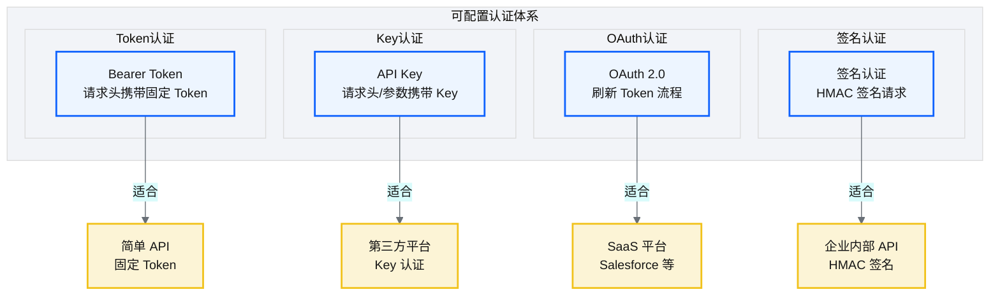
<p class="caption" markdown="span">**图 16-2** 认证策略</p>

| 认证策略 | 机制 | 适合场景 | 配置要点 | 安全考虑 |
|----------|------|----------|----------|----------|
| **Bearer Token** | 请求头携带固定 Token | 简单 API | Token 存 Secrets Manager | Token 泄露风险 |
| **API Key** | 请求头/参数携带 Key | 第三方平台 | Key 存 Secrets Manager | Key 轮转策略 |
| **OAuth 2.0** | 刷新 Token 流程 | SaaS 平台（Salesforce 等） | Client ID/Secret + 刷新流程 | Token 自动刷新 |
| **签名认证** | HMAC 签名请求 | 企业内部 API | 密钥 + 签名算法 | 请求防篡改 |
<p class="caption" markdown="span">**表 16-1** 认证策略矩阵</p>

| 认证策略 | 适合场景 | 配置要点 |
|---|---|---|
| Bearer Token | 简单 API | Token 存 Secrets Manager |
| API Key | 第三方平台 | Key 存 Secrets Manager |
| OAuth 2.0 | SaaS 平台（:material-cloud-braces: Salesforce 等） | Client ID/Secret + 刷新流程 |
| 签名认证 | 企业内部 API | 密钥 + 签名算法 |
<p class="caption" markdown="span">**表 16-2** 认证策略</p>


!!! tip "引申"
    认证策略的可配置化是"策略模式"的典型应用。不要为每种认证写一个客户端——定义统一的认证接口，不同策略实现不同接口，运行时按配置选择。新增一种认证方式只需加一个策略实现。

把策略模式落到代码，就是统一认证接口 + 各策略实现，OAuth2 客户端凭证流是最典型也最复杂的一种：

```python
# 示意：认证策略模式——统一接口 + OAuth2 客户端凭证流实现
from abc import ABC, abstractmethod
import requests, boto3

class AuthStrategy(ABC):
    """统一认证接口：给请求注入凭证。"""
    @abstractmethod
    def apply(self, request: dict) -> dict: ...

class BearerTokenAuth(AuthStrategy):
    def __init__(self, token_secret_arn: str):
        self.token = boto3.client("secretsmanager").get_secret_value(SecretId=token_secret_arn)["SecretString"]
    def apply(self, request: dict) -> dict:
        request["headers"]["Authorization"] = f"Bearer {self.token}"   # 核心意图：固定 Token
        return request

class OAuth2ClientCredentialsAuth(AuthStrategy):
    def __init__(self, token_url, client_id, client_secret_arn):
        self.token_url, self.client_id = token_url, client_id
        self.client_secret = boto3.client("secretsmanager").get_secret_value(SecretId=client_secret_arn)["SecretString"]
        self._token, self._expires_at = None, 0
    def apply(self, request: dict) -> dict:
        if time.time() >= self._expires_at:                             # 核心意图：Token 过期自动刷新
            resp = requests.post(self.token_url, data={
                "grant_type": "client_credentials",
                "client_id": self.client_id, "client_secret": self.client_secret})
            self._token = resp.json()["access_token"]
            self._expires_at = time.time() + resp.json()["expires_in"] - 60  # 提前 60s 刷新
        request["headers"]["Authorization"] = f"Bearer {self._token}"
        return request
```

### 分页策略

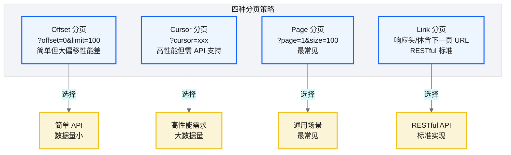
<p class="caption" markdown="span">**图 16-3** 分页策略</p>

| 分页策略 | 参数示例 | 优势 | 劣势 | 适用场景 |
|----------|----------|------|------|----------|
| **Offset 分页** | `?offset=0&limit=100` | 简单直观 | 大偏移性能差（需跳过大量记录） | 简单 API、数据量小 |
| **Cursor 分页** | `?cursor=xxx` | 高性能（基于游标） | 需 API 支持游标 | 高性能需求、大数据量 |
| **Page 分页** | `?page=1&size=100` | 最常见、易理解 | 页码变化时可能重复/遗漏 | 通用场景 |
| **Link 分页** | 响应头含 `Link: <url>; rel="next"` | RESTful 标准、自描述 | 需解析响应头 | RESTful API |
<p class="caption" markdown="span">**表 16-3** 分页策略对比</p>

分页策略落到代码是一个统一的迭代器——不管哪种分页方式，对外都暴露"逐页拉取 + 检查点续传"的接口，分页中断后可从上一页游标恢复：

```python
# 示意：统一分页迭代器 + 检查点续传
def paginate(client, url, auth, page_strategy, checkpoint=None):
    cursor = checkpoint or page_strategy.initial_cursor()       # 核心意图：中断可续传
    while cursor is not None:
        resp = auth.apply({"url": url, "params": page_strategy.params(cursor)}).request()
        if not resp.ok:
            raise PageError(cursor, resp.status_code)           # 失败时保存 cursor 到 DLQ
        yield resp.json()["items"]                              # 逐页产出
        save_checkpoint(url, cursor)                            # 持久化游标（DynamoDB）
        cursor = page_strategy.next_cursor(resp)                # Link: resp.headers["Next"]; Cursor: resp["next_cursor"]
```

### 容错重试

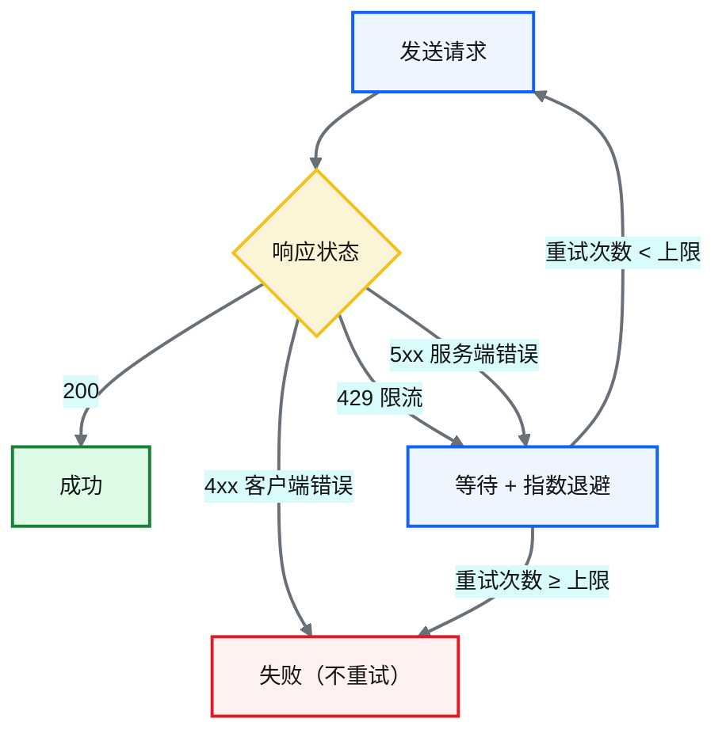
<p class="caption" markdown="span">**图 16-4** 容错重试</p>

| 重试场景 | 策略 |
|---|---|
| 429 Too Many Requests | 指数退避 + 尊重 Retry-After 头 |
| 5xx 服务端错误 | 指数退避重试 |
| 4xx 客户端错误 | 不重试（请求本身有问题） |
| 网络超时 | 重试 + 告警 |
<p class="caption" markdown="span">**表 16-4** 容错重试</p>


容错重试的标准实现是指数退避 + 抖动装饰器，对可重试错误（5xx/429/超时）自动重试，对不可重试错误（4xx）立即失败：

```python
# 示意：指数退避重试装饰器（含抖动，避免惊群效应）
import random, time
RETRYABLE = {429, 500, 502, 503, 504}

def retry_with_backoff(max_retries=5, initial=1.0, max_wait=60.0, multiplier=2.0):
    def decorator(fn):
        def wrapper(*args, **kwargs):
            attempt, wait = 0, initial
            while True:
                try:
                    return fn(*args, **kwargs)
                except (HTTPError, Timeout) as e:
                    if getattr(e, "status", 0) not in RETRYABLE or attempt >= max_retries:
                        raise                                          # 4xx 或达上限：不重试
                    jitter = random.uniform(0, wait * 0.3)             # 核心意图：抖动打散重试
                    time.sleep(min(wait + jitter, max_wait))           # 指数退避 + 上限
                    wait *= multiplier
                    attempt += 1
        return wrapper
    return decorator
```

### 速率限制与重试

重试解决"偶发失败"，但有些 API 失败的根因是**我们自己打太快了**——超过 API 的速率限制。对这类 API，光重试不够，还要主动限流。常用的是**令牌桶算法**：以固定速率往桶里放令牌，每次请求消耗一个令牌，桶空了就等：

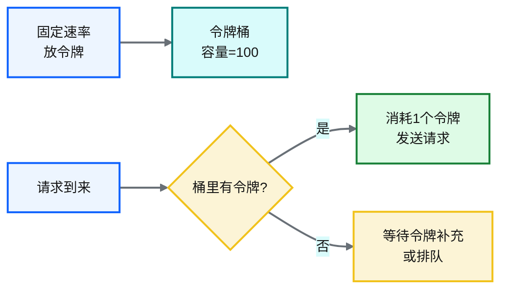
<p class="caption" markdown="span">**图 16-5** 速率限制与重试</p>

| 限流机制 | 做法 | 适用 |
|---|---|---|
| **令牌桶** | 固定速率放令牌，请求消耗令牌，桶空则等 | 允许短时突发（桶容量内） |
| **漏桶** | 请求进队列，固定速率出队处理 | 严格匀速，无突发 |
| **并发数限制** | 限制同时进行中的请求数 | 保护下游连接池 |
<p class="caption" markdown="span">**表 16-5** 速率限制与重试</p>


限流要和重试配合——限流在前（主动避免超限），重试在后（被动应对超限后的 429）。两者一起构成 API 连接器的"流量治理"层。在分页迭代器里，每个 `request()` 调用前先过令牌桶，429 后由重试装饰器兜底。

!!! warning "Trade-off"
    重试是必要的，但"暴力重试"可能加剧 API 服务端压力（"惊群效应"）。指数退避（每次等待时间翻倍）+ 抖动（加随机偏移）是标准做法。另外要区分"可重试错误"（5xx/429）和"不可重试错误"（4xx），避免无意义重试。

---

## 16.2 SaaS 平台批量抽取与双向任务监控

以 Salesforce 为例，SaaS 连接器有两个特殊需求：**批量抽取**和**双向任务监控**。

### 批量抽取

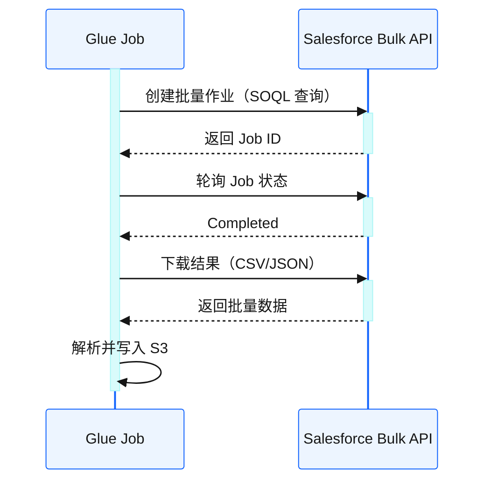
<p class="caption" markdown="span">**图 16-6** 批量抽取</p>

SaaS 平台数据量大，不能用普通 REST API 逐条查——必须用**批量 API**（如 Salesforce Bulk API v2），异步提交查询、轮询状态、下载结果。

我选 Bulk API 而非普通 REST API，是被 Salesforce 的限流逼的。最初我用 REST API 逐条查 Salesforce 的处方数据——SOQL `SELECT ... LIMIT 200` 分页拉取。结果拉到第 50 页时 Salesforce 返回 429（限流），因为 REST API 的调用频率有上限（每秒 100 次）。而 Salesforce 有几百万条处方记录，按 200 条/页要拉几万次——远超限流。换成 Bulk API v2 后，一次提交 SOQL 查询，Salesforce 后台异步执行，完成后批量下载——几百万条记录一次作业搞定，不触发限流。SaaS 平台的数据量决定了必须用批量 API——REST 逐条查在百万级数据下不可行。这是 SaaS 连接器和普通 API 连接器的本质区别。

### 双向任务监控

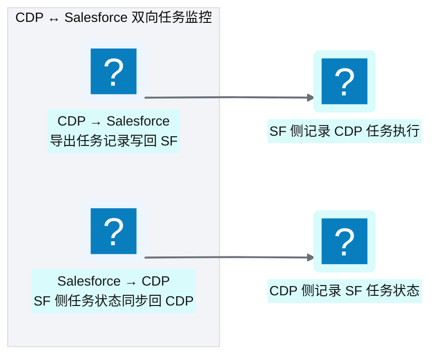
<p class="caption" markdown="span">**图 16-7** 双向任务监控</p>

双向监控的价值是端到端可观测——无论从 CDP 侧还是 Salesforce 侧，都能看到任务的完整状态。这在跨系统协作时非常重要——"数据导出到 Salesforce 了没？"不需要登两个系统查。

这个双向监控设计，是我在第一年的一次"跨系统甩锅"事件后加的。当时有个导出任务从 CDP 推数据到 Salesforce，CDP 侧显示"成功"，但 Salesforce 侧没有数据。CDP 团队说"我们推成功了"，Salesforce 管理员说"我们没收到"——双方各看各的系统，查了一天才发现在 CDP 成功后、Salesforce 接收前，网络中断了——数据丢了。这次事件让我意识到：跨系统任务不能只看一侧的状态——必须有双向监控。CDP 侧记录"我推了什么"，Salesforce 侧记录"我收到了什么"，两边对账才能发现中间丢失。从那以后，所有跨系统任务都配双向监控+对账——CDP 推送后查 Salesforce 是否收到，Salesforce 接收后回执 CDP。跨系统协作的最大风险不是"失败"，而是"假成功"——一侧显示成功但另一侧没收到，这种"静默丢失"比报错更危险。

---

## 16.3 企业邮件附件自动化摄取

邮件附件是医药行业常见的数据交换方式——业务团队习惯用 :fontawesome-solid-file-excel: Excel 整理数据，通过邮件发送给数据平台。这类"非标准"数据源需要专门的连接器处理。

### 两类邮件摄取场景

| 场景 | 数据源 | 技术栈 | 触发方式 |
|------|--------|--------|----------|
| **AWS SES 企业邮箱** | 供应商/分销商 | SES + Lambda | 事件驱动（实时） |
| **Outlook 企业邮箱** | 内部业务用户 | Microsoft Graph API + Glue | 定时轮询（T+1） |
<p class="caption" markdown="span">**表 16-6** 两类邮件摄取场景</p>

---

### 场景一：AWS SES 企业邮箱（供应商数据）

供应商通过企业邮箱发送 CSV/Excel 附件，平台通过 SES 事件驱动实时处理。

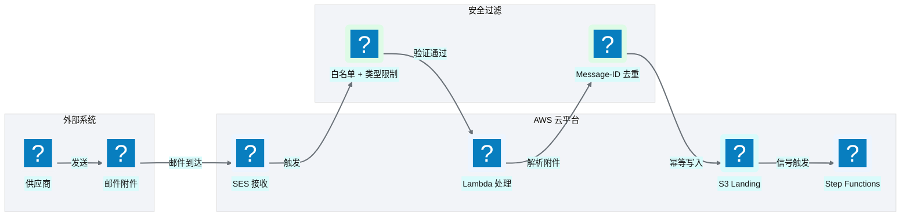
<p class="caption" markdown="span">**图 16-8** AWS SES 邮件摄取架构</p>

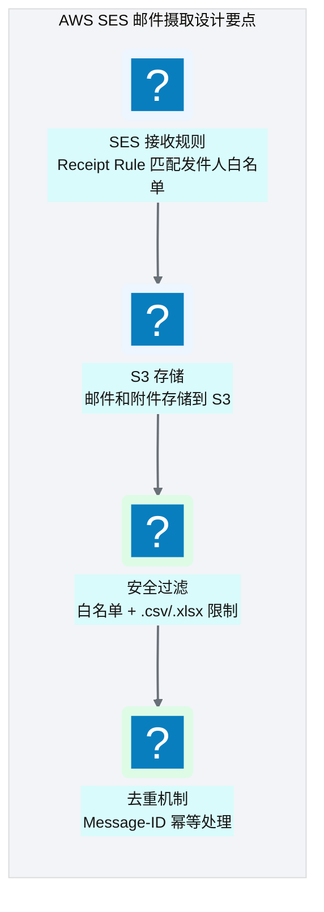
<p class="caption" markdown="span">**图 16-9** AWS SES 邮件摄取设计要点</p>

---

### 场景二：Outlook 企业邮箱（业务用户数据）

这是更常见的场景——业务用户习惯用 :fontawesome-solid-file-excel: Excel 整理数据，通过 Outlook 邮件发送给数据平台专用邮箱。平台通过 **Microsoft Graph API** 定时扫描未读邮件，按配置规则匹配目标邮件，解析附件后进入标准数据管线。

#### 业务场景

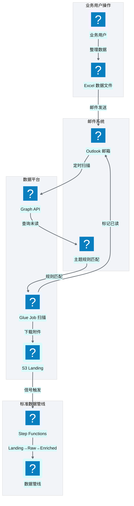
<p class="caption" markdown="span">**图 16-10** Outlook 邮件摄取业务流程</p>

典型场景：
- **市场准入数据**：市场团队每月整理医院准入状态 Excel，邮件发送至 `data-platform@aurora.com`
- **销售目标数据**：销售运营每季度更新目标分配 Excel，邮件主题格式 `[数据平台] 销售目标-Q2-2026`
- **合规报告数据**：质量团队按月发送 GxP 合规检查 Excel，邮件主题格式 `[数据平台] GxP合规报告-202606`

#### 架构设计

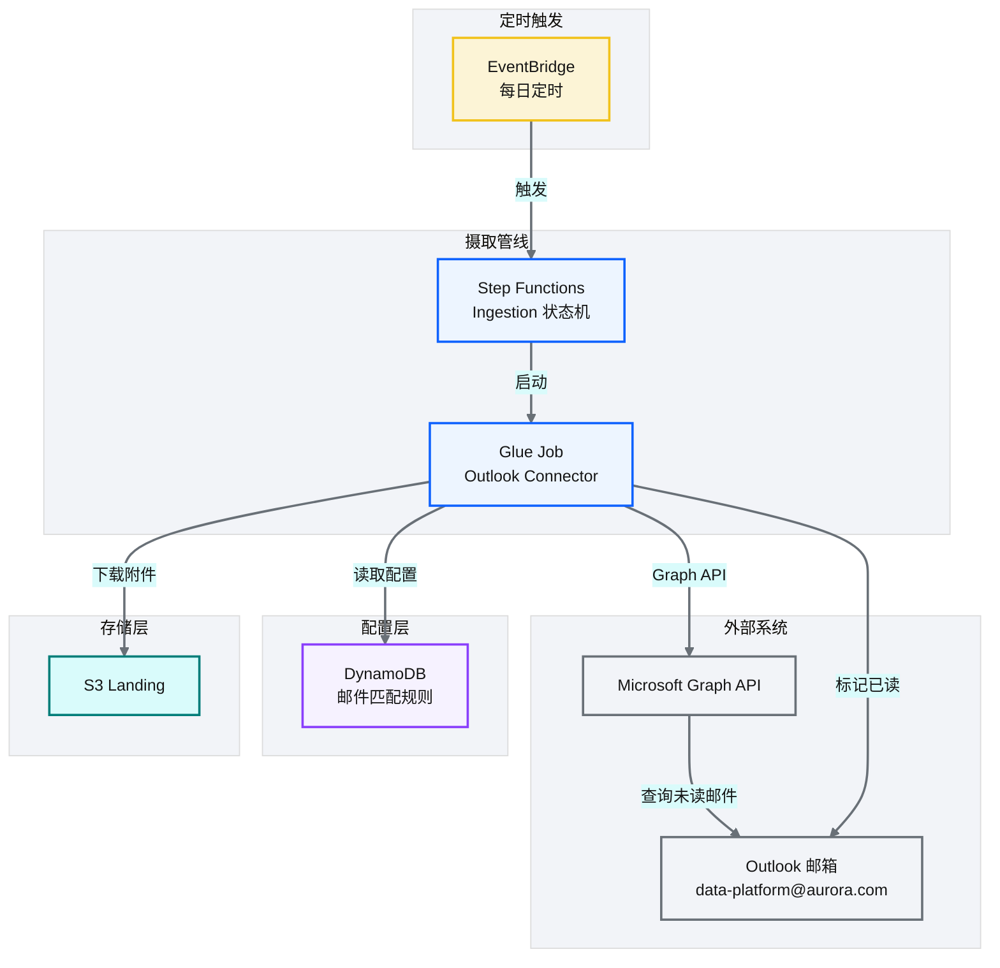
<p class="caption" markdown="span">**图 16-11** Outlook 邮件摄取架构设计</p>

#### 邮件匹配规则配置

业务开发通过 DynamoDB 配置邮件匹配规则，无需修改代码：

```json
// 示意：DynamoDB 邮件匹配规则配置
{
  "connector_id": "outlook-market-access",
  "mailbox": "data-platform@aurora.com",
  "match_rules": {
    "subject_pattern": "\\[数据平台\\]\\s*市场准入.*",
    "sender_whitelist": ["user1@aurora.com", "user2@aurora.com"],
    "attachment_extensions": [".xlsx", ".xls"],
    "attachment_name_pattern": "准入状态.*\\.xlsx"
  },
  "target": {
    "domain": "ma",
    "entity": "hospital_access_status",
    "s3_path": "s3://ap-aurora-cdp-landing/ma/hospital_access_status/"
  },
  "schedule": "cron(0 8 * * ? *)"
}
```

| 配置字段 | 说明 | 示例 |
|----------|------|------|
| `connector_id` | 连接器唯一标识 | `outlook-market-access` |
| `mailbox` | 目标邮箱地址 | `data-platform@aurora.com` |
| `subject_pattern` | 邮件主题正则匹配 | `\\[数据平台\\]\\s*市场准入.*` |
| `sender_whitelist` | 发件人白名单 | `["user1@aurora.com"]` |
| `attachment_extensions` | 允许的附件扩展名 | `[".xlsx", ".xls"]` |
| `attachment_name_pattern` | 附件名正则匹配 | `准入状态.*\\.xlsx` |
| `target.domain` | 目标业务域 | `ma` |
| `target.entity` | 目标数据实体 | `hospital_access_status` |
<p class="caption" markdown="span">**表 16-7** 邮件匹配规则配置字段</p>

#### Glue Job 核心逻辑（伪代码）

```python
# 示意：Outlook Connector Glue Job 核心逻辑
import msal
import requests
import boto3
import re
from datetime import datetime

class OutlookConnector:
    """Outlook 邮件连接器：通过 Microsoft Graph API 扫描邮箱、下载附件、标记已读。"""
    
    def __init__(self, config):
        self.config = config
        self.mailbox = config["mailbox"]
        self.dynamodb = boto3.resource("dynamodb")
        
    def get_access_token(self):
        """获取 Microsoft Graph API 访问令牌（OAuth2 客户端凭证流）。"""
        app = msal.ConfidentialClientApplication(
            client_id=self.config["client_id"],
            client_credential=self.config["client_secret"],
            authority=f"https://login.microsoftonline.com/{self.config['tenant_id']}"
        )
        result = app.acquire_token_for_client(
            scopes=["https://graph.microsoft.com/.default"]
        )
        return result["access_token"]
    
    def scan_unread_messages(self, access_token):
        """扫描未读邮件，按配置规则过滤。"""
        # 核心意图：查询未读邮件，按主题正则匹配
        filter_expr = f"isRead eq false and contains(subject, '{self.config['match_rules']['subject_keyword']}')"
        url = f"https://graph.microsoft.com/v1.0/users/{self.mailbox}/messages"
        headers = {"Authorization": f"Bearer {access_token}"}
        params = {"$filter": filter_expr, "$top": 50}
        
        response = requests.get(url, headers=headers, params=params)
        messages = response.json().get("value", [])
        
        # 按发件人白名单和主题正则进一步过滤
        matched = []
        for msg in messages:
            sender = msg["sender"]["emailAddress"]["address"]
            subject = msg["subject"]
            
            if sender in self.config["match_rules"]["sender_whitelist"]:
                if re.match(self.config["match_rules"]["subject_pattern"], subject):
                    matched.append(msg)
        
        return matched
    
    def download_attachments(self, access_token, message_id):
        """下载邮件附件到 S3 Landing。"""
        url = f"https://graph.microsoft.com/v1.0/users/{self.mailbox}/messages/{message_id}/attachments"
        headers = {"Authorization": f"Bearer {access_token}"}
        
        response = requests.get(url, headers=headers)
        attachments = response.json().get("value", [])
        
        s3 = boto3.client("s3")
        for att in attachments:
            if att["@odata.type"] == "#microsoft.graph.fileAttachment":
                filename = att["name"]
                # 检查附件扩展名和名称模式
                if self._match_attachment(filename):
                    s3_key = f"{self.config['target']['s3_path']}{filename}"
                    s3.put_object(
                        Bucket=s3_key.split("/")[2],
                        Key="/".join(s3_key.split("/")[3:]),
                        body=att["contentBytes"]  # Base64 解码
                    )
    
    def mark_as_read(self, access_token, message_id):
        """处理完成后将邮件标记为已读。"""
        url = f"https://graph.microsoft.com/v1.0/users/{self.mailbox}/messages/{message_id}"
        headers = {
            "Authorization": f"Bearer {access_token}",
            "Content-Type": "application/json"
        }
        payload = {"isRead": True}
        requests.patch(url, headers=headers, json=payload)
    
    def _match_attachment(self, filename):
        """检查附件是否匹配配置的扩展名和名称模式。"""
        ext = "." + filename.split(".")[-1].lower()
        if ext not in self.config["match_rules"]["attachment_extensions"]:
            return False
        if "attachment_name_pattern" in self.config["match_rules"]:
            return re.match(self.config["match_rules"]["attachment_name_pattern"], filename)
        return True
```

#### Microsoft Graph API 认证配置

Outlook 连接器使用 OAuth2 客户端凭证流（Client Credentials Flow）访问 Microsoft Graph API：

| 配置项 | 说明 | 存储位置 |
|--------|------|----------|
| `tenant_id` | Azure AD 租户 ID | Secrets Manager |
| `client_id` | 应用注册 Client ID | Secrets Manager |
| `client_secret` | 应用注册 Client Secret | Secrets Manager |
| `mailbox` | 目标邮箱地址 | DynamoDB 配置 |

<p class="caption" markdown="span">**表 16-8** Microsoft Graph API 认证配置</p>

**Azure AD 应用注册权限**：

- `Mail.Read` — 读取邮件
- `Mail.ReadWrite` — 标记已读

#### 与标准数据管线集成

Outlook 连接器是第六类连接器（文件 / JDBC / API / SaaS / 邮件-SES / **邮件-Outlook**），复用平台的配置驱动架构：

```mermaid
%%{init: {'theme':'base','themeVariables':{'primaryColor':'#edf5ff','primaryTextColor':'#161616','primaryBorderColor':'#0f62fe','lineColor':'#697077','secondaryColor':'#d9fbfb','tertiaryColor':'#f2f4f8'}}}%%
flowchart LR
    classDef bpProcess fill:#edf5ff,stroke:#0f62fe,stroke-width:2px,color:#161616
    classDef bpData fill:#d9fbfb,stroke:#007d79,stroke-width:2px,color:#161616
    classDef bpDecision fill:#fcf4d6,stroke:#f1c21b,stroke-width:2px,color:#161616
    classDef bpSuccess fill:#defbe6,stroke:#198038,stroke-width:2px,color:#161616
    classDef bpExternal fill:#f2f4f8,stroke:#697077,stroke-width:2px,color:#161616
    classDef bpInfo fill:#f6f2ff,stroke:#8a3ffc,stroke-width:2px,color:#161616
    linkStyle default stroke:#697077,stroke-width:2px,fill:none

    subgraph 插件层["Outlook Connector 插件"]
        direction TB
        GLUE[Glue Job<br/>Outlook Connector]
        CONFIG[配置规则<br/>主题/发件人/附件]
        AUTH[OAuth2 认证<br/>Graph API]
    end

    subgraph 标准管线["标准数据管线（复用）"]
        direction TB
        LANDING[S3 Landing]
        SF[Step Functions<br/>Ingestion 状态机]
        RAW[S3 Raw]
        ENRICHED[S3 Enriched]
        RS[Redshift]
    end

    CONFIG -->|运行时读取| GLUE
    AUTH -->|获取凭证| GLUE
    GLUE -->|写入附件| LANDING
    LANDING -->|信号触发| SF
    SF -->|Landing→Raw| RAW
    RAW -->|Raw→Enriched| ENRICHED
    ENRICHED -->|COPY 入仓| RS

    class GLUE,SF bpProcess
    class LANDING,RAW,ENRICHED,RS bpData
    class CONFIG,AUTH bpInfo
```
<p class="caption" markdown="span">**图 16-12** Outlook 连接器与标准管线集成</p>

| 复用组件 | 作用 |
|----------|------|
| **配置驱动** | 邮件匹配规则存 DynamoDB，运行时动态读取 |
| **Step Functions** | 复用 Ingestion 状态机，无需新建编排 |
| **三层 ETL** | Landing → Raw → Enriched 标准流程 |
| **批次标识** | 邮件 Message-ID 作为批次标识，支持追溯 |
| **审计日志** | 邮件处理记录写入审计日志表 |
<p class="caption" markdown="span">**表 16-9** Outlook 连接器复用组件</p>

---

### Trade-off 与演进

!!! warning "Trade-off"
    邮件摄取是"不得已而为之"的方案——理想情况下数据应该通过 API 或 SFTP 交换。但现实是业务用户习惯用 Excel 整理数据，邮件是最自然的传递方式。平台的做法是"接受邮件但标准化处理"——通过配置驱动的连接器将邮件附件转化为标准数据管线的输入。

!!! tip "引申"
    邮件摄取的演进方向：
    1. **推动自助化**：将邮件匹配规则配置暴露为低代码界面（见 [Ch 36](./36-低代码与云混合-零售数据源门户.md)），业务用户自行配置而非依赖开发
    2. **推动数据源升级**：邮件是"过渡方案"，应推动业务改用 SFTP/API 交付
    3. **智能化**：未来可引入 LLM 自动识别邮件主题和附件内容，减少配置依赖

---

## :material-check-circle: 本章小结
- 通用 REST 客户端通过可配置策略层抽象差异：认证（Token/Key/OAuth/签名）/ 分页（Offset/Cursor/Page/Link）/ 容错（指数退避+抖动）
- SaaS 连接器需特殊处理：批量 API 异步抽取 + 双向任务监控实现端到端可观测
- 邮件附件摄取支持两类场景：AWS SES（供应商/事件驱动）和 Outlook（业务用户/定时轮询）
- Outlook 连接器通过 Microsoft Graph API 扫描邮箱，按配置规则（主题正则/发件人白名单/附件类型）匹配目标邮件，下载附件到 S3 后标记已读
- 邮件匹配规则存 DynamoDB，配置驱动无需改代码——第六类连接器复用标准数据管线
- 邮件摄取是过渡方案，应推动上游改用 SFTP/API 或自助化配置

---

!!! quote "下一章"
    [Ch 17 Landing→Raw→Enriched 开发实战](./17-Landing到Raw到Enriched开发实战.md) —— 连接器把数据取到 Landing 了，接下来看三层 ETL 加工的开发实战。

