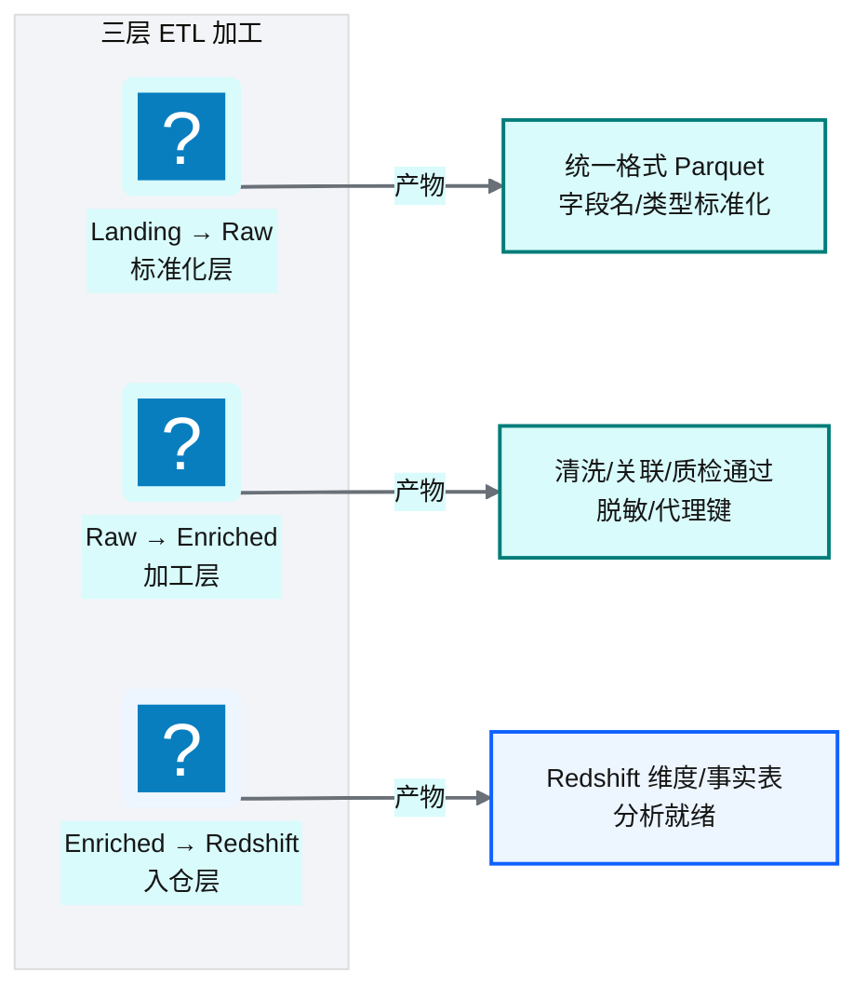
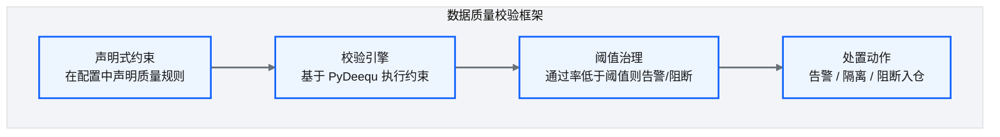
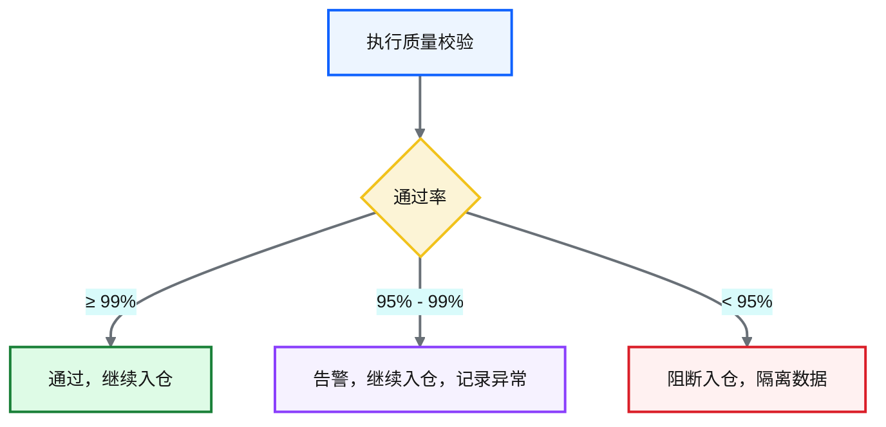
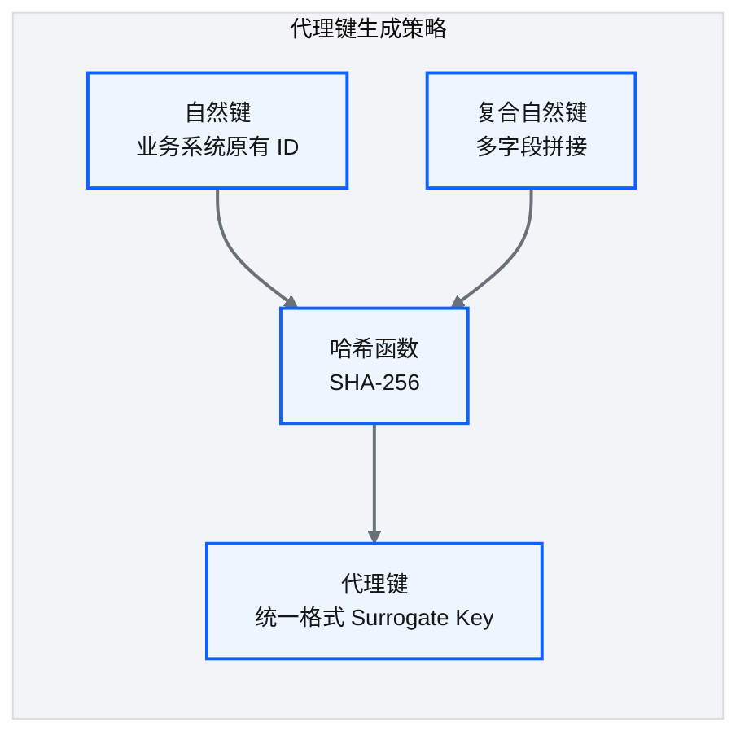
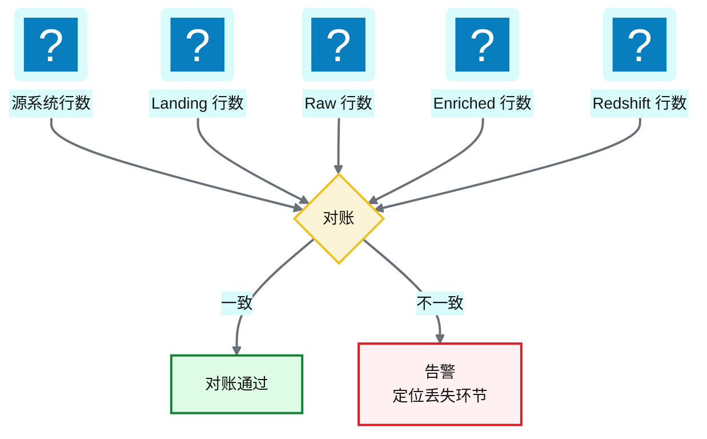

# Ch 17 Landing→Raw→Enriched 开发实战

!!! info "面包屑"
    [本书主页](./index.md) › [Part III 数据工程实践](./16-API-SaaS与邮件连接器.md) › Ch 17

!!! abstract "项目第 1 年 · 核心建设期——三层ETL开发"

---

## :material-school: 本章你将学到
- Landing/Raw/Enriched 三层开发的职责与产物，以及三层 PySpark pipeline 的伪代码
- 数据质量校验框架：约束声明（PyDeequ）与阈值治理
- 代理键生成（哈希 UDF）与行数对账的设计
- Schema 演进处理：防御式 Crawler diff vs 自适应 mergeSchema 的取舍

---

## 17.1 三层开发的职责与产物


<p class="caption" markdown="span">**图 17-1** 三层开发的职责与产物</p>

| 层间转换 | 职责 | 不做什么 |
|---|---|---|
| Landing → Raw | 格式标准化、字段名/类型统一、编码处理 | 不做业务清洗、不做关联 |
| Raw → Enriched | 清洗、关联、质检、脱敏、代理键 | 不改变数据粒度（除非配置要求） |
| Enriched → Redshift | COPY 入仓、建表/改表 DDL | 不做数据加工 |
<p class="caption" markdown="span">**表 17-1** 三层开发的职责与产物</p>


!!! warning "Trade-off"
    三层分离的好处是"每层职责单一、可独立重跑"。代价是数据被写三次（Landing→Raw→Enriched），存储和计算成本更高。另一种方案是"两层"（ :octicons-git-merge-16: 合并 Landing 和 Raw），代价是"原始数据和标准化数据混在一起，重跑困难"。对于医药合规场景，三层的可追溯性优势值得这个成本。

三层职责落到 :simple-apachespark: PySpark 代码，就是三个界限分明的转换阶段——每层只做自己的事，层间通过 Parquet 解耦，任何一层失败可独立重跑：

```python
# 示意：Landing→Raw→Enriched 三层 PySpark pipeline
def run_pipeline(spark, config):
    # ① Landing → Raw：只做格式标准化，不做业务清洗
    raw = (spark.read.parquet(f"s3://ap-aurora-cdp-landing/{config['domain']}/{config['table']}/")
               .withColumnRenamed("col_a", "hospital_id")      # 字段名统一
               .withColumn("biz_date", F.to_date("raw_ts")))   # 类型标准化
    (raw.write.mode("overwrite").partitionBy("biz_date")
         .parquet(f"s3://ap-aurora-cdp-raw/{config['domain']}/{config['table']}/"))

    # ② Raw → Enriched：清洗、关联、质检、脱敏、代理键
    enriched = (spark.read.parquet(f".../raw/{config['table']}/")
                    .dropDuplicates(["hospital_id", "biz_date"])      # 清洗去重
                    .withColumn("sk", surrogate_key_udf("hospital_id"))  # 代理键（见下）
                    .transform(lambda df: apply_masking(df, config))     # 脱敏（见 Ch 18）))
    run_quality_checks(enriched, config)                              # 质检门禁（PyDeequ）
    (enriched.write.mode("overwrite").partitionBy("biz_date")
              .parquet(f"s3://ap-aurora-cdp-enriched/{config['domain']}/{config['table']}/"))

    # ③ Enriched → Redshift：COPY 入仓，不做加工（见 Ch 8）
    redshift_copy(enriched, config)
```

---

## 17.2 数据质量校验框架：约束声明与阈值治理

### 质量校验架构


<p class="caption" markdown="span">**图 17-2** 质量校验架构</p>

声明式约束落到代码就是用 PyDeequ 的 `VerificationSuite` 把上面表格里的约束一行行声明出来，引擎自动生成校验逻辑并执行——比手写 SQL 校验更可维护：

```python
# 示意：PyDeequ 声明式质量校验（约束即声明）
from pydeequ.checks import Check, CheckLevel
from pydeequ.verification import VerificationSuite

def run_quality_checks(df, config):
    check = Check(spark, CheckLevel.Error, "enriched_quality_gate")   # 核心意图：约束即声明
    (check.isComplete("prescription_id")                              # 完整性
          .isUnique("prescription_id")                                # 唯一性
          .isInRange("quantity", (1, 10000))                          # 范围性
          .satisfies("end_date >= start_date", "date_consistency"))   # 一致性
    result = VerificationSuite(spark).onData(df).addCheck(check).run()
    pass_rate = result.checkMetrics.filter("constraint_status='Success'").count() / result.checkMetrics.count()
    if pass_rate < config["block_threshold"]:                         # 阈值治理：低于阈值阻断入仓
        raise QualityGateError(f"质检通过率 {pass_rate:.2%} 低于阻断阈值，隔离数据")
```

### 质量约束类型

| 约束类型 | 说明 | 举例 |
|---|---|---|
| **完整性** | 字段非空 | `prescription_id IS NOT NULL` |
| **唯一性** | 主键不重复 | `COUNT(prescription_id) = COUNT(DISTINCT prescription_id)` |
| **范围性** | 值在合理范围内 | `quantity BETWEEN 1 AND 10000` |
| **一致性** | 跨字段逻辑一致 | `end_date >= start_date` |
| **引用性** | 外键引用有效 | `hospital_id EXISTS IN dim_hospital` |
<p class="caption" markdown="span">**表 17-2** 质量约束类型</p>


### 阈值治理


<p class="caption" markdown="span">**图 17-3** 阈值治理</p>

!!! tip "引申"
    质量校验框架基于 Amazon PyDeequ——一个构建在 Spark 上的数据质量库。它的核心理念是"约束即声明"——你声明期望的约束，引擎自动生成校验逻辑并执行。这比手写 SQL 校验更可维护、更可复用。如果今天重新选型，Great Expectations 也是优秀的开源替代。

---

## 17.3 代理键生成与行数对账

### 代理键生成


<p class="caption" markdown="span">**图 17-4** 代理键生成</p>

| 策略 | 机制 | 优势 | 劣势 |
|---|---|---|---|
| **哈希代理键** | `SHA256(natural_key)` | 确定性、跨源可关联 | 哈希碰撞（概率极低） |
| **自增序列** | 数据库自增 | 简单 | 跨系统不可关联 |
| **UUID** | 随机生成 | 无碰撞 | 不可追溯、索引差 |
<p class="caption" markdown="span">**表 17-3** 代理键生成</p>


平台采用**哈希代理键**——对自然键（可能是复合键）做 SHA-256 哈希，生成确定性代理键。好处是：同一实体在不同源系统中，只要自然键相同，代理键就相同，天然支持跨源关联。

落到代码是一个 UDF：把一个或多个自然键字段拼接后做 SHA-256，复合键用分隔符拼接收敛成单一哈希：

```python
# 示意：哈希代理键 UDF（支持复合自然键）
from pyspark.sql.functions import udf, sha2, concat_ws
import pyspark.sql.functions as F

# 核心意图：复合自然键拼接后哈希，保证跨源同键同代理键
def make_surrogate_key(columns):
    return sha2(concat_ws("||", *columns), 256)     # 分隔符避免 "ab"+"c" 与 "a"+"bc" 撞键

enriched = enriched.withColumn("sk", make_surrogate_key(["hospital_id", "source_system"]))
```

### 行数对账


<p class="caption" markdown="span">**图 17-5** 行数对账</p>

行数对账是**最简单但最有效**的质量保障手段——在每一层记录行数，层间比对。如果 Landing 有 1000 行但 Raw 只有 998 行，说明标准化过程中丢了 2 行，需要排查。

落到代码就是每层写入后捕获行数，写到一个对账表里层间比对：

```python
# 示意：三层行数对账
def reconcile(spark, config, counts: dict):
    # 核心意图：层间行数比对，丢失即告警
    ddb.put_item(Item={"table": config["table"], "batch_id": config["batch_id"], **counts})
    if counts["landing"] != counts["raw"]:
        alert(f"{config['table']} Landing→Raw 丢失 {counts['landing']-counts['raw']} 行")
    if counts["raw"] != counts["enriched"] and not config.get("dedup_enabled"):
        alert(f"{config['table']} Raw→Enriched 行数变化，检查是否预期去重")

# pipeline 各层末尾捕获行数
counts = {"landing": df_landing.count(), "raw": df_raw.count(), "enriched": df_enriched.count()}
reconcile(spark, config, counts)
```

!!! warning "Trade-off"
    行数对账不完美——它检测不到"行数不变但内容错误"的问题（如某行被错误覆盖）。但对于"数据丢失"这类最常见、最致命的问题，行数对账是性价比最高的检测手段。配合质量校验框架，两者互补。

### Schema 演进处理

数据源不是一成不变的——业务系统加字段、改类型、删列是常态。三层 pipeline 如果对 schema 变化没有预案，会出现"上游加了一列，Enriched 层静默丢列"或"类型从 INT 变 VARCHAR，质检门禁全红"的事故。应对 schema 演进有两套方案，各有取舍：

| 方案 | 机制 | 优势 | 劣势 |
|---|---|---|---|
| **A 防御式（Crawler diff）** | Glue Crawler 检测 DDL 变更 → 生成 diff → Lambda 通知 → 人工确认 → 更新 target schema | 可控、变更可审查 | 人工介入，延迟 schema 上线 |
| **B 自适应（mergeSchema）** | 启用 `mergeSchema=true` 自动合并新增列，旧分区 NULL 填充，监控告警删除列/类型变更 | 自动化、无延迟 | 静默合并可能掩盖非预期变更 |
<p class="caption" markdown="span">**表 17-4** Schema 演进处理</p>


```python
# 示意：方案 B 自适应 schema 合并
(spark.read.option("mergeSchema", True)                 # 核心意图：新增列自动合并
      .parquet(f"s3://ap-aurora-cdp-raw/{table}/")
      .write.mode("overwrite")
      .option("mergeSchema", True)
      .parquet(f"s3://ap-aurora-cdp-enriched/{table}/"))
# 删除列 / 类型变更仍需告警，mergeSchema 不处理这两类破坏性变更
```

!!! warning "Trade-off"
    平台默认采用**方案 A（防御式）**——医药合规要求"任何 schema 变更可审查"，静默合并风险过高。方案 B 仅用于非合规敏感域的快速迭代场景。无论哪种方案，删除列和类型变更这两类**破坏性变更**都必须告警——它们会导致下游 Redshift COPY 失败或质检门禁全红。

---

## :material-check-circle: 本章小结
- 三层 ETL：Landing→Raw（标准化）/ Raw→Enriched（加工）/ Enriched→Redshift（入仓），每层职责单一、可独立重跑，三层 PySpark pipeline 界限分明
- 数据质量校验基于声明式约束（PyDeequ VerificationSuite）+ 阈值治理：完整性/唯一性/范围性/一致性/引用性约束，按通过率决定通过/告警/阻断
- 代理键采用哈希策略（SHA-256 of 复合自然键），支持跨源关联；行数对账是最简单有效的数据丢失检测手段
- Schema 演进两套方案：防御式 Crawler diff（医药合规默认，可审查）vs 自适应 mergeSchema（快速迭代），删除列/类型变更必须告警

---

!!! quote "下一章"
    [Ch 18 数据脱敏与隐私治理](./18-数据脱敏与隐私治理.md) —— 数据加工好了，但敏感数据怎么保护？接下来看脱敏策略与 RLS/CLS 协同防护。

