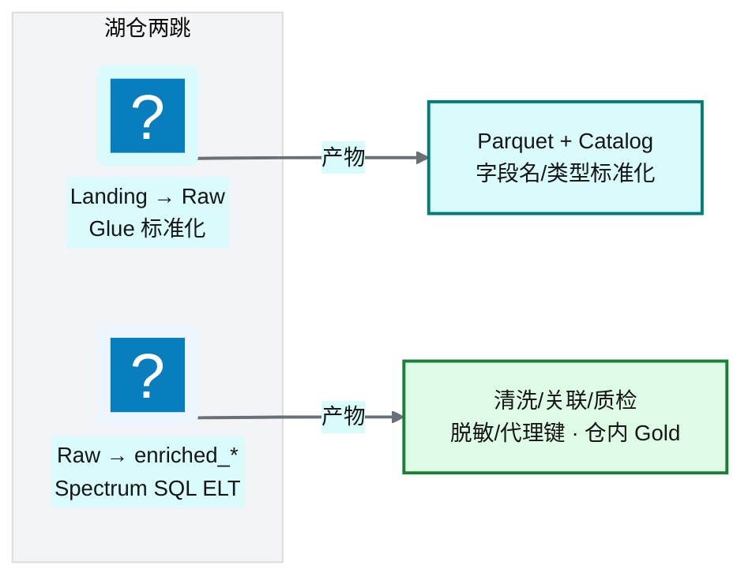
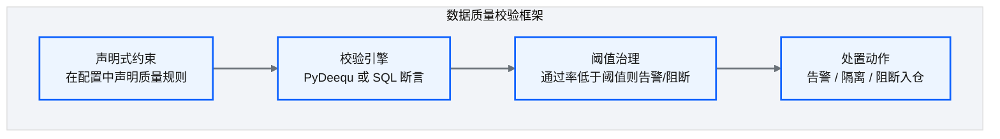
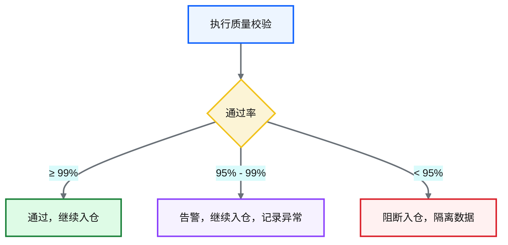
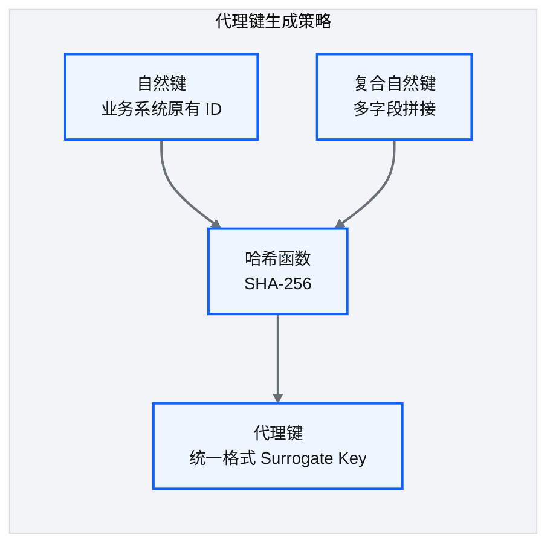
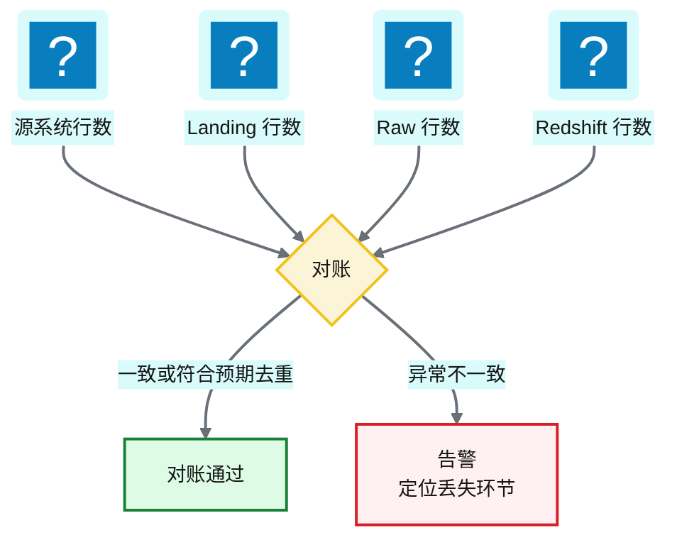

# Ch 17 Landing→Raw→Redshift 开发实战

!!! info "面包屑"
    [本书主页](./index.md) › [Part III 数据工程实践](./16-API-SaaS与邮件连接器.md) › Ch 17

!!! abstract "项目第 1-2 年 · 核心建设期——湖仓两跳开发（演进自三层 ETL）"

---

## :material-school: 本章你将学到
- Landing→Raw（Glue）与 Raw→Redshift（SQL ELT）两跳职责与产物
- 数据质量校验：约束声明与阈值治理（可在入仓前门禁）
- 代理键生成与行数对账（源 / Landing / Raw / Redshift）
- Schema 演进：防御式 Crawler diff vs 自适应 mergeSchema 的取舍

---

## 17.1 两跳开发的职责与产物

第 1 年我写过完整的 Landing→Raw→Enriched→COPY 三层 PySpark。第 1–2 年砍掉 S3 Enriched 后，开发面缩成两跳：**湖上只标准化，仓内做业务变换**（见 [Ch 7](./07-数据湖分层设计.md)/[Ch 8](./08-数据仓库设计-Redshift.md)）。


<p class="caption" markdown="span">**图 17-1** 两跳开发的职责与产物</p>

| 层间转换 | 职责 | 不做什么 |
|---|---|---|
| Landing → Raw | 格式标准化、字段名/类型统一、编码处理、更新 Catalog | 不做业务清洗、不做关联 |
| Raw → Redshift | Spectrum 读 Raw；SQL 清洗/关联/质检/脱敏/代理键；写入 `enriched_*` | 不在 S3 再写金层；不默认 COPY |
<p class="caption" markdown="span">**表 17-1** 两跳开发的职责与产物</p>

!!! warning "Trade-off"
    早期三层的好处是"每层职责单一、可独立重跑"，代价是数据写三次（含可重建的 Enriched）。现行两跳是**湖写两次 + 仓内一次**：合规追溯仍靠 Landing/Raw，Gold 只在 Redshift。湖侧其他引擎拿不到现成金层 Parquet；换来的是少一套 Glue 作业和一份对象存储。某域变换特别重时，我仍会局部开 Glue 特例，默认路径则是 SQL ELT。

落地示意如下。第一跳仍是 PySpark，第二跳是交给 Redshift Data API 的 SQL：

```python
# 示意：Landing→Raw（Glue）+ SQL ELT 入仓
def run_lake_standardize(spark, config):
    # ① Landing → Raw：只做格式标准化
    raw = (spark.read.parquet(f"s3://aurora-cdp-landing/{config['domain']}/{config['table']}/")
               .withColumnRenamed("col_a", "hospital_id")
               .withColumn("biz_date", F.to_date("raw_ts")))
    (raw.write.mode("overwrite").partitionBy("batch_id")
         .parquet(f"s3://aurora-cdp-raw/{config['domain']}/{config['table']}/"))
    # Crawler / enableUpdateCatalog 更新 Glue Data Catalog

def run_sql_elt(redshift_data_api, config):
    # ② Raw(external) → enriched_*：清洗、脱敏、代理键、入仓
    sql = f"""
    INSERT INTO enriched_{config['domain']}.dim_hospital
    SELECT DISTINCT hospital_id,
           f_mask(patient_name) AS patient_name_masked,
           sha2(hospital_id || '||' || source_system, 256) AS sk,
           biz_date
    FROM ext_raw.{config['table']}
    WHERE batch_id = '{config['batch_id']}';
    """
    redshift_data_api.execute(sql)   # Glue Python Shell + boto3 Data API
```

---

## 17.2 数据质量校验框架：约束声明与阈值治理

### 质量校验架构

质检门禁可以挂在两处：Raw 写完后用 Glue/PyDeequ 扫一遍（大数据量时更适合 Spark 侧），或入仓 SQL 前后用 Redshift 约束/断言。我这边默认是**入仓前门禁**：不合格就不写 `enriched_*`。


<p class="caption" markdown="span">**图 17-2** 质量校验架构</p>

```python
# 示意：PyDeequ 声明式质量校验（也可改写为 Redshift SQL 断言）
from pydeequ.checks import Check, CheckLevel
from pydeequ.verification import VerificationSuite

def run_quality_checks(df, config):
    check = Check(spark, CheckLevel.Error, "raw_quality_gate")
    (check.isComplete("prescription_id")
          .isUnique("prescription_id")
          .isInRange("quantity", (1, 10000))
          .satisfies("end_date >= start_date", "date_consistency"))
    result = VerificationSuite(spark).onData(df).addCheck(check).run()
    pass_rate = result.checkMetrics.filter("constraint_status='Success'").count() / result.checkMetrics.count()
    if pass_rate < config["block_threshold"]:
        raise QualityGateError(f"质检通过率 {pass_rate:.2%} 低于阻断阈值，隔离数据")
```

### 质量约束类型

| 约束类型 | 说明 | 举例 |
|---|---|---|
| **完整性** | 字段非空 | `prescription_id IS NOT NULL` |
| **唯一性** | 主键不重复 | `COUNT(prescription_id) = COUNT(DISTINCT prescription_id)` |
| **范围性** | 值在合理范围内 | `quantity BETWEEN 1 AND 10000` |
| **一致性** | 跨字段逻辑一致 | `end_date >= start_date` |
| **引用性** | 外键引用有效 | `hospital_id EXISTS IN dim_hospital` |
<p class="caption" markdown="span">**表 17-2** 质量约束类型</p>

### 阈值治理


<p class="caption" markdown="span">**图 17-3** 阈值治理</p>

!!! tip "引申"
    质量校验框架可用 Amazon PyDeequ（Spark）或 Redshift SQL 断言。"约束即声明"比散落在代码里的手写校验好维护。若今天重新选型，Great Expectations 也是常见的开源替代。

---

## 17.3 代理键生成与行数对账

### 代理键生成

代理键生成从早期 Enriched 里的 Spark UDF，迁到了 **SQL ELT 表达式**（`sha2` / UDF）。同自然键得到同代理键，跨源才能对上。


<p class="caption" markdown="span">**图 17-4** 代理键生成</p>

| 策略 | 机制 | 优势 | 劣势 |
|---|---|---|---|
| **哈希代理键** | `SHA256(natural_key)` | 确定性、跨源可关联 | 哈希碰撞（概率极低） |
| **自增序列** | 数据库自增 | 简单 | 跨系统不可关联 |
| **UUID** | 随机生成 | 无碰撞 | 不可追溯、索引差 |
<p class="caption" markdown="span">**表 17-3** 代理键生成</p>

平台用的是**哈希代理键**：对自然键（可能是复合键）做 SHA-256，输出确定。同一实体落在不同源系统里，只要自然键一致，代理键就一致。

### 行数对账


<p class="caption" markdown="span">**图 17-5** 行数对账</p>

行数对账不花哨，但管用：每层记行数，层间比一下。Landing 1000、Raw 998？标准化丢了 2 行。Raw 与 Redshift 因去重对不上时，得对着配置看是不是预期行为。

```python
# 示意：两跳行数对账（无 Enriched）
def reconcile(config, counts: dict):
    ddb.put_item(Item={"table": config["table"], "batch_id": config["batch_id"], **counts})
    if counts["landing"] != counts["raw"]:
        alert(f"{config['table']} Landing→Raw 丢失 {counts['landing']-counts['raw']} 行")
    if counts["raw"] != counts["redshift"] and not config.get("dedup_enabled"):
        alert(f"{config['table']} Raw→Redshift 行数变化，检查是否预期去重")
```

!!! warning "Trade-off"
    行数对账查不出"行数没变、内容却错了"。对"数据丢失"这类高频事故，性价比却很高。跟质量校验框架搭着用，各补一块盲区。

### Schema 演进处理

数据源会变：加字段、改类型、删列。两跳 pipeline 若对 schema 变化没预案，常见结果是上游加了列被 ELT 静默丢掉，或类型一改入仓直接失败。

| 方案 | 机制 | 优势 | 劣势 |
|---|---|---|---|
| **A 防御式（Crawler diff）** | Glue Crawler 检测 DDL 变更 → diff → 人工确认 → 更新 target / ELT SQL | 可控、变更可审查 | 人工介入，延迟上线 |
| **B 自适应（mergeSchema）** | Raw 读启用 `mergeSchema=true`；Catalog 同步后 ELT 跟列 | 自动化、无延迟 | 静默合并可能掩盖非预期变更 |
<p class="caption" markdown="span">**表 17-4** Schema 演进处理</p>

!!! warning "Trade-off"
    平台默认走**方案 A（防御式）**。医药合规要求"任何 schema 变更可审查"。方案 B 我只放在非合规敏感域。删除列和类型变更必须告警：它们会直接打挂 Spectrum/ELT 或质检门禁。

---

## :material-check-circle: 本章小结
- 两跳开发：Landing→Raw（Glue 标准化）/ Raw→Redshift（Spectrum SQL ELT）；早期三层含 Enriched→COPY 已演进淘汰为默认路径
- 质量校验：声明式约束 + 阈值治理；门禁挡在入仓前
- 代理键用哈希策略；行数对账覆盖源 / Landing / Raw / Redshift
- Schema 演进默认防御式 Crawler diff；破坏性变更必须告警

---

!!! quote "下一章"
    [Ch 18 数据脱敏与隐私治理](./18-数据脱敏与隐私治理.md)：数据入仓了，敏感字段怎么保护？下一章看脱敏怎么落在 SQL ELT 与仓内表上。
