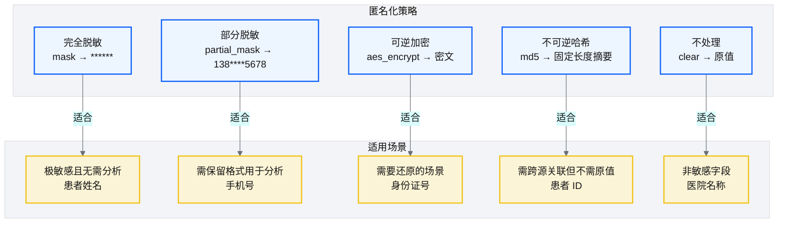
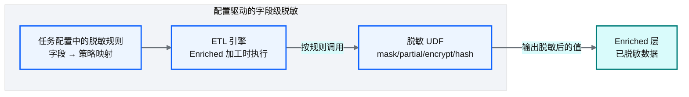
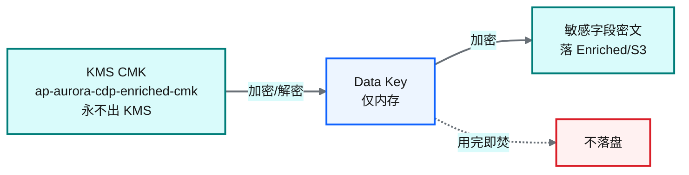
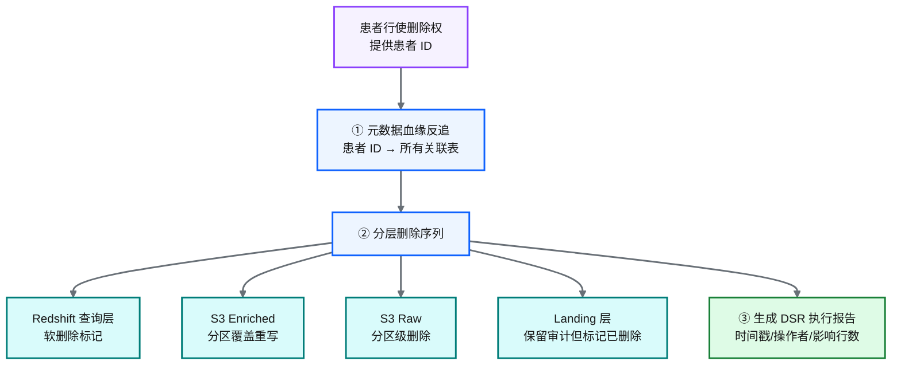
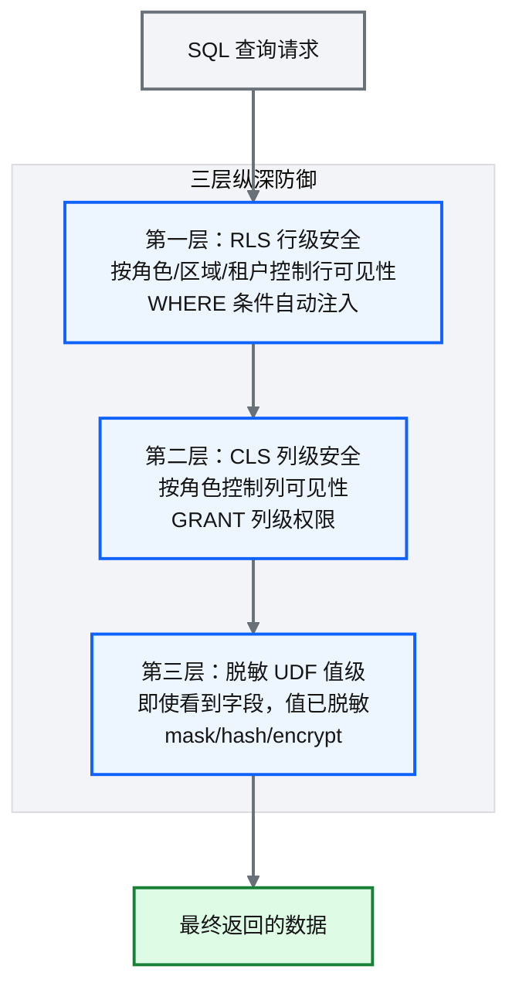
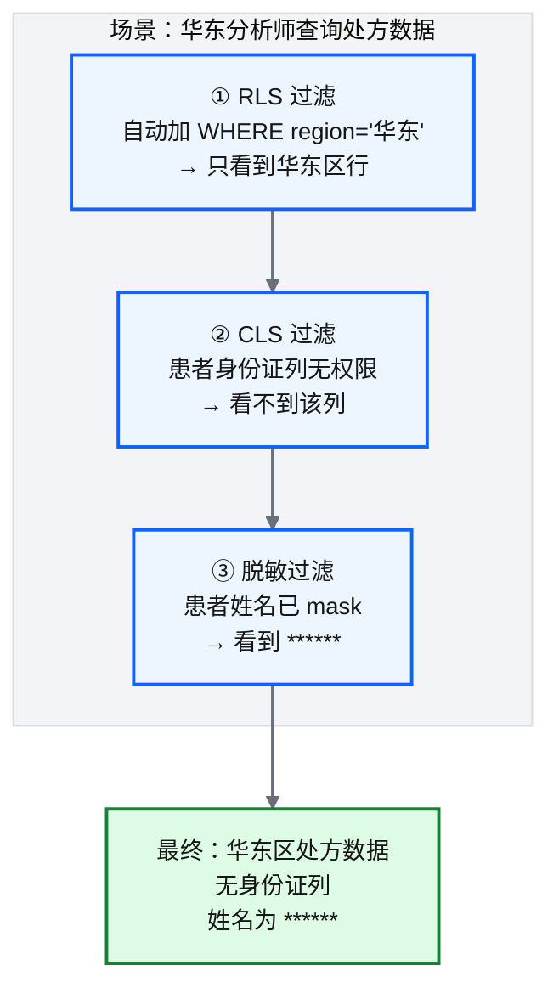

# Ch 18 数据脱敏与隐私治理

!!! info "面包屑"
    [本书主页](./index.md) › [Part III 数据工程实践](./17-Landing到Raw到Enriched开发实战.md) › Ch 18

!!! abstract "项目第 1 年 · 核心建设期——合规治理嵌入"

---

## :material-school: 本章你将学到
- 匿名化策略矩阵：脱敏、部分脱敏、加密、哈希的适用场景
- 配置驱动的字段级脱敏设计，以及医药行业字段脱敏决策表与脱敏 UDF 实现
- KMS 信封加密与密钥分层、DSR 数据主体权利响应、脱敏验证
- Redshift RLS/CLS 与脱敏 UDF 的三层协同防护体系
- 医药 GxP 数据完整性与中国数据合规（PIPL）的引申

---

医药行业的数据治理，比我在专利数据和企业征信两段经历里遇到的都要严格。

专利数据的敏感度相对低——专利本身就是公开文件，只有少量商业秘密（如未公开的专利申请）需要保护。企业征信涉及企业敏感信息，但主要是"企业级"的，个人隐私数据较少。但医药行业不一样——它同时涉及**企业敏感数据**（处方量、市场份额、定价策略）和**个人隐私数据**（患者姓名、身份证号、病历、处方记录），而且受 GxP 法规和中国 PIPL 双重约束。数据泄露不仅是技术事故，更是合规事故，可能导致监管处罚和声誉损失。

所以在 Aurora 平台设计之初，我就在 [Ch 2](./02-从需求到蓝图：一个数据平台的诞生.md) 的范围边界里把"治理合规"列为平台的五点核心诉求之一。这一章就是把"治理合规"从口号变成工程实现——通过匿名化策略矩阵、配置驱动脱敏、以及 RLS/CLS/脱敏三层协同防护。

---

## 18.1 匿名化策略矩阵：脱敏、部分脱敏、加密、哈希


<p class="caption" markdown="span">**图 18-1** 匿名化策略矩阵：脱敏、部分脱敏、加密、哈希</p>

| 策略 | 机制 | 可逆性 | 适合字段 | 举例 |
|---|---|---|---|---|
| **完全脱敏** | 替换为固定值 | 不可逆 | 极敏感且无需分析 | 患者姓名 → `******` |
| **部分脱敏** | 保留部分、遮蔽部分 | 不可逆 | 需保留格式用于分析 | 手机号 → `138****5678` |
| **可逆加密** | AES 加密 | 可逆（需密钥） | 需要还原的场景 | 身份证号 → 密文 |
| **不可逆哈希** | MD5/SHA 哈希 | 不可逆 | 需跨源关联但不需原值 | 患者 ID → 哈希值 |
| **不处理** | 原值保留 | — | 非敏感字段 | 医院名称 |
<p class="caption" markdown="span">**表 18-1** 匿名化策略矩阵：脱敏、部分脱敏、加密、哈希</p>


!!! tip "引申"
    选择脱敏策略的核心问题是"这个字段需要用于分析吗？需要还原吗？需要跨源关联吗？"——这三个问题决定了策略选择。比如患者身份证号：如果要跨源关联但不需原值 → 哈希；如果合规要求可审计还原 → 加密；如果完全不需要 → 完全脱敏。

---

## 18.2 配置驱动的字段级脱敏设计


<p class="caption" markdown="span">**图 18-2** 配置驱动的字段级脱敏设计</p>

脱敏规则作为任务配置的一部分，声明"哪个字段用什么策略"：

```json
// 脱敏规则配置示意
"masking_rules": {
  "patient_name": "mask",
  "phone": "partial_mask",
  "id_card": "aes_encrypt",
  "patient_id": "md5"
}
```

但"哪个字段用哪种策略"不是一个能拍脑袋的决定——它取决于字段的敏感级别、分析用途、是否需要还原、是否需要跨源关联。下面这张**医药行业字段脱敏决策表**把 18.1 引申框里的三个问题（要分析吗？要还原吗？要跨源关联吗？）落到具体字段，作为脱敏规则配置的依据：

| 数据类别 | 典型字段 | 敏感级别 | 分析用途 | 可逆需求 | 跨源关联 | 选用策略 | 理由 |
|---|---|---|---|---|---|---|---|
| **患者标识** | 受试者编号、患者姓名、身份证号 | P0 极敏感 | 需聚合统计 | 否 | 是（跨系统关联同一患者） | **md5** | 需跨源关联但不可还原身份 |
| **患者敏感** | 诊断详情、不良反应报告 | P0 极敏感 | 临床分析 | 是（授权解密） | 否 | **aes_encrypt** + RLS | 合规要求可还原但严格控权 |
| **医生标识** | 处方医生姓名、医师执业证号 | P1 敏感 | 医生维度分析 | 否 | 是 | **partial_mask**（保留科室/医院） | 需分析但限制个人识别 |
| **药品定价** | 净价、折扣率、返利比例 | P1 敏感 | 商务分析 | 是（财务角色解密） | 否 | **aes_encrypt** | 商业敏感，严格列级权限 |
| **处方量排名** | 医生-产品-月度处方数 | P1 敏感 | 绩效分析 | 否 | 否 | **md5(医生ID) + 聚合至医院级** | 防止反推识别个人 |
| **HCP 主数据** | 医生姓名、联系方式、科室 | P1 敏感 | 主数据治理 | 否 | 是 | **clear**（内部员工）/ **partial_mask**（外部） | 分级可见 |
| **渠道库存** | 经销商编码、进货/库存数量 | P2 内部 | 商务分析 | 否 | 否 | **clear**（内部商务）/ **mask**（跨部门） | 竞争敏感 |
| **临床试验** | 随机分组、盲法编码 | P0 极敏感 | 揭盲分析 | 揭盲时是 | 否 | **md5**（分析）/ **aes_encrypt**（揭盲流程） | 盲法完整性 |
| **患者反馈** | 自由文本投诉/评价 | P1 敏感 | 文本分析 | 否 | 否 | **脱敏 NER**（识别姓名/电话/地址后 mask） | 非结构化脱敏 |
<p class="caption" markdown="span">**表 18-2** 配置驱动的字段级脱敏设计</p>


### 脱敏 UDF 实现与密钥供给

决策表定好策略后，每种策略对应一个 UDF。`mask`/`partial_mask`/`md5` 是纯计算无需密钥，`aes_encrypt` 需要数据密钥——密钥从哪来、怎么不随代码泄露，是脱敏工程的关键：

```python
# 示意：四种脱敏 UDF（aes_encrypt 的密钥来自 KMS 信封加密）
import hashlib, boto3
from cryptography.fernet import Fernet
kms = boto3.client("kms")

def mask(value):           return "******"
def partial_mask(phone):   return phone[:3] + "****" + phone[-4:]      # 138****5678
def md5_hash(value):       return hashlib.md5(str(value).encode()).hexdigest()

def aes_encrypt(value, cmk_id="ap-aurora-cdp-enriched-cmk"):
    # 核心意图：信封加密——KMS 解密 data key，本地加密数据，data key 不落盘不进代码
    data_key = kms.generate_data_key(KeyId=cmk_id, KeySpec="AES_256")["Plaintext"]  # 仅内存
    cipher = Fernet(Fernet.generate_key_from_bytes(data_key)).encrypt(value.encode())
    del data_key                                                    # 用完即焚
    return cipher.decode()
```

### KMS 信封加密与密钥分层

上面的 `aes_encrypt` UDF 用到了一个关键模式——**信封加密（Envelope Encryption）**：用一个客户主密钥（CMK，永不出 KMS）加密数据密钥（Data Key），数据密钥在内存中加密数据，用完即焚。这样密钥永不随数据落盘，也永不硬编码在 ETL 代码里：


<p class="caption" markdown="span">**图 18-3** KMS 信封加密与密钥分层</p>

| 密钥层 | 用途 | 存放 | 谁能调用 |
|---|---|---|---|
| **CMK（主密钥）** | 加密/解密 Data Key | KMS（永不导出） | ETL 角色（限 IAM） |
| **Data Key（数据密钥）** | 加密字段值 | 仅内存，用完即焚 | UDF 进程内 |
| **密文字段** | 落 Enriched/S3 | S3（KMS 加密） | 分析师（密文不可读） |
<p class="caption" markdown="span">**表 18-3** KMS 信封加密与密钥分层</p>


CMK 的创建、轮换、策略由 IaC 管理，定义在 [Ch 22](./22-核心基础设施仓库设计.md) 的 core-infra 仓库——脱敏 UDF 只负责"用"，不负责"管"，职责分离。

### DSR 数据主体权利响应

PIPL 赋予患者"删除权"等数据主体权利（DSR, Data Subject Request）。当患者行使删除权时，平台不能只删一张表——患者 ID 散落在 Landing/Raw/Enriched/Redshift 多层多表。DSR 响应需要一套**基于血缘的分层删除流程**：


<p class="caption" markdown="span">**图 18-4** DSR 数据主体权利响应</p>

| 步骤 | 做法 | 理由 |
|---|---|---|
| **① 血缘反追** | 通过元数据血缘（[Ch 20](./20-元数据管理与数据血缘.md)）找到患者 ID 出现在哪些表 | 避免遗漏 |
| **② 分层删除** | Redshift 软删除 → Enriched 分区覆盖 → Raw 分区删除 → Landing 保留但标记 | 从消费端到源头逐层清理；Landing 保留以满足 GxP 审计要求 |
| **③ 审计报告** | 生成含时间戳、操作者、影响行数的 DSR 报告 | 供合规审查，证明删除已执行 |
<p class="caption" markdown="span">**表 18-4** DSR 数据主体权利响应</p>


!!! tip "引申"
    DSR 响应是"被动血缘"价值最直接的体现——如果没有血缘，DSR 只能靠人工猜"患者数据可能在哪几张表"，漏删风险极高。这也是为什么 [Ch 20](./20-元数据管理与数据血缘.md) 和 [Ch 52](./52-架构师的复盘-取舍遗憾与主流对比.md) 都把"主动血缘"列为遗憾——血缘不只是排障工具，更是合规基础设施。

### 脱敏验证

脱敏策略配好后，必须验证它"真的生效了"——医药合规审计会检查脱敏是否可被绕过。验证包括三类测试：

| 验证类型 | 做法 | 目的 |
|---|---|---|
| **不可逆性检查** | 对 md5/mask 后的值尝试反推原值 | 确认哈希/脱敏不可还原 |
| **格式保留检查** | 检查 partial_mask 后格式是否一致（如手机号仍 11 位） | 确认脱敏不破坏下游分析依赖的格式 |
| **重识别攻击测试** | 用准标识符（邮编+生日+性别）组合尝试重新识别个体 | 确认脱敏后数据不可被"拼图式"去匿名化 |
<p class="caption" markdown="span">**表 18-5** 脱敏验证</p>


```python
# 示意：脱敏验证——重识别攻击测试
def reidentification_risk(df, quasi_identifiers=["zip", "birth_date", "gender"]):
    # 核心意图：准标识符组合越唯一，重识别风险越高
    groups = df.groupBy(*quasi_identifiers).count()
    risky = groups.filter("count = 1").count() / df.count()   # 唯一组合占比
    return risky   # 行业基准：<0.2 为低风险，>0.5 需加强泛化
```

| 设计要点 | 说明 |
|---|---|
| **声明式** | 脱敏规则在配置中声明，不在代码中硬编码 |
| **字段级** | 精确到每个字段的脱敏策略 |
| **UD 化** | 每种策略实现为可复用的 UDF（用户定义函数） |
| **不可绕过** | Enriched 加工时强制执行，确保下游拿到的是脱敏后数据 |
<p class="caption" markdown="span">**表 18-6** 示意：脱敏验证——重识别攻击测试</p>


!!! warning "Trade-off"
    脱敏在 Enriched 层执行意味着 Raw 层仍保留原始敏感数据。这是必要的——如果脱敏后发现策略错了（比如该哈希的用了 mask），需要从 Raw 层重跑。Raw 层的敏感数据通过 IAM 权限严格控制（只有 ETL 引擎能访问），不暴露给分析师。

---

## 18.3 Redshift RLS/CLS 与脱敏 UDF 的协同防护体系

结合 [Ch 8](./08-数据仓库设计-Redshift.md) 介绍的 RLS/CLS，平台构建了**三层纵深防御**：


<p class="caption" markdown="span">**图 18-5** Redshift RLS/CLS 与脱敏 UDF 的协同防护体系</p>

### 三层协同的实战场景


<p class="caption" markdown="span">**图 18-6** 三层协同的实战场景</p>

| 防线 | 防护对象 | 即使被绕过…… |
|---|---|---|
| RLS（行级） | 防止跨区域/租户数据泄露 | CLS 仍限制敏感列 |
| CLS（列级） | 防止敏感字段被未授权访问 | 脱敏 UDF 仍让值不可读 |
| 脱敏 UDF（值级） | 防止看到真实敏感值 | （最后一道防线） |
<p class="caption" markdown="span">**表 18-7** 三层协同的实战场景</p>


!!! tip "引申"
    三层纵深防御体现了安全架构的"不依赖单一防线"原则。即使某一层配置失误（如 RLS 策略遗漏了某个角色），其他层仍能兜底。这在医药行业尤为重要——GxP 合规要求数据访问可审计、可控制，单一防线无法满足审计要求。

---

## 18.4 引申：医药 GxP 数据完整性与中国数据合规（PIPL）

### GxP 数据完整性

医药行业受 GxP（GMP/GCP/GLP）法规约束，要求数据满足 **ALCOA+** 原则：

| 原则 | 含义 | 在平台中的实现 |
|---|---|---|
| **A**ttributable | 可归属 | 审计日志记录谁在何时访问了什么 |
| **L**egible | 可读 | 数据标准化为清晰格式 |
| **C**ontemporaneous | 同步性 | 批次标识记录数据加载时间 |
| **O**riginal | 原始性 | Landing 层保留原始数据 |
| **A**ccurate | 准确性 | 质量校验框架保障 |
| **+ Complete** | 完整性 | 行数对账保障 |
| **+ Consistent** | 一致性 | 统一 schema 和口径 |
| **+ Enduring** | 持久性 | S3 生命周期策略保障留存 |
| **+ Available** | 可用性 | 多环境 + 备份保障 |
<p class="caption" markdown="span">**表 18-8** GxP 数据完整性</p>


### 中国数据合规（PIPL）

《个人信息保护法》（PIPL）对个人数据处理的要求：

| PIPL 要求 | 平台应对 |
|---|---|
| 最小必要原则 | 只采集业务必需的个人数据 |
| 目的限制 | 脱敏后的数据不超范围使用 |
| 安全保障义务 | RLS/CLS/脱敏三层防护 + KMS 加密 |
| 数据本地化 | 数据驻留 AWS China（cn-north-1） |
| 可审计 | 审计日志全链路记录 |
<p class="caption" markdown="span">**表 18-9** 中国数据合规（PIPL）</p>


!!! warning "Trade-off"
    合规要求与开发效率存在天然张力。比如 GxP 的"可归属"要求每个操作都有审计记录，这增加了系统复杂度。但合规不是可选项——尤其在医药行业，违规的代价（罚款+声誉损失+监管处罚）远超合规成本。架构师必须把合规作为"非功能性需求"纳入设计，而非事后补丁。

---

## :material-check-circle: 本章小结
- 匿名化策略矩阵：mask（完全脱敏）/ partial_mask（部分脱敏）/ aes_encrypt（可逆加密）/ md5（不可逆哈希）/ clear（不处理）——按"是否需分析/还原/关联"选择
- 医药行业字段脱敏决策表把策略选择落到 9 类具体字段（患者标识/患者敏感/医生标识/药品定价等），作为脱敏规则配置依据
- 配置驱动的字段级脱敏：规则在配置中声明，Enriched 加工时由 UDF 执行，不可绕过；aes_encrypt 的密钥来自 KMS 信封加密
- KMS 信封加密：CMK 永不出 KMS，Data Key 仅内存用完即焚，密钥管理与脱敏使用职责分离
- DSR 数据主体权利响应：基于血缘反追 → 分层删除（Redshift 软删 → Enriched 覆盖 → Raw 删 → Landing 保留标记）→ 审计报告
- 脱敏验证：不可逆性检查、格式保留检查、重识别攻击测试，确保脱敏不可绕过
- 三层纵深防御：RLS（行级）+ CLS（列级）+ 脱敏 UDF（值级），不依赖单一防线
- GxP ALCOA+ 原则和 PIPL 合规要求作为非功能性需求纳入架构设计——合规不是可选项

---

!!! quote "下一章"
    [Ch 19 任务开发配方与实战案例](./19-任务开发配方与实战案例.md) —— 理论和框架都讲完了，接下来看四个实战 Recipe，把前面的知识串起来。

