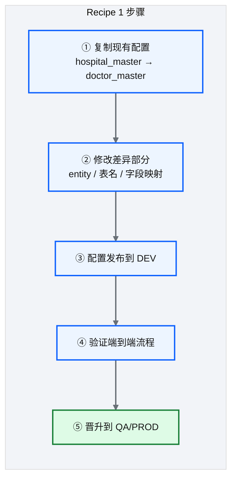
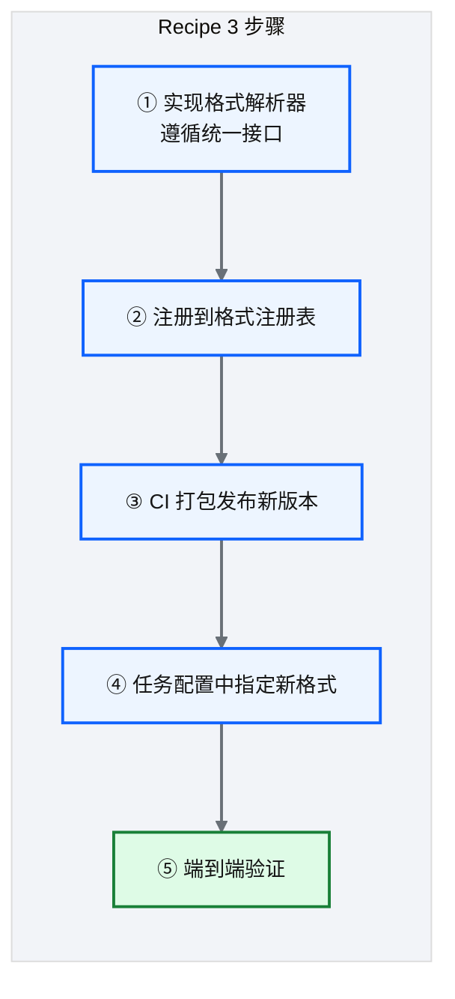
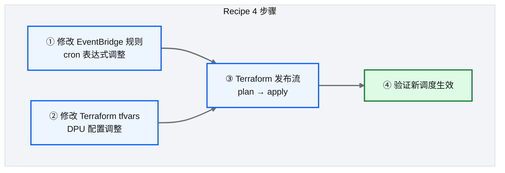

# Ch 19 任务开发配方与实战案例

!!! info "面包屑"
    [本书主页](./index.md) › [Part III 数据工程实践](./18-数据脱敏与隐私治理.md) › Ch 19

!!! abstract "项目第 1 年 · 核心建设期——开发实战"

---

## :material-school: 本章你将学到
- 四个高频任务开发 Recipe，把前面章节的知识串成完整工作流
- 每个 Recipe 的"从需求到上线"全步骤
- 实战中的常见陷阱与最佳实践

---

## 19.1 Recipe 1：复制现有任务新增同类

**场景**：SCI 域已有 `hospital_master` 的摄取任务，现在要新增 `doctor_master`——结构类似，源相同。


<p class="caption" markdown="span">**图 19-1** Recipe 1：复制现有任务新增同类</p>

| 步骤 | 操作 | 注意事项 |
|---|---|---|
| 复制配置 | 在 config-store 中复制现有 :simple-json: JSON | 确保新 entity 名称全局唯一 |
| 修改差异 | 改 entity 名、目标表名、字段映射 | 不要改 source_type 和连接信息（同类源） |
| 配置发布 | 通过配置发布流推送到 DEV | 详见 [Ch 28](./28-四类发布流.md) |
| 验证 | 手动触发一次，检查全链路 | 检查行数对账、质量校验、脱敏 |
| 晋升 | tag → QA → PROD | 按 [Ch 6](./06-环境与多账号隔离设计.md) 发布路径 |
<p class="caption" markdown="span">**表 19-1** Recipe 1：复制现有任务新增同类</p>


!!! tip "引申"
    这是配置驱动架构最大的价值体现——新增同类任务**零代码**，只需复制配置改差异。在传统 ETL 中，这需要写一整套新的存储过程/脚本。

这个"复制配置"的 Recipe 看起来简单，但我第一年踩过一个坑值得提醒。当时复制 `hospital_master` 配置做 `doctor_master`，开发者改了 entity 名和表名，但**忘了改字段映射**——`hospital_master` 的字段映射（`hospital_id`/`hospital_name`）原样保留在了 `doctor_master` 的配置里。结果 `doctor_master` 的数据被按医院的字段名映射了，下游报表里"医生表"出现了"医院名称"列——数据张冠李戴。从那以后我在配置发布流里加了一个校验：**复制配置时检查字段映射是否与目标表 schema 匹配**，不匹配阻断发布。**复制是最容易出错的操作——因为它"看起来已经改好了"，人容易放松检查**。

---

## 19.2 Recipe 2：接入新数据源

**场景**：新增一个 :simple-postgresql: PostgreSQL 数据源，需要全量摄取某张表。


<p class="caption" markdown="span">**图 19-2** Recipe 2：接入新数据源</p>

| 步骤 | 操作 | 注意事项 |
|---|---|---|
| 准备源连接 | DB 凭证存入 Secrets Manager | 遵循 `auroracdp/` 命名约定 |
| 编写配置 | source_type=jdbc, load_mode=full | 填写字段映射、主键、质量规则 |
| 确认 Glue 连接 | 网络（VPC/SG）可达 + JDBC 驱动 :fontawesome-solid-file-code: JAR 可用 | 跨 VPC 需 VPC Peering/Endpoint |
| 验证 | 手动触发，检查数据完整性 | 行数对账 + 质量校验 |
| 调度 | 配置 EventBridge 定时规则 | 避开业务高峰期 |
<p class="caption" markdown="span">**表 19-2** Recipe 2：接入新数据源</p>


!!! warning "Trade-off"
    新数据源最常见的坑是"网络不通"——Glue 需要通过 VPC 访问源数据库，如果源在本地 IDC，需要 VPN/Direct Connect。务必在配置前验证网络可达性，避免"配好了跑不通"。

下面是一个新 JDBC 源表全量入湖的端到端配置走读——它把 [Ch 12](./12-配置驱动的任务模型.md)（配置模型）、[Ch 14](./14-数据库与JDBC连接器.md)（JDBC 分区/水位）、[Ch 17](./17-Landing到Raw到Redshift开发实战.md)（两跳加工/质检/脱敏）全串成一份任务声明：

```json
// 示意：Recipe 2 的任务配置（新 JDBC 源全量入湖）
{
  "entity": "doctor_master",
  "source_type": "jdbc",
  "source": {
    "jdbc_url": "jdbc:postgresql://source-db.example:5432/ma",
    "secret_arn": "arn:aws-cn:secretsmanager:cn-north-1:123456789012:secret:auroracdp/ma-db-xxx",
    "table": "public.doctor",
    "driver_jar": "s3://ap-aurora-cdp-tooling/jars/postgresql-42.7.jar"
  },
  "load_mode": "full",                          // 见 Ch 14：小表全量
  "partition": {"column": "doctor_id", "num": 8},
  "pipeline": {
    "raw": {"rename": {"doc_name": "doctor_name"}, "type_cast": {"license_no": "string"}},
    "enriched": {
      "surrogate_key": ["doctor_id", "source_system"],     // 见 Ch 17：哈希代理键
      "masking_rules": {"doctor_name": "partial_mask", "license_no": "md5"},  // 见 Ch 18：脱敏
      "quality_checks": {"doctor_id": "isComplete,isUnique"}                  // 见 Ch 17：PyDeequ
    }
  },
  "target": {"s3_prefix": "s3://ap-aurora-cdp-enriched/ma/doctor_master/",
             "redshift_table": "ma.dim_doctor"},
  "schedule": "cron(0 16 * * ? *)"               // UTC 16:00 = 北京次日 00:00
}
```

这份配置发布到 config-store 后，调度器到点就会触发完整链路——连接器读取 → JDBC 分区取数 → Landing→Raw → SQL ELT 入仓（质检/脱敏）——**零代码**，配置驱动。前面 8 章的设计思想，到这里汇聚成一个 Recipe。

---

## 19.3 Recipe 3：新增文件格式支持

**场景**：现有连接器支持 :fontawesome-solid-file-csv: CSV/JSON，现在需要支持 XML 格式。


<p class="caption" markdown="span">**图 19-3** Recipe 3：新增文件格式支持</p>

| 步骤 | 操作 | 注意事项 |
|---|---|---|
| 实现解析器 | 输入文件路径 → 输出标准化 DataFrame | 遵循 [Ch 15](./15-文件与S3连接器.md) 的统一接口 |
| 注册 | 在格式注册表添加新格式标识 | 标识命名规范化 |
| CI 发布 | 打包新版本 runtime-glue | 语义化版本号 |
| 配置 | 任务配置中指定新格式标识 | 旧任务不受影响 |
| 验证 | 测试 XML 解析正确性 | 注意 XML 嵌套/命名空间处理 |
<p class="caption" markdown="span">**表 19-3** Recipe 3：新增文件格式支持</p>


格式注册表是一个标识 → 解析器的映射，新增格式只需注册新解析器，旧任务不受影响（开闭原则）：

```python
# 示意：格式注册表——新增 XML 格式支持
FORMAT_REGISTRY = {"csv": parse_csv, "json": parse_json}   # 现有格式

def parse_xml(file_path: str) -> DataFrame:                 # 新增解析器：遵循统一接口
    # 核心意图：输入文件路径 → 输出标准化 DataFrame
    root = ET.parse(file_path).getroot()
    rows = [{child.tag: child.text for child in elem} for elem in root]
    return spark.createDataFrame(rows)

FORMAT_REGISTRY["xml"] = parse_xml                          # 注册：旧任务仍用 csv/json，不受影响
```

这个 Recipe 我在项目第二年真做过——有个供应商的遗留系统只能导出 XML。我一开始想"推供应商改 CSV"，供应商说"系统十几年了改不了"。于是走 Recipe 3：实现 `parse_xml` → 注册 → CI 发布 → 配置指定。半天完事，没动任何现有代码——开闭原则（M1）的价值就在这里。但 XML 解析有个我最初没料到的坑：**XML 的嵌套结构比 CSV/JSON 复杂得多**——一个 `<doctor>` 节点下面可能有多个 `<specialty>` 子节点（一对多），直接 `spark.createDataFrame` 会报"行数不一致"。最后走了"先 pandas 展平嵌套再转 Spark DataFrame"的中转方案。**新增格式的难度不在"注册"，在"解析嵌套结构"**——做这个 Recipe 才学到的。

---

## 19.4 Recipe 4：修改调度与运行时控制

**场景**：某任务从每天凌晨 2 点改为每天凌晨 4 点，并降低 DPU 配置以节省成本。


<p class="caption" markdown="span">**图 19-4** Recipe 4：修改调度与运行时控制</p>

| 变更类型 | 改哪里 | 发布方式 |
|---|---|---|
| 调度时间 | 业务 IaC 仓的 EventBridge tfvars | :simple-terraform: Terraform 发布流 |
| DPU 配置 | 业务 IaC 仓的 Glue tfvars | Terraform 发布流 |
| 运行时参数（加载模式等） | config-store 配置 | 配置发布流 |
| 脚本逻辑 | runtime-glue 代码 | Glue 脚本发布流 |
<p class="caption" markdown="span">**表 19-4** Recipe 4：修改调度与运行时控制</p>


DPU 配置变更落在业务仓的 tfvars 里——改一个数字，走 Terraform 发布流即可，无需碰运行时配置：

```hcl
# 示意：Recipe 4 的 glue-all.tfvars DPU 变更（凌晨 2→4 点 + 降 DPU 省）
# 变更前
glue_jobs = {
  ma_doctor_master = { schedule = "cron(0 18 * * ? *)", max_dpus = 10 }   # UTC 18 = 北京 02:00
}
# 变更后
glue_jobs = {
  ma_doctor_master = { schedule = "cron(0 20 * * ? *)", max_dpus = 6 }    # UTC 20 = 北京 04:00，DPU 10→6
}
```

!!! tip "引申"
    这个 Recipe 展示了"配置驱动"和"IaC"的分界线——调度时间和 DPU 是部署参数（Terraform 管），加载模式和字段映射是运行时配置（DynamoDB 管）。明确分界让变更影响范围可控：改调度时间只走 Terraform 流，不碰运行时配置；改加载模式只走配置流，不碰基础设施。

---

## :material-check-circle: 本章小结
- Recipe 1 复制新增：配置驱动架构的最大价值——新增同类任务零代码，复制配置改差异即可
- Recipe 2 接入新源：准备连接→编写配置→确认网络→验证→调度，最常见坑是网络不通
- Recipe 3 新增格式：实现解析器→注册→CI 发布→配置指定，遵循统一接口实现开闭原则
- Recipe 4 修改调度：区分部署参数（Terraform）与运行时配置（DynamoDB），变更影响范围可控

---

!!! quote "下一章"
    [Ch 20 元数据管理与数据血缘](./20-元数据管理与数据血缘.md) —— Part III 的最后一章：元数据模型、数据目录、以及主动血缘 vs 被动审计日志的架构对比。

