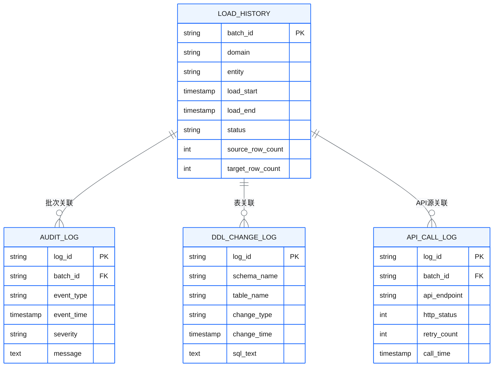
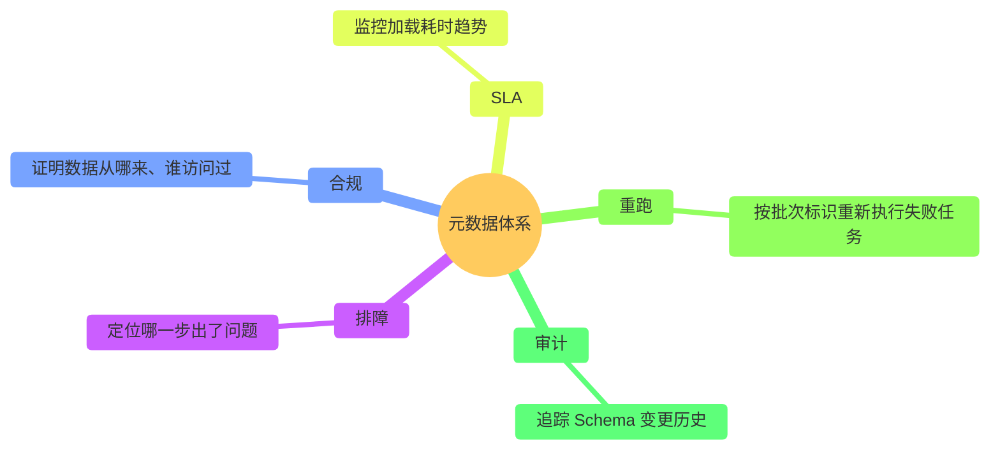
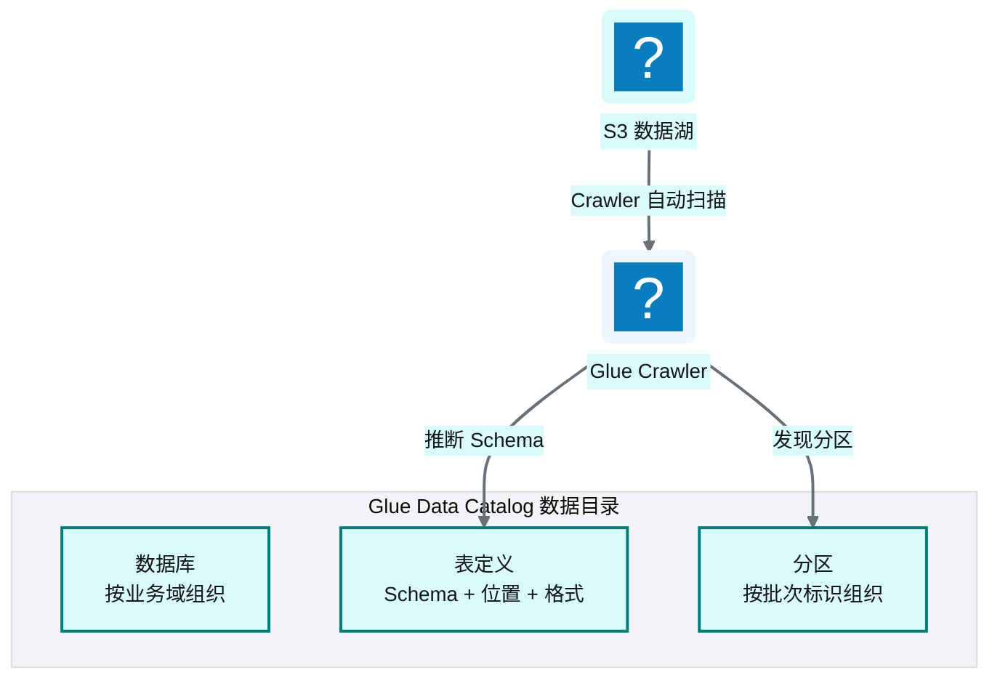
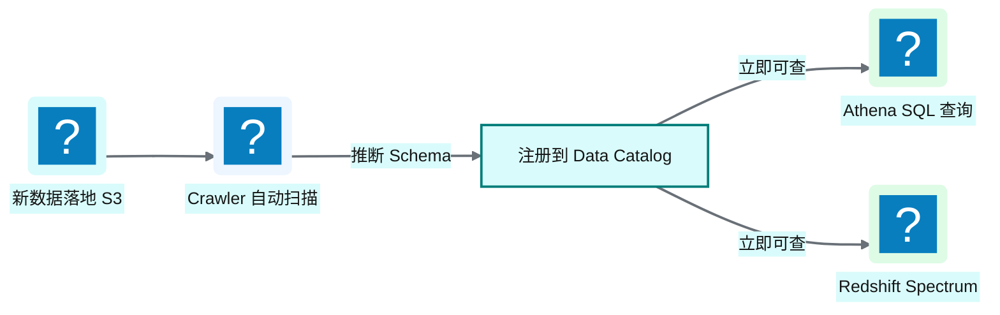
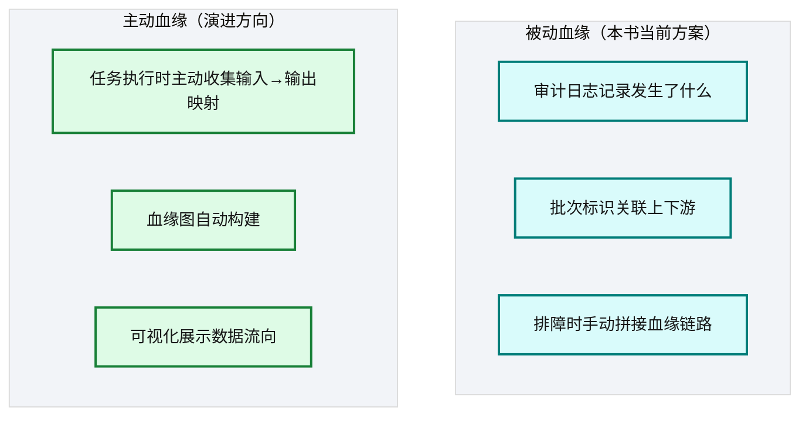
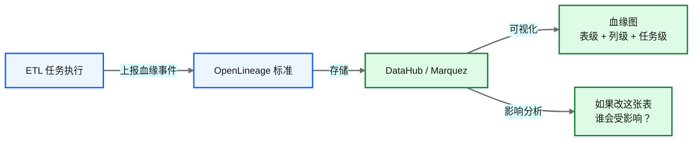
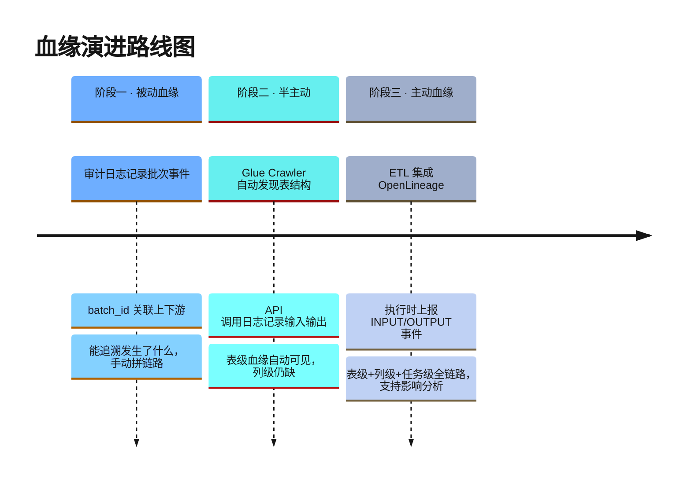

# Ch 20 元数据管理与数据血缘

!!! info "面包屑"
    [本书主页](./index.md) › [Part III 数据工程实践](./19-任务开发配方与实战案例.md) › Ch 20

!!! abstract "项目第 1 年 · 核心建设期——元数据体系"

---

## :material-school: 本章你将学到
- 元数据模型设计：审计日志、加载历史、变更日志的体系化组织
- 数据目录与 schema 自动发现的机制
- 主动血缘 vs 被动审计日志的架构对比与演进方向

---

## 20.1 元数据模型设计：审计日志、加载历史、变更日志


<p class="caption" markdown="span">**图 20-1** 元数据模型设计：审计日志、加载历史、变更日志</p>

| 元数据表 | 记录内容 | 用途 |
|---|---|---|
| **加载历史** | 每次数据加载的批次、域、实体、行数、耗时、状态 | 数据追溯 + SLA 监控 |
| **审计日志** | 全链路事件（开始/完成/失败/告警/重试） | 排障 + 合规审计 |
| **DDL 变更日志** | Schema 变更（建表/改列/删表/改类型） | Schema 演进追溯 |
| **API 调用日志** | API 连接器的每次调用记录 | API 连接器排障 |
<p class="caption" markdown="span">**表 20-1** 元数据模型设计：审计日志、加载历史、变更日志</p>


ER 图定义了元数据的结构，落到 Redshift 就是一组建表 DDL——`batch_id` 贯穿四张表，是血缘拼接的纽带：

```sql
-- 示意：元数据表 DDL（batch_id 是血缘拼接的纽带）
CREATE TABLE aurora_cdp_meta.load_history (
    batch_id        VARCHAR(64) PRIMARY KEY,
    domain          VARCHAR(32),
    entity          VARCHAR(128),
    load_start      TIMESTAMP,
    load_end        TIMESTAMP,
    status          VARCHAR(16),          -- SUCCESS/FAILED/RETRYING
    source_row_count BIGINT,
    target_row_count BIGINT
);
CREATE TABLE aurora_cdp_meta.audit_log (
    log_id      VARCHAR(64) PRIMARY KEY,
    batch_id    VARCHAR(64) REFERENCES aurora_cdp_meta.load_history(batch_id),
    event_type  VARCHAR(32),             -- START/COMPLETE/FAIL/ALERT/RETRY
    event_time  TIMESTAMP,
    severity    VARCHAR(8),              -- INFO/WARN/ERROR
    message     VARCHAR(max)
);
```

### 元数据的价值


<p class="caption" markdown="span">**图 20-2** 元数据的价值</p>

| 价值维度 | 问题场景 | 元数据如何解决 | 依赖的元数据表 |
|----------|----------|----------------|----------------|
| **排障** | ETL 任务失败，定位哪一步出了问题 | 按 batch_id 查询审计日志，定位失败环节和错误信息 | 审计日志 |
| **合规** | 监管审计要求证明数据从哪来、谁访问过 | 加载历史记录数据来源，审计日志记录访问者和操作 | 加载历史 + 审计日志 |
| **SLA** | 业务投诉数据延迟，需监控加载耗时趋势 | 加载历史记录每次耗时，可聚合分析趋势和异常 | 加载历史 |
| **重跑** | 任务失败后需要重新执行 | 按 batch_id 定位失败批次，重新触发相同参数的任务 | 加载历史 |
| **审计** | Schema 变更导致下游报表异常 | DDL 变更日志记录每次表结构变更，支持回溯和影响分析 | DDL 变更日志 |
<p class="caption" markdown="span">**表 20-2** 元数据的价值矩阵</p>

!!! tip "引申"
    元数据是数据平台的"神经系统"——没了它，平台就是黑箱，出问题只能靠猜。好的元数据体系让平台"可观测、可追溯、可审计"，这是企业级平台跟"玩具项目"真正的分界线。

---

## 20.2 数据目录与 schema 自动发现

### Glue Data Catalog


<p class="caption" markdown="span">**图 20-3** Glue Data Catalog</p>

| 组件 | 作用 |
|---|---|
| **Database** | 按业务域组织表（如 `sci_db`、`retail_db`） |
| **Table** | 定义表的 Schema（列名/类型）+ 数据位置（S3 路径）+ 格式（:simple-apacheparquet: Parquet） |
| **Partition** | 按批次标识分区，查询时只扫描必要分区 |
| **Crawler** | 自动扫描 S3 数据，推断 Schema 并注册到目录 |
<p class="caption" markdown="span">**表 20-3** Glue Data Catalog</p>


### Schema 自动发现的价值


<p class="caption" markdown="span">**图 20-4** Schema 自动发现的价值</p>

!!! warning "Trade-off"
    Crawler 自动推断 Schema 很方便，但不总是准确——它通过采样推断类型，可能把"看起来像数字的字符串"误判为整型。对于关键表，建议手动定义 Schema 而非依赖自动推断。Crawler 更适合"探索性发现"，正式表应该有显式 Schema 定义。

---

## 20.3 引申：主动血缘 vs 被动审计日志

### 两种血缘方案对比


<p class="caption" markdown="span">**图 20-5** 两种血缘方案对比</p>

| 维度 | 被动血缘（审计日志） | 主动血缘（OpenLineage/DataHub） |
|---|---|---|
| **采集方式** | 被动记录事件 | 主动收集输入/输出映射 |
| **血缘视图** | 需手动拼接 | 自动生成血缘图 |
| **实时性** | 事后查询 | 近实时更新 |
| **实现成本** | 低（日志已有） | 中（需集成血缘框架） |
| **可视化** | 无（需自建） | 框架自带 |
| **影响分析** | 困难 | 一键查看"谁依赖这张表" |
<p class="caption" markdown="span">**表 20-4** 两种血缘方案对比</p>


### OpenLineage / DataHub 简介


<p class="caption" markdown="span">**图 20-6** OpenLineage / DataHub 简介</p>

| 框架 | 定位 | 特点 |
|---|---|---|
| **OpenLineage** | 血缘标准协议 | 开放标准，多家支持 |
| **DataHub** | 元数据平台 | LinkedIn 开源，功能全面 |
| **Marquez** | 血缘收集+可视化 | OpenLineage 参考实现 |
| **Apache Atlas** | 元数据+血缘 | Hadoop 生态，较重 |
<p class="caption" markdown="span">**表 20-5** OpenLineage / DataHub 简介</p>


OpenLineage 的核心是一个标准化的 `RunEvent`——ETL 任务在开始/结束时上报"我读了哪些表（INPUT）、写了哪些表（OUTPUT）"，血缘平台据此自动构建血缘图：

```json
// 示意：OpenLineage RunEvent 事件（ETL 任务上报输入→输出映射）
{
  "eventType": "COMPLETE",
  "run": {"runId": "batch-20260618-ma-doctor"},
  "job": {"namespace": "aurora_cdp", "name": "ma.doctor_master.pipeline"},
  "inputs":  [{"namespace": "postgres", "name": "public.doctor"}],
  "outputs": [{"namespace": "s3", "name": "ap-aurora-cdp-enriched/ma/doctor_master/"},
              {"namespace": "redshift", "name": "ma.dim_doctor"}],
  "facets": {"rowCount": {"input": 12450, "output": 12450}}
}
```

!!! tip "引申"
    主动血缘是数据平台的"下一代能力"。本书平台的审计日志是"被动血缘"——能追溯"发生了什么"，但不能自动回答"如果我改了 dim_hospital，哪些下游表会受影响？"。如果今天重建，建议从第一天就集成 OpenLineage——事后补血缘比一开始就收集难十倍。这也是我们在 [Ch 54](./54-架构师的复盘-取舍遗憾与主流对比.md) 列为"遗憾"之一的原因。

### 从被动血缘到主动血缘：演进路线图

被动血缘不是"错"，是"阶段性够用"——项目初期审计日志能追溯排障，性价比最高。但平台规模上来后（20000+ 张表），被动血缘"手动拼接"的成本跟着线性涨，主动血缘的价值开始超过集成成本。一条三阶段演进路线：


<p class="caption" markdown="span">**图 20-7** 从被动血缘到主动血缘：演进路线图</p>

| 阶段 | 做法 | 血缘能力 | 触发条件 |
|---|---|---|---|
| **一 被动** | 审计日志记录批次事件，`batch_id` 关联上下游 | 能追溯"发生了什么"，手动拼链路 | 项目初期，表少、排障靠人 |
| **二 半主动** | Glue Crawler 自动发现表结构 + API 调用日志记录输入输出 | 表级血缘自动可见，列级仍缺 | 表增长到千级，手动拼接吃力 |
| **三 主动** | ETL 任务集成 OpenLineage，执行时上报 INPUT/OUTPUT 事件，注入数据质量监控和成本归因 | 表级+列级+任务级全链路血缘，支持影响分析 | 表增长到万级，合规（如 DSR）要求血缘可查 |
<p class="caption" markdown="span">**表 20-6** 从被动血缘到主动血缘：演进路线图</p>


!!! tip "引申"
    这条路线图最大的教训是**阶段一就该为阶段三埋种子**——哪怕初期不上 OpenLineage，审计日志里也该显式记"本任务读了哪些表、写了哪些表"（即 INPUT/OUTPUT 字段），别只记"批次开始/结束"。这样到阶段三接 OpenLineage 时，历史数据能回填，不用从头来。本书平台恰恰在阶段一漏了这步，[Ch 54](./54-架构师的复盘-取舍遗憾与主流对比.md) 把"无主动血缘"列为遗憾——事后补血缘难十倍，根因就在这里。

---

## :material-check-circle: 本章小结
- 元数据体系：加载历史（批次追溯）/ 审计日志（排障合规）/ DDL 变更日志（Schema 演进）/ API 调用日志（连接器排障）
- Glue Data Catalog 提供数据目录，Crawler 实现 schema 自动发现——但关键表建议手动定义 Schema
- 被动血缘（审计日志）能追溯但不能自动可视化；主动血缘（OpenLineage/DataHub）自动构建血缘图、支持影响分析——是演进方向

---

!!! quote "下一部分"
    [Part IV 基础设施与工程效能](./21-Terraform架构总览.md) —— 数据工程实践讲完了，接下来进入基础设施层：:simple-terraform: Terraform 架构、CI/CD 平台、四类发布流、OIDC 凭证治理。

