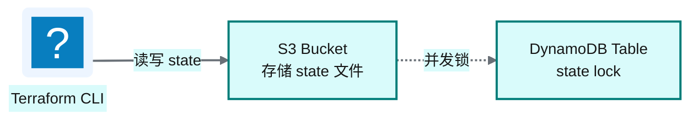
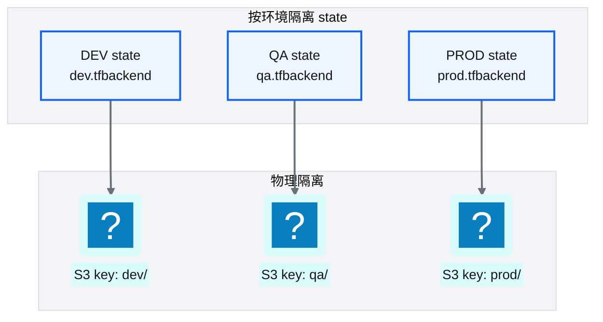
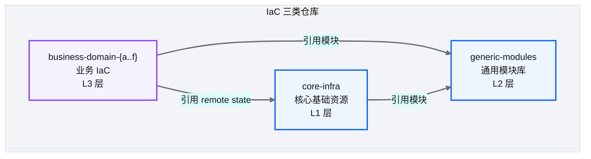
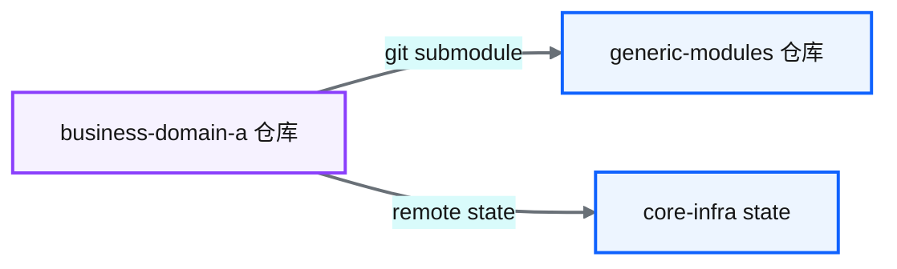
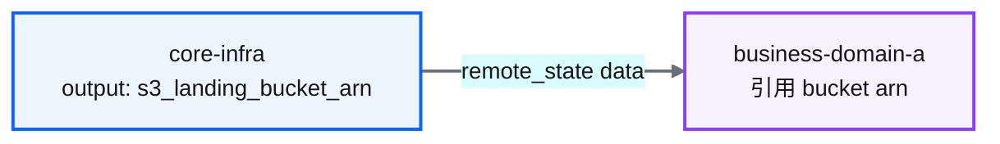

# Ch 21 :simple-terraform: Terraform 架构总览

!!! info "面包屑"
    [本书主页](./index.md) › [Part IV 基础设施与工程效能](./20-元数据管理与数据血缘.md) › Ch 21

!!! abstract "项目第 1 年 · 核心建设期——IaC架构"

---

## :material-school: 本章你将学到
- Terraform 分层与 state 后端设计（S3 + DynamoDB lock）
- core-infra / business / generic-modules 三类仓库的职责
- 模块组装策略与依赖管理（git submodule）

---

## 21.1 Terraform 分层与 state 后端设计

### State 后端

**图 21-1** State 后端

| 设计要点 | 说明 |
|---|---|
| **S3 存 state** | state 文件存 S3，团队共享 |
| **DynamoDB lock** | 防止多人同时 apply 导致 state 损坏 |
| **加密** | state 文件含敏感信息，S3 端 KMS 加密 |
| **版本控制** | S3 版本控制开启，可回滚 state |

**表 21-1** State 后端

!!! warning "Trade-off"
    Terraform state 含明文敏感信息（如数据库密码），S3 存储需严格 IAM 控制 + KMS 加密。另一种方案是 Terraform Cloud/Enterprise 的远程 state——托管且加密，但引入供应商依赖。本书方案用 S3+DynamoDB 是自托管、零额外成本的选择。

### State 隔离

**图 21-2** State 隔离

---

## 21.2 core-infra / business / generic-modules 三类仓库

这是 [Ch 4](./04-平台五层模型与设计哲学.md) 五层模型在 IaC 层的落地：

**图 21-3** core-infra / business / generic-...

| 仓库类型 | 职责 | 变更频率 | 审批级别 |
|---|---|---|---|
| **core-infra** | 全局共享资源（S3/Redshift/IAM/VPC） | 低 | 平台架构组 |
| **generic-modules** | 通用 Terraform 模块 | 中 | 平台架构组 |
| **business-domain-{a..f}** | 业务域资源 | 高 | 业务域团队 |

**表 21-2** core-infra / business / generic-modules 三类仓库

---

## 21.3 模块组装策略与依赖管理

### Git Submodule 模式

**图 21-4** Git Submodule 模式

业务仓通过 **git submodule** 引用 generic-modules 仓库，实现模块复用：

| 设计要点 | 说明 |
|---|---|
| **submodule 固定版本** | 每个业务仓锁定 generic-modules 的特定 commit |
| **升级可控** | 模块升级 = 更新 submodule 指针 + 测试 |
| **独立 CI** | 模块变更不自动影响业务仓（需业务仓主动升级） |

**表 21-3** Git Submodule 模式

!!! tip "引申"
    git submodule 的替代方案是 Terraform Registry / Module Registry——模块发布到 Registry，业务仓通过 `source` 和 `version` 引用。Registry 方式版本管理更规范，但需要自建私有 Registry 或使用 Terraform Cloud。submodule 方式零额外基础设施，适合初期。

### Remote State 引用

业务仓通过 `terraform_remote_state` data source 引用 core-infra 的输出：

**图 21-5** Remote State 引用

这让"共享资源的唯一定义权"归属 core-infra，业务仓只消费不创建。

---

## :material-check-circle: 本章小结
- State 后端：S3 存储 + DynamoDB lock，按环境隔离 state，KMS 加密
- IaC 三类仓库：core-infra（L1 共享资源）/ generic-modules（L2 通用模块）/ business-domain（L3 业务 IaC）
- 模块组装用 git submodule（固定版本、升级可控）；共享资源通过 remote state 引用（唯一定义权在 core-infra）

---

!!! quote "下一章"
    [Ch 22 核心基础设施仓库设计](./22-核心基础设施仓库设计.md) —— 接下来深入 core-infra 仓库的具体设计。

