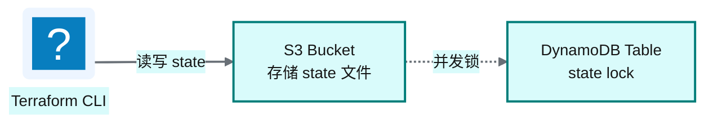
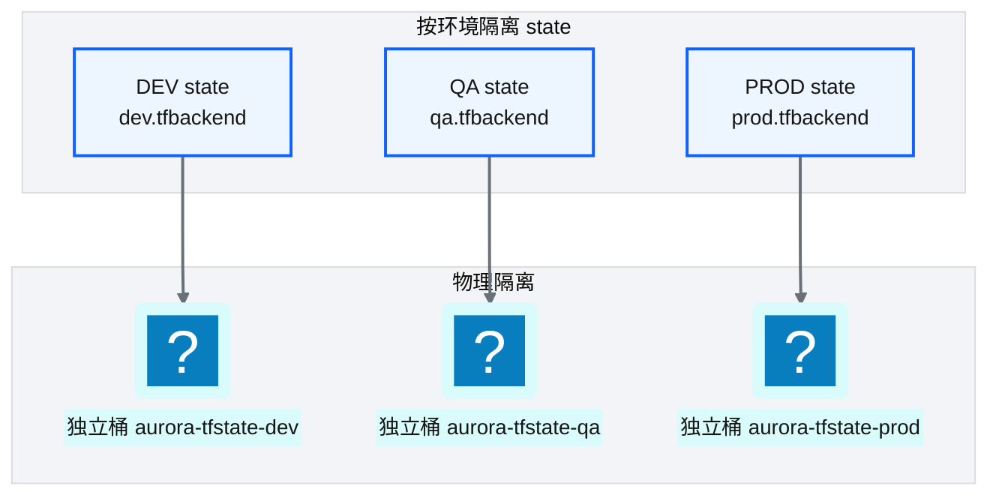
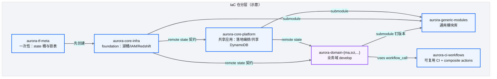
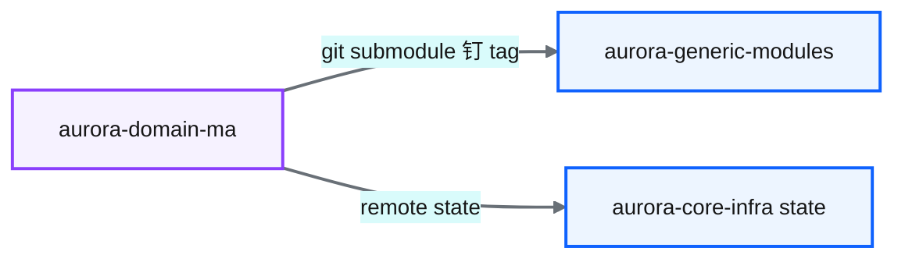
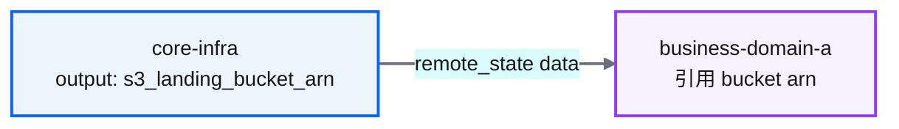

# Ch 21 :simple-terraform: Terraform 架构总览

!!! info "面包屑"
    [本书主页](./index.md) › [Part IV 基础设施与工程效能](./20-元数据管理与数据血缘.md) › Ch 21

!!! abstract "项目第 1 年 · 核心建设期——IaC架构"

---

## :material-school: 本章你将学到
- Terraform 分层与 state 后端设计（空 backend + 分环境 tfbackend、S3 + 锁、环境物理隔离）
- meta → foundation → platform apps → domain develop 的仓职责分层，以及 generic-modules / CI workflows 两支撑层
- 模块组装策略：git submodule 钉版本 vs Registry；共享资源通过 remote state 唯一定义

---

## 21.1 Terraform 分层与 state 后端设计

Part III 把数据工程做通了：连接器、分层湖仓、编排都在跑。到了项目第 1 年中段，瓶颈换成了：怎么让 6 个业务域、3 套环境、上千条资源定义持续变更却不互相踩脚。对我来说，IaC 首先是变更治理的物理载体；把控制台点过的东西誊成 HCL，只是其中一环。

### State 后端


<p class="caption" markdown="span">**图 21-1** State 后端</p>

图 21-1 看起来简单。我反复强调的拆分是：代码里的 backend 块是空的，真正的桶/键/锁表由分环境的 `*.tfbackend` 在 `init` 时注入。Terraform 官方叫它 partial backend configuration。同一份 root module 可以挂到不同环境的 state，不必为每个环境复制一份 `terraform {}` 块。

| 设计要点 | 说明 |
|---|---|
| **S3 存 state** | state 文件存 S3，团队共享；开启版本控制以便回滚 |
| **锁机制** | 防止多人同时 apply 损坏 state；Aurora 初期用 DynamoDB 锁表 |
| **加密** | state 含敏感信息，S3 端 KMS 加密 + 桶策略收紧读权限 |
| **空 backend + tfbackend** | 代码仓不写死桶名；CI/本地用 `-backend-config=environments/dev/dev.tfbackend` |
<p class="caption" markdown="span">**表 21-1** State 后端</p>

```hcl
# 示意：aurora-domain-ma/versions.tf —— 代码仓只声明 backend 类型，不写死环境
terraform {
  required_version = ">= 1.5.0"
  backend "s3" {}  # 空块：bucket/key/region/锁表由 *.tfbackend 注入
}

# 示意：environments/dev/dev.tfbackend —— 仅示意字段，无真实账号与桶名
bucket         = "aurora-tfstate-dev"
key            = "domain-ma/terraform.tfstate"
region         = "cn-north-1"
encrypt        = true
dynamodb_table = "aurora-tfstate-lock-dev"
# role_arn     = "arn:aws-cn:iam::ACCOUNT:role/aurora-tf-assumable"  # CI OIDC 扮演
```

!!! warning "Trade-off"
    Terraform state 含明文敏感信息（如数据库密码），S3 存储需严格 IAM 控制 + KMS 加密。另一种方案是 HCP Terraform / Enterprise 的远程 state：托管且加密，但引入供应商依赖，当时也没法满足 AWS China 数据驻留。我们选 S3 自托管，代价是自己管桶策略、锁表和备份。

我选 S3 而非 HCP Terraform，首要原因是**数据驻留**：合规要求 state 留在中国境内的 AWS 分区（M10）。DynamoDB 锁是第一年踩坑后才加的。最初没配锁，两人同时 `apply`，state 被并发写入损坏，靠 S3 版本回滚花了半天。后来 HashiCorp 文档把 DynamoDB 锁标为 deprecated，推荐 S3 原生锁；Aurora 仍保留 DynamoDB，是因为当时 runner 镜像钉在仍依赖该参数的 Terraform 小版本，迁移窗口留给第 3 年。锁用什么可以换，"必须有锁"从第一天就不能省。

### State 隔离


<p class="caption" markdown="span">**图 21-2** State 隔离</p>

图 21-2 真正要看的是**分桶**，不只是分 key。我在企业征信用过 `workspace` 共用一个 state 后端。有人在本意跑 dev 的 shell 里误切到 prod workspace，`destroy` 直接打到生产。到 Aurora 第一版我改成同桶不同 key；第二年一次 CI 误配把整个 tfstate 桶的生命周期规则改坏，差点连同环境一起误伤。从那以后我改成 **dev/qa/prod 各一个独立 state 桶 + 独立锁表**。key 级隔离防逻辑混淆，桶级隔离防物理误删（[Ch 25](./25-环境参数与tfvars模型.md) 会再展开这次事故）。

逻辑隔离靠人记得住，物理隔离靠系统保证。在 IaC 这种一行命令就能删资源的领域，workspace 只能当便利工具，不能当安全边界。下一节把"谁拥有哪些资源"落到仓库分层。没有仓分层，再好的 state 隔离也会被"所有人往一个仓里塞资源"冲垮。

---

## 21.2 core-infra / business / generic-modules 三类仓库

这是 [Ch 4](./04-平台五层模型与设计哲学.md) 五层模型在 IaC 层的落地。对外我常说"三类仓"，对内实际是**四层资源仓 + 两支撑仓**：


<p class="caption" markdown="span">**图 21-3** core-infra / business / generic-modules 仓分层</p>

| 仓库类型 | 职责 | 变更频率 | 审批级别 |
|---|---|---|---|
| **aurora-tf-meta** | 一次性 bootstrap：state 桶、锁表、基础 KMS | 极低 | 平台架构组 |
| **aurora-core-infra** | 全局共享：数据湖桶、平台 IAM、Redshift 基座、Secrets、VPC | 低 | 平台架构组 |
| **aurora-core-platform** | 跨域共享应用：落地编排、共享配置表、平台级 Step Functions | 中低 | 平台工程组 |
| **aurora-generic-modules** | 可复用 AWS 资源模块（Glue/Lambda/S3/SFN…） | 中 | 平台架构组 |
| **aurora-domain-*** | 业务域资源（`repo_type=develop`，不含平台 IAM） | 高 | 业务域团队 |
| **aurora-ci-workflows** | reusable workflows + composite actions | 中 | 平台工程组 |
<p class="caption" markdown="span">**表 21-2** IaC 仓职责与变更治理</p>

仓库分层首先是 blast radius 分层。我在项目第一年统计过变更频率：foundation 每月约 2 次，模块库约 5 次，业务域合计约 50 次。若混在一个 monorepo，平台 IAM 改动会淹没在业务 PR 队列里。有一次我改 Glue 执行角色策略，排在三十多个业务 PR 后面等了两天。分开后各走各的 CI 与审批流（M2 / M7）。

还有一条我坚持的规则：**IAM 基座只出现在 core-infra 的计划里**，domain develop 仓的 plan var-files **故意不带** `iam-all.tfvars`。业务域可以引用平台 Role ARN，但不能在本仓 invent 一套平行 IAM，否则权限面会在六个仓里发散。这是治理与执行分离（M6）在 IaC 上的具体形状。

协作逻辑是底层稳定、上层活跃。下一章会拆开 core-infra / core-platform 的目录与输出契约；再下一章讲业务仓为什么要同构。没有同构，CI 平台就得为每个域写一份流水线。

---

## 21.3 模块组装策略与依赖管理

分层定了"谁拥有资源"，还缺"怎么引用别人的代码与别人的输出"。Aurora 用两条依赖边：对模块库走 **git submodule（钉 commit/tag）**，对共享资源走 **`terraform_remote_state`**。

### Git Submodule 模式


<p class="caption" markdown="span">**图 21-4** Git Submodule 模式</p>

| 设计要点 | 说明 |
|---|---|
| **submodule 固定版本** | 业务仓锁定模块库特定 tag/commit，升级显式改指针 |
| **升级可控** | 模块发版 ≠ 业务仓自动吃到；需走 DEV→QA→PROD 发布流 |
| **独立 CI** | 模块仓自己跑测试；业务仓升级时才在域上下文里验证 |
<p class="caption" markdown="span">**表 21-3** Git Submodule 模式</p>

```hcl
# 示意：业务仓引用通用模块——用相对路径吃 submodule，而不是漂在 latest
module "glue_job_ingest" {
  source = "./aurora-generic-modules/modules/glue_job"
  # 版本真相在 .gitmodules 的 pin，不在这里写 version=
  name   = "ma-doctor-ingest"
  role_arn = data.terraform_remote_state.core.outputs.glue_exec_role_arn
}
```

!!! tip "引申"
    替代方案是私有 Module Registry 或 `git::…?ref=vX.Y.Z` 直连。Registry 的 SemVer 约束更清晰，但要自建或依赖 HCP；直连 Git 省掉 submodule 同步麻烦，却让"一次升级扫全仓"更难审计。我选 submodule，是因为第 1 年不想再引入一套 Registry 运维，且审计要能回答"此刻每个域钉在哪个模块 commit"。

代价很具体：模块库发一次 breaking change，六个域仓都要改指针并回归。15 个仓时烦但可控。我估过 50 个仓时，维护成本会逼近自建 Registry 的运维成本。选型匹配规模（M11），别为了潮流换工具。第 3 年我们加了检查全仓 submodule 是否落后于最低支持 tag 的 CI action，把烦的一部分自动化掉，但没有急着换 Registry。

### Remote State 引用

业务仓通过 `terraform_remote_state` 消费 core-infra 输出，不复制资源定义：


<p class="caption" markdown="span">**图 21-5** Remote State 引用</p>

```hcl
# 示意：业务仓只读共享契约，不创建湖桶
data "terraform_remote_state" "core" {
  backend = "s3"
  config = {
    bucket = "aurora-tfstate-dev"
    key    = "core-infra/terraform.tfstate"
    region = "cn-north-1"
  }
}

resource "aws_s3_object" "placeholder" {
  bucket = data.terraform_remote_state.core.outputs.landing_bucket_name
  key    = "ma/_keep"
  content = ""
}
```

这样共享资源的唯一定义权就归 core-infra。我在企业征信犯过重复定义：三个仓各自 `aws_s3_bucket` 同名资源，state 互相覆盖，桶策略被改得面目全非。到 Aurora，共享资源只能有一个定义者，其他仓只能引用。这和 [Ch 4](./04-平台五层模型与设计哲学.md)"依赖只能向下"一致。

代价是耦合：core-infra 改输出名字会打断下游 plan。我们对冲的办法是输出契约按 SemVer 心态维护：只增不改，弃用先标 `deprecated_*` 输出，并留一个发布窗口。若重来，我还会给 remote state 加一层契约测试：CI 在 core-infra 合并前，对一份冻结的下游期望 JSON 做 diff。

后端、仓分层和依赖边定了之后，下一章进入 core-infra 内部：meta bootstrap、湖分层目录，以及平台应用层为什么要从 foundation 拆出去。

---

## :material-check-circle: 本章小结
- State：空 `backend "s3" {}` + 分环境 `*.tfbackend`；S3 存 state + 锁；环境用**独立桶**做物理隔离，不只靠 workspace
- 仓分层：meta → core-infra → core-platform → domain develop，外加 generic-modules 与 CI workflows；变更频率决定审批与 blast radius
- 组装：模块用 submodule 钉版本；共享资源用 remote state 唯一定义。治理边界先于语法技巧

---

!!! quote "下一章"
    [Ch 22 核心基础设施仓库设计](./22-核心基础设施仓库设计.md) —— 接下来深入 core-infra / platform 的目录、输出契约与共享资源治理。
