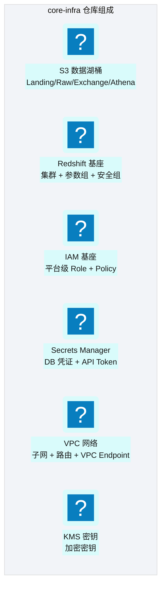
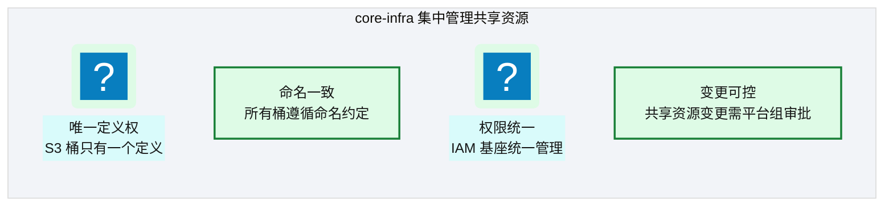
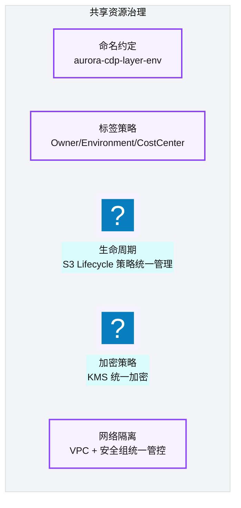

```mermaid
%%{init: {'theme':'base','themeVariables':{'primaryColor':'#edf5ff','primaryTextColor':'#161616','primaryBorderColor':'#0f62fe','lineColor':'#697077','secondaryColor':'#d9fbfb','tertiaryColor':'#f2f4f8','fontSize':'14px'}}}%%
flowchart LR
 CORE[core-infra<br/>terraform apply] -->|output|STATE[state 文件]
 STATE -->|存储|S3[S3 backend]

 BIZ[business-domain-a<br/>terraform plan] -->|remote_state data|S3
 S3 -->|返回 output|BIZ
 BIZ -->|引用 bucket_arn / role_arn|RESOURCES[创建业务资源]
classDef bpProcess fill:#edf5ff,stroke:#0f62fe,stroke-width:2px,color:#161616
classDef bpData fill:#d9fbfb,stroke:#007d79,stroke-width:2px,color:#161616
classDef bpInfo fill:#f6f2ff,stroke:#8a3ffc,stroke-width:2px,color:#161616

class CORE,BIZ bpProcess
class STATE,S3 bpData
class RESOURCES bpInfo
linkStyle default stroke:#697077,stroke-width:2px
```

# Ch 22 核心基础设施仓库设计

!!! info "面包屑"
    [本书主页](./index.md) › [Part IV 基础设施与工程效能](./21-Terraform架构总览.md) › Ch 22

!!! abstract "项目第 1 年 · 核心建设期——核心仓设计"

---

## :material-school: 本章你将学到
- core-infra 的两段式结构：meta bootstrap（先有 state）与 foundation（湖桶/IAM/Redshift/Secrets/VPC）
- 为何平台共享应用从 foundation 拆到 core-platform，以及共享资源的 blast radius
- remote state 输出契约与治理层如何用代码而非文档强制命名/加密/网络边界

---

## 22.1 core-infra：数据湖桶、IAM、Redshift 基座、Secrets、VPC

[Ch 21](./21-Terraform架构总览.md) 把仓分层画清楚了。落到第 1 年落地时，我最先撞上的是鸡生蛋问题：foundation 的 state 要写进 S3，但那只桶本身还不存在。于是 core-infra 在物理上拆成两段 apply 边界，先是 **meta**，再是 **foundation**；旁边又长出一层 **core-platform**，放跨域共享应用。


<p class="caption" markdown="span">**图 22-1** core-infra：数据湖桶、IAM、Redshift 基座、...</p>

图 22-1 是 foundation 的能力面。表 22-1 补上谁消费这些输出：业务仓从不创建这些对象，只读 ARN/endpoint。

| 组件 | 职责 | 输出（供业务仓引用） |
|---|---|---|
| **S3 数据湖桶** | 创建分层桶 + 生命周期策略 | bucket arn / name |
| **Redshift 基座** | 集群 + 参数组 + 安全组 | cluster endpoint / arn |
| **IAM 基座** | 平台级 Role（Glue/Lambda/Step Functions） | role arn |
| **Secrets Manager** | DB 凭证 + API Token 存储 | secret arn |
| **VPC** | 网络 + 子网 + VPC Endpoint | subnet ids / sg ids |
| **KMS** | 加密密钥 | key arn |
<p class="caption" markdown="span">**表 22-1** core-infra：数据湖桶、IAM、Redshift 基座、Secrets、VPC</p>

目录上我按**湖分层**组织 foundation，不按 AWS 服务堆平铺。`landing/`、`raw/`、`enriched/`、`exchange/` 与 [Ch 7](./07-数据湖分层设计.md) 对齐，旁边再挂 `iam/`、`redshift/`、`secrets/`、`security/`。新人打开仓就能顺着数据流找资源，不必在五十个 `aws_*` 文件里搜。

```text
# 示意：aurora-core-infra 目录骨架（脱敏）
aurora-core-infra/
├── terraform-meta/                 # 一次性：state 桶 + 锁表 + 基础 KMS
│   └── environments/{dev,qa,prod}/
└── terraform-foundation/
    ├── aurora-generic-modules/     # git submodule
    ├── environments/{dev,qa,prod}/ # *.tfbackend + *-all.tfvars
    └── layers/
        ├── landing|raw|enriched|exchange/
        ├── iam|redshift|secrets|network/
        └── integration/            # 跨层权限与事件接线
```

apply 顺序是硬约束：先 meta（本地或专用 bootstrap workflow），再 foundation，再 core-platform，最后才是 domain develop。我见过有人把 state 桶写进 foundation 同一份 root module。第一次 apply 要用 local backend，迁到 S3 时又要 `-migrate-state`，CI 矩阵一复杂就翻车。把 bootstrap 拆成独立 root，就是用仓库边界消灭鸡生蛋。

### 设计原则：共享资源集中管理


<p class="caption" markdown="span">**图 22-2** 设计原则：共享资源集中管理</p>

图 22-2 四条原则里，我对团队讲得最多的是第一条。有一次业务域想"临时"在本仓建一个 `exchange` 旁路桶做联调，命名少了环境后缀，结果 Glue Role 的桶策略匹配不上，排障三小时。从那以后：**共享桶/平台 Role 只能经 core-infra PR**，业务仓最多提 issue 描述需求。

!!! warning "Trade-off"
    集中管理的代价是业务域不能自助创建共享资源：每次新桶或新平台 Role 都得提 PR 到 core-infra。协作变慢，但换来全局一致性与可审计的变更归属（M10）。共享面优先一致性；域内 Glue/Lambda 的速度，留给同构业务仓（下一章）。

另一个切割点是 **foundation vs core-platform**。我最初把共享落地编排、共享 DynamoDB 配置表也塞进 foundation。结果改一条编排 ASL，plan 里夹着 IAM 与 Redshift 参数组，审阅人不敢点 approve。拆出 `aurora-core-platform` 之后，foundation 管地基，platform 管跨域公共设施，domain 管自己的资源。IAM 仍只在 foundation 的 var-files 里出现；platform/domain 的 CI `repo_type` 故意不挂 `iam-all.tfvars`（M6）。

模块接口保持薄。下面只保留契约骨架；完整资源细节不如先把"为什么这些字段是输入"说清楚：

```hcl
# 示意：foundation 湖桶模块输入——生命周期按层可配，满足 GxP 留存差异
variable "environment" { type = string }
variable "kms_key_arn" { type = string }
variable "lifecycle_days" {
  type = map(number)
  # landing 短留存；enriched 长留存——按数据类别，而非一刀切 30 天删除
  default = { landing = 365, raw = 1825, enriched = 2555 }
}

resource "aws_s3_bucket" "lake" {
  for_each = toset(["landing", "raw", "enriched", "exchange"])
  bucket   = "aurora-cdp-${each.key}-${var.environment}"
}

output "bucket_arns"  { value = { for k, b in aws_s3_bucket.lake : k => b.arn } }
output "bucket_names" { value = { for k, b in aws_s3_bucket.lake : k => b.id } }
```

```hcl
# 示意：Redshift 基座——按环境规格分化，公网关闭，凭证来自 Secrets
resource "aws_redshift_cluster" "base" {
  cluster_identifier    = "aurora-cdp-${var.environment}"
  node_type             = var.environment == "prod" ? "ra3.4xlarge" : "ra3.xlplus"
  number_of_nodes       = var.environment == "prod" ? 8 : 2
  encrypted             = true
  kms_key_id            = var.kms_key_arn
  publicly_accessible   = false
  # master 凭证：从 Secrets Manager 注入，不进 tfvars 明文
}
```

foundation 的资源和所有权定了，下一节看契约怎么递给业务仓，治理规则又怎样变成强制项。

---

## 22.2 共享资源治理层与 remote state 引用

### Remote State 输出

core-infra 通过 root `output` 暴露共享资源标识；业务仓用 `terraform_remote_state` 只读消费。官方模型很清楚：下游只能看到上游 root module 再导出的输出，嵌套模块内部 output 不会自动穿透。所以我们强制在 foundation 根做一层契约汇总。


<p class="caption" markdown="span">**图 22-3** Remote State 输出</p>

图 22-3 要盯住的是**单向依赖**：业务 plan 依赖 foundation state，反过来绝不成立。apply 顺序与仓审批因此绑在一起。foundation 合并并 apply 成功后，domain CI 才能绿。

```hcl
# 示意：foundation/outputs.tf —— 契约面：只增不改，弃用先双写
output "s3_landing_bucket_arn"     { value = module.s3_data_lake.bucket_arns["landing"] }
output "s3_exchange_bucket_name"   { value = module.s3_data_lake.bucket_names["exchange"] }
output "redshift_cluster_endpoint" { value = module.redshift_base.cluster_endpoint }
output "glue_role_arn"             { value = module.iam_base.glue_role_arn }
output "kms_key_arn"               { value = module.kms.key_arn }
# output "deprecated_glue_role_arn" { ... }  # 弃用窗口内双写，下个大版本删除
```

```hcl
# 示意：aurora-domain-ma —— 只引用，不重建
data "terraform_remote_state" "core" {
  backend = "s3"
  config = {
    bucket = "aurora-tfstate-prod"
    key    = "core-infra/terraform.tfstate"
    region = "cn-north-1"
  }
}

module "glue_job_doctor" {
  source          = "./aurora-generic-modules/modules/glue_job"
  job_name        = "ma-doctor-master"
  script_location = "s3://${data.terraform_remote_state.core.outputs.s3_exchange_bucket_name}/glue/ma/doctor/1.2.3/job.py"
  role_arn        = data.terraform_remote_state.core.outputs.glue_role_arn
}
```

!!! tip "实践"
    我要求 foundation 的 PR 若改动 `outputs.tf`，必须附下游影响清单：哪些域会 plan 失败、是否需要双写弃用输出。有一次我们重命名 `glue_role_arn` → `glue_exec_role_arn` 没双写，六个域 CI 同时红。那是用事故买来的契约纪律。

### 治理层设计


<p class="caption" markdown="span">**图 22-4** 治理层设计</p>

图 22-4 不是愿望清单。落地手段分三层：

1. **模块默认值**：桶加密、versioning、强制标签在 generic-modules 里写死，调用方覆盖不掉关键项。
2. **PR 门禁**：core-infra 的 CODEOWNERS 指向平台架构组；plan 必须含在 PR 评论里，prod apply 要人工审批（[Ch 28](./28-四类发布流.md)）。
3. **策略即代码**：对未经模块创建的例外资源跑 Conftest/OPA 白名单；例外必须有工单号进白名单文件，否则 CI 失败。

!!! tip "引申"
    core-infra 把平台治理写成了代码：命名、标签、加密、网络不再停在 wiki 的"请遵守"；只有写进 apply 路径的约束才能进生产。我把它叫**治理即代码**（M7）。下一章的业务仓同构，是把这套治理铺到每一个域；流水线本身不复制。

---

## :material-check-circle: 本章小结
- meta 先建 state，foundation 再建湖桶/IAM/Redshift/Secrets/网络；共享应用拆到 core-platform，避免与地基变更绑死
- 共享资源唯一定义权在 foundation；业务仓只通过 remote state 消费契约化 output
- 治理靠模块默认值 + CODEOWNERS/审批 + 策略即代码三层强制，不靠文档自觉

---

!!! quote "下一章"
    [Ch 23 业务仓库设计与同构模式](./23-业务仓库设计与同构模式.md) —— core-infra 搭好了，接下来看业务 IaC 仓为什么刻意保持同构。
