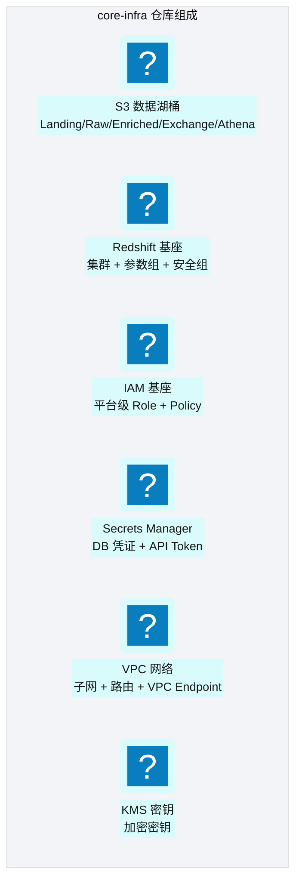
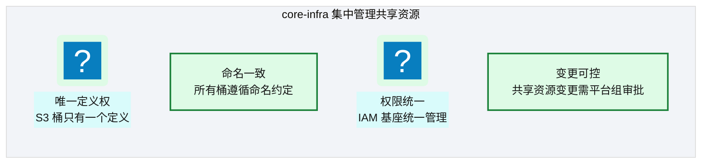
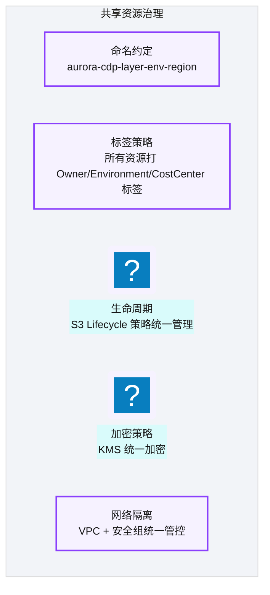

# Ch 22 核心基础设施仓库设计

!!! info "面包屑"
    [本书主页](./index.md) › [Part IV 基础设施与工程效能](./21-Terraform架构总览.md) › Ch 22

!!! abstract "项目第 1 年 · 核心建设期——核心仓设计"

---

## :material-school: 本章你将学到
- core-infra 仓库的组成：数据湖桶、IAM、Redshift 基座、Secrets、VPC
- S3 数据湖桶与 Redshift 基座的完整 Terraform module（variables/main/outputs）
- 共享资源治理层与 remote state 引用机制（含 outputs.tf 汇总与业务仓 remote_state 引用 HCL）

---

## 22.1 core-infra：数据湖桶、IAM、Redshift 基座、Secrets、VPC


<p class="caption" markdown="span">**图 22-1** core-infra：数据湖桶、IAM、Redshift 基座、...</p>

| 组件 | 职责 | 输出（供业务仓引用） |
|---|---|---|
| **S3 数据湖桶** | 创建分层桶 + 生命周期策略 | bucket arn / name |
| **Redshift 基座** | 集群 + 参数组 + 安全组 | cluster endpoint / arn |
| **IAM 基座** | 平台级 Role（Glue/Lambda/Step Functions） | role arn |
| **Secrets Manager** | DB 凭证 + API Token 存储 | secret arn |
| **VPC** | 网络 + 子网 + VPC Endpoint | subnet ids / sg ids |
| **KMS** | 加密密钥 | key arn |
<p class="caption" markdown="span">**表 22-1** core-infra：数据湖桶、IAM、Redshift 基座、Secrets、VPC</p>


### 设计原则：共享资源集中管理


<p class="caption" markdown="span">**图 22-2** 设计原则：共享资源集中管理</p>

!!! warning "Trade-off"
    集中管理的代价是"业务域不能自助创建共享资源"——每次需要新桶或新 Role 都得提 :octicons-git-pull-request-16: PR 到 core-infra。这增加了协作成本，但保证了全局一致性。对于共享资源，一致性比速度重要——一个命名不一致的桶可能导致权限策略失效。

把"集中管理共享资源"落到 :simple-terraform: Terraform，core-infra 仓就是一套模块组合。下面是 S3 数据湖桶模块的完整示意——变量接口、资源定义、输出三者齐全，命名约定/加密/版本/生命周期全部代码化：

```hcl
# 示意：core-infra/modules/s3_data_lake/variables.tf —— 数据湖桶模块的输入接口
variable "environment"    { type = string }                 # dev / qa / prod
variable "region"         { type = string }                 # cn-north-1
variable "kms_key_arn"    { type = string }                 # 来自 KMS 模块输出
variable "lifecycle_days" {                                 # 分层生命周期，满足 GxP 留存
  type    = map(number)
  default = { landing = 30, raw = 365, enriched = 2555 }     # enriched 留存 7 年
}
```

```hcl
# 示意：core-infra/modules/s3_data_lake/main.tf —— 资源定义（命名/加密/版本/生命周期）
resource "aws_s3_bucket" "lake" {
  for_each = toset(["landing", "raw", "enriched", "exchange"])
  bucket   = "ap-aurora-cdp-${each.key}-${var.environment}-${var.region}"
  # 核心意图：命名约定 aurora-cdp-layer-env-region 全局唯一且可审计
}

resource "aws_s3_bucket_versioning" "lake" {                 # 版本控制满足 GxP 原始性（[Ch 18](./18-数据脱敏与隐私治理.md)）
  for_each = toset(["landing", "raw", "enriched", "exchange"])
  bucket   = aws_s3_bucket.lake[each.key].id
  versioning_configuration { status = "Enabled" }
}

resource "aws_s3_bucket_server_side_encryption_configuration" "lake" {
  for_each = toset(["landing", "raw", "enriched", "exchange"])
  bucket   = aws_s3_bucket.lake[each.key].id
  rule {
    apply_server_side_encryption_by_default { sse_algorithm = "aws:kms"  kms_master_key_id = var.kms_key_arn }
  }
}

resource "aws_s3_bucket_lifecycle_configuration" "lake" {
  for_each = toset(["landing", "raw", "enriched"])
  bucket   = aws_s3_bucket.lake[each.key].id
  rule {                                     # 核心意图：分层生命周期平衡成本与合规
    id     = "tiered-storage"
    status = "Enabled"
    transition { days = var.lifecycle_days[each.key]  storage_class = "GLACIER" }
  }
}
```

```hcl
# 示意：core-infra/modules/s3_data_lake/outputs.tf —— 暴露给业务仓的输出
output "bucket_arns"  { value = { for k, b in aws_s3_bucket.lake : k => b.arn } }
output "bucket_names" { value = { for k, b in aws_s3_bucket.lake : k => b.id } }
```

Redshift 基座模块同理——按环境差异化规格、仅 VPC 内可达、凭证从 Secrets Manager 注入：

```hcl
# 示意：core-infra/modules/redshift_base/main.tf —— Redshift 基座（集群+参数组+安全组）
resource "aws_redshift_cluster" "base" {
  cluster_identifier  = "ap-aurora-cdp-${var.environment}"
  node_type           = var.environment == "prod" ? "ra3.4xlarge" : "ra3.xlplus"
  number_of_nodes     = var.environment == "prod" ? 24 : 3        # 核心意图：按环境差异化规格
  database_name       = "aurora_cdp"
  master_username     = jsondecode(data.aws_secretsmanager_secret_version.db_creds.secret_string)["username"]
  master_password     = jsondecode(data.aws_secretsmanager_secret_version.db_creds.secret_string)["password"]
  encrypted           = true
  kms_key_id          = var.kms_key_arn
  cluster_subnet_group_name = aws_redshift_subnet_group.base.name
  vpc_security_group_ids    = [aws_security_group.redshift.id]
  publicly_accessible       = false                             # 核心意图：仅 VPC 内可达
}
output "cluster_endpoint" { value = aws_redshift_cluster.base.endpoint }
output "cluster_arn"      { value = aws_redshift_cluster.base.arn }
```

---

## 22.2 共享资源治理层与 remote state 引用

### Remote State 输出

core-infra 通过 `output` 暴露共享资源标识：

```mermaid
%%{init: {'theme':'base','themeVariables':{'primaryColor':'#edf5ff','primaryTextColor':'#161616','primaryBorderColor':'#0f62fe','lineColor':'#697077','secondaryColor':'#d9fbfb','tertiaryColor':'#f2f4f8','fontSize':'14px'}}}%%
flowchart LR
 CORE[core-infra<br/>terraform apply] -->|output|STATE[state 文件]
 STATE -->|存储|S3[S3 backend]

 BIZ[business-domain-a<br/>terraform plan] -->|remote_state data|S3
 S3 -->|返回 output|BIZ
 BIZ -->|引用 bucket_arn / role_arn|RESOURCES[创建业务资源]
classDef bpProcess fill:#edf5ff,stroke:#0f62fe,stroke-width:2px,color:#161616
classDef bpData fill:#d9fbfb,stroke:#007d79,stroke-width:2px,color:#161616
classDef bpInfo fill:#f6f2ff,stroke:#8a3ffc,stroke-width:2px,color:#161616

class CORE,BIZ bpProcess
class STATE,S3 bpData
class RESOURCES bpInfo
linkStyle default stroke:#697077,stroke-width:2px
```


<p class="caption" markdown="span">**图 22-3** Remote State 输出</p>

core-infra 仓的根 `outputs.tf` 汇总各模块输出，业务仓用 `terraform_remote_state` data source 只读引用——这是"共享资源集中管理、业务仓不重建"的落地点：

```hcl
# 示意：core-infra/outputs.tf —— 汇总暴露共享资源标识
output "s3_landing_bucket_arn"     { value = module.s3_data_lake.bucket_arns["landing"] }
output "s3_enriched_bucket_arn"    { value = module.s3_data_lake.bucket_arns["enriched"] }
output "s3_exchange_bucket_name"   { value = module.s3_data_lake.bucket_names["exchange"] }
output "redshift_cluster_endpoint" { value = module.redshift_base.cluster_endpoint }
output "glue_role_arn"             { value = module.iam_base.glue_role_arn }
output "kms_key_arn"               { value = module.kms.key_arn }
```

```hcl
# 示意：business-domain-a/main.tf —— 业务仓用 remote_state 引用 core-infra 输出
data "terraform_remote_state" "core" {
  backend = "s3"
  config = {
    bucket = "ap-aurora-cdp-tfstate-prod-cn-north-1"
    key    = "prod/terraform.tfstate"              # 核心意图：按环境读对应 state
    region = "cn-north-1"
  }
}

module "glue_job_doctor" {
  source          = "git::https://github.com/aurora-data-platform/generic-modules//glue_job?ref=v1.77.0"
  job_name        = "ma-doctor-master"
  script_location = "s3://${data.terraform_remote_state.core.outputs.s3_exchange_bucket_name}/glue/v1.2.3/doctor.py"
  role_arn        = data.terraform_remote_state.core.outputs.glue_role_arn   # 引用而非重建
  max_dpus        = 6
}
```

### 治理层设计


<p class="caption" markdown="span">**图 22-4** 治理层设计</p>

!!! tip "引申"
    core-infra 的本质是"平台治理的代码化"——命名约定、标签策略、加密策略、网络隔离这些治理规则，不再是文档里的"请遵守"，而是 :simple-terraform: Terraform 代码里的"必须遵守"。这是 IaC 的深层价值：**治理即代码**。

---

## :material-check-circle: 本章小结
- core-infra 集中管理共享资源：S3 数据湖桶 / Redshift 基座 / IAM 基座 / Secrets / VPC / KMS
- S3 数据湖桶 module 完整示意（variables/main/outputs）：命名约定/加密/版本/生命周期全部代码化；Redshift 基座按环境差异化规格、仅 VPC 内可达
- 设计原则：共享资源唯一定义权、命名一致、权限统一、变更可控
- 通过 remote state output 暴露资源标识，业务仓用 `terraform_remote_state` data source 只读引用不重建
- 治理层将命名/标签/加密/网络策略代码化——治理即代码

---

!!! quote "下一章"
    [Ch 23 业务仓库设计与同构模式](./23-业务仓库设计与同构模式.md) —— core-infra 搭好了，接下来看业务 IaC 仓为什么刻意保持同构。

