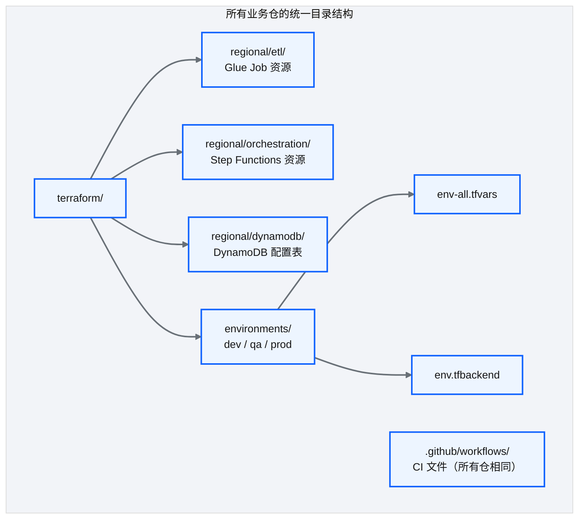
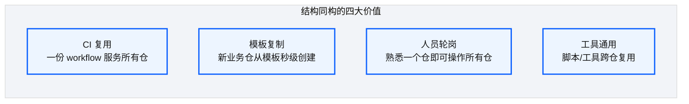
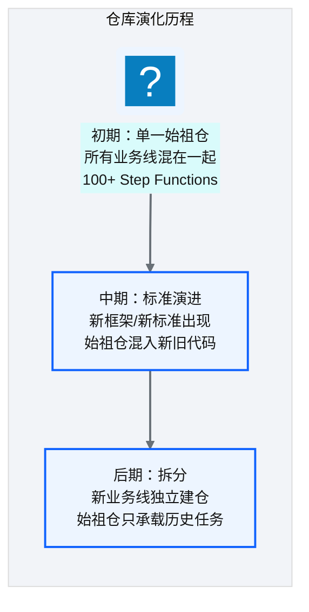
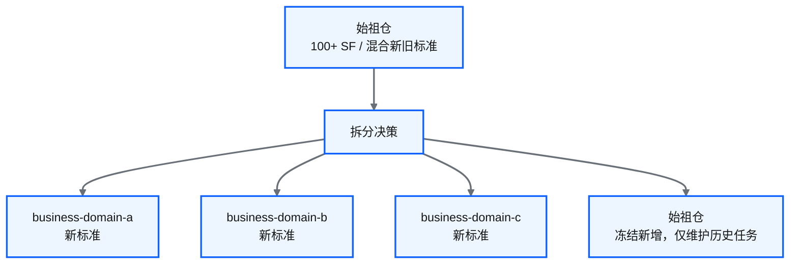
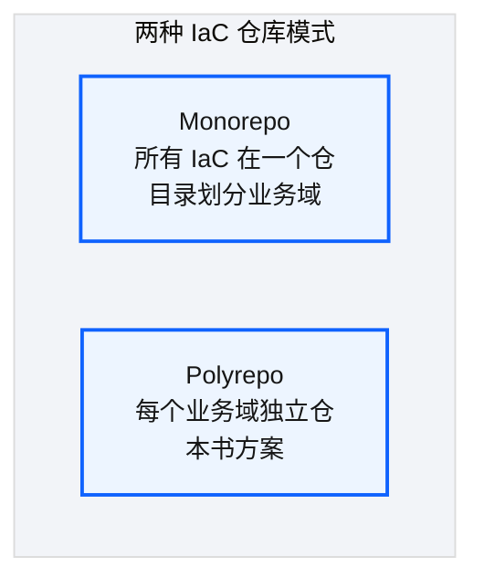

# Ch 23 业务仓库设计与同构模式

!!! info "面包屑"
    [本书主页](./index.md) › [Part IV 基础设施与工程效能](./22-核心基础设施仓库设计.md) › Ch 23

!!! abstract "项目第 1 年 · 核心建设期——业务仓同构"

---

## :material-school: 本章你将学到
- 业务 IaC 仓的同构目录结构设计
- 为什么刻意保持结构同构：CI 复用/模板复制/人员轮岗
- 始祖仓的遗产：新旧标准混合的治理债与拆分决策
- monorepo vs polyrepo 的 IaC 治理对比

---

## 23.1 业务 IaC 仓的同构目录结构设计

**图 23-1** 业务 IaC 仓的同构目录结构设计

| 目录 | 内容 | 同构性 |
|---|---|---|
| `terraform/regional/etl/` | Glue Job 资源定义 | 结构相同，内容不同（Job 数量/配置） |
| `terraform/regional/orchestration/` | Step Functions 资源 | 结构相同 |
| `terraform/regional/dynamodb/` | DynamoDB 配置表 | 结构相同 |
| `terraform/environments/{dev,qa,prod}/` | 环境级 tfvars + tfbackend | 结构相同 |
| `.github/workflows/` | CI 流程定义 | **完全相同**（调用同一 reusable workflow） |

**表 23-1** 业务 IaC 仓的同构目录结构设计

---

## 23.2 为什么刻意保持结构同构

**图 23-2** 为什么刻意保持结构同构

| 价值 | 说明 |
|---|---|
| **CI 复用** | 所有仓调用同一个 reusable workflow，CI 逻辑只维护一份 |
| **模板复制** | 新建业务仓 = `cp -r template/ new-domain/`，改 domain 名即可 |
| **人员轮岗** | 工程师从 domain-a 调到 domain-b，无需重新学习仓库结构 |
| **工具通用** | 排障脚本、变更检测脚本跨仓通用 |

**表 23-2** 为什么刻意保持结构同构

!!! warning "Trade-off"
    同构的代价是"不够灵活"——某些业务域可能有特殊需求，同构结构可能不完全适配。应对策略是"同构为主、特例标注"——绝大多数仓严格同构，极少数特例在 README 中明确标注差异。同构的收益（可维护性）远大于特例的收益（灵活性）。

---

## 23.3 始祖仓的遗产：新旧标准混合的治理债与拆分决策

### 始祖仓的演化

**图 23-3** 始祖仓的演化

### 治理债的形成

| 问题 | 原因 | 影响 |
|---|---|---|
| 新旧标准混合 | 始祖仓承载了 v1 和 v2 两代框架 | 新人困惑，不知道该遵循哪套标准 |
| 旧代码不再维护 | 大量旧 connector/state machine 仍在跑 | 不敢改、不敢删，维护成本高 |
| 仓库过大 | 100+ 资源定义在一个仓 | CI 慢、 :octicons-git-pull-request-16: PR review 困难 |

**表 23-3** 治理债的形成

### 拆分决策

**图 23-4** 拆分决策

!!! tip "引申"
    始祖仓的治理债是"快速迭代"的代价——初期为了快速上线，所有东西放一个仓；随着业务增长，这个仓变成了"垃圾场"。拆分是正确的决策，但代价是"历史任务留在始祖仓，长期需要维护两套标准"。更好的做法是"从第一天就按业务域拆仓"——哪怕初期只有 2-3 个任务，也建独立仓。这就是同构模式的预防价值。

---

## 23.4 引申：monorepo vs polyrepo 的 IaC 治理对比

**图 23-5** 引申：monorepo vs polyrepo 的 IaC 治理对比

| 维度 | Monorepo | Polyrepo（本书） |
|---|---|---|
| **CI** | 一次 CI 覆盖所有（慢但全面） | 每仓独立 CI（快但需复用） |
| **权限** | 粗粒度（全有或全无） | 细粒度（按仓授权） |
| **变更协调** | 跨域变更一个 PR | 跨域变更需多仓协调 |
| **发布节奏** | 统一节奏 | 各域独立节奏 |
| **新人上手** | 需理解整体结构 | 只需理解一个仓 |
| **适合规模** | 中小型、域间耦合强 | 中大型、域间解耦 |

**表 23-4** 引申：monorepo vs polyrepo 的 IaC 治理对比

!!! warning "Trade-off"
    本书选 polyrepo 的核心理由是"IaC 与运行时代码发布节奏不同"——:simple-terraform: Terraform 需 plan/apply 审批，Glue 脚本只需 S3 上传。混在 monorepo 会让 CI 极度复杂。但如果团队小、域间耦合强，monorepo 的协调成本更低。没有银弹——按团队规模和耦合度选择。

---

## :material-check-circle: 本章小结
- 业务 IaC 仓采用同构目录结构：etl/orchestration/dynamodb + environments/{dev,qa,prod} + 统一 CI
- 同构四大价值：CI 复用 / 模板复制 / 人员轮岗 / 工具通用——收益远大于特例灵活性
- 始祖仓的治理债：新旧标准混合、旧代码不维护、仓库过大——拆分是正确决策但遗留两套标准
- monorepo vs polyrepo：按团队规模和耦合度选择，本书选 polyrepo 因 IaC 与运行时代码发布节奏不同

---

!!! quote "下一章"
    [Ch 24 通用 Terraform 模块设计](./24-通用Terraform模块设计.md) —— 接下来看通用模块库如何设计，让业务仓能"搭积木"式组装资源。

