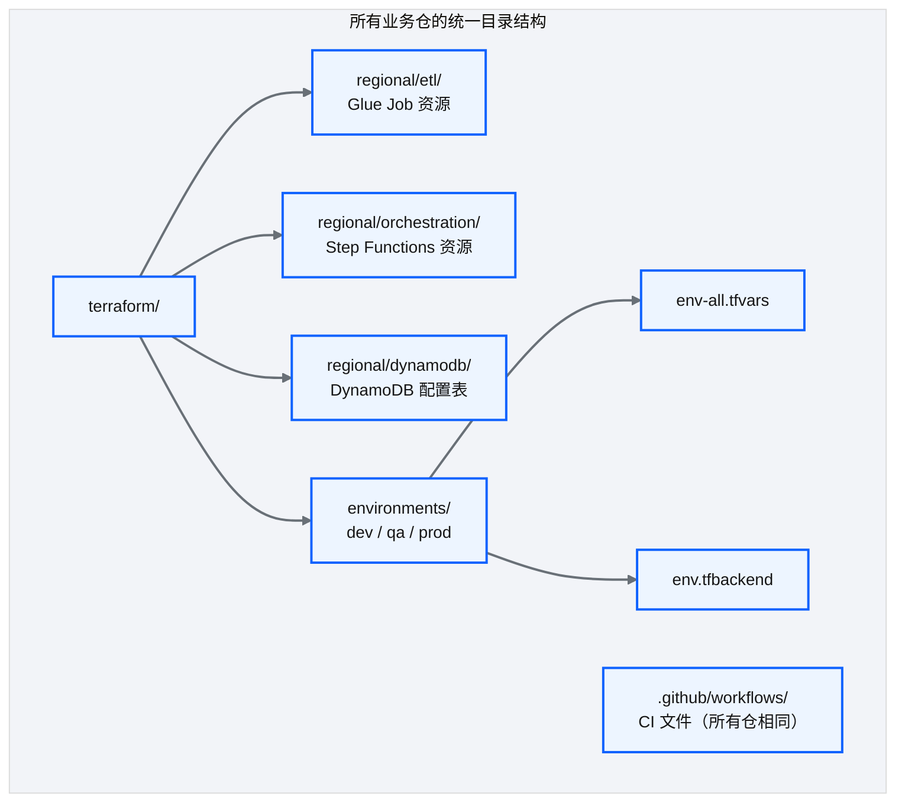
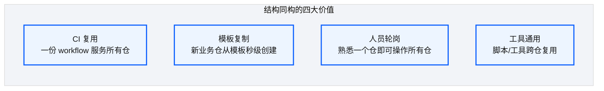
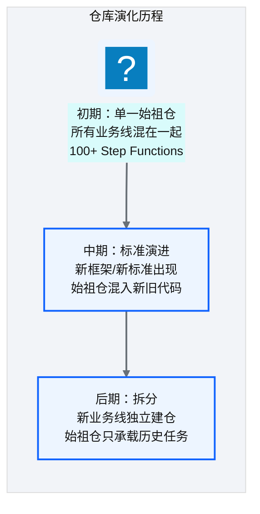
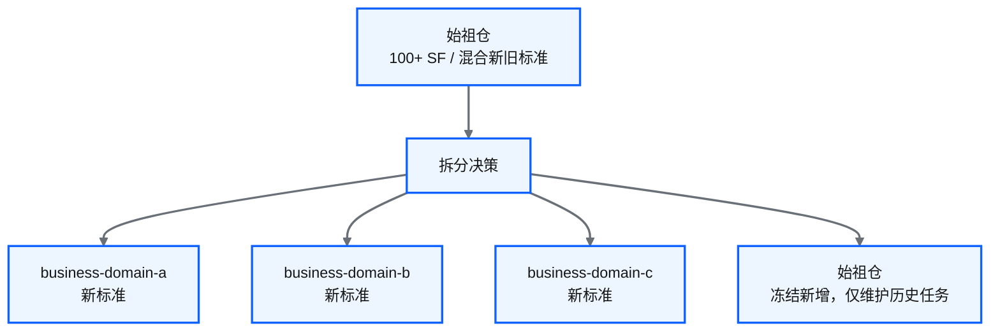
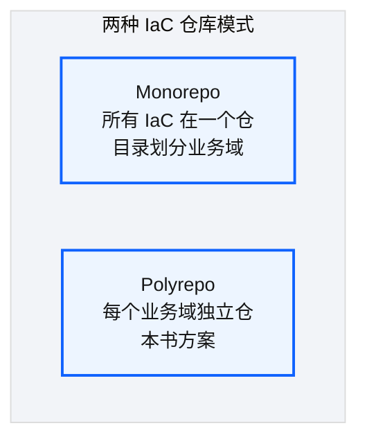

# Ch 23 业务仓库设计与同构模式

!!! info "面包屑"
    [本书主页](./index.md) › [Part IV 基础设施与工程效能](./22-核心基础设施仓库设计.md) › Ch 23

!!! abstract "项目第 1 年 · 核心建设期——业务仓同构"

---

## :material-school: 本章你将学到
- 业务 IaC 仓的同构目录：代码在 `regional/`，参数在 `environments/`，CI 只调用平台 workflow
- 同构如何换来 CI 复用、模板开仓与合规可归属；特例如何标注
- 始祖仓治理债、冻结机制与按域拆分；monorepo vs polyrepo 在医药合规下的取舍

---

## 23.1 业务 IaC 仓的同构目录结构设计

[Ch 22](./22-核心基础设施仓库设计.md) 把地基放进 core-infra。业务域要的是**可复制的铺面图纸**，别让每个域自己发明一种目录方言。


<p class="caption" markdown="span">**图 23-1** 业务 IaC 仓的同构目录结构设计</p>

| 目录 | 内容 | 同构性 |
|---|---|---|
| `terraform/regional/etl/` | Glue / Lambda / S3 事件等 ETL 资源 | 结构相同，内容按域不同 |
| `terraform/regional/orchestration/` | Step Functions + `state_files/` 模板 | 结构相同 |
| `terraform/regional/dynamodb/` | 域内配置表（若有） | 结构相同 |
| `terraform/environments/{dev,qa,prod}/` | `{env}-all` + 按服务 `*-all.tfvars` + `.tfbackend` | 结构相同 |
| `.github/workflows/ci.yml` | 仅 `uses:` 调用平台 reusable workflow | **完全相同**（差在输入参数） |
<p class="caption" markdown="span">**表 23-1** 业务 IaC 仓的同构目录结构设计</p>

```text
# 示意：aurora-domain-ma 同构骨架
terraform/
├── main.tf / providers.tf
├── aurora-generic-modules/          # submodule
├── regional/
│   ├── etl/          # glue.tf lambda.tf s3_event.tf
│   ├── orchestration/# stepfunctions.tf + process_state_files/
│   └── dynamodb/
└── environments/{dev,qa,prod}/
    ├── {env}.tfbackend
    ├── {env}-all.tfvars
    ├── glue-all.tfvars | lambda-all.tfvars | step-functions-all.tfvars
    └── state_files/*.state.json     # ASL 模板，见 Ch 26
```

这个结构不是我一开始就定好的。前三个月 domain-a 用 `glue/`+`sf/`，domain-b 用 `etl/`+`orchestration/`，排障先要翻译目录方言。我停下开发花一天统一成图 23-1。同构是痛出来的（M4）。

开新域的标准动作：复制模板仓，改 domain 名与 `repo_type=develop`，在三套 `environments/` 填 tfvars，且不加 `iam-all`（IAM 仍归 foundation）。加一个 Glue Job 也固定：在 `regional/etl` 声明模块调用，三环境 `glue-all.tfvars` 补条目，PR 触发 CI。下一节解释为什么我宁可牺牲一点灵活性，也要钉死这张图纸。

---

## 23.2 为什么刻意保持结构同构


<p class="caption" markdown="span">**图 23-2** 为什么刻意保持结构同构</p>

| 价值 | 说明 |
|---|---|
| **CI 复用** | 所有仓调用同一 reusable workflow；路径过滤假设目录约定存在 |
| **模板复制** | 新建域 = 复制模板 + 改名，不重写流水线 |
| **人员轮岗** | 工程师换域不换心智模型 |
| **工具通用** | 变更检测、排障脚本跨仓同一套 |
<p class="caption" markdown="span">**表 23-2** 为什么刻意保持结构同构</p>

同构和 [Ch 27](./27-CI-CD可复用工作流平台.md) 绑在一起：workflow 里写死 `environments/${env}/glue-all.tfvars` 这类路径，是因为所有仓都遵守表 23-1。异构一天，平台 CI 就要长出 `if domain == …` 的特例树。

!!! warning "Trade-off"
    同构的代价是不够灵活，个别域的特殊拓扑可能别扭。策略是**同构为主、特例标注**：特例必须在 README 写明差异，并尽量用模块输入表达，别另起目录。仓从 3 个涨到 6 个时，改一处安全扫描、六仓同时生效，复利才看得见（M4 / M11）。

---

## 23.3 始祖仓的遗产：新旧标准混合的治理债与拆分决策

### 始祖仓的演化


<p class="caption" markdown="span">**图 23-3** 始祖仓的演化</p>

### 治理债的形成

| 问题 | 原因 | 影响 |
|---|---|---|
| 新旧标准混合 | 始祖仓承载了 v1 和 v2 两代框架 | 新人不知道该遵循哪套 |
| 旧代码不再维护 | 大量旧 connector/state machine 仍在跑 | 不敢改、不敢删 |
| 仓库过大 | 100+ 资源定义在一个仓 | CI 慢、PR review 困难 |
<p class="caption" markdown="span">**表 23-3** 治理债的形成</p>

### 拆分决策


<p class="caption" markdown="span">**图 23-4** 拆分决策</p>

拆分时我定了三条**冻结运营规则**，否则"始祖仓"会继续膨胀：

1. CODEOWNERS：新增 `regional/**` 资源仅允许平台架构组例外合并。
2. CI 策略：`validation_type=freeze`。plan 若出现 `create` 计数 > 0 则失败，只允许 in-place update / destroy 迁移。
3. 文档：README 置顶"禁止新接入；新需求去同构域仓"。

!!! tip "引申"
    拆分是对的，但遗留两套标准的双轨成本真实存在（M5）。更好的预防是第一天就按域拆仓，哪怕每域只有两三个任务。同构帮我复用流水线，也拦住了再长出一个始祖垃圾场。

---

## 23.4 引申：monorepo vs polyrepo 的 IaC 治理对比


<p class="caption" markdown="span">**图 23-5** 引申：monorepo vs polyrepo 的 IaC 治理对比</p>

| 维度 | Monorepo | Polyrepo（本书） |
|---|---|---|
| **CI** | 一次 CI 覆盖所有（慢但全面） | 每仓独立 CI（快，靠同构复用） |
| **权限** | 粗粒度或复杂 CODEOWNERS | 按仓授权，变更可归属 |
| **变更协调** | 跨域一个 PR | 跨域 N 个 PR（例：改平台 Role + 六域引用） |
| **发布节奏** | 易被绑成统一节奏 | 各域独立；与 Glue/Lambda 发布流解耦 |
| **适合规模** | 小团队、强耦合 | 多域、合规要求强 |
<p class="caption" markdown="span">**表 23-4** 引申：monorepo vs polyrepo 的 IaC 治理对比</p>

!!! warning "Trade-off"
    我选 polyrepo，决定性因素是**权限隔离与变更可归属**（M10），其次才是 IaC 与运行时代码发布节奏不同。代价是一次改 foundation 输出名，可能要开 1+6 个 PR。我们用契约双写窗口加域仓批量升级脚本对冲，不退回 monorepo。

下一章进入同构仓共同依赖的积木 generic-modules：中国区子集、SemVer，以及我拆过的胖模块教训。

---

## :material-check-circle: 本章小结
- 同构目录：`regional/{etl,orchestration,dynamodb}` + `environments/*` + 极简 CI 调用
- 同构服务平台工程：一份 workflow、一套变更检测、模板开仓（M4 / M7）
- 始祖仓用冻结规则止血，新域走同构；polyrepo 用仓边界换合规可归属

---

!!! quote "下一章"
    [Ch 24 通用 Terraform 模块设计](./24-通用Terraform模块设计.md) —— 接下来看通用模块库如何设计，让业务仓能"搭积木"式组装资源。
