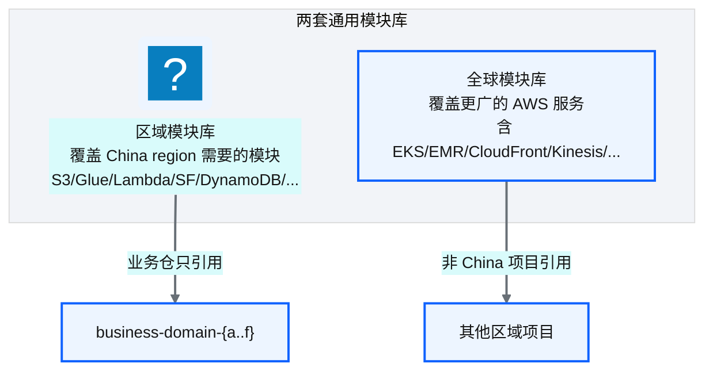
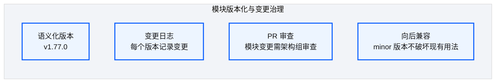
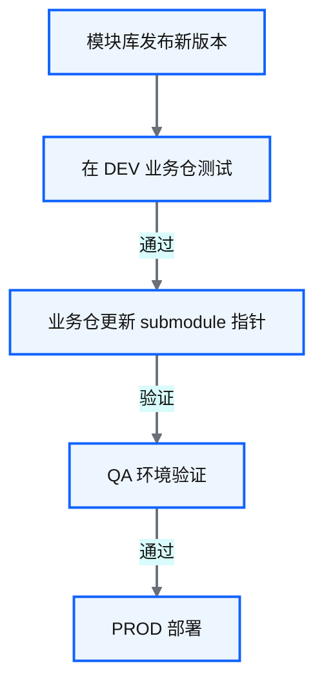
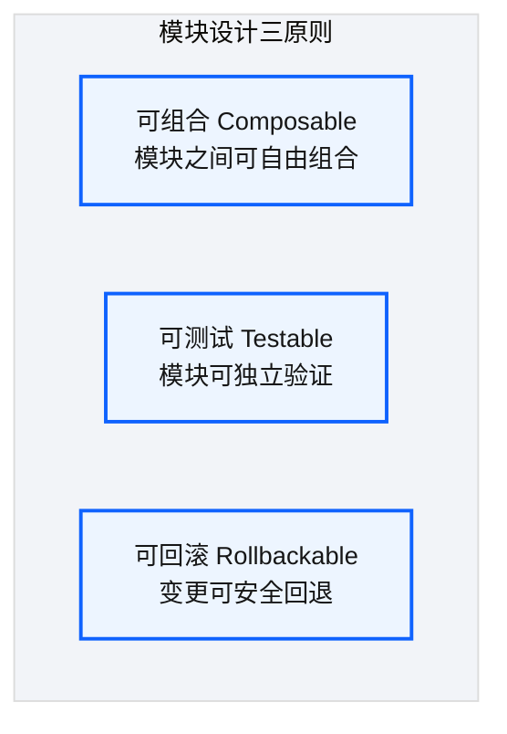

# Ch 24 通用 :simple-terraform: Terraform 模块设计

!!! info "面包屑"
    [本书主页](./index.md) › [Part IV 基础设施与工程效能](./23-业务仓库设计与同构模式.md) › Ch 24

!!! abstract "项目第 1 年 · 核心建设期——模块库设计"

---

## :material-school: 本章你将学到
- 区域模块与全球模块的分工设计（含 19 个区域模块清单）
- 模块版本化与变更治理（含 submodule 版本锁定 HCL）
- Terraform 模块设计原则：可组合/可测试/可回滚（含 Glue Job 模块完整接口）

---

## 24.1 区域模块与全球模块的分工


<p class="caption" markdown="span">**图 24-1** 区域模块与全球模块的分工</p>

| 模块库 | 覆盖范围 | 使用者 |
|---|---|---|
| **区域模块库** | China region 需要的核心模块（约 19 个） | 所有 China 业务仓 |
| **全球模块库** | 更广 AWS 服务（50+ 模块） | 非 China 项目或扩展需求 |
<p class="caption" markdown="span">**表 24-1** 区域模块与全球模块的分工</p>


区域模块库覆盖 China region 数据平台所需的核心服务，下面是 19 个区域模块的完整清单——业务仓通过组合这些模块组装资源，无需从零写 resource：

| # | 模块 | 覆盖资源 | 典型使用者 |
|---|---|---|---|
| 1 | `s3_bucket` | S3 桶+加密+版本+生命周期 | 所有仓 |
| 2 | `glue_job` | Glue Job+安全配置+脚本路径 | 业务仓 |
| 3 | `glue_catalog` | Glue Database/Table/Partition | 业务仓 |
| 4 | `lambda_function` | Lambda+IAM+日志组 | 业务仓 |
| 5 | `step_functions` | 状态机+IAM+日志 | 业务仓 |
| 6 | `eventbridge_rule` | 定时规则+事件目标 | 业务仓 |
| 7 | `dynamodb_table` | 表+索引+加密 | core-infra/业务仓 |
| 8 | `kms_key` | CMK+key policy | core-infra |
| 9 | `iam_role` | Role+assume policy+inline policy | 所有仓 |
| 10 | `vpc` | VPC+子网+路由+Endpoint | core-infra |
| 11 | `redshift_cluster` | 集群+参数组+安全组 | core-infra |
| 12 | `secrets_manager` | Secret+轮转 Lambda | core-infra |
| 13 | `cloudwatch_alarm` | 告警+SNS 订阅 | 业务仓 |
| 14 | `cloudwatch_log_group` | 日志组+保留策略 | 所有仓 |
| 15 | `cloudtrail` | Trail+S3 归档 | core-infra |
| 16 | `sns_topic` | Topic+订阅 | 业务仓 |
| 17 | `sqs_queue` | 队列+死信+加密 | 业务仓 |
| 18 | `api_gateway` | REST API+阶段+日志 | DaaS（[Ch 37](./37-数据即服务-DaaS激活层设计.md)） |
| 19 | `parameter_store` | SSM Parameter+KMS | 业务仓 |
<p class="caption" markdown="span">**表 24-2** 区域模块与全球模块的分工</p>


以最常用的 `glue_job` 模块为例，它的完整接口如下——变量是业务仓的输入，输出供其他模块/remote state 引用，`versions.tf` 锁定 provider 版本保证一致性：

```hcl
# 示意：generic-modules/glue_job/variables.tf —— Glue Job 模块输入接口
variable "job_name"        { type = string }                          # ma-doctor-master
variable "script_location" { type = string }                          # s3://ap-aurora-cdp-.../doctor.py
variable "role_arn"        { type = string }                          # 来自 remote_state 引用
variable "max_dpus"        { type = number  default = 5 }
variable "timeout"         { type = number  default = 60 }            # 分钟
variable "schedule"        { type = string  default = null }          # cron 表达式，null=仅手动
variable "extra_py_files"  { type = string  default = "" }            # 依赖 whl 包路径
variable "environment"     { type = string }                          # dev/qa/prod，用于标签
```

```hcl
# 示意：generic-modules/glue_job/main.tf —— 资源定义
resource "aws_glue_job" "this" {
  name              = var.job_name
  role_arn          = var.role_arn
  glue_version      = "4.0"
  max_capacity      = var.max_dpus
  timeout           = var.timeout
  command { script_location = var.script_location  python_version = "3" }
  default_arguments = { "--extra-py-files" = var.extra_py_files }     # 核心意图：依赖注入
  tags              = { Environment = var.environment  Owner = "aurora-cdp" }
}

resource "aws_cloudwatch_log_group" "job" {                           # 日志组随 Job 创建
  name              = "/aws-glue/${var.job_name}"
  retention_in_days = 30
}
```

```hcl
# 示意：generic-modules/glue_job/outputs.tf —— 输出供引用
output "job_arn"   { value = aws_glue_job.this.arn }
output "job_name"  { value = aws_glue_job.this.name }
```

```hcl
# 示意：generic-modules/glue_job/versions.tf —— provider 版本锁定（团队一致）
terraform { required_providers { aws = { source = "hashicorp/aws"  version = "~> 5.0" } } }
```

!!! warning "Trade-off"
    维护两套模块库有重复成本——某些模块在两套库中都有。但 China region 的 AWS 服务子集与全球不同（某些服务不可用），区域模块库做了适配。合并为一套库会增加 China 业务的复杂度。分而治之是务实选择。

---

## 24.2 模块版本化与变更治理


<p class="caption" markdown="span">**图 24-2** 模块版本化与变更治理</p>

| 版本类型 | 含义 | 示例 |
|---|---|---|
| **Major** | 破坏性变更 | v1 → v2（需业务仓迁移） |
| **Minor** | 新功能，向后兼容 | v1.77 → v1.78 |
| **Patch** | Bug 修复 | v1.77.0 → v1.77.1 |
<p class="caption" markdown="span">**表 24-3** 模块版本化与变更治理</p>


### 模块升级流程


<p class="caption" markdown="span">**图 24-3** 模块升级流程</p>

模块版本通过 submodule 指针锁定——业务仓用 `?ref=v1.77.0` 固定到具体版本，升级时更新指针并走 DEV→QA→PROD 验证：

```hcl
# 示意：业务仓锁定模块版本（升级时改 ref，走完整发布流）
module "glue_job_doctor" {
  source = "git::https://github.com/aurora-data-platform/generic-modules//glue_job?ref=v1.77.0"
  # 核心意图：版本指针锁定，避免模块库主分支变更直接影响业务仓
  ...
}
# 升级到 v1.78.0：改 ref → DEV 测试 → QA 验证 → PROD 部署
```

!!! tip "引申"
    模块版本化的核心挑战是"升级扩散"——模块库发新版后，如何确保所有业务仓都升级？我们的做法是：模块库发 Major 版本时设"废弃期"（如 3 个月），期间旧版可用但 CI 会输出告警，过期后旧版不再维护。这给了业务团队升级窗口，同时施加了压力。

---

## 24.3 引申：Terraform 模块设计原则


<p class="caption" markdown="span">**图 24-4** 引申：Terraform 模块设计原则</p>

| 原则 | 实践 |
|---|---|
| **可组合** | 模块输出（output）设计为其他模块的输入（variable），形成积木式组装 |
| **可测试** | 每个模块有 `examples/` 目录，可用 :octicons-terminal-16: `terraform plan` 验证 |
| **可回滚** | 变更不破坏旧版本接口（向后兼容），出问题可回退 submodule 指针 |
<p class="caption" markdown="span">**表 24-4** 引申：Terraform 模块设计原则</p>


!!! tip "引申"
    好的 Terraform 模块像好的 API——接口稳定、文档清晰、向后兼容。推荐阅读 HashiCorp 官方的 [Terraform Module Best Practices](https://developer.hashicorp.com/terraform/best-practices) 指南。核心建议：模块聚焦单一资源类型（一个模块管 S3，另一个管 Glue），不要做"大而全"的模块。

    这三原则（可组合/可测试/可回滚）不是我一开始就总结出来的，而是"违反了再补"的。最初我的 glue_job 模块是"大而全"的——它不只管 Glue Job，还管了 EventBridge 规则和 CloudWatch 告警（"反正都跟 Job 相关"）。结果"可组合"被破坏——只想用 Glue Job 不想用告警的业务仓，被迫接受告警资源。"可回滚"也被破坏——改告警逻辑会影响 Glue Job 用户。后来我把大模块拆成三个独立小模块（glue_job / eventbridge_rule / cloudwatch_alarm），每个聚焦单一资源，业务仓按需组合。**模块的粒度是"单一资源类型"——大而全的模块看起来方便，实则破坏了组合性和可回滚性**（M2 关注点分离在模块设计的落地）。

---

## :material-check-circle: 本章小结
- 两套模块库：区域模块（China 核心 19 个，含完整清单）/ 全球模块（50+ 扩展）——分而治之适应 China 服务子集
- Glue Job 模块完整接口示意（variables/main/outputs/versions）：变量是业务仓输入，输出供引用，provider 版本锁定保证团队一致
- 模块版本化：语义化版本 + submodule `?ref=vX.Y.Z` 指针锁定 + 变更日志 + PR 审查 + 向后兼容；Major 版本设废弃期推动升级扩散
- 模块设计三原则：可组合（输出为输入）/ 可测试（examples 验证）/ 可回滚（向后兼容）

---

!!! quote "下一章"
    [Ch 25 环境参数与 tfvars 模型](./25-环境参数与tfvars模型.md) —— 模块设计好了，环境参数怎么管？接下来看 tfvars 模型。

