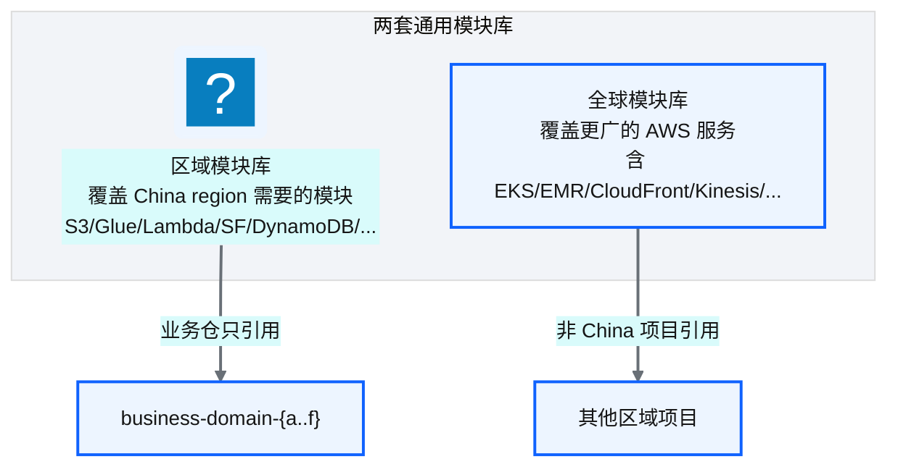
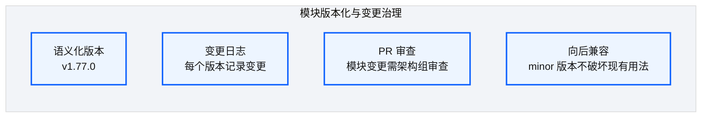
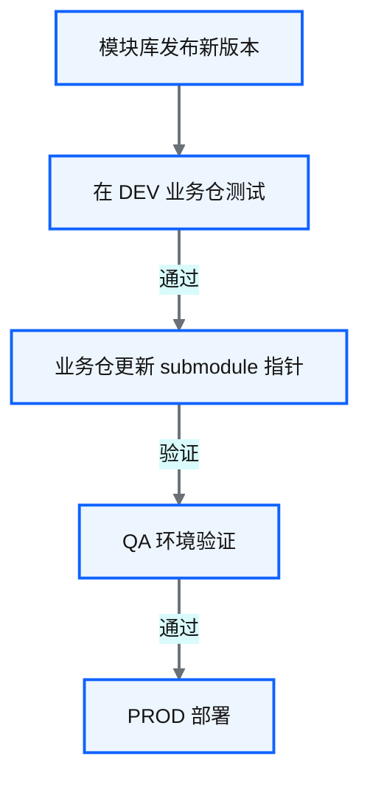
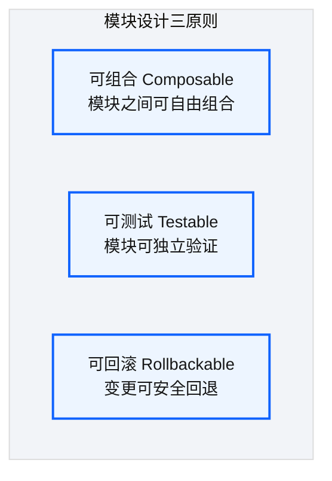

# Ch 24 通用 :simple-terraform: Terraform 模块设计

!!! info "面包屑"
    [本书主页](./index.md) › [Part IV 基础设施与工程效能](./23-业务仓库设计与同构模式.md) › Ch 24

!!! abstract "项目第 1 年 · 核心建设期——模块库设计"

---

## :material-school: 本章你将学到
- 中国区模块子集 vs 全球模块库的分工与重复成本
- 模块选型原则（平台关键子集）与 `glue_job` 契约示例
- SemVer / submodule 钉版本 / 弃用窗口；可组合、可测试、可回滚（含胖模块拆分教训）

---

## 24.1 区域模块与全球模块的分工

同构业务仓（[Ch 23](./23-业务仓库设计与同构模式.md)）要靠模块库搭起来。模块得稳定、能钉版本；更现实的一点是：全球区能用的 AWS 服务，中国区不一定有。


<p class="caption" markdown="span">**图 24-1** 区域模块与全球模块的分工</p>

| 模块库 | 覆盖范围 | 使用者 |
|---|---|---|
| **区域模块库**（`aurora-generic-modules`） | China 数据平台子集；provider/分区差异已适配 | 所有 China 业务仓与 core-infra |
| **全球模块库** | 更广 AWS 服务面 | 非 China 项目或未来扩展 |
<p class="caption" markdown="span">**表 24-1** 区域模块与全球模块的分工</p>

我没有把"中国区库有多少个模块"当成 KPI。进库的模块至少要满足：被 ≥2 个仓复用，或者扛着合规默认值（加密/标签/日志），或者必须做中国区特化。平台主路上的核心模块大致如下；完整枚举留给附录，正文不装全。

| 模块 | 覆盖 | 为何算平台关键 |
|---|---|---|
| `s3_bucket` | 加密/版本/生命周期/CORS 约束 | 湖与工具桶的默认合规面 |
| `glue_job` | Job + 日志组；支持 shell/spark 参数面 | ETL 主路径 |
| `lambda_function` | 函数 + 日志；可选 layer | 控制面与轻量变换 |
| `step_functions` | 状态机 + 日志 | 编排主路径 |
| `eventbridge_rule` | 调度/事件目标 | 与 Job 解耦的触发器 |
| `dynamodb_table` | 表 + 加密 | 运行时配置面 |
| `secrets_manager` | Secret；**默认不写 secret 值进 state** | 轮转友好（见下） |
| `cloudwatch_alarm` / `iam_role` / `kms_key` / `redshift_cluster` | 观测与地基 | foundation 与域告警 |
<p class="caption" markdown="span">**表 24-2** 平台关键模块子集（非完整枚举）</p>

```hcl
# 示意：glue_job 模块契约——单一资源类型，调度与告警不塞进来
variable "job_name"        { type = string }
variable "script_location" { type = string }
variable "role_arn"        { type = string }
variable "max_capacity"    { type = number  default = 5 }
variable "glue_version"    { type = string  default = "4.0" }
variable "default_arguments" { type = map(string) default = {} }

resource "aws_glue_job" "this" {
  name         = var.job_name
  role_arn     = var.role_arn
  glue_version = var.glue_version
  max_capacity = var.max_capacity
  command { script_location = var.script_location  python_version = "3" }
  default_arguments = var.default_arguments
}

output "job_arn"  { value = aws_glue_job.this.arn }
output "job_name" { value = aws_glue_job.this.name }
```

!!! warning "Trade-off"
    维护两套库有重复成本：`s3_bucket` 可能两边都有。若合并成一套、用 feature flag 区分中国区，就把"服务不可用 / 端点不同 / 分区 `aws-cn`"的分支打进每个模块，审查更贵。分而治之更务实（M10）：China 仓禁止直接依赖全球库里未适配的模块。

一个容易忽略的设计债：Secrets 模块默认创建空值 Secret，值交给轮转流程写。若把明文 secret 写进 Terraform，每次轮转可能堆出上百个 state 版本，apply 和 state 拉取都会变慢。这是我从生产轮转事故里学到的。

---

## 24.2 模块版本化与变更治理


<p class="caption" markdown="span">**图 24-2** 模块版本化与变更治理</p>

| 版本类型 | 含义 | 示例 |
|---|---|---|
| **Major** | 破坏性变更 | v1 → v2（需业务仓迁移） |
| **Minor** | 新功能，向后兼容 | v1.77 → v1.78 |
| **Patch** | Bug 修复 | v1.77.0 → v1.77.1 |
<p class="caption" markdown="span">**表 24-3** 模块版本化与变更治理</p>

### 模块升级流程


<p class="caption" markdown="span">**图 24-3** 模块升级流程</p>

业务仓用 git submodule 钉 tag（或等价的 `?ref=vX.Y.Z`）消费模块库。模块发版不会自动进生产；必须改指针，再走图 24-3。这和 Terraform 官方"钉版本"建议一致：Registry 用 `version`，Git 源用 `ref`。

```hcl
# 示意：钉版本——升级 = 改 pin + 走发布流
module "glue_job_doctor" {
  source = "./aurora-generic-modules/modules/glue_job"
  # 真相在 .gitmodules：branch/tag = v1.77.0
}
# 或：source = "git::https://github.com/aurora-data-platform/generic-modules.git//modules/glue_job?ref=v1.77.0"
```

废弃策略我分两层：

1. **接口弃用**：变量/输出标记 deprecated，plan 出警告（Terraform 新版本支持 deprecated 元数据；旧版本用文档 + CI 扫调用方）。
2. **模块退役**：目录改名为 `*_DEPRECATED_DO_NOT_USE`，MAJOR 起 90 天窗口，CI 对仍引用旧路径的仓打 fail（可临时豁免工单）。

!!! tip "引申"
    升级扩散是模块库的真问题。我们加了"最低支持 tag"检查：域仓 submodule 落后安全基线就黄灯，落后强制基线就红灯。业务侧有压力，迁移侧有窗口；总比突然删分支文明（M7）。

---

## 24.3 引申：Terraform 模块设计原则


<p class="caption" markdown="span">**图 24-4** 引申：Terraform 模块设计原则</p>

| 原则 | 实践 |
|---|---|
| **可组合** | 输出可接下一模块输入；触发器/告警不绑死在 Job 模块里 |
| **可测试** | 每模块 `examples/` + 模块仓 CI `terraform plan` |
| **可回滚** | minor 不破坏接口；出事回退 submodule pin |
<p class="caption" markdown="span">**表 24-4** 引申：Terraform 模块设计原则</p>

!!! tip "引申"
    三原则是"违反了再补"的。最初 `glue_job` 大而全，顺带创建 EventBridge 与告警，理由是"反正都跟 Job 相关"。结果只要 Job、不要告警的域也被迫吃下告警资源；改告警逻辑还会惊到 Job 用户。我拆成 `glue_job` / `eventbridge_rule` / `cloudwatch_alarm` 之后，组合和回滚才重新说得通。粒度按单一资源类型（M2）；组装的便利放在调用方的 tfvars 里，别塞进上帝模块。

下一章展开调用方的参数面：按服务拆分的 tfvars、和 DynamoDB 运行时配置的边界，以及独立 state 桶怎么变成刚需。

---

## :material-check-circle: 本章小结
- 中国区子集库与全球库分治；正文只谈平台关键模块和筛选标准
- 版本靠 SemVer + submodule/`ref` 钉死；弃用有窗口，CI 施压
- 模块要可组合、可测试、可回滚；胖模块拆分是事故换来的

---

!!! quote "下一章"
    [Ch 25 环境参数与 tfvars 模型](./25-环境参数与tfvars模型.md) —— 模块设计好了，环境参数怎么管？接下来看 tfvars 模型。
