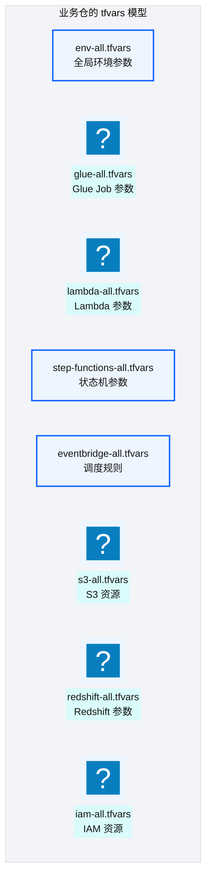
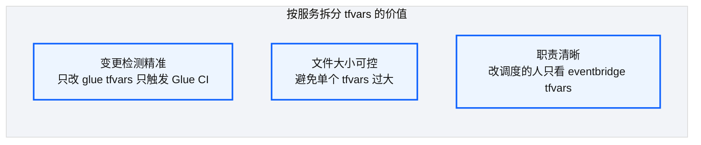
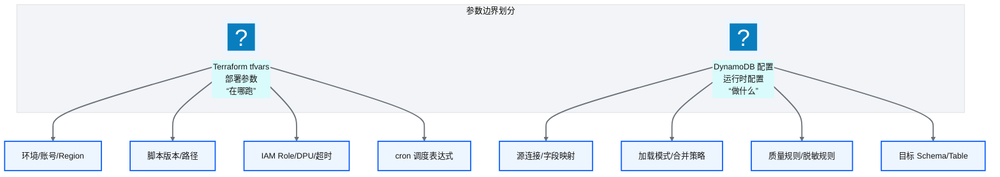
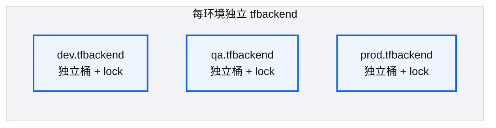

# Ch 25 环境参数与 tfvars 模型

!!! info "面包屑"
    [本书主页](./index.md) › [Part IV 基础设施与工程效能](./24-通用Terraform模块设计.md) › Ch 25

!!! abstract "项目第 1 年 · 核心建设期——参数模型"

---

## :material-school: 本章你将学到
- `{env}-all` + 按服务 `*-all.tfvars` 的分层与 `-var-file` 组合方式
- 部署参数（Terraform）vs 运行时配置（DynamoDB）的边界判据
- 分环境 `*.tfbackend`：独立桶 + 独立锁表，以及误删事故后的隔离强度升级

---

## 25.1 环境级参数文件与按服务拆分策略

模块是积木（[Ch 24](./24-通用Terraform模块设计.md)），tfvars 决定每个环境怎么拼。Aurora 业务仓把代码放在 `regional/`，参数放在 `environments/`；同构约定里，这一半几乎全在这里。


<p class="caption" markdown="span">**图 25-1** 环境级参数文件与按服务拆分策略</p>

| 文件 | 内容 | 变更频率 | 谁的 plan 会带 |
|---|---|---|---|
| `{env}-all.tfvars` | region / 前缀 / cost_center | 极低 | 所有 `repo_type` |
| `glue-all.tfvars` 等 | 各服务资源参数 | 中 | develop / platform |
| `iam-all.tfvars` | 平台 IAM | 低 | **仅** foundation / infra |
| `step-functions-all.tfvars` + `state_files/` | 编排与 ASL 模板 | 低–中 | develop（桥接 [Ch 26](./26-StepFunctions模板注入.md)） |
<p class="caption" markdown="span">**表 25-1** 环境级参数文件与按服务拆分策略</p>

CI 里 plan 按 `repo_type` 组装 `-var-file`，不是随手挂几个文件：

```bash
# 示意：develop 仓 plan —— 故意不带 iam-all
terraform plan \
  -var-file=environments/dev/dev-all.tfvars \
  -var-file=environments/dev/glue-all.tfvars \
  -var-file=environments/dev/lambda-all.tfvars \
  -var-file=environments/dev/step-functions-all.tfvars \
  -var-file=environments/dev/eventbridge-all.tfvars
```

```hcl
# 示意：glue-all.tfvars（嵌套 map，脱敏）
glue_jobs = {
  ma_doctor_master = {
    script_location = "s3://aurora-tooling-dev/glue/ma/doctor/1.2.3/job.py"
    max_capacity    = 6
    timeout         = 45
    schedule        = "cron(0 16 * * ? *)"   # 错峰，降低源库尖峰
    default_arguments = {
      "--extra-py-files" = "s3://aurora-tooling-dev/wheels/aurora_common-1.2.3-py3-none-any.whl"
    }
  }
}
```

### 按服务拆分的好处


<p class="caption" markdown="span">**图 25-2** 按服务拆分的好处</p>

!!! tip "引申"
    拆分是变更检测的前提（[Ch 27](./27-CI-CD可复用工作流平台.md)）：`git diff` 只看到 `glue-all.tfvars` 动了，矩阵就只扩 Glue 相关 target，省掉二十分钟全量 plan。我在专利数据项目吃过"单文件巨型 tfvars"的亏，merge conflict 周周来；拆开之后冲突面立刻窄了（M11 / M12）。

---

## 25.2 运行时配置 vs 部署参数的边界

这是 [Ch 11](./11-配置与状态管理.md) 落到 tfvars 层的边界：


<p class="caption" markdown="span">**图 25-3** 运行时配置 vs 部署参数的边界</p>

| 维度 | Terraform tfvars | DynamoDB 配置 |
|---|---|---|
| **回答** | "在哪跑、用什么资源" | "做什么、怎么处理" |
| **变更方式** | plan/apply | 配置发布流（热更新） |
| **生效时机** | 部署时 | 下次任务读取时 |
| **审批** | plan review | 配置发布审批 |
<p class="caption" markdown="span">**表 25-2** 运行时配置 vs 部署参数的边界</p>

!!! warning "Trade-off"
    判据很简单：这次变更要不要重建或原地更新 AWS 资源。DPU、IAM、脚本 S3 路径、cron 走 Terraform；字段映射、合并策略走 DynamoDB。灰区是"脚本版本号"：它像配置，又指向制品。我们放进 tfvars，是为了和 [Ch 28](./28-四类发布流.md) 的 Glue 制品晋升对齐——版本晋升本身是受控部署，不是运行时随手改指针。反例也有：有人把字段映射塞进 tfvars，改一列映射就得走完整 apply，业务恨死平台。那次我强制迁回 DynamoDB（M1 / M6）。

---

## 25.3 后端配置多环境隔离


<p class="caption" markdown="span">**图 25-4** 后端配置多环境隔离</p>

每个环境一份 `*.tfbackend`，在 `terraform init -backend-config=...` 时注入空 `backend "s3" {}`（[Ch 21](./21-Terraform架构总览.md)）。关键的不是 key 怎么切，是桶要不要分开。

第二年，dev CI 脚本一次 `aws s3 rm --recursive` 少了 exclude，把整个 tfstate 桶清空。当时 dev/prod 还同桶不同 key，prod state 一起没了。恢复靠版本控制和备份；那几小时我站在战争室里，脑子里只剩一句：隔离强度不够。从那以后：

- dev / qa / prod **独立 state 桶**
- **独立 DynamoDB 锁表**
- 桶策略禁止人用长期密钥做递归删除；删除需打断玻璃角色

```hcl
# 示意：dev.tfbackend / prod.tfbackend —— 字段齐全，值均虚构
# dev
bucket         = "aurora-tfstate-dev"
key            = "domain-ma/terraform.tfstate"
region         = "cn-north-1"
dynamodb_table = "aurora-tfstate-lock-dev"
encrypt        = true

# prod —— 另一个桶，另一个锁表
bucket         = "aurora-tfstate-prod"
key            = "domain-ma/terraform.tfstate"
region         = "cn-north-1"
dynamodb_table = "aurora-tfstate-lock-prod"
encrypt        = true
```

key 级隔离防的是逻辑混淆；桶级隔离防的是物理误删。后者才是 IaC 事故真正要命的地方。参数和后端就绪后，编排层还缺一块：Step Functions 的 ASL 怎么按环境注入账号与 ARN。下一章。

---

## :material-check-circle: 本章小结
- tfvars 分层：`{env}-all` + 按服务拆分；develop plan 不带 `iam-all`
- 部署参数 vs 运行时配置：看要不要动 AWS 资源，并和四类发布流对齐
- state 后端按环境独立桶与锁表；隔离强度来自误删事故

---

!!! quote "下一章"
    [Ch 26 Step Functions 模板注入](./26-StepFunctions模板注入.md) —— 参数管好了，状态机模板怎么参数化？接下来看模板注入设计。
