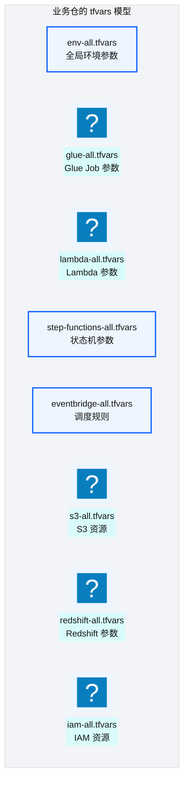
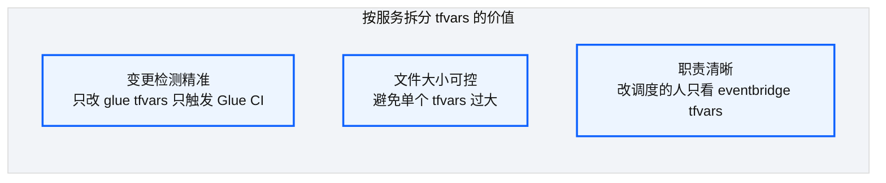
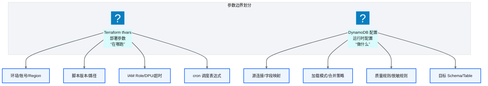
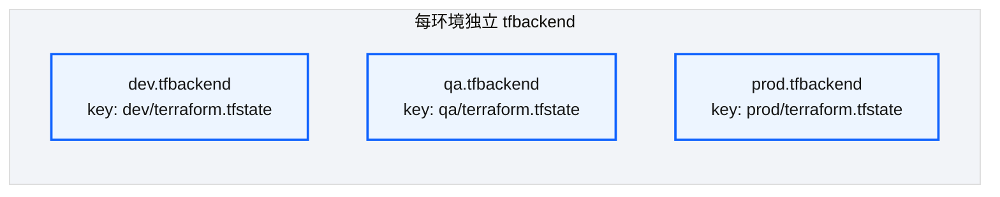

# Ch 25 环境参数与 tfvars 模型

!!! info "面包屑"
    [本书主页](./index.md) › [Part IV 基础设施与工程效能](./24-通用Terraform模块设计.md) › Ch 25

!!! abstract "项目第 1 年 · 核心建设期——参数模型"

---

## :material-school: 本章你将学到
- 环境级参数文件与按服务拆分 tfvars 策略（含 glue-all.tfvars / dev-all.tfvars 真实片段）
- 运行时配置 vs 部署参数的边界
- 后端配置多环境隔离（含 dev/prod.tfbackend HCL）

---

## 25.1 环境级参数文件与按服务拆分策略


<p class="caption" markdown="span">**图 25-1** 环境级参数文件与按服务拆分策略</p>

| 文件 | 内容 | 变更频率 |
|---|---|---|
| `{env}-all.tfvars` | 环境级全局参数（region/account_id/通用前缀） | 极低 |
| `glue-all.tfvars` | Glue Job 定义（脚本路径/DPU/超时） | 中 |
| `lambda-all.tfvars` | Lambda 定义（运行时/内存/超时） | 中 |
| `step-functions-all.tfvars` | 状态机定义 | 低 |
| `eventbridge-all.tfvars` | 调度规则（cron 表达式） | 中 |
| `redshift-all.tfvars` | Redshift Schema/表/权限 | 低 |
<p class="caption" markdown="span">**表 25-1** 环境级参数文件与按服务拆分策略</p>


`glue-all.tfvars` 的真实片段长这样——每个 Glue Job 一组参数，脚本路径用版本化 S3 路径，调度用 cron 表达式：

```hcl
# 示意：business-domain-ma/glue-all.tfvars —— Glue Job 定义（dev 环境）
glue_jobs = {
  ma_doctor_master = {
    script_location = "s3://ap-aurora-cdp-tooling-dev-cn-north-1/glue/v1.2.3/doctor.py"
    max_dpus        = 6
    timeout         = 45                                    # 分钟
    schedule        = "cron(0 16 * * ? *)"                  # UTC 16:00 = 北京次日 00:00
    extra_py_files  = "s3://ap-aurora-cdp-tooling-dev-cn-north-1/glue/aurora_cdp_common_utils-1.2.3-py3-none-any.whl"
  }
  ma_hospital_master = {
    script_location = "s3://ap-aurora-cdp-tooling-dev-cn-north-1/glue/v1.2.3/hospital.py"
    max_dpus        = 4
    timeout         = 30
    schedule        = "cron(0 17 * * ? *)"                  # 核心意图：错峰避免源库压力叠加
    extra_py_files  = "s3://ap-aurora-cdp-tooling-dev-cn-north-1/glue/aurora_cdp_common_utils-1.2.3-py3-none-any.whl"
  }
}
```

`{env}-all.tfvars` 承载环境级全局参数，所有服务 tfvars 共享：

```hcl
# 示意：business-domain-ma/dev-all.tfvars —— 环境级全局参数
environment = "dev"
region      = "cn-north-1"
account_id  = "123456789012"
prefix      = "ap-aurora-cdp"                               # 核心意图：统一命名前缀
cost_center = "ma-domain"
```

### 按服务拆分的好处


<p class="caption" markdown="span">**图 25-2** 按服务拆分的好处</p>

!!! tip "引申"
    按服务拆分 tfvars 是"变更检测驱动 CI"的基础——CI 通过 :octicons-terminal-16: `git diff` 检测哪些 tfvars 变了，只对变更的服务执行 :simple-terraform: Terraform plan/apply。这比"每次都 plan 全部"快得多。

---

## 25.2 运行时配置 vs 部署参数的边界

这是 [Ch 11](./11-配置与状态管理.md) 核心设计决策在 tfvars 层的体现：


<p class="caption" markdown="span">**图 25-3** 运行时配置 vs 部署参数的边界</p>

| 维度 | Terraform tfvars | DynamoDB 配置 |
|---|---|---|
| **回答** | "在哪跑、用什么资源" | "做什么、怎么处理" |
| **变更方式** | Terraform plan/apply | 配置发布流（热更新） |
| **生效时机** | 部署时 | 运行时 |
| **审批** | 需 plan review | 配置发布审批 |
<p class="caption" markdown="span">**表 25-2** 运行时配置 vs 部署参数的边界</p>


!!! warning "Trade-off"
    边界划分的关键判据是"这个参数变更是否需要重建 AWS 资源"。如果需要（如改 DPU、改 IAM）→ Terraform；如果不需要（如改字段映射、改加载模式）→ DynamoDB。错误地把运行时配置放进 Terraform 会导致"改个字段映射也要走 Terraform apply"的沉重流程。

---

## 25.3 后端配置多环境隔离


<p class="caption" markdown="span">**图 25-4** 后端配置多环境隔离</p>

每个环境有独立的 `tfbackend` 文件，指向 S3 上不同 key 的 state 文件。这实现了 state 的物理隔离——一个环境的 state 损坏不影响其他环境。

这里有一个我在 [Ch 21](./21-Terraform架构总览.md) 提过但值得在此深化的细节——**dev 和 prod 用的是独立的 S3 桶**，不是同一个桶的不同 key。最初我用"同桶不同 key"（`tfstate-bucket/dev/` 和 `tfstate-bucket/prod/`），看起来够隔离。但第二年发生了一件事让我改成了独立桶：dev 环境的一个 CI 脚本误删了整个 tfstate 桶（`aws s3 rm --recursive` 少了 `--exclude`），连 prod 的 state 也一起删了——因为它们在同一个桶里。从那以后我坚持"dev 和 prod 的 state 存独立桶"——dev 桶炸了碰不到 prod 桶。**桶级隔离比 key 级隔离更强——一个 `aws s3 rm` 命令误删桶时，只影响一个环境**。这个教训让我对"隔离强度"有了更深的理解：key 级隔离防的是"逻辑混淆"，桶级隔离防的是"物理误删"——后者更危险，必须更强隔离。

```hcl
# 示意：dev.tfbackend —— DEV 环境 state 后端配置
bucket         = "ap-aurora-cdp-tfstate-dev-cn-north-1"
key            = "dev/terraform.tfstate"                     # 核心意图：每环境独立 key，物理隔离
region         = "cn-north-1"
dynamodb_table = "ap-aurora-cdp-tflock-dev"                  # DynamoDB 锁，防并发 apply
encrypt        = true
```

```hcl
# 示意：prod.tfbackend —— PROD 环境 state 后端（独立桶 + 独立锁表）
bucket         = "ap-aurora-cdp-tfstate-prod-cn-north-1"
key            = "prod/terraform.tfstate"
region         = "cn-north-1"
dynamodb_table = "ap-aurora-cdp-tflock-prod"
encrypt        = true
```

注意 dev 和 prod 的 `bucket` 名不同——独立桶，不是一个桶的两个 key。DynamoDB 锁表也是独立的（`tflock-dev` vs `tflock-prod`），防止一个环境的 lock 故障影响另一个环境。**隔离要从桶到锁表全面独立，不能只隔 state 文件**。

---

## :material-check-circle: 本章小结
- tfvars 按服务拆分：`{env}-all.tfvars` 全局 + 按服务（glue/lambda/sf/eb/...）拆分——支持精准变更检测；含 `glue-all.tfvars` 真实片段（版本化脚本路径/cron/依赖包）
- 运行时配置（DynamoDB）vs 部署参数（Terraform）边界：需重建资源的 → Terraform，运行时可热更的 → DynamoDB
- 每环境独立 tfbackend（含 HCL 示意：独立桶 + 独立 key + DynamoDB 锁），state 物理隔离

---

!!! quote "下一章"
    [Ch 26 Step Functions 模板注入](./26-StepFunctions模板注入.md) —— 参数管好了，状态机模板怎么参数化？接下来看模板注入设计。

