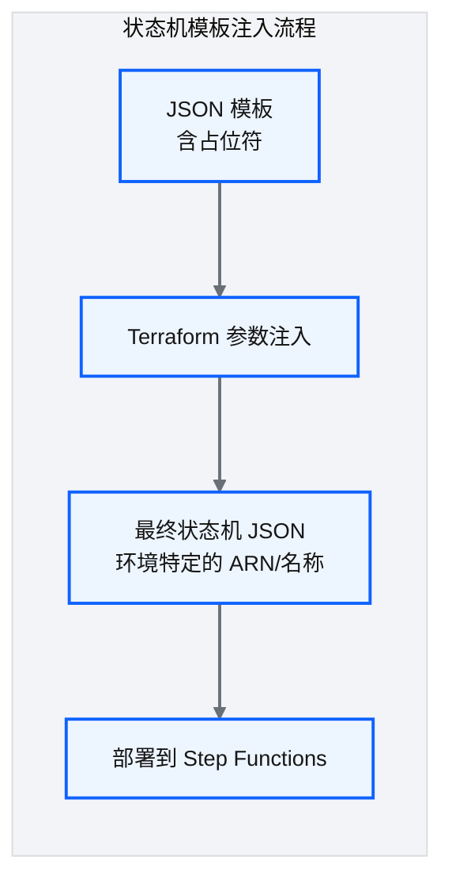
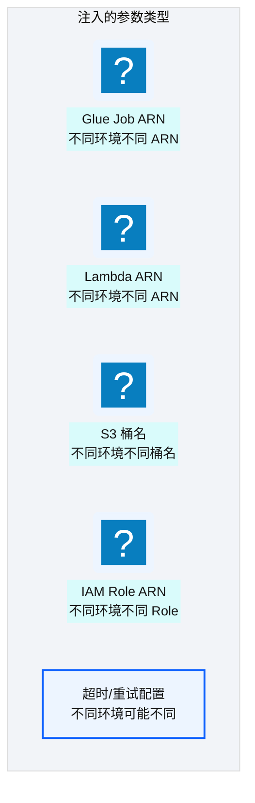
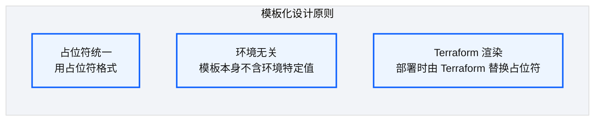
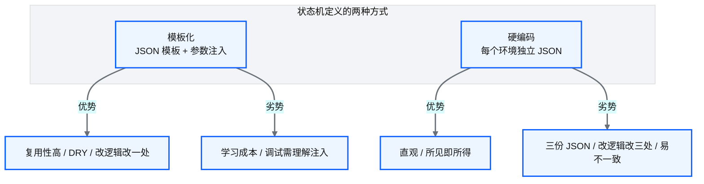

# Ch 26 Step Functions 模板注入

!!! info "面包屑"
    [本书主页](./index.md) › [Part IV 基础设施与工程效能](./25-环境参数与tfvars模型.md) › Ch 26

!!! abstract "项目第 1 年 · 核心建设期——模板注入"

---

## :material-school: 本章你将学到
- ASL 模板参数化与 `templatefile()` 注入；CI lint 与 apply 时渲染的双路径
- 表间依赖声明与拓扑排序如何进入编排
- 模板化 vs 硬编码：用事故换来的一致性，以及调试成本

---

## 26.1 状态机模板的参数化与环境变量注入

[Ch 25](./25-环境参数与tfvars模型.md) 把环境参数拆开了，Step Functions 的 ASL 却仍是一整份 JSON。dev/qa/prod 的 Glue ARN、Role、桶名都不一样；若复制三份 ASL，逻辑迟早漂移。


<p class="caption" markdown="span">**图 26-1** 状态机模板的参数化与环境变量注入</p>


<p class="caption" markdown="span">**图 26-2** 状态机模板的参数化与环境变量注入</p>

### 模板化设计


<p class="caption" markdown="span">**图 26-3** 模板化设计</p>

Aurora 实际跑的是双路径渲染。这是我对照平台仓实践后刻意留下的：

1. **Apply 路径**：`aws_sfn_state_machine.definition = templatefile(...)`，部署时写入 AWS。
2. **CI lint 路径**：同一套模板再经 `process_state_files` 写出 `*.json.processed`（`local_file`），给 `lint_state_files` 做 ASL 结构检查。不依赖先 apply 出 ARN。

```hcl
# 示意：apply 路径——定义直接进状态机
resource "aws_sfn_state_machine" "ingestion" {
  name       = "aurora-ma-ingestion-${var.environment}"
  role_arn   = data.terraform_remote_state.core.outputs.sfn_role_arn
  definition = templatefile("${path.module}/state_files/ingestion.state.json", {
    glue_job_arn = module.glue_job_doctor.job_arn
    lambda_arn   = module.lambda_trigger.arn
    max_retries  = var.environment == "prod" ? 3 : 1
    aws_region   = var.region
    account_id   = var.account_id
  })
}

# 示意：CI lint 路径——local_files_enabled=true 时落盘 processed 副本
module "process_state_files" {
  source              = "./regional/orchestration/process_state_files"
  local_files_enabled = var.ci_lint_mode
  templates_dir       = "${path.module}/environments/${var.environment}/state_files"
  render_vars         = merge(var.sfn_render_vars, { aws_region = var.region, account_id = var.account_id })
}
```

```json
// 示意：ingestion.state.json —— 环境无关模板
{
  "StartAt": "TriggerGlue",
  "States": {
    "TriggerGlue": {
      "Type": "Task",
      "Resource": "arn:aws-cn:states:::glue:startJobRun.sync",
      "Parameters": { "JobName": "${glue_job_name}" },
      "Next": "CheckResult"
    },
    "CheckResult": {
      "Type": "Task",
      "Resource": "${lambda_arn}",
      "Retry": [{ "ErrorEquals": ["States.TaskFailed"], "MaxAttempts": ${max_retries} }],
      "End": true
    }
  }
}
```

!!! tip "引申"
    为什么要双路径？纯靠 `terraform plan` 看 `definition` 差分，对 ASL 语义错误（缺 `End`、非法状态名）不友好；CI 里若还没 apply，模块输出 ARN 往往只是占位。lint 路径先用"账户/区域 + 约定占位"渲染，拦住低级错误；apply 路径再用真实 ARN 部署（M6：描述与执行解耦）。

---

## 26.2 依赖排序策略与模板化编排技巧

### 依赖排序问题

状态机步骤顺序之外，还有表加载顺序：外键要求维度先于事实。平台把依赖写在配置里，引擎拓扑排序后生成并行/串行分支。模板注入的是 ARN；图的形状由依赖排序决定。


<p class="caption" markdown="span">**图 26-4** 依赖排序问题</p>


<p class="caption" markdown="span">**图 26-5** 依赖排序问题</p>

```python
# 示意：拓扑排序——配置声明依赖，引擎算顺序
def topological_order(tables: dict) -> list:
    # {"fact_prescription": ["dim_hospital", "dim_product"], "dim_hospital": []}
    order, visited = [], set()
    def visit(name):
        if name in visited:
            return
        for dep in tables.get(name, []):
            visit(dep)
        visited.add(name)
        order.append(name)
    for t in tables:
        visit(t)
    return order  # ["dim_hospital", "dim_product", "fact_prescription"]
```

### 编排技巧

| 技巧 | 说明 |
|---|---|
| **依赖声明** | 配置中声明"表 A 依赖表 B" |
| **拓扑排序** | 引擎计算加载顺序；环依赖在 CI 直接失败 |
| **并行优化** | 无依赖节点进 Parallel 状态 |
| **模板只注入身份** | ARN/重试次数进模板；顺序由图生成，不手写死 |
<p class="caption" markdown="span">**表 26-1** 编排技巧</p>

!!! warning "Trade-off"
    自动排序更好维护，引擎也更重。表少、依赖浅时，ASL 里手写顺序更直观。我们在千表迁移场景被迫上拓扑排序（[Ch 31](./31-遗留系统迁移-SQLServer到Redshift.md)）；日常域仓只有十来张表，可以走"声明式顺序数组"捷径。要不要上图算法，看规模（M11）。

---

## 26.3 模板化 vs 硬编码的维护性权衡


<p class="caption" markdown="span">**图 26-6** 模板化 vs 硬编码的维护性权衡</p>

| 维度 | 模板化（本书） | 硬编码 |
|---|---|---|
| **复用性** | 一套模板三环境 | 三份 JSON |
| **一致性** | 逻辑必然一致 | 手动同步易漂移 |
| **可读性** | 需理解占位符 | 所见即所得 |
| **调试** | 看 plan / processed 文件 | 直接看 JSON |
| **适合规模** | 几十上百状态机 | 个位数状态机 |
<p class="caption" markdown="span">**表 26-2** 模板化 vs 硬编码的维护性权衡</p>

!!! tip "引申"
    我从硬编码改到模板化，是被"三份 JSON 不一致"逼的：dev 加了重试，qa/prod 忘了，生产故障直通失败。排查时三份步骤数都不一样。模板化的学习成本一次性付清；硬编码的同步成本会一直涨。双路径 lint 补的是可读性：CI 产物里总能打开一份渲染后的 JSON。

编排能参数化之后，流水线还缺平台化的 CI。下一章讲 reusable workflows 与变更检测。

---

## :material-check-circle: 本章小结
- `templatefile()` 注入环境特定 ARN；CI processed 副本专供 ASL lint，与 apply 路径分开
- 表依赖用拓扑排序进编排；规模小可用显式顺序
- 模板化用一致性换调试门槛；硬编码三环境迟早漂

---

!!! quote "下一章"
    [Ch 27 CI/CD：可复用工作流平台](./27-CI-CD可复用工作流平台.md) —— 状态机能部署了，整个 CI/CD 平台怎么设计？接下来看可复用工作流架构。
