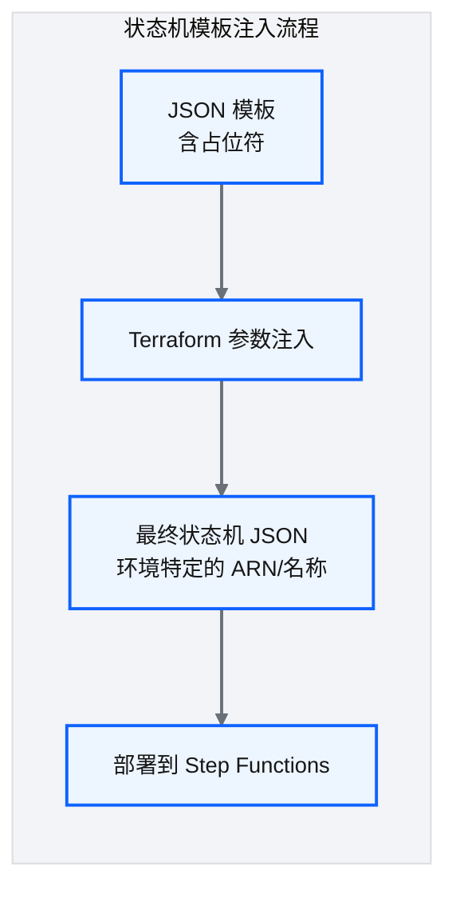
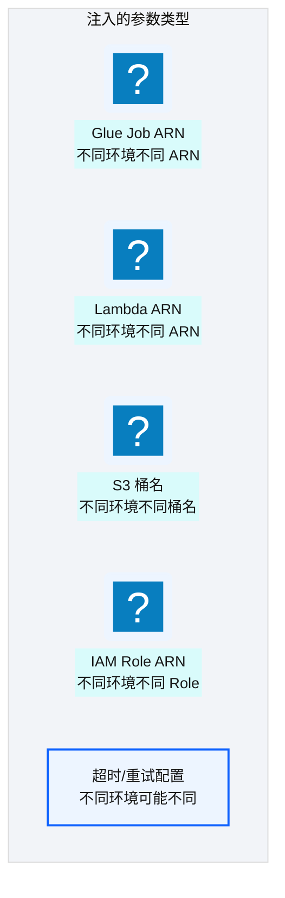
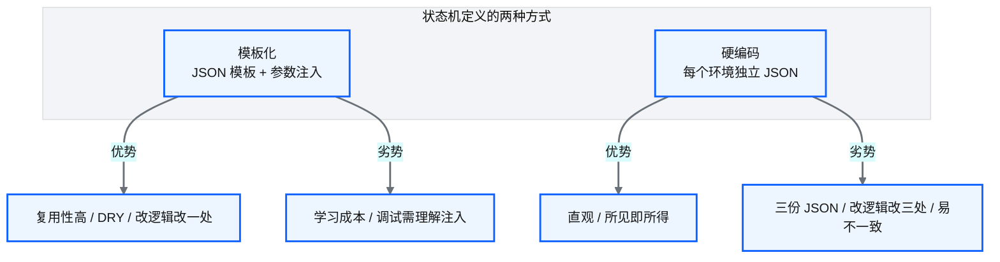

# Ch 26 Step Functions 模板注入

!!! info "面包屑"
    [本书主页](./index.md) › [Part IV 基础设施与工程效能](./25-环境参数与tfvars模型.md) › Ch 26

!!! abstract "项目第 1 年 · 核心建设期——模板注入"

---

## :material-school: 本章你将学到
- 状态机模板的参数化与环境变量注入设计（含 templatefile() 调用 + json.tpl 模板 + 渲染后对比）
- 依赖排序策略与模板化编排技巧（含拓扑排序伪代码）
- 模板化 vs 硬编码的维护性权衡

---

## 26.1 状态机模板的参数化与环境变量注入

Step Functions 的状态机定义是 :simple-json: JSON 文件，但不同环境（dev/qa/prod）的 ARN、名称不同。平台通过**模板化 + 参数注入**解决：


<p class="caption" markdown="span">**图 26-1** 状态机模板的参数化与环境变量注入</p>


<p class="caption" markdown="span">**图 26-2** 状态机模板的参数化与环境变量注入</p>

### 模板化设计


<p class="caption" markdown="span">**图 26-3** 模板化设计</p>

模板化落到代码，核心是 Terraform 的 `templatefile()` 函数——它读取一个 `.json.tpl` 模板文件，用传入的变量替换占位符，输出最终状态机 JSON。下面是调用端、模板、渲染后的完整对比：

```hcl
# 示意：business-domain-ma/main.tf —— templatefile() 调用端
locals {
  sf_params = {
    glue_job_arn   = module.glue_job_doctor.job_arn          # 来自模块输出，环境特定
    lambda_arn     = module.lambda_trigger.arn
    s3_bucket      = data.terraform_remote_state.core.outputs.s3_enriched_bucket_arn
    role_arn       = data.terraform_remote_state.core.outputs.sf_role_arn
    max_retries    = var.environment == "prod" ? 3 : 1       # 核心意图：环境差异化配置
  }
}

resource "aws_sfn_state_machine" "ingestion" {
  name     = "ap-aurora-cdp-ma-ingestion-${var.environment}"
  role_arn = local.sf_params.role_arn
  definition = templatefile("${path.module}/templates/ingestion.json.tpl", local.sf_params)
}
```

```json
// 示意：templates/ingestion.json.tpl —— 状态机模板（含占位符，环境无关）
{
  "StartAt": "TriggerGlue",
  "States": {
    "TriggerGlue": {
      "Type": "Task",
      "Resource": "${glue_job_arn}",                        // 占位符，渲染时替换为真实 ARN
      "Next": "CheckResult"
    },
    "CheckResult": {
      "Type": "Task",
      "Resource": "${lambda_arn}",
      "Retry": [{ "ErrorEquals": ["States.TaskFailed"], "MaxAttempts": ${max_retries} }],
      "End": true
    }
  }
}
```

```json
// 示意：渲染后的 PROD 状态机 JSON（占位符已被替换为真实值）
{
  "StartAt": "TriggerGlue",
  "States": {
    "TriggerGlue": {
      "Type": "Task",
      "Resource": "arn:aws-cn:states:cn-north-1:123456789012:glue:ma-doctor-master",
      "Next": "CheckResult"
    },
    "CheckResult": {
      "Type": "Task",
      "Resource": "arn:aws-cn:lambda:cn-north-1:123456789012:function:ap-aurora-cdp-ma-trigger",
      "Retry": [{ "ErrorEquals": ["States.TaskFailed"], "MaxAttempts": 3 }],
      "End": true
    }
  }
}
```

!!! tip "引申"
    模板化的本质是"关注点分离"——状态机的"流程逻辑"（步骤顺序、错误处理）写在模板里，"环境特定值"（ARN/名称）由 :simple-terraform: Terraform 注入。这让同一套流程逻辑在三个环境中复用，只是参数不同。调试时若需看渲染后结果，可在 `terraform plan` 输出中查看 `definition` 字段。

---

## 26.2 依赖排序策略与模板化编排技巧

### 依赖排序问题

状态机中某些步骤有顺序依赖——比如"外键约束要求维度表先于事实表加载"。平台通过**依赖排序策略**解决：


<p class="caption" markdown="span">**图 26-4** 依赖排序问题</p>


<p class="caption" markdown="span">**图 26-5** 依赖排序问题</p>

依赖排序落到代码就是一个拓扑排序——引擎读配置里声明的表间依赖，按拓扑序计算加载顺序，无依赖的表可并行：

```python
# 示意：依赖排序——拓扑排序计算加载顺序
def topological_order(tables: dict) -> list:
    # tables: {"fact_prescription": ["dim_hospital", "dim_product"], "dim_hospital": []}
    order, visited = [], set()
    def visit(name):
        if name in visited: return
        for dep in tables.get(name, []):        # 核心意图：先加载依赖的表
            visit(dep)
        visited.add(name); order.append(name)
    for t in tables: visit(t)
    return order        # → ["dim_hospital", "dim_product", "fact_prescription"]，维度表先于事实表
```

### 编排技巧

| 技巧 | 说明 |
|---|---|
| **依赖声明** | 在配置中声明"表 A 依赖表 B" |
| **拓扑排序** | 引擎自动计算加载顺序 |
| **特殊排序** | 外键约束的表通过命名约定排在后面 |
| **并行优化** | 无依赖的表并行加载，有依赖的串行 |
<p class="caption" markdown="span">**表 26-1** 编排技巧</p>


!!! warning "Trade-off"
    自动依赖排序比"手动维护加载顺序"更可维护，但增加了引擎复杂度。对于依赖关系简单的场景，手动排序（在配置中显式指定顺序）更直观。自动排序适合表数量多、依赖关系复杂的场景。

---

## 26.3 模板化 vs 硬编码的维护性权衡


<p class="caption" markdown="span">**图 26-6** 模板化 vs 硬编码的维护性权衡</p>

| 维度 | 模板化（本书） | 硬编码 |
|---|---|---|
| **复用性** | ✅ 一套模板三环境 | ❌ 三份 JSON |
| **一致性** | ✅ 逻辑必然一致 | ❌ 手动同步易出错 |
| **可读性** | ⚠️ 需理解占位符 | ✅ 所见即所得 |
| **调试** | ⚠️ 需看渲染后结果 | ✅ 直接看 JSON |
| **适合规模** | 大规模（几十个状态机） | 小规模（几个状态机） |
<p class="caption" markdown="span">**表 26-2** 模板化 vs 硬编码的维护性权衡</p>


!!! tip "引申"
    模板化是"DRY 原则"（Don't Repeat Yourself）在 IaC 中的体现。硬编码看似简单，但随着状态机数量增长，三份 JSON 的同步成本指数级上升。模板化的前期投入会在规模扩大后获得回报。

---

## :material-check-circle: 本章小结
- 状态机模板化：`templatefile()` 读取 `.json.tpl` 模板，用传入变量替换 `${占位符}`，输出环境特定状态机 JSON——调用端/模板/渲染后三者分离
- 依赖排序策略：声明依赖→拓扑排序（伪代码）→自动计算加载顺序，解决外键约束等顺序依赖，无依赖表可并行
- 模板化 vs 硬编码：模板化复用性高、一致性好，适合大规模；硬编码直观但不可扩展

---

!!! quote "下一章"
    [Ch 27 CI/CD：可复用工作流平台](./27-CI-CD可复用工作流平台.md) —— 状态机能部署了，整个 CI/CD 平台怎么设计？接下来看可复用工作流架构。

