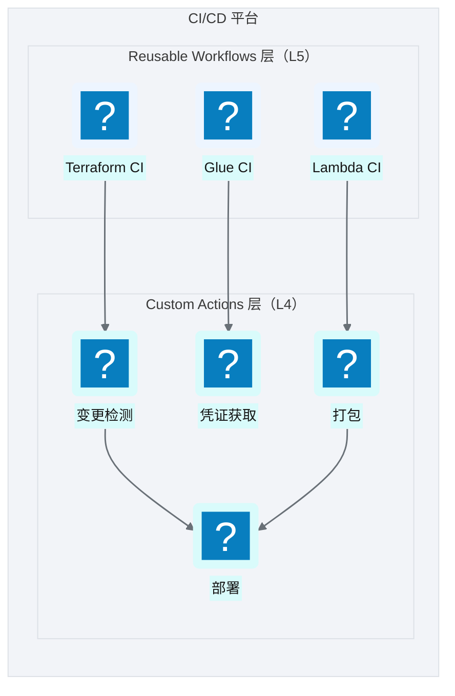
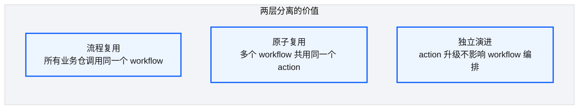
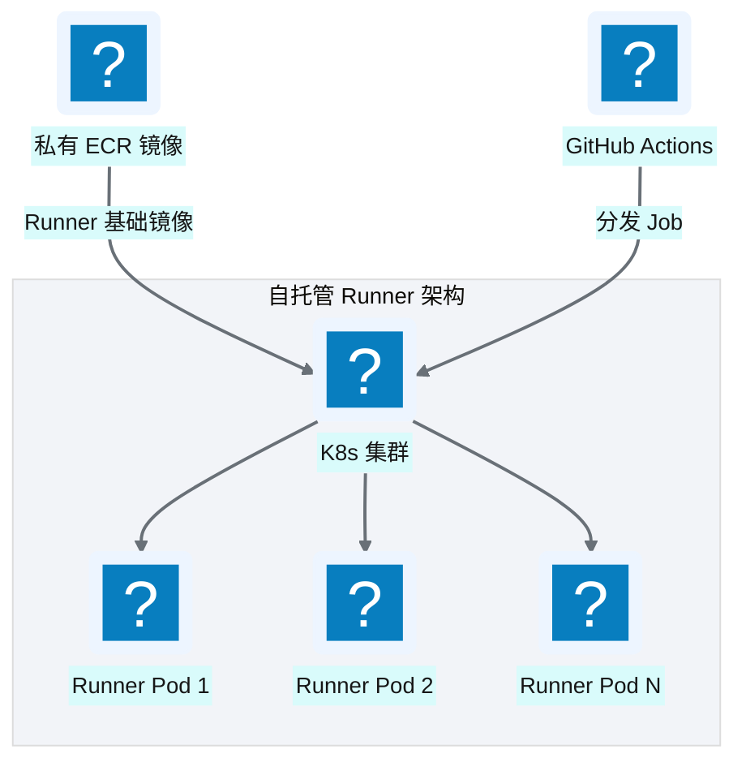
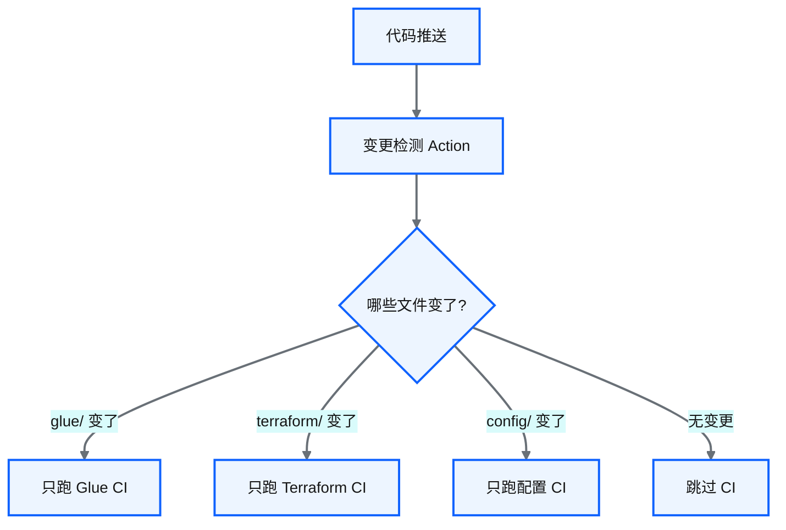

# Ch 27 CI/CD：可复用工作流平台

!!! info "面包屑"
    [本书主页](./index.md) › [Part IV 基础设施与工程效能](./26-StepFunctions模板注入.md) › Ch 27

!!! abstract "项目第 1 年 · 核心建设期——CI/CD平台"

---

## :material-school: 本章你将学到
- :simple-githubactions: GitHub Actions reusable workflows + custom actions 两层架构
- 自托管 runner 与容器化执行环境
- 变更检测驱动的增量 CI

---

## 27.1 GitHub Actions reusable workflows + custom actions 两层架构


<p class="caption" markdown="span">**图 27-1** GitHub Actions reusable workflows + custom actions 两层架构</p>

| 层 | 职责 | 举例 |
|---|---|---|
| **Reusable Workflows**（L5） | 定义完整 CI 流程 | `terraform-ci.yml`：init→validate→plan→apply |
| **Custom Actions**（L4） | 提供原子操作 | `get-changed-modules`：检测哪些模块变了 |
<p class="caption" markdown="span">**表 27-1** GitHub Actions reusable workflows + custom actions 两层架构</p>


### 两层分离的价值


<p class="caption" markdown="span">**图 27-2** 两层分离的价值</p>

业务仓的 CI 文件极其简洁——只需调用 reusable workflow：

```yaml
# 业务仓的 CI 文件示意（极简）
jobs:
  ci:
    uses: aurora-data-platform/ci-workflows/.github/workflows/terraform-ci.yml@v1
    with:
      environment: ${{ github.event.inputs.environment }}
    secrets: inherit
```

!!! tip "引申"
    reusable workflows 是 GitHub Actions 的"函数调用"机制——定义一次，多处调用。这让 CI 逻辑集中维护，业务仓只需"调用"而非"复制"。如果某天 CI 流程要改（如加一道安全扫描），只改 workflow 仓即可，所有业务仓自动生效。

---

## 27.2 自托管 runner 与容器化执行环境


<p class="caption" markdown="span">**图 27-3** 自托管 runner 与容器化执行环境</p>

| 设计要点 | 说明 |
|---|---|
| **K8s 自托管** | Runner 跑在 K8s 上，弹性扩缩容 |
| **私有 ECR 镜像** | Runner 基础镜像含 AWS CLI/:simple-terraform: Terraform/:simple-python: Python 等工具 |
| **隔离执行** | 每个 Job 在独立 Pod 中执行，互不干扰 |
| **成本可控** | 按需扩缩容，无 Job 时缩为 0 |
<p class="caption" markdown="span">**表 27-2** 自托管 runner 与容器化执行环境</p>


!!! warning "Trade-off"
    自托管 runner 比 GitHub 托管 runner 多了运维成本（管 K8s/镜像），但好处是：①可在 VPC 内访问 AWS 资源（无需公网暴露）②可预装企业工具 ③无 GitHub 托管 runner 的分钟数限制。对于需要访问 VPC 内资源的数据平台，自托管是必要的。

    我选自托管 runner 而非 GitHub 托管，决定性因素是**VPC 内访问**——Terraform apply 要访问 AWS 资源（S3/Redshift/Glue），这些资源在 VPC 内，且部分有"仅 VPC 可达"的安全组限制。GitHub 托管 runner 在公网，要访问 VPC 内资源要么开公网入口（安全风险），要么搭 VPN/隧道（复杂）。自托管 runner 跑在 VPC 内的 K8s 集群上，直接访问 AWS 资源——零网络配置。这个"网络就近"优势在医药合规场景下尤其重要——**开公网入口意味着暴露攻击面，合规审计不通过**。自托管的运维成本（管 K8s/镜像）是值得的代价。第一年我曾尝试用 GitHub 托管 runner + OIDC（不开公网入口，用短期凭证访问 AWS），但 OIDC 凭证只能解决"认证"问题，解决不了"网络可达"问题——Redshift 的安全组只允许 VPC 内访问，GitHub runner 在公网根本连不上。**认证和网络是两个问题——OIDC 解决认证，自托管解决网络**（M10 合规约束驱动选型）。

---

## 27.3 变更检测驱动的增量 CI


<p class="caption" markdown="span">**图 27-4** 变更检测驱动的增量 CI</p>

| 变更检测维度 | Action | 触发的 CI |
|---|---|---|
| 哪些 Terraform 模块变了 | `get-changed-modules` | 只 plan/apply 变更的模块 |
| 哪些状态机变了 | `get-changed-stacks` | 只部署变更的状态机 |
| 哪些表配置变了 | `get-changed-tables` | 只发布变更的配置 |
<p class="caption" markdown="span">**表 27-3** 变更检测驱动的增量 CI</p>


!!! tip "引申"
    变更检测驱动的增量 CI 是"大规模 IaC"的关键效率优化。如果每次推送都 plan 全部资源，一个有 100+ 资源的仓库 CI 要跑 20+ 分钟。通过变更检测只跑变更部分，CI 时间可降至 2-3 分钟。这是"持续集成"真正做到"持续"的基础。

---

## :material-check-circle: 本章小结
- 两层 CI 架构：Reusable Workflows（流程编排）+ Custom Actions（原子操作）——业务仓 CI 极简调用
- 自托管 Runner 跑在 K8s 上，私有 ECR 镜像，可在 VPC 内访问 AWS 资源
- 变更检测驱动增量 CI：只对变更的模块/状态机/配置执行 CI，从 20 分钟降至 2-3 分钟

---

!!! quote "下一章"
    [Ch 28 四类发布流](./28-四类发布流.md) —— CI 平台搭好了，具体的发布流程怎么走？接下来看四类发布物各自的发布流。

