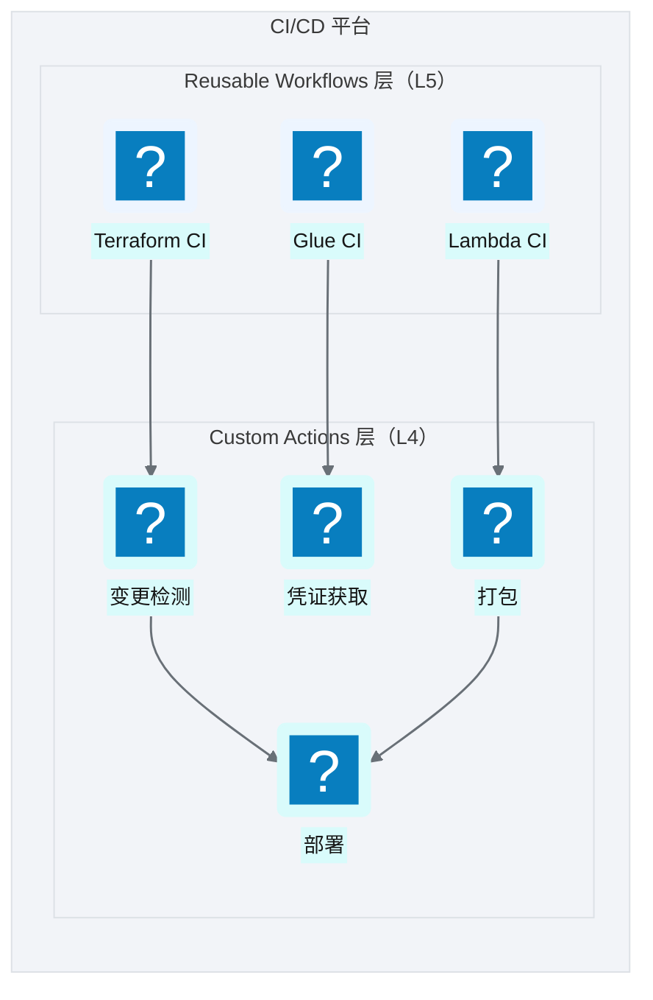
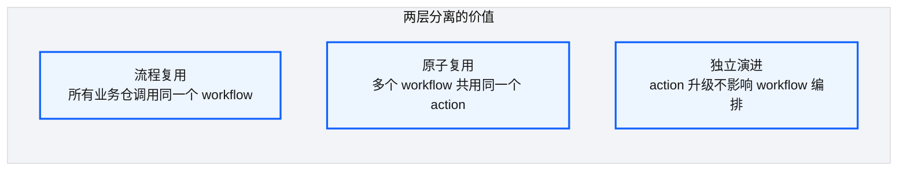
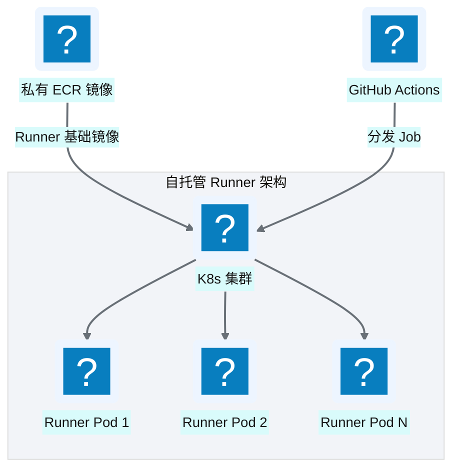
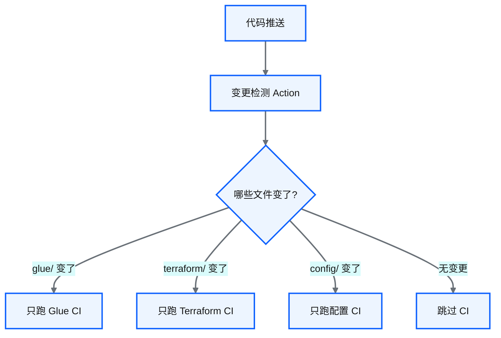
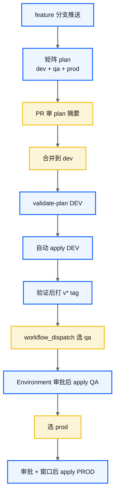

# Ch 27 CI/CD：可复用工作流平台

!!! info "面包屑"
    [本书主页](./index.md) › [Part IV 基础设施与工程效能](./26-StepFunctions模板注入.md) › Ch 27

!!! abstract "项目第 1 年 · 核心建设期——CI/CD平台"

---

## :material-school: 本章你将学到
- 为什么大型数据平台必须先建 CI/CD 平台，而不是让每个域仓复制流水线
- reusable workflows + composite actions 两层架构；`repo_type` 如何决定 plan 的 var-files
- 自托管 runner：私有镜像、ECR 拉镜像、OIDC 认证 ≠ VPC 网络可达
- 变更检测矩阵与 Terraform 生命周期编排：feature 三环境矩阵 plan → plan 制品 → Environment 门禁 apply

---

## 27.1 GitHub Actions reusable workflows + custom actions 两层架构

[Ch 26](./26-StepFunctions模板注入.md) 解决了 ASL 怎么参数化部署。接下来卡在**治理爆炸**：Aurora 同时有 foundation、platform、半打以上同构业务域，外加 Glue/Lambda/配置仓。若每个仓各维护一份 init→plan→apply、各写一套变更检测，半年后一定会出现安全扫描漏装、OIDC 权限抄错、`iam-all` 被 develop 仓误挂、PROD apply 不走已审 plan。

第 1 年架构评审会上，有人问："业务域自己写 CI 不就行了？平台组管基础设施就够。"我的回答是：数据平台的变更面按**乘法**长，域数 × 环境数 × 发布物类型。6 个域 × 3 环境 × 4 类发布流，已经是七十多条潜在路径；再乘"谁复制错了 YAML"，合规审计（GxP 变更可归属，M10）会直接失败。CI/CD 必须先成为平台能力（M7），同构仓（[Ch 23](./23-业务仓库设计与同构模式.md)）才谈得上"业务只关心业务"。

于是我把流水线收成两个仓：

| 仓 | 职责 |
|---|---|
| **`aurora-ci-workflows`** | 只放 `on: workflow_call` 的 reusable workflows，编排完整生命周期 |
| **`aurora-ci-actions`** | 只放 composite actions：变更检测、打包、terraform-init/plan/apply、读 ECR 凭证等原子能力 |


<p class="caption" markdown="span">**图 27-1** GitHub Actions reusable workflows + custom actions 两层架构</p>

图 27-1 真正要守的是**调用约定**：业务仓永远不复制 plan/apply 步骤，只 `uses:` 平台 workflow 并传入契约参数。GitHub 允许 reusable workflow 再嵌套调用（官方上限约十层），我们实际用到两到三层：入口编排 → validate-plan / deploy / process-state-machines → composite action。

| 层 | 职责 | Aurora 中的典型单元 |
|---|---|---|
| **Reusable Workflows**（L5） | 完整生命周期与分支策略 | `aws-tf-ci.yml`（入口）、`aws-tf-validate-plan.yml`、`aws-tf-deploy.yml`、`process-state-machines.yml`、`glue-python-ci.yml`、`lambda-python-ci.yml`、`dynamodb-ci.yml` |
| **Custom Actions**（L4） | 可单测的原子步骤 | `get-changed-modules`、`get-changed-tables`、`get-changed-stacks`、`get-infra-env`、`terraform-create`、`python-package`、`python-package-s3-upload`、`get-ecr-credentials`、`update-terraform-submodules` |
<p class="caption" markdown="span">**表 27-1** GitHub Actions reusable workflows + custom actions 两层架构</p>

### 两层分离的价值


<p class="caption" markdown="span">**图 27-2** 两层分离的价值</p>

业务仓的 CI 文件刻意极简，但**契约参数一个都不能少**。`repo_type` 最要紧：它决定 Terraform plan 挂哪些 `-var-file`（呼应 [Ch 25](./25-环境参数与tfvars模型.md)），把 blast radius 写进代码。

```yaml
# 示意：aurora-domain-ma/.github/workflows/ci.yml —— 调用方只声明身份与开关
name: domain-terraform-ci
on:
  workflow_dispatch:
    inputs:
      environment:
        type: choice
        options: [dev, qa, prod]
  push:
    branches: [dev, 'feature**']
    paths: ['terraform/**']

permissions:
  id-token: write   # 向 GitHub OIDC 要 JWT；缺了就 AssumeRole 失败
  contents: write   # checkout + 打 tag/release 时需要

jobs:
  call_aws_tf:
    if: ${{ github.ref_name == 'dev' || startsWith(github.ref_name, 'feature') || startsWith(github.ref_name, 'v') }}
    uses: aurora-data-platform/ci-workflows/.github/workflows/aws-tf-ci.yml@v2
    with:
      repo_type: develop                 # foundations | infra | develop
      gh_environment_name: ${{ github.event.inputs.environment || 'dev' }}
      branch_name: ${{ github.ref_name }}
      validation_type: development
      state_machines: true
      state_machines_path: terraform/environments/${{ github.event.inputs.environment || 'dev' }}/state_files
      # CI lint 要对准的 local_file 模块地址（与 Ch 26 双路径一致）
      state_machines_module: module.applications_regional.module.process_state_files.local_file.processed_state_file
    secrets: inherit
```

平台侧按 `repo_type` 组装 plan。这是我反复强调的**治理与执行分离（M6）**：develop 仓物理上可以放 `iam-all.tfvars`，但 CI **拒绝**把它喂给 `terraform plan`。

```bash
# 示意：平台 validate-plan job 内部（伪代码）——同一套 init，不同 var-file 集合
terraform init -backend-config="./environments/${ENV}/${ENV}.tfbackend"

case "$REPO_TYPE" in
  foundations)
    # 地基：含 IAM + subsystem 配置
    EXTRA="-var-file=.../iam-all.tfvars -var-file=.../subsystem-configs.tfvars ..."
    ;;
  infra)
    # 平台共享应用：含 IAM，通常不含 eventbridge 业务调度面
    EXTRA="-var-file=.../iam-all.tfvars -var-file=.../glue-all.tfvars ..."
    ;;
  develop)
    # 业务域：故意不含 iam-all；含 eventbridge 调度
    EXTRA="-var-file=.../glue-all.tfvars -var-file=.../lambda-all.tfvars \
           -var-file=.../step-functions-all.tfvars -var-file=.../eventbridge-all.tfvars \
           -var-file=.../s3-all.tfvars"
    ;;
esac

terraform plan -refresh=true $EXTRA \
  -var-file="./environments/${ENV}/${ENV}-all.tfvars" \
  -var="environment=${ENV}" \
  -out="deployment-${ENV}.plan"
```

| `repo_type` | 典型仓 | plan 是否带 `iam-all` | 额外常见 var-file |
|---|---|---|---|
| **foundations** | core-infra / meta 消费方 | 是 | `subsystem-configs`、ECS 等平台面 |
| **infra** | core-platform | 是 | glue/lambda/sfn/s3（共享应用） |
| **develop** | aurora-domain-* | **否** | glue/lambda/sfn/**eventbridge**/s3 |
<p class="caption" markdown="span">**表 27-4** `repo_type` 与 plan var-file 矩阵</p>

!!! tip "引申"
    表 27-4 管的是权限面。有一次业务同学在域仓里"顺手"加了 Role，本地 plan 绿了，但我拒绝合入，并在平台 CI 把 develop 路径写死为不含 `iam-all`。从那以后，想改平台 IAM 只能走 foundation PR + 平台架构组 CODEOWNERS。**流水线比文档更硬**（M7）。

加一道全仓安全扫描、ASL lint、Conftest，只改 `aurora-ci-workflows`；域仓第二天自动吃到，前提是同构路径约定还在（`environments/*/glue-all.tfvars`）。异构一天，平台就要长 `if domain == …` 特例树，CI 平台就死了。

编排层之后，还得解决：job 跑在哪，以及怎么少做全量 plan。

---

## 27.2 自托管 runner 与容器化执行环境

GitHub 托管 runner 在公网。Aurora 的 Terraform apply、部分校验要碰 VPC 内资源（私有子网、仅 VPC 可达的 Redshift 安全组、内网 ECR）。第 1 年我试过"托管 runner + OIDC"：JWT 换临时凭证成功，下一秒连 Redshift 超时。**认证通了，网络没通**。


<p class="caption" markdown="span">**图 27-3** 自托管 runner 与容器化执行环境</p>

图 27-3 落地时还有一层容易漏掉：**Job 跑在带 label 的 K8s runner 上，步骤再进私有容器镜像**。镜像里钉死 Terraform / AWS CLI / jq / Python，避免"每个 workflow 自己 setup-terraform 版本漂移"。拉私有 ECR 需要临时密码，我们用 composite action 从配置仓读短期凭证，不把 ECR 密码散落到每个业务仓 Secret。

```yaml
# 示意：平台 workflow 中的执行环境（脱敏）
jobs:
  read_ecr:
    runs-on: [aurora-k8s]          # 自托管 runner 标签；在 VPC 内
    outputs:
      ecr_password: ${{ steps.ecr.outputs.ecr_password }}
    steps:
      - id: ecr
        uses: aurora-data-platform/ci-actions/get-ecr-credentials@v1
        with:
          config_repository: aurora-ci-configs
          gh_token: ${{ secrets.GH_TOKEN }}

  validate_plan:
    needs: read_ecr
    runs-on: [aurora-k8s]
    container:
      image: ${{ vars.TF_CICD_IMAGE }}   # 私有 ECR：terraform + ansible 工具链
      credentials:
        username: AWS
        password: ${{ needs.read_ecr.outputs.ecr_password }}
    permissions:
      id-token: write
      contents: read
    steps:
      - uses: actions/checkout@v4
        with:
          submodules: true
          token: ${{ secrets.GH_TOKEN }}
      - uses: aurora-data-platform/ci-actions/update-terraform-submodules@v1
        with:
          submodule_path: terraform/aurora-generic-modules
          pin_ref: v1.77.0                 # 与业务仓 pin 策略一致，CI 可强制对齐
      - uses: aws-actions/configure-aws-credentials@v4
        with:
          role-to-assume: ${{ vars[format('{0}_ASSUME_ROLE', matrix.environment)] }}
          aws-region: cn-north-1
          role-duration-seconds: 7200      # 大仓 plan 可能超过默认 1h
```

| 设计要点 | 说明 |
|---|---|
| **K8s 自托管** | label 调度；按队列弹性扩缩，空闲缩容 |
| **私有 ECR 镜像** | 工具链版本由镜像 tag 锁定，workflow 不各自 `setup-*` |
| **ECR 凭证 action** | 短期密码，集中在配置仓，业务仓不散落 Secret |
| **OIDC** | `id-token: write` + 按环境 `*_ASSUME_ROLE`（详 [Ch 29](./29-OIDC与凭证治理.md)） |
| **submodule 检出** | CI 显式 `submodule update` 并校验 pin，防止本地漂移进生产 |
<p class="caption" markdown="span">**表 27-2** 自托管 runner 与容器化执行环境</p>

!!! warning "Trade-off"
    自托管多了 K8s/镜像/证书轮转成本，换来的是 VPC 内可达、工具链可审计，以及无公网数据面入口。对医药合规这几乎是硬约束（M10）。若只图省事上托管 runner，要么给 Redshift 开公网（审计不过），要么搭复杂隧道（运维更贵）。我选付 runner 运维税。

执行环境稳住后，才轮到效率：下一节用变更检测把"每次全量 plan 二十分钟"压下去。

---

## 27.3 变更检测驱动的增量 CI

同构目录 + 按服务 tfvars，是变更检测的前提。没有路径约定，检测脚本只能猜。平台侧把"文件路径 → 发布流 / 模块目录"收成一组 composite actions，供 Terraform / Glue / Lambda / 配置四类生命周期复用。


<p class="caption" markdown="span">**图 27-4** 变更检测驱动的增量 CI</p>

| 变更检测维度 | Action | 触发的 CI |
|---|---|---|
| 变更文件列表 | `changed-files`（或等价） | 上游输入 |
| Glue/Lambda **模块目录** | `get-changed-modules` | 只打包变更的 job/function 目录；`strategy.matrix` 展开 |
| 状态机 JSON | `get-changed-stacks` | process + ASL lint + 相关 SFN |
| 配置表目录 | `get-changed-tables` | 只发布变更表到 DynamoDB |
| 分支 → 环境 | `get-infra-env` | 如 `hotfix*`→prod 通道的约定映射 |
| 部署指纹 | `monitor-github-deployments` | 记录 commit SHA，支持增量/防重复发布 |
<p class="caption" markdown="span">**表 27-3** 变更检测驱动的增量 CI</p>

Glue 流水线最能说明增量检测怎么用：先检出变更目录，再按目录建矩阵，跳过全仓打包：

```yaml
# 示意：glue-python-ci.yml（workflow_call）——变更目录驱动 matrix
jobs:
  detect_changes:
    runs-on: [aurora-k8s]
    outputs:
      changed_dirs: ${{ steps.dirs.outputs.changed_dirs }}
    steps:
      - uses: actions/checkout@v4
        with: { fetch-depth: 2 }
      - id: files
        uses: tj-actions/changed-files@v45
        with: { separator: ',' }
      - id: dirs
        uses: aurora-data-platform/ci-actions/get-changed-modules@v1
        with:
          changed_files: ${{ steps.files.outputs.all_changed_files }}
          ignore_modules: .github,docs
          parent_only: 'true'

  package_and_upload:
    needs: detect_changes
    if: needs.detect_changes.outputs.changed_dirs != ''
    strategy:
      fail-fast: false
      matrix:
        module: ${{ fromJSON(needs.detect_changes.outputs.changed_dirs) }}
    runs-on: [aurora-k8s]
    steps:
      - uses: aurora-data-platform/ci-actions/python-package@v1
        with: { module_path: ${{ matrix.module }} }
      - uses: aurora-data-platform/ci-actions/python-package-s3-upload@v1
        with:
          artifact_type: ${{ startsWith(github.ref_name, 'feature') && 'snapshot' || 'release' }}
          s3_prefix: glue/${{ matrix.module }}
```

```python
# 示意：get-changed-modules 核心逻辑（伪代码）
def changed_module_dirs(changed_files: list[str], ignore: set[str], posix_index: int = 2) -> list[str]:
    """路径 foo/bar/job.py + posix_index=2 → 模块目录 foo/bar"""
    dirs = []
    for path in changed_files:
        parts = path.strip("/").split("/")
        if not parts or parts[0] in ignore:
            continue
        module = "/".join(parts[:posix_index]) if len(parts) >= posix_index else parts[0]
        if module not in dirs and module not in ignore:
            dirs.append(module)
    return dirs
```

!!! tip "引申"
    全量 plan 在 100+ 资源仓常见 20+ 分钟；路径增量后 Terraform 仍可能要整栈 plan（state 是整份的），但 **Glue/Lambda/配置** 可以真正按模块矩阵缩到分钟级。Terraform 侧我们另用"feature 只 validate+plan、dev 才 apply"和多区域 `-target`（可选）控成本。规模上来后，没有增量检测，"持续集成"会退化成"持续排队"（M11）。

变更检测回答了"跑哪条流水线"。还缺一块：**一条 Terraform 流水线内部如何按分支编排**。下面单独写。

---

## 27.4 Terraform CI 生命周期编排：从 feature 矩阵到 plan 制品

大型数据平台的 Terraform CI，不能做成"push 就 apply"。我在 Aurora 定的编排，就是一张**分支状态机**：

| 分支 / 事件 | CI 做什么 | 是否 apply |
|---|---|---|
| **`feature/**`** | `strategy.matrix.environment = [dev, qa, prod]`，对三环境都 `init + validate + plan`（`fail-fast: false`） | 否，只暴露差分，防止"只在 dev 绿、prod 爆" |
| **`dev` 推送 / merge** | 针对 `gh_environment_name=dev`：validate-plan → **自动 apply** → 可选自动打预发 tag | 是（仅 DEV） |
| **`v*` tag + 手动选 qa/prod** | 下载/再生 plan → GitHub Environment 保护规则审批 → apply 该环境 | 是（QA/PROD，门禁后） |
<p class="caption" markdown="span">**表 27-5** Terraform CI 分支生命周期</p>


<p class="caption" markdown="span">**图 27-5** Terraform CI 生命周期编排</p>

图 27-5 有三条我用事故换来的硬规则：

1. **feature 必须矩阵 plan 三环境**  
   只 plan dev 会漏掉 prod 独有的变量（节点规格、生命周期天数）。`fail-fast: false` 让 qa 挂了也能看到 prod 差分；评审要看全貌，第一份红就停不够。

2. **apply 只消费已审 plan 制品**  
   validate-plan job 把 `deployment-${ENV}.plan`（以及 `terraform show -json`）上传 artifact；deploy job `download-artifact` 后 `terraform apply deployment-${ENV}.plan`。禁止审批后再跑一遍裸 `plan`。否则人审的与机器执行的可能对不上（[Ch 28](./28-四类发布流.md) 会再强调）。

3. **PROD/QA 走 GitHub Environment**  
   `environment: prod` 绑定必需审阅人与等待计时器；OIDC Role 的 `sub` 条件与 Environment 对齐（[Ch 29](./29-OIDC与凭证治理.md)）。流水线门禁与云上信任策略是一对，拆开就有绕过面。

平台入口 workflow 的结构大致如下。业务仓看不见这些细节，只传 `repo_type` 与开关：

```yaml
# 示意：aws-tf-ci.yml —— 入口编排（嵌套 reusable workflows）
jobs:
  read_ecr: ...

  feature_matrix_plan:
    if: startsWith(inputs.branch_name, 'feature')
    strategy:
      fail-fast: false
      matrix: { environment: [dev, qa, prod] }
    # 内联或调用 validate-plan；OIDC 用 vars[format('{0}_ASSUME_ROLE', matrix.environment)]
    # 输出：打印 jq 过滤后的非 no-op / delete 资源，方便 PR 评论

  validate_plan:
    if: inputs.branch_name == 'dev' || startsWith(github.ref, 'refs/tags/v')
    uses: ./.github/workflows/aws-tf-validate-plan.yml
    with:
      repo_type: ${{ inputs.repo_type }}
      gh_environment_name: ${{ inputs.gh_environment_name }}

  process_state_machines:
    if: inputs.state_machines
    uses: ./.github/workflows/process-state-machines.yml
    with:
      # local_files_enabled=true，target 到 processed local_file，再 lint_state_files
      state_machines_module: ${{ inputs.state_machines_module }}

  deploy_dev:
    needs: [validate_plan]
    if: inputs.branch_name == 'dev' && inputs.gh_environment_name == 'dev'
    uses: ./.github/workflows/aws-tf-deploy.yml
    with: { gh_environment_name: dev }

  deploy_qa_or_prod:
    needs: [validate_plan]
    if: startsWith(github.ref, 'refs/tags/v')
    uses: ./.github/workflows/aws-tf-deploy.yml
    with: { gh_environment_name: ${{ inputs.gh_environment_name }} }
    # job 级 environment: 触发 GitHub 保护规则
```

| 编排组件 | 解决什么问题 |
|---|---|
| **入口 `aws-tf-ci`** | 分支策略与开关；业务仓稳定契约 |
| **validate-plan** | `repo_type`→var-files；产出 plan artifact；可选 Conftest |
| **process-state-machines** | Ch 26 的 CI lint 路径；与 apply 定义解耦 |
| **deploy** | 只 apply 制品；绑定 Environment |
| **prepare-plans / merge_plans** | 多区域 plan 下载合并（规模化后的扩展点） |
| **pipeline-tools** | `lint_state_files.py`、`merge_plans.py` 等与 YAML 同仓的可测脚本 |
<p class="caption" markdown="span">**表 27-6** Terraform CI 编排组件职责</p>

!!! warning "Trade-off"
    这套编排比"单文件 CI YAML"重一个数量级，新人要先懂 `workflow_call` 嵌套与 Environment。代价是六个域行为一致、IAM 面收得住、PROD 可审计。企业征信时期每个域私房 CI，出过"prod 用了未审查的本地 plan"；从那以后我拒绝再走捷径。若团队只有一个仓、两个人，这套会过重；**规模决定要不要上平台级 CI（M11）**。在 Aurora 这种医药数据平台上，CI/CD 本身就是变更治理的主干。

平台级编排与增量检测齐了。下一章拆四类发布物的制品模型与门禁强度：Terraform plan、Glue 版本包、Lambda 包、配置热更新，各自的"慢"不一样。

---

## :material-check-circle: 本章小结
- 大型数据平台的 CI/CD 是平台工程：域数×环境×发布类型会放大任何复制粘贴错误
- 两层架构：workflows 编排生命周期，actions 提供变更检测/打包/Terraform/ECR 等原子能力；`repo_type` 硬编码 IAM 是否进入 plan
- 自托管 runner + 私有镜像解决网络与工具链；OIDC 另解认证
- 增量检测服务 Glue/Lambda/配置矩阵；Terraform 用 feature 三环境矩阵 plan、plan 制品与 Environment 门禁构成可审计生命周期

---

!!! quote "下一章"
    [Ch 28 四类发布流](./28-四类发布流.md) —— CI 平台搭好了，具体的发布流程怎么走？接下来看四类发布物各自的发布流。
