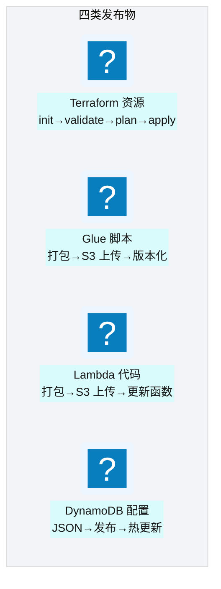
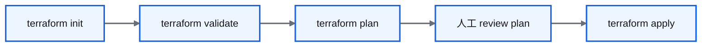
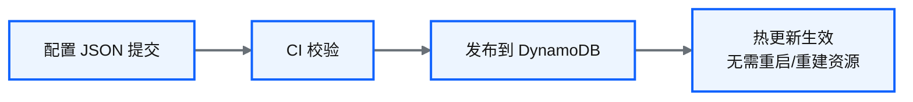
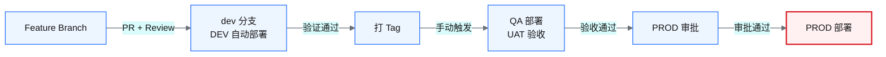
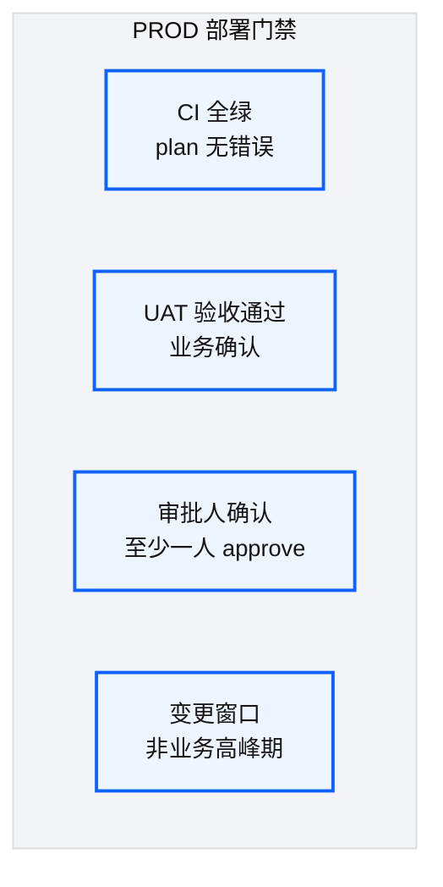

# Ch 28 四类发布流

!!! info "面包屑"
    [本书主页](./index.md) › [Part IV 基础设施与工程效能](./27-CI-CD可复用工作流平台.md) › Ch 28

!!! abstract "项目第 1 年 · 核心建设期——发布流设计"

---

## :material-school: 本章你将学到
- 四类发布物的制品模型与审批差异：Terraform / Glue / Lambda / DynamoDB 配置
- feature→dev→qa→prod 晋升与 PROD 四道门禁
- 为何配置走热更新、脚本走版本化 S3、基础设施走 plan 制品

---

## 28.1 四类发布流

[Ch 27](./27-CI-CD可复用工作流平台.md) 的变更检测会把一次推送拆进不同流水线。四类发布物不能共用同一套门禁强度：改字段映射，和改 Redshift 参数组，爆炸半径差两个数量级。

**图 28-1** 28.1-28.4 四类发布流

| 发布流 | 制品 | 生效方式 | PROD 门禁 |
|---|---|---|---|
| **Terraform** | plan 文件（二进制/JSON） | apply | 人工 review plan + 审批 |
| **Glue** | 版本化 S3 对象（`…/1.2.3/job.py`） | tfvars 改路径后再 TF apply，或绑定的 job update | 版本晋升 + 域验证 |
| **Lambda** | zip/layer + S3 | 更新函数代码；注意冷启动窗口 | 同 Glue，另加预热 |
| **配置** | 表级 JSON | 写入 DynamoDB，下次读取即生效 | 仍走环境晋升，但**不**跑全量 TF |

**表 28-4** 四类发布流对照（总览）

### Terraform 发布流

**图 28-2** Terraform 发布流

| 阶段 | 作用 | 自动/手动 |
|---|---|---|
| init | `-backend-config` 注入 + 拉模块 | 自动 |
| validate / ASL lint | 语法 + 状态机 processed 校验 | 自动 |
| plan | 生成并**上传 plan 制品** | 自动 |
| review | 人读 plan | PROD 必需 |
| apply | `terraform apply plan.out`（禁止无 plan 的 apply） | DEV 可自动；PROD 手动 |

**表 28-1** Terraform 发布流

我坚持 PROD 只 apply 已审查的 plan 文件，禁止审批后再跑一遍裸 `plan`。否则审查过的，和真正执行的，可能不是同一份差分。

### Glue 脚本发布流

**图 28-3** Glue 脚本发布流

| 设计要点 | 说明 |
|---|---|
| **S3 tooling 桶** | 脚本与 whl 版本化存放 |
| **snapshot / release** | feature→snapshot；合并主线→release 版本 |
| **与 TF 解耦又耦合** | 制品可先上传；**生效**靠 tfvars 中 `script_location` 晋升 |

**表 28-2** Glue 脚本发布流

### Lambda 代码发布流

与 Glue 类似：打包 → S3 → 更新函数。差异在冷启动窗口：已热实例可能仍跑旧代码。控制面 Lambda 靠幂等兜底；有进程内缓存的，发布后我会触发一次预热，缩短双版本共存。上传不等于全流量立刻换成新逻辑。

### 配置发布流

**图 28-4** 配置发布流

!!! warning "Trade-off"
    配置热更新让"加数据源"不必走 TF apply（呼应 [Ch 25](./25-环境参数与tfvars模型.md) 边界），错误也会更快打到运行时。因此配置流仍走 feature→dev→qa→prod，只是跳过基础设施 plan。我见过有人做成"直写 prod 表"：两周后一次错误映射污染主数据，回滚靠 DynamoDB PITR。热更新不是无门禁（M1 / M5）。

---

## 28.5 feature→dev→qa→prod 的晋升路径与审批门禁

**图 28-5** feature→dev→qa→prod 的晋升路径与审批门禁

| 阶段 | 触发方式 | 门禁 | 部署目标 |
|---|---|---|---|
| Feature → dev | PR merge | 审查 + CI | DEV（自动） |
| feature 校验 | PR | **矩阵 plan 覆盖多环境（只读）** | 不 apply prod |
| dev → tag | 手动打 tag | DEV 验证 | — |
| tag → QA | 手动 | UAT | QA |
| QA → PROD | 手动 | UAT + 审批 + 窗口 | PROD |

**表 28-3** feature→dev→qa→prod 的晋升路径与审批门禁

### 审批门禁设计

**图 28-6** 审批门禁设计

!!! tip "引申"
    四道门禁来自企业征信"merge 即生产"的周末事故。CI 防代码错，UAT 防业务错，审批防未授权，窗口防无人值守爆炸。紧急修复可以降级门禁，但必须事后补审：GxP 要的是可归属，不是永远不能 hotfix（M10）。周五下午默认不开 PROD。两年里拦下的"差点周末炸"，比门禁耽误的时间值钱。

发布流要落地，还差凭证。下一章讲 OIDC、中国区 STS，以及我们仍未完全消灭的长期密钥债。

---

## :material-check-circle: 本章小结
- 四类流制品不同：plan 文件 / 版本化 S3 脚本 / Lambda 包 / DynamoDB 配置热更新
- 晋升路径统一，门禁强度按爆炸半径调；配置热更新仍要环境晋升
- PROD 只 apply 已审 plan；变更窗口与可归属优先于发布手感

---

!!! quote "下一章"
    [Ch 29 OIDC 与凭证治理](./29-OIDC与凭证治理.md) —— 发布流走通了，但 CI 怎么安全地获取 AWS 凭证？接下来看 OIDC 无密钥设计。
