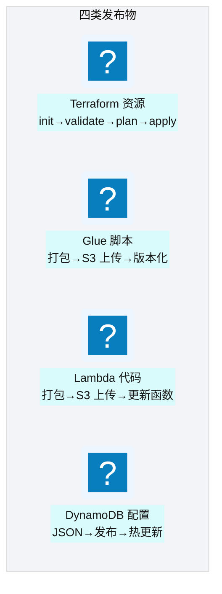
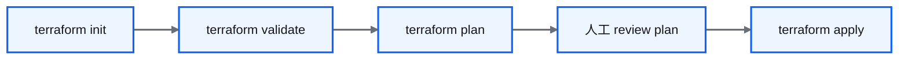
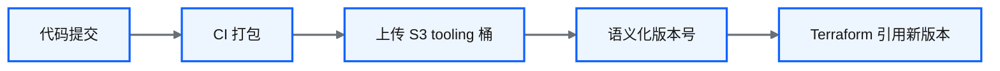
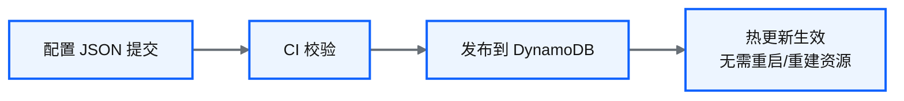
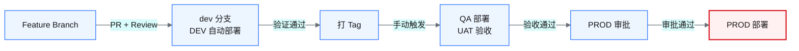
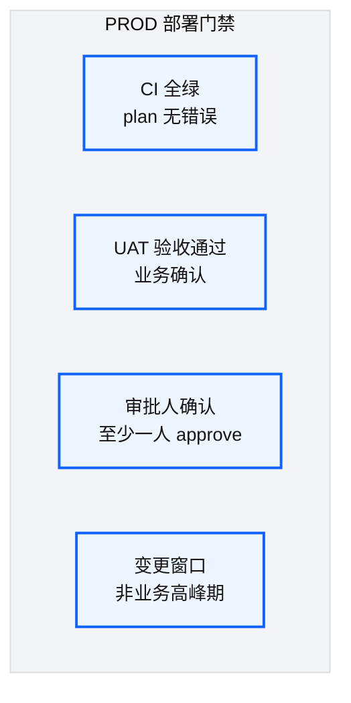

# Ch 28 四类发布流

!!! info "面包屑"
    [本书主页](./index.md) › [Part IV 基础设施与工程效能](./27-CI-CD可复用工作流平台.md) › Ch 28

!!! abstract "项目第 1 年 · 核心建设期——发布流设计"

---

## :material-school: 本章你将学到
- 四类发布物（:simple-terraform: Terraform/Glue/Lambda/配置）各自的发布流设计
- feature→dev→qa→prod 的晋升路径与审批门禁
- 语义化版本在发布流中的应用

---

## 28.1 四类发布流

**图 28-1** 28.1-28.4 四类发布流

### Terraform 发布流

**图 28-2** Terraform 发布流

| 阶段 | 作用 | 自动/手动 |
|---|---|---|
| init | 初始化后端+下载模块 | 自动 |
| validate | 语法校验 | 自动 |
| plan | 生成变更计划 | 自动 |
| review | 人工审查变更 | 手动（PROD 必需） |
| apply | 执行变更 | 手动（PROD）/ 自动（DEV） |

**表 28-1** Terraform 发布流

### Glue 脚本发布流

**图 28-3** Glue 脚本发布流

| 设计要点 | 说明 |
|---|---|
| **S3 tooling 桶** | 脚本存 S3，Glue Job 通过 S3 路径引用 |
| **语义化版本** | 每次 CI 生成版本号（如 v1.2.3） |
| **snapshot/release** | :octicons-git-branch-16: feature 分支→snapshot， :octicons-git-branch-16: dev 分支→release |
| **Terraform 引用** | tfvars 中指定脚本版本，apply 时更新 Glue Job |

**表 28-2** Glue 脚本发布流

### Lambda 代码发布流

与 Glue 类似：CI 打包 → S3 上传 → Terraform 更新 Lambda function 的 code source。

### 配置发布流

**图 28-4** 配置发布流

!!! warning "Trade-off"
    配置发布流是"热更新"——推送到 DynamoDB 即生效，无需 Terraform apply。这让"加数据源"极快，但也意味着"配置错误会立即影响生产"。因此配置发布流同样需要 feature→dev→qa→prod 的晋升路径和审批门禁。

---

## 28.5 feature→dev→qa→prod 的晋升路径与审批门禁

**图 28-5** feature→dev→qa→prod 的晋升路径与审批门禁

| 阶段 | 触发方式 | 门禁 | 部署目标 |
|---|---|---|---|
| :octicons-git-branch-16: Feature → dev | :octicons-git-pull-request-16: PR merge | 代码审查 + CI 通过 | DEV（自动） |
| dev → :octicons-tag-16: tag | 手动 :octicons-tag-16: 打 tag | DEV 验证通过 | — |
| tag → QA | 手动触发 | 无额外 | QA |
| QA → PROD | 手动触发 | **UAT 验收 + 审批** | PROD |

**表 28-3** feature→dev→qa→prod 的晋升路径与审批门禁

### 审批门禁设计

**图 28-6** 审批门禁设计

!!! tip "引申"
    PROD 门禁的核心是"防止错误变更上生产"。四道门禁（CI/UAT/审批/窗口）各有侧重：CI 防"代码错误"，UAT 防"业务逻辑错误"，审批防"未授权变更"，窗口防"业务影响"。不是所有变更都需要全部门禁——紧急修复可以简化流程，但必须有事后补审。

---

## :material-check-circle: 本章小结
- 四类发布流：Terraform（init→validate→plan→review→apply）/ Glue（打包→S3→语义化版本→Terraform 引用）/ Lambda（同 Glue）/ 配置（:simple-json: JSON→DynamoDB 热更新）
- 晋升路径：feature→dev（自动）→tag→QA（手动）→PROD（审批），每阶段有门禁
- PROD 四道门禁：CI 全绿 / UAT 验收 / 审批人确认 / 变更窗口——紧急修复可简化但需事后补审

---

!!! quote "下一章"
    [Ch 29 OIDC 与凭证治理](./29-OIDC与凭证治理.md) —— 发布流走通了，但 CI 怎么安全地获取 AWS 凭证？接下来看 OIDC 无密钥设计。

