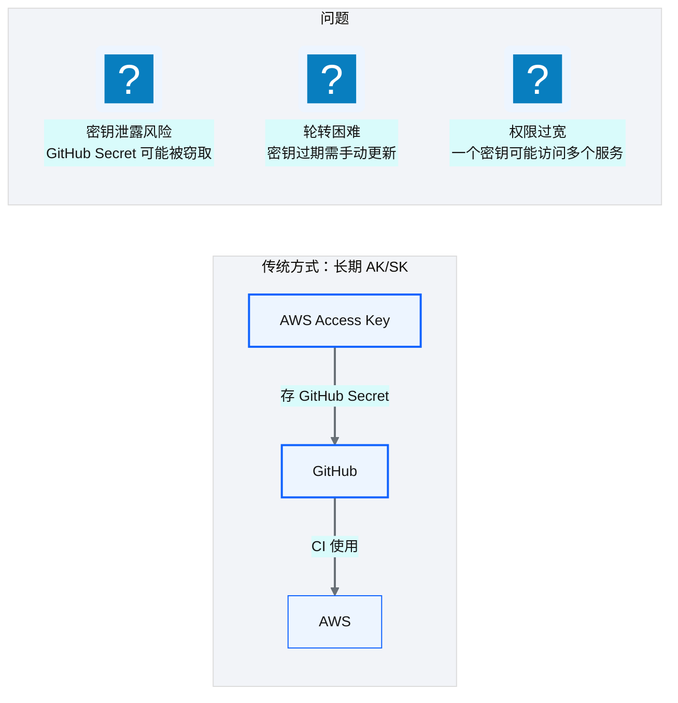
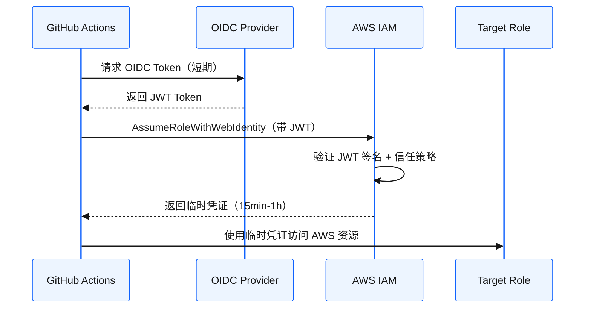
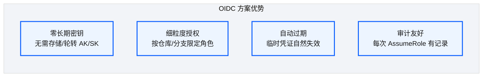
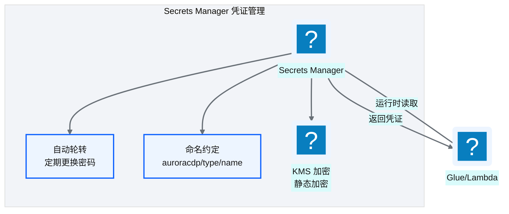
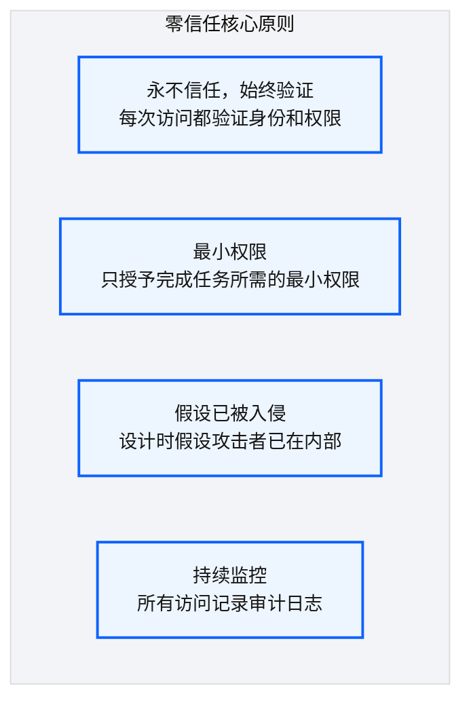

# Ch 29 OIDC 与凭证治理

!!! info "面包屑"
    [本书主页](./index.md) › [Part IV 基础设施与工程效能](./28-四类发布流.md) › Ch 29

!!! abstract "项目第 1 年 · 核心建设期——凭证治理"

---

## :material-school: 本章你将学到
- OIDC + AssumeRole：无长期 AK/SK；完整 trust policy 与 AWS China（`aws-cn` / STS）差异
- Secrets Manager 命名、轮转与"人不碰密码"
- 零信任纵深与最小权限矩阵；诚实承认尚未迁完的静态密钥债

---

## 29.1 OIDC + AssumeRole：CI 无长期密钥

[Ch 27](./27-CI-CD可复用工作流平台.md) / [Ch 28](./28-四类发布流.md) 的流水线要调 AWS API。第 1 年最危险的捷径是把 AK/SK 塞进 GitHub Secrets：能跑，泄露窗口却等于轮转周期。

### 传统方式的问题


<p class="caption" markdown="span">**图 29-1** 传统方式的问题</p>

### OIDC 方案


<p class="caption" markdown="span">**图 29-2** OIDC 方案</p>

| 设计要点 | 说明 |
|---|---|
| **无长期密钥** | GitHub 不存 AWS AK/SK（主路径） |
| **短期凭证** | 每次 CI 换票，15min–1h |
| **信任关系** | IAM OIDC Provider 信任 `token.actions.githubusercontent.com` |
| **条件约束** | `sub` / `aud` 限定仓、分支或 environment |
<p class="caption" markdown="span">**表 29-1** OIDC 方案</p>


<p class="caption" markdown="span">**图 29-3** OIDC 方案</p>

### trust policy 怎么写，以及 AWS China 差在哪

光知道"用 OIDC"不够。我第一次在中国区配，把全球区 ARN 粘过来，`AssumeRoleWithWebIdentity` 一直失败。差在 partition 与 STS 端点：

| 项 | 全球区（`aws`） | AWS China（`aws-cn`） |
|---|---|---|
| **STS 端点** | `sts.<region>.amazonaws.com` | `sts.cn-north-1.amazonaws.com.cn` 等 |
| **Partition** | `aws` | `aws-cn` |
| **OIDC Provider ARN** | `arn:aws:iam::ACCOUNT:oidc-provider/token.actions.githubusercontent.com` | `arn:aws-cn:iam::ACCOUNT:oidc-provider/...` |
| **默认 aud** | 常配 `sts.amazonaws.com` | 中国区常需对齐 `sts.amazonaws.com.cn` / 文档与 action `audience` 输入 |

```json
{
  "Version": "2012-10-17",
  "Statement": [{
    "Effect": "Allow",
    "Principal": {
      "Federated": "arn:aws-cn:iam::ACCOUNT_ID:oidc-provider/token.actions.githubusercontent.com"
    },
    "Action": "sts:AssumeRoleWithWebIdentity",
    "Condition": {
      "StringEquals": {
        "token.actions.githubusercontent.com:aud": "sts.amazonaws.com.cn",
        "token.actions.githubusercontent.com:sub": "repo:aurora-data-platform/aurora-domain-ma:ref:refs/heads/main"
      }
    }
  }]
}
```

```yaml
# 示意：调用方必须显式要 JWT
permissions:
  id-token: write
  contents: read
steps:
  - uses: aws-actions/configure-aws-credentials@v4
    with:
      role-to-assume: arn:aws-cn:iam::ACCOUNT_ID:role/aurora-tf-deploy-prod
      aws-region: cn-north-1
      audience: sts.amazonaws.com.cn
```

!!! warning "Trade-off"
    只限仓库、不限分支/environment，等于 feature 分支 CI 也能假设生产 Role。这是我见过最常见的误配。PROD Role 应绑 `environment:prod`，或 `ref:refs/heads/main` 再加 GitHub Environment 审批。OIDC 解决认证后，VPC 网络仍要自托管 runner（[Ch 27](./27-CI-CD可复用工作流平台.md)）。两件事别混。

!!! tip "工程诚实（M5）"
    Terraform 主路径已 OIDC 化；个别遗留 Glue/Lambda 打包流水线仍接受静态密钥输入，迁移清单挂在平台债上。读者若照抄，请把"全部无长期密钥"当目标态，别默认我们已 100% 到达。

---

## 29.2 Secrets Manager 轮转与命名约定

### 数据库凭证管理


<p class="caption" markdown="span">**图 29-4** 数据库凭证管理</p>

### 命名约定

```
auroracdp/
  ├── global/
  ├── mssql/{source-name}
  ├── pgsql/{source-name}
  ├── salesforce/{instance}
  ├── api/{source-name}
  └── sync/{target}          # 跨账号同步等；避免把真实产品名写进路径
```

| 设计要点 | 说明 |
|---|---|
| **层级命名** | `{type}/{name}`，便于 IAM 前缀授权 |
| **统一前缀** | `auroracdp/` 方便策略匹配 |
| **自动轮转** | 须挂轮转 Lambda；只开开关等于没轮转 |
| **Terraform 不写明文值** | Secret 资源可空值创建，值由轮转写入（[Ch 24](./24-通用Terraform模块设计.md)） |
<p class="caption" markdown="span">**表 29-2** 命名约定</p>

!!! warning "Trade-off"
    轮转能提高安全性，前提是没人缓存密码。企业征信密码进过 Git 历史；Aurora 起誓密码永不进仓。供应商 Token 过期无人知，则推动了 90 天自动轮转。人不碰密码，也不靠人记得过期。

---

## 29.3 引申：零信任与最小权限在数据平台的落地

### 零信任原则


<p class="caption" markdown="span">**图 29-5** 零信任原则</p>

企业征信"内网即安全"被木马加 VPN 打穿后，我不再按位置信任。Aurora 把 OIDC（身份）、IAM（权限）、RLS/CLS（数据）、CloudTrail（审计）分层独立设防：每层都假设前一层已失陷（M10）。这和 [Ch 18](./18-数据脱敏与隐私治理.md) 的纵深防御是同一思路。

### 最小权限在数据平台的实践

| 实践 | 说明 |
|---|---|
| **CI 按环境分角色** | DEV Role 碰不到 prod state 桶；PROD Role 绑 Environment 审批 |
| **Glue/Lambda 按域分角色** | 路径级 S3 前缀隔离 |
| **Secrets 按需授权** | Job 只读自己的 Secret ARN |
| **Redshift RLS/CLS** | 库内最后一道 |
| **CloudTrail** | AssumeRole 与数据面 API 可追溯 |
<p class="caption" markdown="span">**表 29-3** 最小权限在数据平台的实践</p>

基础设施和凭证讲完了。下一章收成工程师每天怎么走：变更决策树与质量门禁。

---

## :material-check-circle: 本章小结
- OIDC 主路径无长期密钥；trust policy 必须钉 `sub`/`aud`，中国区用 `aws-cn` 与正确 STS/audience
- Secrets：命名约定 + 真轮转 Lambda + Terraform 不写明文
- 零信任纵深 + 最小权限矩阵；遗留静态密钥当已知债，不粉饰

---

!!! quote "下一章"
    [Ch 30 工程师日常工作流与变更场景](./30-工程师日常工作流与变更场景.md) —— 基础设施层讲完了，接下来看工程师日常怎么在这个平台上工作。
