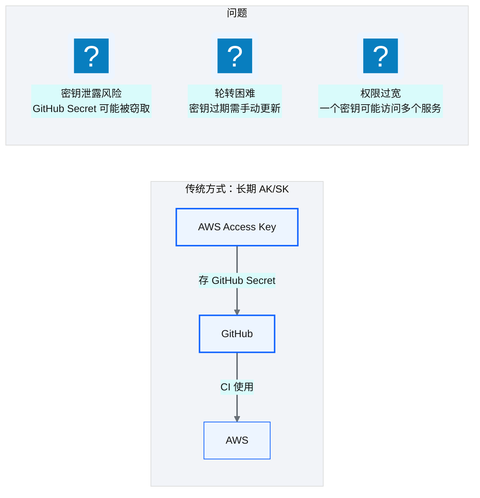
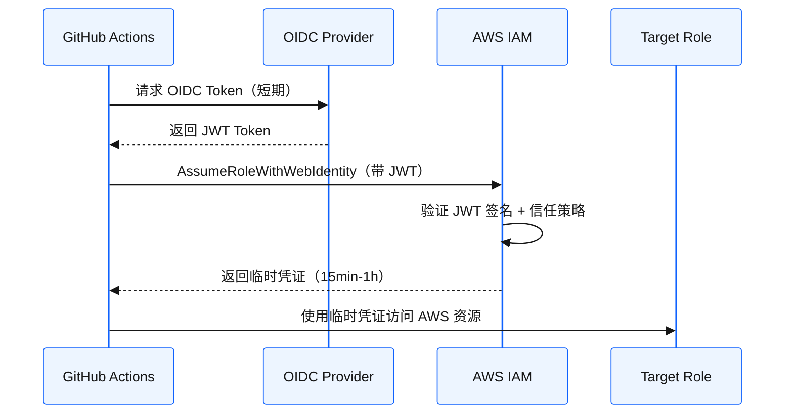
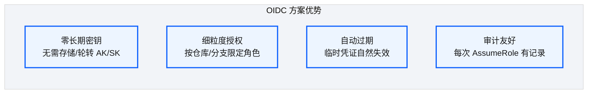
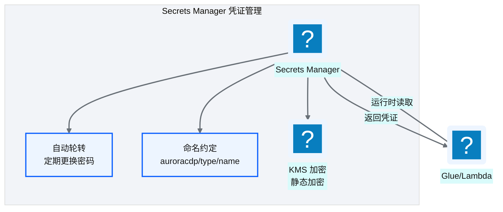
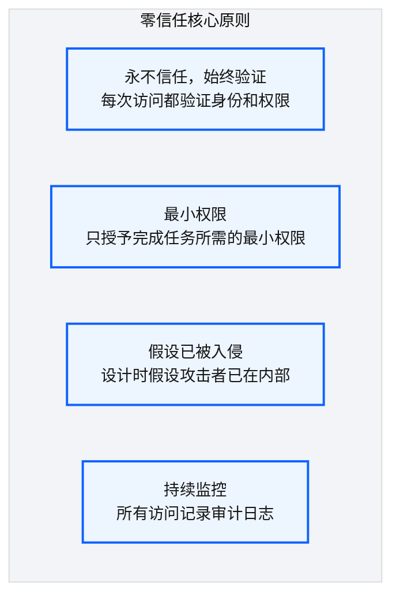

# Ch 29 OIDC 与凭证治理

!!! info "面包屑"
    [本书主页](./index.md) › [Part IV 基础设施与工程效能](./28-四类发布流.md) › Ch 29

!!! abstract "项目第 1 年 · 核心建设期——凭证治理"

---

## :material-school: 本章你将学到
- OIDC + AssumeRole：CI 无长期密钥的安全设计
- Secrets Manager 轮转与命名约定
- 零信任与最小权限在数据平台的落地

---

## 29.1 OIDC + AssumeRole：CI 无长期密钥

### 传统方式的问题


<p class="caption" markdown="span">**图 29-1** 传统方式的问题</p>

### OIDC 方案


<p class="caption" markdown="span">**图 29-2** OIDC 方案</p>

| 设计要点 | 说明 |
|---|---|
| **无长期密钥** | GitHub 不存储任何 AWS AK/SK |
| **短期凭证** | 每次 CI 获取 15min-1h 的临时凭证 |
| **信任关系** | AWS IAM 信任 GitHub OIDC Provider |
| **条件约束** | 信任策略可限定"哪个仓库/哪个分支"才能 AssumeRole |
<p class="caption" markdown="span">**表 29-1** OIDC 方案</p>



<p class="caption" markdown="span">**图 29-3** OIDC 方案</p>

!!! tip "引申"
    OIDC（OpenID Connect）是"身份联合"的标准协议。它的本质是"让 GitHub 成为 AWS 的身份提供者"——GitHub 证明"这个 CI 是谁"，AWS 据此授予临时权限。这比"存密钥"安全得多，因为没有任何静态密钥可以被窃取。

---

## 29.2 Secrets Manager 轮转与命名约定

### 数据库凭证管理


<p class="caption" markdown="span">**图 29-4** 数据库凭证管理</p>

### 命名约定

```
auroracdp/
  ├── global/                    ← 全局密钥
  ├── mssql/{source-name}       ← SQL Server 源凭证
  ├── pgsql/{source-name}       ← PostgreSQL 源凭证
  ├── salesforce/{instance}     ← Salesforce 凭证
  ├── api/{source-name}         ← API Token
  └── rclone/{target}           ← 跨账号同步凭证
```

| 设计要点 | 说明 |
|---|---|
| **层级命名** | 按 `{type}/{name}` 组织，便于权限粒度控制 |
| **统一前缀** | `auroracdp/` 前缀，便于 IAM 策略匹配 |
| **自动轮转** | 数据库密码定期轮转（如 90 天） |
| **KMS 加密** | 所有 Secret 静态加密 |
<p class="caption" markdown="span">**表 29-2** 命名约定</p>


!!! warning "Trade-off"
    自动轮转提高了安全性，但增加了复杂度——轮转后所有使用该凭证的 Glue/Lambda 需要能获取新密码。因为凭证存在 Secrets Manager 而非硬编码，运行时动态读取，所以轮转对应用透明。但前提是"所有应用都通过 Secrets Manager 读凭证"，不能有任何地方缓存了密码。

    我从"硬编码凭证"改到 Secrets Manager，是被一次"密码泄露"事件吓的。企业征信时，数据库密码硬编码在 ETL 脚本里——脚本存在 Git 仓库，所有有仓库读权限的人都能看到密码。有次一个离职员工的 Git 历史里还留着密码（即使新代码删了，旧 commit 还在），安全审计时被发现了。从那以后我发誓**密码永不进代码、永不进 Git**——全部放 Secrets Manager，代码只存 Secret ARN，运行时动态读取。自动轮转是另一个被事件触发的决策——有次一个供应商的 API Token 过期了没人知道（写代码的人已离职），ETL 连续失败三天才发现是 Token 过期。设了 90 天自动轮转后，这类"凭证过期"故障彻底消失。**凭证管理的核心是"人不碰密码"——人碰密码就会泄露、会遗忘、会过期**。

---

## 29.3 引申：零信任与最小权限在数据平台的落地

### 零信任原则


<p class="caption" markdown="span">**图 29-5** 零信任原则</p>

零信任"假设已被入侵"这条原则，是我在企业征信的一次安全事件后真正理解的。当时平台内部网络被信任（"内网就是安全的"），结果一个开发者的笔记本中了木马，攻击者通过 VPN 进入内网，直接访问了数据库——因为内网没有额外认证。从那以后我不再信任"内网=安全"这个假设——**零信任的核心是"不因位置信任"**：不管你在内网还是外网，每次访问都要验证身份和权限。到 Aurora 我把 OIDC（身份验证）+ IAM（权限控制）+ RLS/CLS（数据层防护）+ CloudTrail（审计）四层全部独立设防——即使攻击者突破了 OIDC 拿到了临时凭证，IAM 最小权限限制它只能访问特定资源；即使突破了 IAM，RLS/CLS 限制它只能看到特定行/列；即使突破了数据层，CloudTrail 记录了所有操作可追溯。**零信任不是"多加一层锁"，而是"每层都假设前一层已被突破"**——这是安全架构从"城堡式"到"纵深式"的思维转变（M10 合规从第一天嵌入的安全维度）。

### 最小权限在数据平台的实践

| 实践 | 说明 |
|---|---|
| **CI 按环境分角色** | DEV CI 只能操作 DEV 账号，PROD CI 需额外审批 |
| **Glue/Lambda 按域分角色** | domain-a 的 Glue 只能访问 domain-a 的 S3 路径 |
| **Secrets 按需授权** | 每个 Glue Job 只能读取它需要的 Secret |
| **Redshift RLS/CLS** | 数据库内按角色控制行/列可见性 |
| **CloudTrail 全审计** | 所有 API 调用记录审计日志 |
<p class="caption" markdown="span">**表 29-3** 最小权限在数据平台的实践</p>


!!! tip "引申"
    零信任不是某个工具，而是一种安全架构理念。在数据平台中，零信任体现为"层层设防"——网络层（VPC）→ 身份层（IAM/OIDC）→ 数据层（RLS/CLS/脱敏）→ 审计层（CloudTrail）。每一层都"假设前一层已被突破"，独立设防。这与 [Ch 18](./18-数据脱敏与隐私治理.md) 的三层纵深防御一脉相承。

---

## :material-check-circle: 本章小结
- OIDC + AssumeRole：CI 无长期密钥，通过 GitHub OIDC Token 获取 AWS 临时凭证——零泄露风险
- Secrets Manager 统一管理凭证：`auroracdp/type/name` 命名约定 + 自动轮转 + KMS 加密
- 零信任与最小权限：按环境/域/需求分角色，层层设防——网络/身份/数据/审计四层独立防御

---

!!! quote "下一章"
    [Ch 30 工程师日常工作流与变更场景](./30-工程师日常工作流与变更场景.md) —— 基础设施层讲完了，接下来看工程师日常怎么在这个平台上工作。

