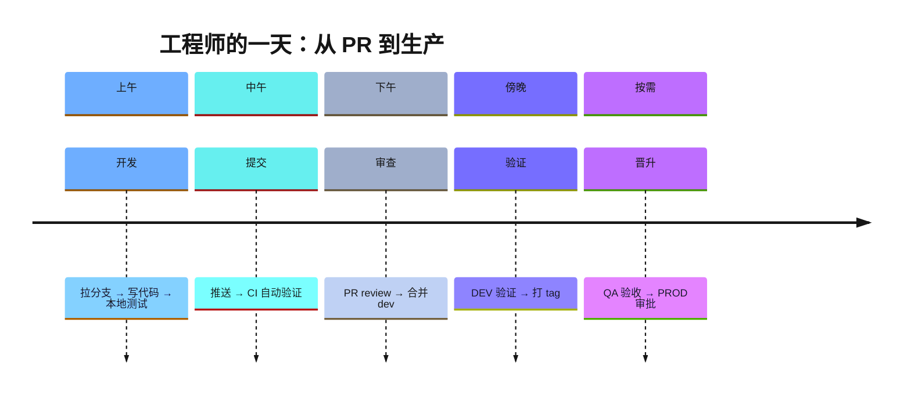
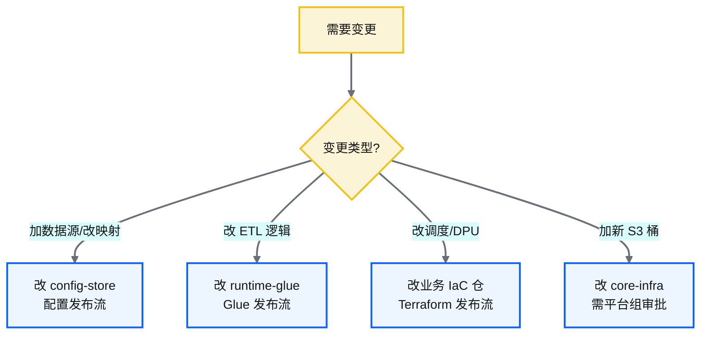
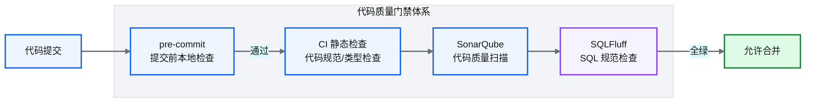
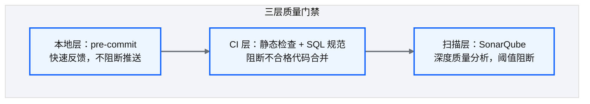

# Ch 30 工程师日常工作流与变更场景

!!! info "面包屑"
    [本书主页](./index.md) › [Part IV 基础设施与工程效能](./29-OIDC与凭证治理.md) › Ch 30

!!! abstract "项目第 1 年 · 核心建设期——工程师工作流"

---

## :material-school: 本章你将学到
- 工程师的一天：从 :octicons-git-pull-request-16: PR 到生产的完整工作流
- 常见变更场景清单与对应仓库
- 代码质量门禁体系：静态检查/代码扫描/SQL 规范

---

## 30.1 工程师的一天：从 :octicons-git-pull-request-16: PR 到生产

**图 30-1** 工程师的一天：从 PR 到生产

| 时段 | 活动 | 工具/仓库 |
|---|---|---|
| 上午 | :octicons-git-branch-16: 拉分支、写代码、本地测试 | :octicons-terminal-16: git / 本地 IDE |
| 中午 | :octicons-git-commit-16: 推送、CI 自动验证 | :simple-githubactions: GitHub Actions / CI |
| 下午 | :octicons-git-pull-request-16: PR review、:octicons-git-merge-16: 合并 dev | GitHub PR |
| 傍晚 | DEV 验证、:octicons-tag-16: 打 tag | DEV 环境 |
| 按需 | QA 验收、PROD 审批 | QA/PROD 环境 |

**表 30-1** 工程师的一天：从 :octicons-git-pull-request-16: PR 到生产

### 变更的分类决策

**图 30-2** 变更的分类决策

---

## 30.2 常见变更场景清单与对应仓库

| 变更场景 | 改哪个仓库 | 发布方式 |
|---|---|---|
| 新增一个 JDBC 数据源 | config-store | 配置发布流 |
| 修改某任务的加载模式（全量→增量） | config-store | 配置发布流 |
| 修改某任务的调度时间 | business-domain-{x}（tfvars） | :simple-terraform: Terraform 发布流 |
| 修改 Glue Job 的 DPU 配置 | business-domain-{x}（tfvars） | Terraform 发布流 |
| 修复 ETL 脚本的 bug | runtime-glue | Glue 发布流 |
| 新增一种文件格式支持 | runtime-glue | Glue 发布流 |
| 修改 Lambda 控制面函数 | runtime-lambda | Lambda 发布流 |
| 新增 S3 数据湖桶 | core-infra | Terraform 发布流（需平台审批） |
| 修改 IAM 策略 | core-infra 或 business-domain | Terraform 发布流 |
| 升级 Terraform 模块版本 | business-domain-{x}（submodule 指针） | Terraform 发布流 |

**表 30-2** 常见变更场景清单与对应仓库

!!! tip "引申"
    "改哪个仓库"是新人最常问的问题。核心判据是 [Ch 25](./25-环境参数与tfvars模型.md) 的边界划分：运行时配置→config-store，部署参数→业务 IaC 仓，运行时代码→runtime-glue/lambda，共享资源→core-infra。

---

## 30.3 代码质量门禁体系

**图 30-3** 代码质量门禁体系

| 门禁 | 检查内容 | 时机 | 阻断级别 |
|---|---|---|---|
| **pre-commit** | 格式化、基础 lint、密钥泄露检测 | 提交前（本地） | 警告 |
| **CI 静态检查** | :simple-python: Python 类型检查、HCL 语法校验 | 推送后（CI） | 阻断 |
| **:simple-sonar: SonarQube** | 代码复杂度、重复代码、安全漏洞 | CI | 阈值阻断 |
| **SQLFluff** | SQL 风格规范（大小写/缩进/关键字） | CI | 阻断 |

**表 30-3** 代码质量门禁体系

### 质量门禁的分层设计

**图 30-4** 质量门禁的分层设计

!!! warning "Trade-off"
    质量门禁越多，代码质量越高，但开发体验越差。pre-commit 的价值是"在本地快速反馈"——格式问题在提交前就修复，不用等 CI 跑完才发现。门禁设计的核心原则是"快速反馈前置"——能本地检查的不放 CI，能在 CI 检查的不放人工 review。

---

## :material-check-circle: 本章小结
- 工程师的一天：上午开发→中午 CI→下午 review→傍晚验证→按需晋升
- 变更分类决策：运行时配置→config-store / 部署参数→业务 IaC / 运行时代码→runtime-glue/lambda / 共享资源→core-infra
- 三层质量门禁：pre-commit（本地快速反馈）→ CI 静态检查（阻断合并）→ SonarQube（深度扫描）——"快速反馈前置"

---

!!! quote "下一部分"
    [Part V 平台演进：数据迁移与跨系统协同](./31-遗留系统迁移-SQLServer到Redshift.md) —— 平台建好并运转后，接下来面临演进挑战：遗留系统迁移、跨账号同步、自研 DAG 调度器。

