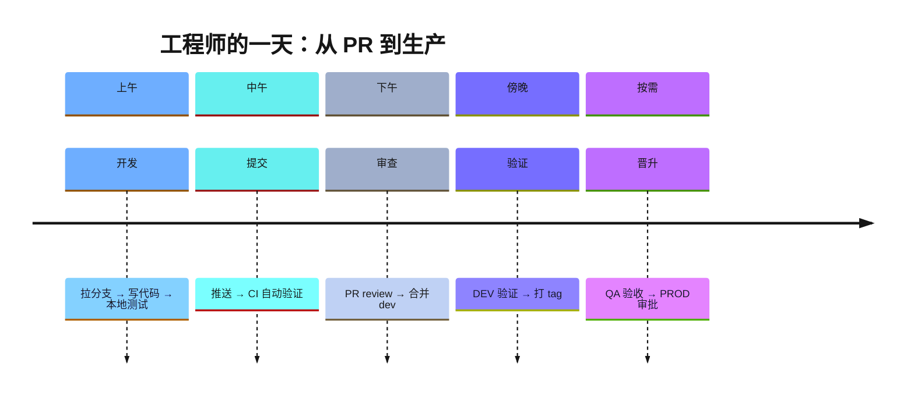
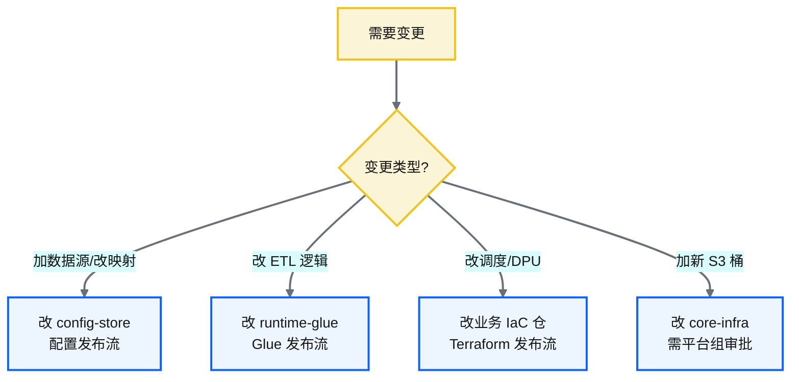
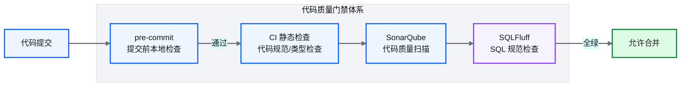
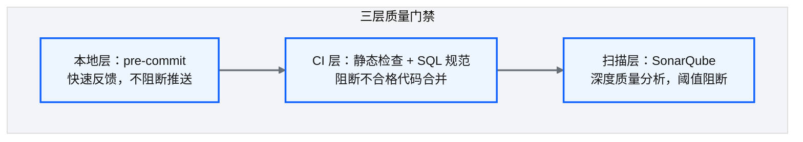

# Ch 30 工程师日常工作流与变更场景

!!! info "面包屑"
    [本书主页](./index.md) › [Part IV 基础设施与工程效能](./29-OIDC与凭证治理.md) › Ch 30

!!! abstract "项目第 1 年 · 核心建设期——工程师工作流"

---

## :material-school: 本章你将学到
- 从 PR 到生产的一日节奏，以及"DEV 验证后再打 tag"为何是门禁
- 变更场景 → 仓库 → 四类发布流的决策树
- 质量门禁分层：本地 / CI / 策略即代码 / 密钥扫描——平台工程边界

---

## 30.1 工程师的一天：从 :octicons-git-pull-request-16: PR 到生产

Part IV 前面九章把仓、模块、参数、模板、CI、发布流、OIDC 铺齐了。工程师不会每天改 OIDC trust policy。他每天问的是：我这一改该进哪个仓、走哪条发布流、卡在哪道门。

**图 30-1** 工程师的一天：从 PR 到生产

| 时段 | 活动 | 工具/仓库 |
|---|---|---|
| 上午 | 拉分支、改对的仓、本地 plan/单测 | git / IDE / `terraform plan`（dev backend） |
| 中午 | 推送；增量 CI（[Ch 27](./27-CI-CD可复用工作流平台.md)） | GitHub Actions |
| 下午 | PR review；合并 `dev` | GitHub |
| 傍晚 | **在 DEV 看数据/日志后再打 tag** | DEV 环境 |
| 按需 | QA → PROD（[Ch 28](./28-四类发布流.md) 门禁） | QA/PROD |

**表 30-1** 工程师的一天：从 :octicons-git-pull-request-16: PR 到生产

"傍晚打 tag"是我刻意加的仪式。企业征信 merge 进 dev 就推 QA，结果 QA 验收的是 DEV 都没验过的包，来回烧一天。Aurora 规定：tag 等于"我已在 DEV 验证过"的承诺。QA 有效验收率从大约一半升到九成。不是 QA 变强了，是垃圾输入变少了。

### 变更的分类决策

**图 30-2** 变更的分类决策

图 30-2、[Ch 25](./25-环境参数与tfvars模型.md) 的边界、[Ch 28](./28-四类发布流.md) 的四类流，说的是同一件事。新人先背决策树，再背工具名。

---

## 30.2 常见变更场景清单与对应仓库

| 变更场景 | 改哪个仓库 | 发布方式 |
|---|---|---|
| 新增 JDBC 数据源 / 改字段映射 | config-store | 配置发布流（热更新） |
| 改加载模式（全量→增量） | config-store | 配置发布流 |
| 改调度 cron / DPU / 脚本路径版本 | aurora-domain-*（tfvars） | Terraform 发布流 |
| 修 ETL bug / 新文件格式 | runtime-glue | Glue 发布流 → 再升 tfvars 版本 |
| 改控制面 Lambda | runtime-lambda | Lambda 发布流（含预热） |
| 新湖桶 / 平台 IAM | aurora-core-infra | Terraform + 平台审批 |
| 升级 generic-modules | 域仓 submodule pin | Terraform 发布流（DEV→QA→PROD） |
| 改 ASL 模板 | 域仓 `state_files/` | TF + ASL lint（[Ch 26](./26-StepFunctions模板注入.md)） |

**表 30-2** 常见变更场景清单与对应仓库

!!! tip "引申"
    口诀：改行为看配置，改资源看 Terraform，改逻辑看代码，改共享看 core。新人最常错的是把加载模式改到 Glue 脚本里；发布后行为不变，因为模式在 DynamoDB。平台工程的价值，就是把这张表变成默认路径，别让每人重新发明（M7）。

---

## 30.3 代码质量门禁体系

**图 30-3** 代码质量门禁体系

| 门禁 | 检查内容 | 时机 | 阻断级别 |
|---|---|---|---|
| **pre-commit** | 格式、基础 lint、密钥模式扫描 | 本地提交前 | 警告→渐变为阻断 |
| **CI 静态检查** | Python 类型、HCL validate、ASL lint | 推送后 | 阻断 |
| **策略即代码** | Conftest/OPA：例外资源须进白名单 | CI（IaC） | 阻断 |
| **SonarQube** | 复杂度、重复、漏洞 | CI | 阈值阻断 |
| **SQLFluff** | SQL 风格 | CI | 阻断 |
| **secret scanning** | 仓级密钥扫描 | CI / 平台 | 阻断 |

**表 30-3** 代码质量门禁体系

### 质量门禁的分层设计

**图 30-4** 质量门禁的分层设计

!!! warning "Trade-off"
    门禁越多质量越高，手感越差。原则是快速反馈前置：格式本地解，策略 CI 解，架构争议留给人审。策略即代码（白名单例外）比口头"下不为例"可审计。这是平台组替业务域扛复杂度的方式（M7），也是 Part IV 落到"人怎么用平台"的地方。

Part IV 到此结束：从 state 与仓分层，走到工程师每天怎么改生产。下一 Part 进入迁移与跨系统协同。

---

## :material-check-circle: 本章小结
- 一日节奏以"DEV 验证后再 tag"为门禁，并和四类发布流晋升对齐
- 变更决策树把场景映射到仓与发布流，少改错地方
- 质量门禁分层 + 策略即代码 + 密钥扫描，是平台工程的日常界面

---

!!! quote "下一部分"
    [Part V 平台演进：数据迁移与跨系统协同](./31-遗留系统迁移-SQLServer到Redshift.md) —— 平台建好并运转后，接下来面临演进挑战：遗留系统迁移、跨账号同步、自研 DAG 调度器。
